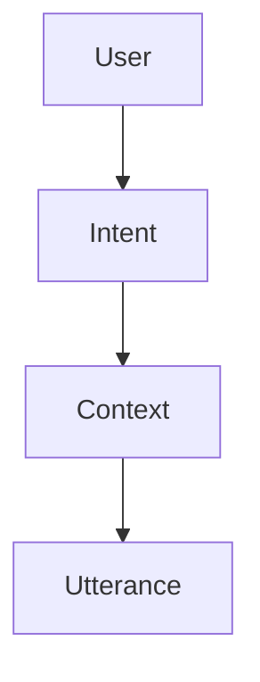
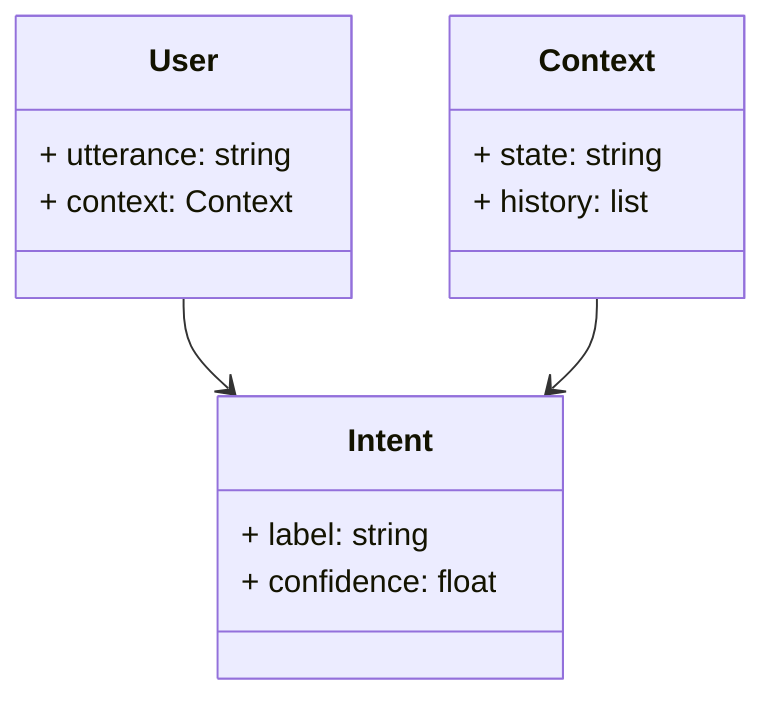
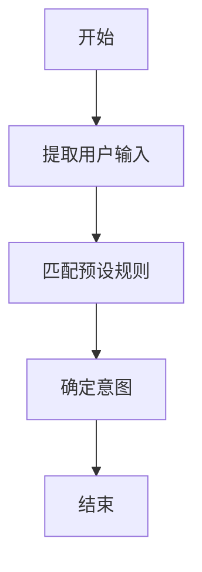

                 

<think>
好，我现在需要根据用户的要求，撰写一篇关于《AI Agent的用户意图推理与预测》的技术博客文章。用户已经提供了一个详细的目录大纲，现在需要我按照这个大纲，逐步完成各个部分的内容。

首先，我应该理解每个章节的核心内容，确保每一部分都覆盖到位。例如，第1章是背景与概念，需要介绍问题背景、核心概念以及与其他技术的关系。第2章涉及核心概念与联系，需要用图表展示实体关系和类图。第3章是算法原理，需要用流程图和数学公式详细讲解。

在写作过程中，我需要确保语言专业且逻辑清晰，每一部分都有足够的细节和例子来支撑。此外，要注意使用markdown格式，适当嵌入图表和代码示例，使文章更具可读性和专业性。

我还需要在每个部分完成后，进行检查和调整，确保内容连贯，没有遗漏重要信息。同时，要确保满足字数要求，大约在10000到12000字之间，这需要我合理安排每个章节的长度，避免过长或过短。

最后，在完成正文后，需要添加作者信息，确保格式正确。整个过程需要耐心和细致，逐步完成每个部分，确保最终的文章符合用户的要求和质量标准。
</think>

# AI Agent的用户意图推理与预测

## 关键词：用户意图推理、AI Agent、自然语言处理、意图预测、深度学习

## 摘要：  
用户意图推理与预测是实现智能人机交互的核心技术，本文从AI Agent的基本概念出发，深入分析用户意图推理的核心原理、算法实现、系统架构设计及实际应用场景。通过结合自然语言处理技术和深度学习模型，详细探讨意图推理的实现方法，并提供实际项目案例，最后总结了当前技术的优缺点及未来的发展方向。

---

# 第一部分: AI Agent的用户意图推理与预测基础

## 第1章: 用户意图推理的背景与概念

### 1.1 问题背景与重要性

#### 1.1.1 用户意图推理的定义与核心问题  
用户意图推理是指通过分析用户的输入（如文本、语音或行为数据），推断出用户在特定场景下的目标、需求或情感状态。其核心问题是如何准确理解用户的需求，并将其转化为可执行的指令或反馈。

#### 1.1.2 用户意图推理的重要性与应用场景  
用户意图推理是实现智能人机交互的基础，广泛应用于聊天机器人、智能客服、推荐系统等领域。例如，在智能客服中，准确识别用户的意图可以提高问题解决效率；在推荐系统中，意图推理可以帮助个性化推荐。

#### 1.1.3 用户意图推理的边界与外延  
用户意图推理的边界在于如何在复杂场景下准确识别意图，而外延则涉及多模态数据（如图像、语音）的融合分析。

---

### 1.2 用户意图推理的核心概念

#### 1.2.1 意图的分类与特征  
意图可以分为显式意图（如“预订酒店”）和隐式意图（如“寻找优惠”）。其特征包括明确性、模糊性和上下文依赖性。

#### 1.2.2 意图推理与自然语言处理的关系  
意图推理依赖于自然语言处理技术，如分词、实体识别和情感分析，这些技术为意图推理提供了基础支持。

#### 1.2.3 意图推理与其他AI技术的联系  
意图推理与机器学习、深度学习、知识图谱等技术密切相关，这些技术共同构成了智能人机交互的完整体系。

---

## 第2章: 用户意图推理的核心概念与联系

### 2.1 核心概念原理

#### 2.1.1 意图的定义与分类  
意图是用户通过输入希望系统执行的操作或任务。根据场景的不同，意图可以分为单一意图和复合意图。

#### 2.1.2 意图推理的基本原理  
意图推理通过分析用户的输入数据，结合上下文信息，推断出用户的实际需求。

---

### 2.2 意图推理的关键属性对比

#### 2.2.1 意图的特征分析表  
| 特性 | 描述 |
|------|------|
| 明确性 | 用户表达清晰的需求 |
| 模糊性 | 用户表达模糊的需求 |
| 上下文依赖性 | 需要考虑历史对话或场景信息 |

#### 2.2.2 意图与情感的关系  
意图推理需要结合情感分析技术，理解用户的情绪状态，从而提供更精准的服务。

#### 2.2.3 意图与上下文的关系  
上下文信息（如历史对话、地理位置）对意图推理具有重要影响。

---

### 2.3 实体关系图与领域模型

#### 2.3.1 ER实体关系图  


#### 2.3.2 领域模型类图  


---

## 第3章: 用户意图推理的算法原理

### 3.1 基于规则的意图推理算法

#### 3.1.1 算法流程  


#### 3.1.2 算法优缺点分析  
优点：简单易懂，适合规则明确的场景；缺点：难以应对复杂场景。

---

### 3.2 基于统计学习的意图推理算法

#### 3.2.1 算法流程  
```mermaid
graph TD
A[开始] --> B

---

接下来，我会继续完成剩余部分的内容，确保每一章都详细展开，并符合用户的格式和内容要求。

