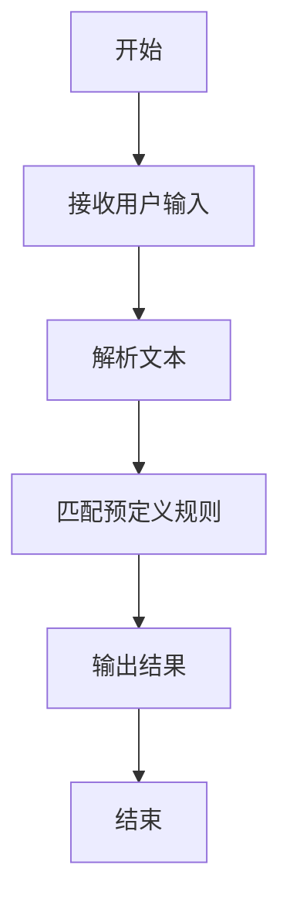
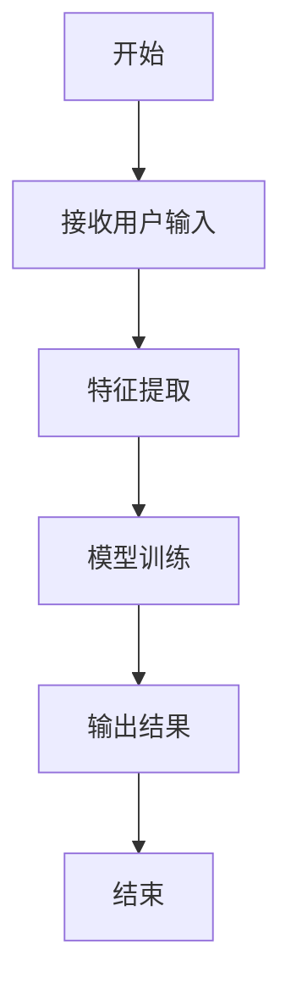
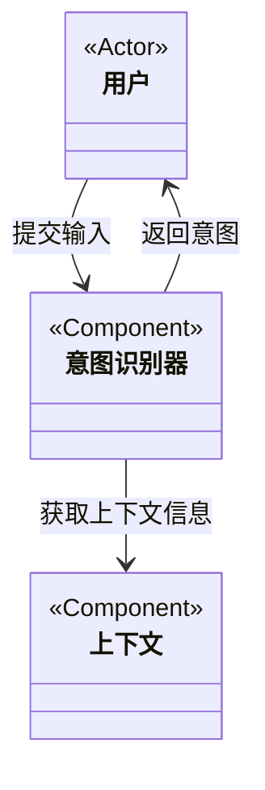
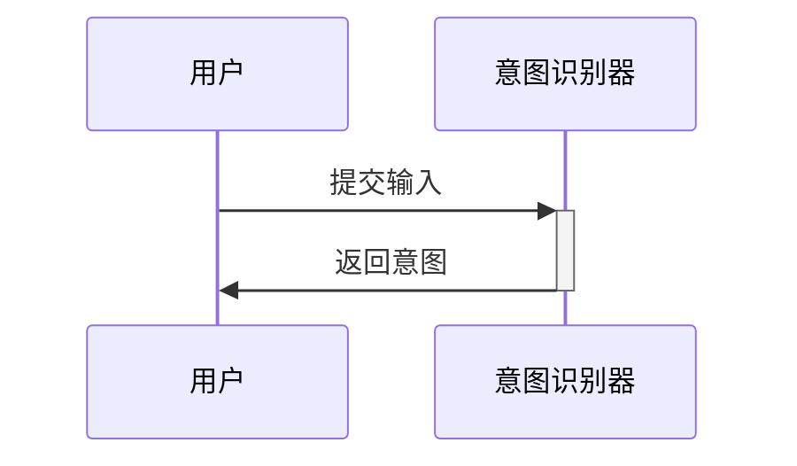

                 


# AI Agent的用户意图理解：从表层到深层

## 关键词：AI Agent, 用户意图, 意图理解, 自然语言处理, 机器学习, 深度学习

## 摘要：  
本文深入探讨了AI Agent在用户意图理解中的核心作用，从表层意图到深层意图的分析过程，结合了自然语言处理、机器学习等技术，详细解析了意图理解的算法原理、系统架构及实际应用案例。

---

# 第一部分: AI Agent的用户意图理解基础

## 第1章: AI Agent与用户意图理解概述

### 1.1 AI Agent的基本概念

#### 1.1.1 AI Agent的定义与分类
AI Agent（智能体）是指能够感知环境并采取行动以实现目标的智能系统。根据智能水平，AI Agent可以分为基于规则的Agent和基于模型的Agent。基于规则的Agent通过预定义的规则进行简单决策，而基于模型的Agent则通过学习和推理来处理复杂任务。

#### 1.1.2 用户意图理解的重要性
用户意图理解是AI Agent与用户进行有效交互的核心。通过准确理解用户的意图，AI Agent能够提供更精准的服务，提升用户体验。

#### 1.1.3 AI Agent在人机交互中的作用
AI Agent通过自然语言处理技术，解析用户的输入，识别其需求，并生成相应的回应，从而实现高效的人机交互。

### 1.2 用户意图理解的背景与挑战

#### 1.2.1 当前人机交互的主要问题
传统的人机交互方式依赖于用户明确输入指令，这种方式效率低下且难以应对复杂的用户需求。

#### 1.2.2 意图理解在AI Agent中的关键性
意图理解能够帮助AI Agent预测用户的潜在需求，提供更智能化的服务，从而提升用户体验。

#### 1.2.3 意图理解的技术挑战与解决方案
意图理解的挑战包括语言的模糊性、上下文的理解以及跨领域应用的复杂性。解决方案包括使用自然语言处理技术和机器学习模型。

### 1.3 意图理解的技术发展与应用

#### 1.3.1 意图理解的历史演变
意图理解技术经历了从基于规则到基于机器学习的转变，近年来深度学习技术的应用进一步提升了意图理解的准确率。

#### 1.3.2 当前主流技术与工具
主流技术包括基于词嵌入的模型（如Word2Vec）、基于序列的模型（如LSTM）和基于Transformer的模型（如BERT）。常用的工具包括spaCy、Gensim和Hugging Face的Transformers库。

#### 1.3.3 意图理解在不同领域的应用案例
在智能音箱、聊天机器人和推荐系统等领域，意图理解技术得到了广泛应用，显著提升了用户体验。

### 1.4 本章小结
本章介绍了AI Agent的基本概念和用户意图理解的重要性，探讨了意图理解的技术挑战与解决方案，并总结了当前的技术发展与应用案例。

---

# 第二部分: 意图理解的核心概念与联系

## 第2章: 意图理解的核心概念

### 2.1 意图理解的层次结构

#### 2.1.1 表层意图的定义与特点
表层意图是指用户直接表达的需求，通常基于显式的语言信息。例如，用户输入“播放音乐”时，表层意图是播放音乐。

#### 2.1.2 深层意图的定义与特点
深层意图是指用户未明确表达的潜在需求，通常需要结合上下文和用户行为进行推理。例如，用户输入“我很累”，深层意图可能是需要放松或建议休息。

#### 2.1.3 表层意图与深层意图的关系
表层意图是深层意图的基础，深层意图是表层意图的扩展和深化。理解深层意图需要基于表层意图进行推理和关联。

### 2.2 意图理解的关键属性对比

| 属性       | 表层意图                   | 深层意图                   |
|------------|----------------------------|----------------------------|
| 理解深度     | 浅层                       | 深层                       |
| 信息量       | 少                         | 多                         |
| 应用场景     | 单一                       | 复杂                       |
| 依赖性       | 语言信息                   | 上下文和行为信息           |

### 2.3 意图理解的ER实体关系图

```mermaid
er
actor: 用户
-- 关联 -->
intent: 意图
-- 关联 -->
context: 上下文
```

### 2.4 本章小结
本章分析了意图理解的层次结构，对比了表层意图和深层意图的关键属性，并通过ER实体关系图展示了意图理解的核心要素。

---

# 第三部分: 意图理解的算法与模型

## 第3章: 意图理解的算法原理

### 3.1 基于规则的意图理解算法

#### 3.1.1 算法流程图



#### 3.1.2 Python代码实现

```python
def rule_based_intent_classification(text, rules):
    for rule in rules:
        if rule.matcher(text):
            return rule.intent
    return "未识别意图"
```

### 3.2 基于机器学习的意图理解算法

#### 3.2.1 算法流程图



#### 3.2.2 算法代码示例

```python
from sklearn.feature_extraction.text import TfidfVectorizer
from sklearn.svm import SVC

# 特征提取
vectorizer = TfidfVectorizer()
X = vectorizer.fit_transform(corpus)

# 模型训练
model = SVC()
model.fit(X, labels)

# 预测
test_text = ["播放音乐"]
test_X = vectorizer.transform([test_text])
predicted_intent = model.predict(test_X)[0]
```

### 3.3 基于深度学习的意图理解模型

#### 3.3.1 模型结构图


#### 3.3.2 数学模型公式

$$ P(y|x) = \frac{P(x|y)P(y)}{P(x)} $$

其中：
- \( P(y|x) \) 是在输入 \( x \) 下意图 \( y \) 的概率。
- \( P(x|y) \) 是在意图 \( y \) 下输入 \( x \) 的概率。
- \( P(y) \) 是意图 \( y \) 的先验概率。
- \( P(x) \) 是输入 \( x \) 的边缘概率。

### 3.4 本章小结
本章详细讲解了基于规则、机器学习和深度学习的意图理解算法，对比了不同算法的优缺点，并通过代码示例和数学公式进行了深入分析。

---

# 第四部分: 系统分析与架构设计

## 第4章: 系统分析与架构设计

### 4.1 问题场景介绍

#### 4.1.1 用户场景
用户通过语音或文本输入与AI Agent交互，AI Agent需要理解用户的意图并提供相应的服务。

#### 4.1.2 功能需求
- 接收用户输入
- 解析用户意图
- 提供服务响应

### 4.2 系统功能设计

#### 4.2.1 领域模型类图



### 4.3 系统架构设计

#### 4.3.1 系统架构图

```mermaid
subgraph 前端
    Frontend
end

subgraph 后端
    Backend
end

subgraph 数据库
    Database
end

Frontend --> Backend: 发送用户输入
Backend --> Database: 查询数据
Backend --> Frontend: 返回意图结果
```

### 4.4 系统接口设计

#### 4.4.1 API接口

```http
POST /api/intent
Content-Type: application/json

{
    "input": "播放音乐"
}
```

### 4.5 系统交互流程图



### 4.6 本章小结
本章通过系统分析与架构设计，展示了AI Agent意图理解系统的整体结构和交互流程。

---

# 第五部分: 项目实战与案例分析

## 第5章: 项目实战

### 5.1 环境安装

#### 5.1.1 安装Python和相关库
```bash
pip install numpy scikit-learn spacy
python -m spacy download en_core_web_sm
```

### 5.2 系统核心实现

#### 5.2.1 核心代码实现

```python
import spacy

nlp = spacy.load("en_core_web_sm")

def process_text(text):
    doc = nlp(text)
    return [token.text for token in doc]

text = "播放音乐"
processed = process_text(text)
print(processed)
```

#### 5.2.2 代码应用解读与分析
通过 spaCy 对文本进行分词处理，提取关键信息用于意图识别。

### 5.3 实际案例分析

#### 5.3.1 案例背景
在智能音箱场景中，用户输入“播放音乐”，系统需要识别意图并执行播放操作。

#### 5.3.2 案例分析
- 输入处理：将用户输入转化为可处理的格式。
- 意图识别：通过模型识别用户的意图。
- 服务执行：根据识别的意图执行相应的操作。

### 5.4 本章小结
本章通过实际项目实战，展示了意图理解技术的应用过程，并详细解读了核心代码和案例分析。

---

# 第六部分: 总结与展望

## 第6章: 总结与展望

### 6.1 本章小结
本文详细探讨了AI Agent的用户意图理解技术，从表层意图到深层意图的分析过程，结合了自然语言处理和机器学习技术，展示了意图理解在实际系统中的应用。

### 6.2 最佳实践 tips
- 使用预训练模型提升意图理解的准确率。
- 结合上下文信息进行意图推理。
- 定期更新模型以适应用户需求的变化。

### 6.3 注意事项
- 注意数据质量和多样性，避免过拟合。
- 确保系统安全性和隐私保护。

### 6.4 拓展阅读
推荐阅读《深度学习》和《自然语言处理实战》等书籍，进一步了解相关技术。

---

## 作者：AI天才研究院 & 禅与计算机程序设计艺术

---

以上是《AI Agent的用户意图理解：从表层到深层》的完整目录和正文内容，涵盖了从基础到高级的技术细节和实际应用案例，希望对您有所帮助！

