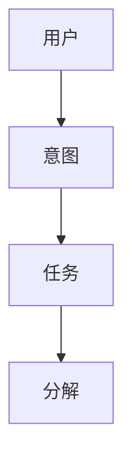
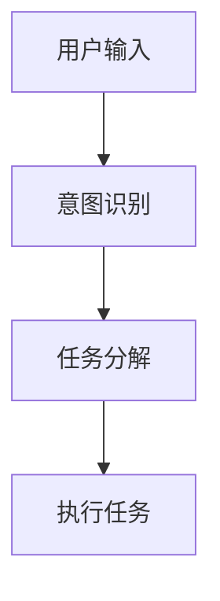
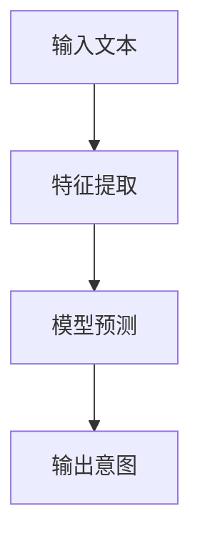
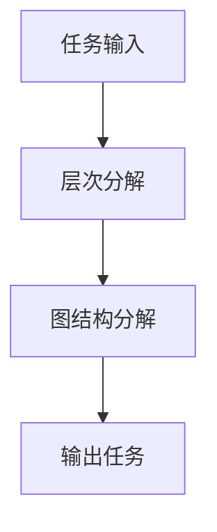
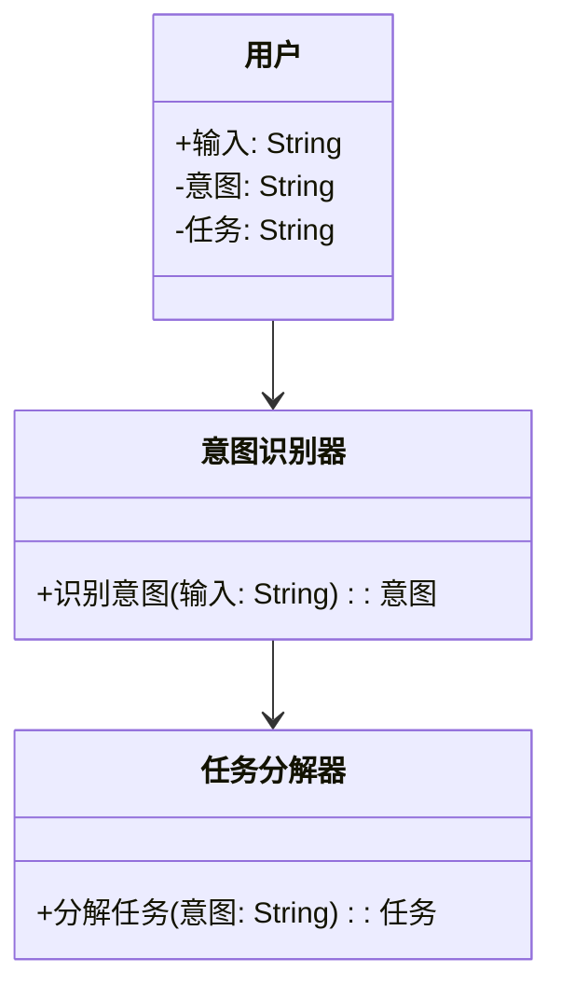
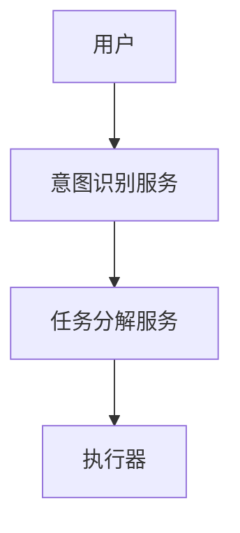

                 


# AI Agent的用户意图识别与任务分解

---

## 关键词：
- AI Agent
- 用户意图识别
- 任务分解
- 自然语言处理
- 深度学习
- 系统架构设计

---

## 摘要：
本文深入探讨了AI Agent在用户意图识别与任务分解中的核心原理、算法实现及其在实际系统中的应用。文章从背景与概念入手，详细分析了意图识别与任务分解的关联性，并通过数学模型、流程图和代码示例，系统性地阐述了相关算法的实现原理。同时，结合实际项目案例，展示了如何设计和实现一个高效的AI Agent系统，并提供了最佳实践和优化建议。

---

# 第一部分：AI Agent与用户意图识别基础

## 第1章：AI Agent的基本概念

### 1.1 AI Agent的定义
- AI Agent的定义与特点
- AI Agent与传统程序的区别
- AI Agent的核心功能：感知、决策、执行

### 1.2 用户意图识别的背景与意义
- 什么是用户意图识别
- 用户意图识别的必要性
- 用户意图识别在AI Agent中的作用

### 1.3 任务分解的基本概念
- 任务分解的定义
- 任务分解的目标
- 意图识别与任务分解的关系

## 第2章：用户意图识别的核心概念与联系

### 2.1 用户意图识别的核心原理
- 基于规则的意图识别
- 基于统计的意图识别
- 基于深度学习的意图识别

### 2.2 意图识别与任务分解的联系
- 意图识别在任务分解中的作用
- 任务分解对意图识别的反哺作用
- 两者结合的实际应用

### 2.3 实体关系图与流程图
- ER实体关系图

- 意图识别与任务分解流程图


---

# 第二部分：用户意图识别的算法原理与数学模型

## 第3章：用户意图识别的算法原理

### 3.1 常见的意图识别算法
- 基于规则的意图识别
- 基于统计的意图识别
- 基于深度学习的意图识别

### 3.2 深度学习模型的数学基础
- 神经网络的数学模型
- 概率论在意图识别中的应用
- 损失函数与优化算法

### 3.3 意图识别的数学公式
- 概率计算公式
$$ P(y|x) = \frac{P(x|y)P(y)}{P(x)} $$
- 神经网络的损失函数
$$ L = -\sum_{i=1}^{n} y_i \log(p_i) + (1 - y_i) \log(1 - p_i) $$

### 3.4 算法流程图


---

## 第4章：任务分解的算法原理

### 4.1 任务分解的核心原理
- 基于规则的任务分解
- 基于层次的任务分解
- 基于图结构的任务分解

### 4.2 任务分解的数学模型
- 分层任务分解模型
- 图结构任务分解模型
- 基于概率的分解模型

### 4.3 任务分解的数学公式
- 分层分解公式
$$ f(x) = \sum_{i=1}^{n} w_i x_i $$
- 图结构分解公式
$$ P(y|x) = \prod_{i=1}^{m} P(y_i|x_i) $$

### 4.4 算法流程图


---

# 第三部分：系统分析与架构设计

## 第5章：系统分析与架构设计

### 5.1 问题场景介绍
- 用户输入的处理流程
- 系统功能需求分析

### 5.2 系统功能设计
- 领域模型类图


### 5.3 系统架构设计
- 系统架构图

- 系统接口设计
```mermaid
sequenceDiagram
用户 ->+> 意图识别服务: 发送输入
意图识别服务 ->+> 任务分解服务: 发送意图
任务分解服务 ->+> 执行器: 发送任务
```

---

## 第6章：项目实战

### 6.1 环境安装
- 安装Python
- 安装相关库（如TensorFlow、NLTK）

### 6.2 核心代码实现
```python
# 意图识别示例代码
def identify_intent(text):
    # 特征提取
    features = extract_features(text)
    # 模型预测
    intent = model.predict(features)
    return intent

# 任务分解示例代码
def decompose_task(intent):
    # 分解任务
    tasks = decompose_model.decompose(intent)
    return tasks
```

### 6.3 实际案例分析
- 案例1：用户输入“预订机票”
  - 意图识别：预订机票
  - 任务分解：搜索航班、选择日期、确认订单

---

## 第7章：最佳实践与优化建议

### 7.1 最佳实践
- 数据质量的重要性
- 模型调优的技巧
- 系统性能优化

### 7.2 小结
- 本文总结
- 未来研究方向

### 7.3 注意事项
- 数据隐私保护
- 系统容错设计
- 优化算法的选择

---

# 作者：AI天才研究院/AI Genius Institute & 禅与计算机程序设计艺术 /Zen And The Art of Computer Programming

