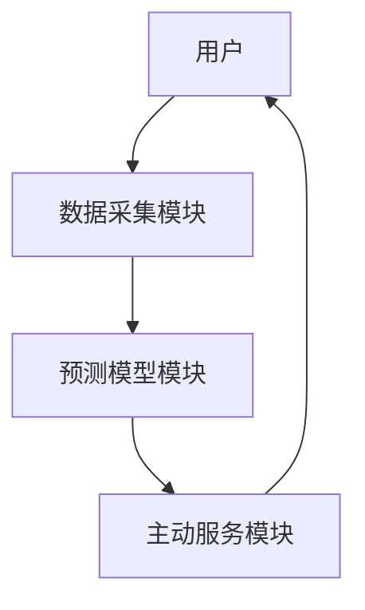

                 


# AI Agent的用户需求预测与主动服务

> **关键词**：AI Agent, 用户需求预测, 主动服务, 人工智能, 机器学习, 算法原理

> **摘要**：本文将深入探讨AI Agent在用户需求预测与主动服务中的应用。从AI Agent的基本概念到用户需求预测的核心算法，再到主动服务的实现机制，我们将系统性地分析其原理、方法和实践。通过结合实际案例和系统架构设计，本文将帮助读者全面理解AI Agent如何通过预测用户需求并提供主动服务，从而提升用户体验和系统效率。

---

## 第1章: AI Agent概述

### 1.1 AI Agent的基本概念

#### 1.1.1 什么是AI Agent
AI Agent（人工智能代理）是指能够感知环境、自主决策并执行任务的智能实体。它可以是一个软件程序、一个机器人，或者任何能够与环境交互的智能系统。AI Agent的核心目标是通过智能化的方法解决复杂问题，并为用户提供高效的服务。

#### 1.1.2 AI Agent的核心特征
- **自主性**：AI Agent能够在没有外部干预的情况下自主决策和行动。
- **反应性**：能够实时感知环境变化并做出相应的反应。
- **目标导向**：基于明确的目标或任务进行行动。
- **学习能力**：通过数据和经验不断优化自身的性能。

#### 1.1.3 AI Agent的分类与应用场景
AI Agent可以根据功能和应用场景分为多种类型：
- **简单反射型AI Agent**：基于规则的简单决策，如自动回复机器人。
- **基于模型的AI Agent**：利用内部模型进行复杂决策，如自动驾驶系统。
- **目标驱动型AI Agent**：基于明确的目标执行任务，如智能助手。
- **学习驱动型AI Agent**：通过机器学习不断优化自身行为，如推荐系统。

---

### 1.2 AI Agent的发展历程

#### 1.2.1 AI Agent的历史演变
AI Agent的概念起源于20世纪60年代的知识表示与推理研究。随着计算机技术的发展，AI Agent逐渐从简单的规则驱动系统演变为基于机器学习的智能系统。

#### 1.2.2 当前AI Agent技术的现状
当前，AI Agent技术广泛应用于多个领域，如智能助手（Siri、Alexa）、推荐系统、自动驾驶、智能客服等。这些应用的成功离不开深度学习和自然语言处理技术的进步。

#### 1.2.3 未来AI Agent的发展趋势
未来，AI Agent将更加智能化和人性化。通过结合边缘计算和物联网技术，AI Agent将能够更高效地处理实时数据，并在更多领域实现自主决策。

---

### 1.3 AI Agent在用户需求预测中的作用

#### 1.3.1 需求预测的核心目标
用户需求预测的目标是通过分析用户的历史行为、偏好和环境信息，预测用户未来的决策或行为。这使得AI Agent能够提前为用户提供所需的服务，从而提升用户体验。

#### 1.3.2 需求预测的关键技术
- **数据采集**：通过日志分析、用户反馈和传感器数据等多种方式获取用户行为数据。
- **特征提取**：从海量数据中提取与用户需求相关的特征，如时间、地点、用户行为频率等。
- **模型训练**：利用机器学习和深度学习算法训练预测模型，并通过不断优化模型提升预测准确率。

---

## 第2章: 用户需求预测的核心算法

### 2.1 需求预测的算法原理

#### 2.1.1 马尔可夫链模型
马尔可夫链是一种基于概率的模型，适用于预测用户在不同状态之间的转移概率。例如，我们可以利用马尔可夫链预测用户在某个时间点的购买行为。

**马尔可夫链模型的数学表达式：**
$$ P(s_{t+1} | s_t) = \theta $$
其中，$\theta$ 表示状态转移的概率矩阵。

#### 2.1.2 基于注意力机制的序列模型
注意力机制是一种基于深度学习的模型，能够捕捉用户行为中的长短期依赖关系。例如，我们可以利用Transformer模型预测用户的下一步行为。

**注意力机制的计算公式：**
$$ \alpha_i = \frac{e^{q_i^T k_j}}{\sum_{l} e^{q_i^T k_l}} $$
其中，$q_i$ 和 $k_j$ 分别是查询和键的向量，$\alpha_i$ 是注意力权重。

---

## 第3章: AI Agent的主动服务实现

### 3.1 主动服务的核心机制

#### 3.1.1 服务触发条件
AI Agent需要根据预测模型的结果决定是否触发主动服务。例如，当预测模型预测到用户可能需要某个服务时，AI Agent会主动提供该服务。

#### 3.1.2 服务内容的动态调整
根据用户的实时行为和反馈，AI Agent可以动态调整服务内容。例如，在推荐系统中，AI Agent可以根据用户的实时反馈调整推荐列表。

#### 3.1.3 服务效果的评估与优化
通过收集用户对主动服务的反馈，AI Agent可以不断优化服务策略。例如，通过A/B测试优化推荐算法。

---

## 第4章: 系统架构设计与实现

### 4.1 系统功能设计

#### 4.1.1 数据采集模块
- 从数据库、日志文件和传感器中获取用户行为数据。
- 数据格式化和预处理。

#### 4.1.2 预测模型模块
- 利用机器学习模型（如XGBoost、随机森林）和深度学习模型（如LSTM、Transformer）进行用户需求预测。
- 模型训练和优化。

#### 4.1.3 主动服务模块
- 根据预测结果触发主动服务。
- 动态调整服务内容并实时反馈用户。

### 4.2 系统架构设计

#### 4.2.1 系统架构图


#### 4.2.2 接口设计
- **数据接口**：提供API用于数据的导入和导出。
- **服务接口**：提供API用于触发主动服务和获取服务结果。

---

## 第5章: 项目实战

### 5.1 环境安装

#### 5.1.1 安装Python环境
```bash
python --version
pip install numpy pandas scikit-learn transformers
```

#### 5.1.2 安装深度学习框架
```bash
pip install tensorflow
pip install pytorch
```

### 5.2 核心代码实现

#### 5.2.1 数据预处理代码
```python
import pandas as pd
import numpy as np

# 加载数据
data = pd.read_csv('user_behavior.csv')

# 数据清洗
data = data.dropna()
data['timestamp'] = pd.to_datetime(data['timestamp'])
```

#### 5.2.2 模型训练代码
```python
from sklearn.model_selection import train_test_split
from sklearn.ensemble import RandomForestClassifier

# 划分训练集和测试集
X_train, X_test, y_train, y_test = train_test_split(data.drop('label', axis=1), data['label'], test_size=0.2)

# 训练随机森林模型
model = RandomForestClassifier()
model.fit(X_train, y_train)
```

#### 5.2.3 服务触发代码
```python
def trigger_service(predicted_probability):
    if predicted_probability > 0.9:
        return True
    else:
        return False
```

---

## 第6章: 最佳实践与总结

### 6.1 最佳实践

#### 6.1.1 数据质量管理
确保数据的准确性和完整性，避免噪声数据对模型的影响。

#### 6.1.2 模型优化
通过A/B测试和在线学习不断优化模型性能。

#### 6.1.3 服务安全
确保用户数据的安全性，避免数据泄露和滥用。

---

## 第7章: 未来展望

随着人工智能和大数据技术的不断进步，AI Agent的用户需求预测与主动服务将变得更加智能化和个性化。未来，我们期待AI Agent能够在更多领域实现更高效的主动服务，为用户带来更好的体验。

---

## 作者信息

作者：AI天才研究院/AI Genius Institute & 禅与计算机程序设计艺术 /Zen And The Art of Computer Programming

