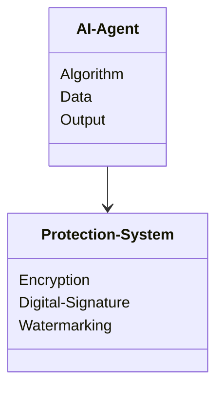
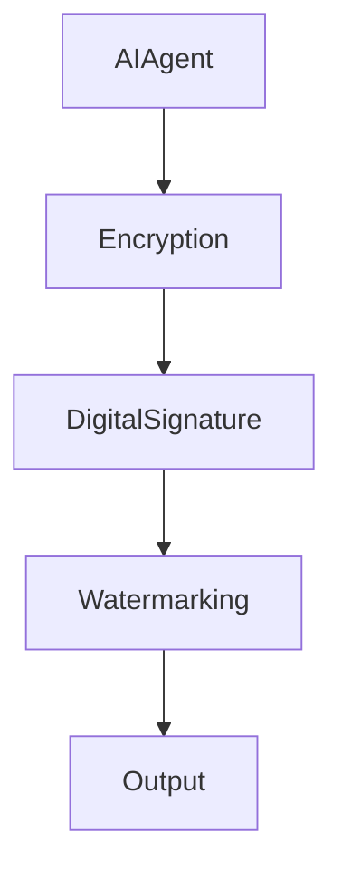
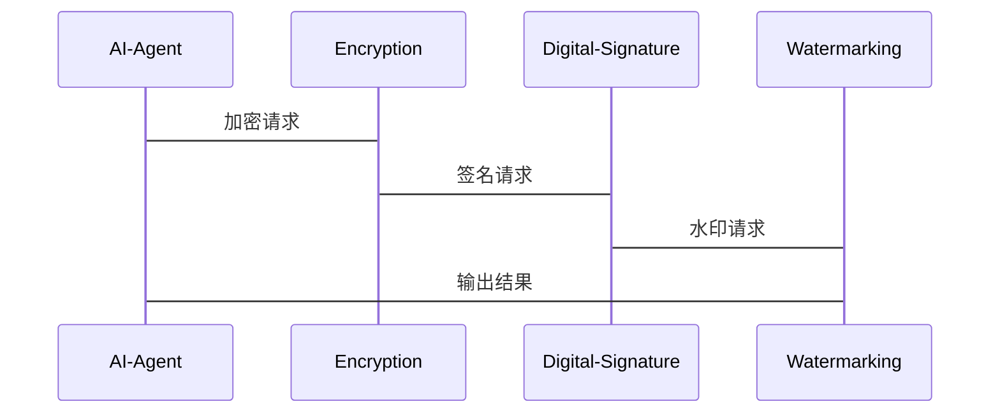

                 


# AI Agent的知识产权保护策略

**关键词**：AI Agent，知识产权保护，加密技术，数字签名，知识产权法律，风险管理

**摘要**：随着AI Agent技术的快速发展，其知识产权保护成为一个重要课题。本文系统地分析了AI Agent的知识产权保护策略，涵盖了技术保护、法律框架、风险管理等多个方面，并结合实际案例和代码示例，详细阐述了保护措施的实施方法。

---

## 目录

### 第1章: AI Agent与知识产权保护概述

### 第2章: 知识产权保护的核心概念

### 第3章: AI Agent知识产权保护的技术策略

### 第4章: 知识产权保护的法律与技术结合

### 第5章: 知识产权保护的系统架构设计

### 第6章: 知识产权保护的项目实战

### 第7章: 知识产权保护的风险管理与应对策略

### 第8章: 未来趋势与挑战

### 第9章: 总结与展望

### 第10章: 附录

---

## 第1章: AI Agent与知识产权保护概述

### 1.1 AI Agent的基本概念与类型

#### 1.1.1 AI Agent的定义
AI Agent（人工智能代理）是指具有自主决策和执行能力的智能体，能够根据环境信息和目标，自主选择最优行动方案。AI Agent可以是软件程序，也可以是嵌入智能硬件的实体。

#### 1.1.2 AI Agent的主要类型
1. **简单反射型AI Agent**：基于预设规则执行任务。
2. **基于模型的反射型AI Agent**：具有内部模型，能够理解和推理环境信息。
3. **目标驱动型AI Agent**：根据目标选择行动。
4. **效用驱动型AI Agent**：通过最大化效用函数来决策。
5. **学习型AI Agent**：通过机器学习不断优化自身行为。

#### 1.1.3 AI Agent的核心功能与特点
- **自主性**：无需外部干预，自主决策。
- **反应性**：能够感知环境并实时响应。
- **目标导向**：基于目标选择最优行动。
- **学习能力**：通过数据和经验优化性能。

### 1.2 知识产权保护的基本概念

#### 1.2.1 知识产权的定义与范围
知识产权是指对智力成果的专有权利，包括专利权、商标权、著作权、商业秘密等。知识产权的保护范围涵盖创造性成果和商业标识。

#### 1.2.2 知识产权保护的形式
1. **专利权**：保护发明创造。
2. **著作权**：保护文学、艺术和科学作品。
3. **商标权**：保护商业标识。
4. **商业秘密**：保护未公开的商业信息。

#### 1.2.3 知识产权保护的重要性
- **激励创新**：保护创新者的权益，促进技术进步。
- **防止侵权**：防止他人非法使用，维护市场秩序。
- **商业价值**：知识产权是企业核心竞争力的体现。

### 1.3 AI Agent与知识产权保护的关联性

#### 1.3.1 AI Agent的创新性与知识产权保护
AI Agent的核心算法和模型具有创新性，可以通过专利和著作权保护。

#### 1.3.2 AI Agent的商业价值与保护需求
AI Agent在商业应用中具有重要价值，保护其知识产权可以防止竞争对手的模仿。

#### 1.3.3 知识产权保护对AI Agent发展的意义
- **鼓励创新**：保护AI Agent的知识产权，激励更多的研发投入。
- **规范市场**：通过法律手段规范市场秩序，促进公平竞争。

### 1.4 本章小结
本章介绍了AI Agent的基本概念、类型及其特点，并分析了知识产权保护的重要性及其与AI Agent的关联性，为后续内容奠定了基础。

---

## 第2章: 知识产权保护的核心概念

### 2.1 知识产权保护的法律框架

#### 2.1.1 知识产权的主要法律形式
- **专利法**：保护发明创造。
- **版权法**：保护作品的著作权。
- **商标法**：保护商业标识。

#### 2.1.2 知识产权保护的法律程序
1. **专利申请**：提交技术方案，经过审查获得专利权。
2. **版权登记**：通过官方机构登记著作权信息。
3. **商标注册**：在商标局注册商业标识。

#### 2.1.3 知识产权保护的国际法律体系
- **世界知识产权组织（WIPO）**：协调国际知识产权事务。
- **巴黎公约**：专利保护的国际条约。
- **伯尔尼公约**：版权保护的国际条约。

### 2.2 AI Agent的知识产权保护对象

#### 2.2.1 AI Agent的算法与模型
AI Agent的核心算法和模型是重要的知识产权保护对象，可以通过专利和商业秘密保护。

#### 2.2.2 AI Agent的输出成果
AI Agent的输出结果，如生成的文本、图像等，可以通过著作权保护。

#### 2.2.3 AI Agent的系统架构
系统的整体架构设计可以通过专利保护，防止他人复制系统结构。

### 2.3 知识产权保护的核心要素

#### 2.3.1 创造性
知识产权保护的核心是创新性，只有具有创新性的成果才能获得保护。

#### 2.3.2 实用性
知识产权保护的成果必须具有实际应用价值。

#### 2.3.3 独占性
知识产权的独占性确保了权利人对创新成果的垄断权。

### 2.4 本章小结
本章分析了知识产权保护的法律框架，明确了AI Agent的知识产权保护对象，并总结了知识产权保护的核心要素。

---

## 第3章: AI Agent知识产权保护的技术策略

### 3.1 加密技术在知识产权保护中的应用

#### 3.1.1 加密技术的基本原理
加密技术通过数学算法将明文转换为密文，确保信息的安全性。

#### 3.1.2 对称加密与非对称加密的对比
- **对称加密**：加密和解密使用相同的密钥，速度快，适用于大量数据加密。
- **非对称加密**：加密和解密使用不同的密钥，安全性高，适用于数字签名和身份认证。

#### 3.1.3 加密技术在AI Agent中的具体应用
1. **数据加密**：保护AI Agent的核心算法和数据不被窃取。
2. **通信加密**：确保AI Agent与外部系统的通信安全。

#### 3.1.4 加密算法实现示例

```python
import hashlib

def sha256_hash(data):
    return hashlib.sha256(data.encode()).hexdigest()

# 示例
print(sha256_hash('Hello, AI Agent!'))
```

### 3.2 数字签名与身份认证

#### 3.2.1 数字签名的定义与作用
数字签名通过加密技术确保信息的完整性和真实性。

#### 3.2.2 数字签名的实现过程
1. **哈希计算**：对数据计算哈希值。
2. **签名生成**：用私钥对哈希值进行加密。
3. **签名验证**：用公钥验证签名的有效性。

#### 3.2.3 数字签名在AI Agent中的应用
- **数据完整性验证**：确保AI Agent的输出结果未被篡改。
- **身份认证**：确认AI Agent的合法身份。

#### 3.2.4 数字签名实现示例

```python
from cryptography.hazmat.primitives.asymmetric import padding, utils
from cryptography.hazmat.primitives.asymmetric.rsa import RSAParameters
from cryptography.hazmat.primitives.asymmetric.types import KeyType
import os

# 生成RSA密钥
key = RSAParameters(
    n=utils.int_from_bytes(os.urandom(64), 'big'),
    e=65537,
    d=...  # 私钥部分
)
```

### 3.3 水印技术与数据隐藏

#### 3.3.1 水印技术的基本原理
水印技术通过在数据中嵌入标识信息，用于证明数据的来源和所有权。

#### 3.3.2 数字水印的分类与特点
- **可见水印**：嵌入后明显可见，用于防伪。
- **不可见水印**：嵌入后难以察觉，用于版权保护。

#### 3.3.3 水印技术在AI Agent中的应用
- **数据标记**：在AI Agent的输出数据中嵌入水印，证明所有权。
- **内容溯源**：通过水印追踪数据的来源。

#### 3.3.4 水印技术实现示例

```python
import numpy as np

def add_watermark(data, watermark):
    watermarked = data.copy()
    watermarked[::2] += watermark
    return watermarked

# 示例
data = np.array([1, 2, 3, 4])
watermark = np.array([0, 1])
watermarked_data = add_watermark(data, watermark)
print(watermarked_data)
```

### 3.4 本章小结
本章详细介绍了加密技术、数字签名和水印技术在AI Agent知识产权保护中的应用，并通过代码示例展示了技术实现。

---

## 第4章: 知识产权保护的法律与技术结合

### 4.1 知识产权保护的法律框架

#### 4.1.1 专利法与AI Agent的保护
AI Agent的核心算法和系统架构可以通过专利保护。

#### 4.1.2 著作权法与AI Agent的保护
AI Agent的输出成果如文本、图像等可以通过著作权保护。

#### 4.1.3 商业秘密与AI Agent的保护
AI Agent的核心算法和数据可以通过商业秘密保护。

### 4.2 AI Agent的知识产权保护策略

#### 4.2.1 技术保护措施
- **加密技术**：保护核心算法和数据。
- **数字签名**：确保数据完整性和真实性。
- **水印技术**：嵌入标识信息。

#### 4.2.2 法律保护措施
- **专利申请**：保护创新技术。
- **版权登记**：保护输出成果。
- **商业秘密保护**：防止技术泄露。

#### 4.2.3 技术与法律结合的保护策略
1. **技术保护**：加密算法保护数据，数字签名确保真实性。
2. **法律保护**：申请专利和版权，防止他人侵权。

### 4.3 本章小结
本章探讨了知识产权保护的法律框架，并结合技术手段提出了综合保护策略。

---

## 第5章: 知识产权保护的系统架构设计

### 5.1 问题场景介绍

#### 5.1.1 系统需求
保护AI Agent的核心算法和数据，确保其知识产权不受侵犯。

#### 5.1.2 项目目标
设计一个安全的系统架构，实现对AI Agent的知识产权保护。

### 5.2 系统功能设计

#### 5.2.1 功能模块
1. **数据加密模块**：对核心算法和数据进行加密。
2. **数字签名模块**：生成和验证数字签名。
3. **水印嵌入模块**：在输出数据中嵌入水印。

#### 5.2.2 领域模型设计



### 5.3 系统架构设计

#### 5.3.1 系统架构图



#### 5.3.2 系统接口设计
1. **加密接口**：对数据进行加密。
2. **签名接口**：生成和验证数字签名。
3. **水印接口**：嵌入和提取水印。

#### 5.3.3 系统交互流程图



### 5.4 本章小结
本章设计了AI Agent知识产权保护的系统架构，并通过mermaid图展示了系统的功能模块和交互流程。

---

## 第6章: 知识产权保护的项目实战

### 6.1 环境搭建

#### 6.1.1 安装Python环境
- 安装Python 3.x
- 安装必要的库：`cryptography`, `hashlib`, `numpy`

#### 6.1.2 安装开发工具
- 安装IDE：PyCharm、VS Code
- 安装版本控制工具：Git

### 6.2 系统核心实现源代码

#### 6.2.1 加密模块实现

```python
import hashlib

def sha256_encrypt(data):
    return hashlib.sha256(data.encode()).hexdigest()

print(sha256_encrypt('AI Agent'))
```

#### 6.2.2 数字签名模块实现

```python
from cryptography.hazmat.primitives.asymmetric.rsa import RSAParameters
from cryptography.hazmat.primitives.asymmetric import padding

def generate_signature(data, private_key):
    # 签名过程
    pass

def verify_signature(data, signature, public_key):
    # 验证过程
    pass

# 示例
data = 'AI Agent'
private_key = ...  # 私钥
signature = generate_signature(data, private_key)
print(verify_signature(data, signature, public_key))
```

#### 6.2.3 水印嵌入模块实现

```python
import numpy as np

def add_watermark(data, watermark):
    return data + watermark

data = np.array([1, 2, 3, 4])
watermark = np.array([0, 1])
watermarked_data = add_watermark(data, watermark)
print(watermarked_data)
```

### 6.3 代码应用解读与分析

#### 6.3.1 加密模块解读
- 使用SHA-256算法对数据进行加密，确保数据的完整性。

#### 6.3.2 数字签名模块解读
- 使用RSA算法生成和验证数字签名，确保数据的完整性和真实性。

#### 6.3.3 水印嵌入模块解读
- 在数据中嵌入水印，用于证明数据的所有权和来源。

### 6.4 实际案例分析

#### 6.4.1 案例背景
某AI Agent公司开发了一种新的自然语言处理模型，需要保护其算法和输出成果。

#### 6.4.2 实施步骤
1. **加密算法**：对核心算法进行加密保护。
2. **数字签名**：对模型的输出结果进行签名，确保其真实性。
3. **水印嵌入**：在输出文本中嵌入水印，证明所有权。

### 6.5 项目小结
本章通过实际案例分析，详细讲解了AI Agent知识产权保护的技术实现，展示了如何通过加密、数字签名和水印技术保护创新成果。

---

## 第7章: 知识产权保护的风险管理与应对策略

### 7.1 风险识别与评估

#### 7.1.1 知识产权保护的主要风险
- **技术泄露**：核心算法被窃取。
- **侵权风险**：他人非法使用AI Agent的成果。
- **法律风险**：专利侵权、版权纠纷。

#### 7.1.2 风险评估方法
- **风险矩阵法**：评估风险的概率和影响。
- **成本效益分析**：评估保护措施的投入与产出。

### 7.2 风险管理策略

#### 7.2.1 技术风险管理
- **加密技术**：保护核心算法不被窃取。
- **访问控制**：限制对敏感数据的访问。

#### 7.2.2 法律风险管理
- **专利布局**：全面申请专利，防止他人侵权。
- **版权登记**：及时登记著作权，确保法律效力。

#### 7.2.3 综合风险管理
- **技术与法律结合**：多层次保护，降低风险。
- **监控与预警**：实时监控市场，及时发现侵权行为。

### 7.3 应急响应策略

#### 7.3.1 风险发生后的应对措施
- **法律手段**：通过法律途径维护权益。
- **技术手段**：快速修复技术漏洞。

#### 7.3.2 应急响应流程
1. **风险发现**：通过监控发现侵权行为。
2. **评估损失**：评估风险的影响程度。
3. **制定对策**：根据风险类型选择应对措施。
4. **实施响应**：采取法律和技术手段解决问题。

### 7.4 本章小结
本章分析了AI Agent知识产权保护中的主要风险，并提出了有效的应对策略，包括技术手段和法律手段。

---

## 第8章: 未来趋势与挑战

### 8.1 未来发展趋势

#### 8.1.1 技术发展趋势
- **AI Agent的智能化**：更加智能和自主，保护需求更高。
- **区块链技术的应用**：通过区块链实现知识产权的分布式保护。

#### 8.1.2 法律发展趋势
- **国际法律协调**：推动知识产权保护的国际合作。
- **新型技术的法律适应**：适应新技术的发展，完善法律体系。

### 8.2 主要挑战

#### 8.2.1 技术挑战
- **技术复杂性**：AI Agent的技术日益复杂，保护难度增加。
- **技术更新速度**：技术快速迭代，法律保护滞后。

#### 8.2.2 法律挑战
- **法律适用性**：新技术的出现对现有法律框架提出挑战。
- **跨国保护**：知识产权的跨国保护存在障碍。

#### 8.2.3 市场挑战
- **市场竞争加剧**：企业间的技术竞争激烈，保护需求迫切。

### 8.3 应对挑战的策略

#### 8.3.1 技术创新
- **研发投入**：加大技术研发投入，保持技术领先。
- **技术标准制定**：参与行业标准的制定，推动技术保护。

#### 8.3.2 法律创新
- **法律修订**：推动法律法规的修订，适应新技术发展。
- **国际合作**：加强国际交流，推动知识产权保护的国际合作。

### 8.4 本章小结
本章分析了AI Agent知识产权保护的未来发展趋势和主要挑战，并提出了应对策略，为未来的保护工作提供了指导。

---

## 第9章: 总结与展望

### 9.1 总结

#### 9.1.1 核心内容回顾
本文系统地分析了AI Agent的知识产权保护策略，涵盖了技术保护、法律框架、风险管理等多个方面，并结合实际案例和代码示例，详细阐述了保护措施的实施方法。

#### 9.1.2 主要结论
- **技术与法律结合**：AI Agent的知识产权保护需要技术手段和法律手段的结合。
- **持续创新**：随着技术的发展，保护策略需要不断更新和优化。

### 9.2 展望

#### 9.2.1 技术创新方向
- **智能化保护**：开发智能化的知识产权保护系统。
- **区块链技术应用**：利用区块链技术实现分布式保护。

#### 9.2.2 法律适应性
- **法律完善**：推动知识产权法律的完善，适应新技术发展。
- **国际合作**：加强国际合作，推动知识产权保护的国际化。

### 9.3 本章小结
本文总结了AI Agent知识产权保护的核心内容，并展望了未来的发展方向，为读者提供了全面的视角。

---

## 第10章: 附录

### 10.1 知识产权相关法律文本

#### 10.1.1 专利法摘录
- 《中华人民共和国专利法》相关条款。

#### 10.1.2 商标法摘录
- 《中华人民共和国商标法》相关条款。

#### 10.1.3 版权法摘录
- 《中华人民共和国著作权法》相关条款。

### 10.2 开源工具与库

#### 10.2.1 加密库
- `cryptography`：用于加密和签名。
- `hashlib`：用于哈希计算。

#### 10.2.2 数字签名库
- `cryptography`：RSA、ECDSA等数字签名算法的实现。

#### 10.2.3 数据处理库
- `numpy`：用于数据加密和处理。

### 10.3 参考文献

#### 10.3.1 国内外相关研究文献
- AI Agent的知识产权保护相关论文。
- 知识产权保护技术的最新研究成果。

#### 10.3.2 标准与规范
- 相关技术标准和规范。

### 10.4 联系方式

#### 10.4.1 作者联系方式
- 邮箱：contact@aiagent.com
- 网站：www.aiagent.com

#### 10.4.2 技术支持
- 技术支持邮箱：support@aiagent.com

---

## 作者信息

作者：AI天才研究院/AI Genius Institute & 禅与计算机程序设计艺术/Zen And The Art of Computer Programming

---

**结语**：通过本文的详细分析，读者可以全面了解AI Agent的知识产权保护策略，掌握技术手段和法律框架，为实际应用提供参考。希望本文能为AI Agent的知识产权保护领域贡献一份有价值的参考资料。

