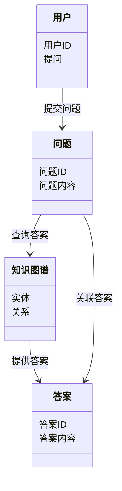
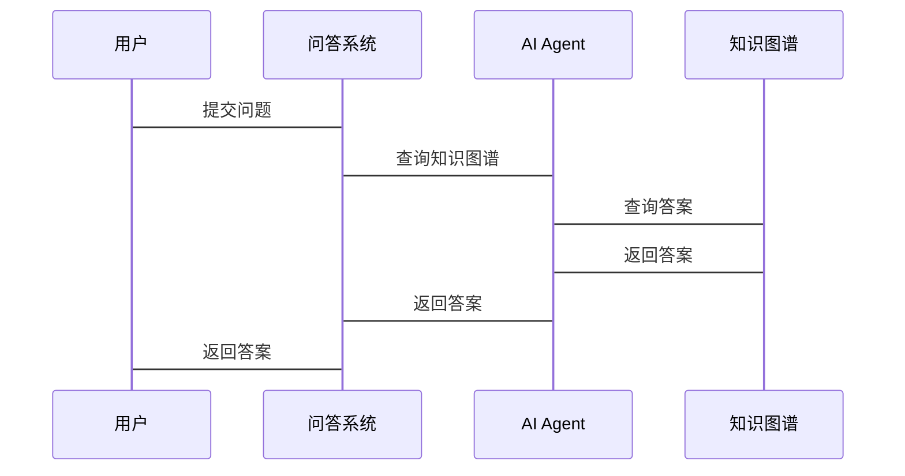

                 


# AI Agent的知识图谱在问答系统中的应用

> 关键词：AI Agent，知识图谱，问答系统，自然语言处理，人工智能，系统架构

> 摘要：本文详细探讨了AI Agent在问答系统中的应用，重点分析了知识图谱在其中的核心作用。通过系统化的分析和案例研究，本文揭示了如何利用知识图谱构建高效的问答系统，并展示了AI Agent在提升问答系统性能中的关键作用。文章内容涵盖了知识图谱的构建、问答系统的原理、系统架构设计以及实际项目实现等多个方面，为读者提供了全面的技术视角。

---

# 第一部分: AI Agent与知识图谱的背景介绍

## 第1章: 问题背景与核心概念

### 1.1 问题背景

随着人工智能技术的快速发展，问答系统已成为人机交互的重要组成部分。传统的问答系统主要依赖于关键词匹配和规则库，难以处理复杂语义和长尾问题。而知识图谱作为一种结构化的知识表示方式，能够有效地补充和提升问答系统的智能性。AI Agent作为具备自主决策和学习能力的智能体，进一步增强了问答系统的灵活性和适应性。

#### 1.1.1 问答系统的发展历程

- **基于规则的问答系统**：依赖人工编写规则，适用于特定领域，但灵活性差。
- **基于检索的问答系统**：通过关键词匹配从大规模文档中检索答案，但难以理解语义。
- **基于生成的问答系统**：利用自然语言处理技术生成回答，但依赖大量训练数据。
- **基于知识图谱的问答系统**：结合知识图谱的结构化知识，实现更智能的问答。
- **AI Agent增强的问答系统**：通过AI Agent的自主学习和推理能力，进一步提升问答系统的智能化水平。

#### 1.1.2 知识图谱在问答系统中的作用

知识图谱通过实体和关系的结构化表示，为问答系统提供了丰富的语义信息。例如，当用户询问“谁是苹果公司的创始人？”时，知识图谱可以直接提供“史蒂夫·乔布斯”与“苹果公司”的关系，从而快速准确地回答问题。

#### 1.1.3 AI Agent在问答系统中的应用价值

AI Agent能够实时分析用户意图，结合知识图谱中的信息进行推理和决策，从而提供更精准和个性化的回答。例如，在医疗领域，AI Agent可以通过知识图谱分析用户的症状，推荐合适的医生和治疗方案。

---

### 1.2 核心概念与定义

#### 1.2.1 知识图谱的定义与特点

知识图谱是一种将实体及其关系以图结构形式表示的知识系统。其特点包括：

- **结构化**：通过节点和边表示实体及其关系。
- **语义丰富**：能够表示复杂的语义信息。
- **动态更新**：支持实时更新和扩展。
- **可扩展性**：适用于多种应用场景。

#### 1.2.2 问答系统的定义与分类

问答系统是一种通过自然语言处理技术实现人机交互的系统，主要分类包括：

- **基于规则的问答系统**：依赖人工编写的规则库。
- **基于检索的问答系统**：通过关键词匹配从文档中检索答案。
- **基于生成的问答系统**：利用生成模型生成回答。
- **基于知识图谱的问答系统**：结合知识图谱进行推理和回答。

#### 1.2.3 AI Agent的定义与功能

AI Agent是一种具备自主决策和学习能力的智能体，其功能包括：

- **意图识别**：理解用户的意图。
- **知识检索**：从知识图谱中检索相关信息。
- **推理与决策**：基于知识图谱进行推理，生成最优回答。
- **自适应学习**：通过反馈优化自身的问答能力。

---

### 1.3 核心概念之间的关系

#### 1.3.1 知识图谱与问答系统的关联

知识图谱为问答系统提供了丰富的语义信息和结构化知识，使得问答系统能够更准确地理解和回答问题。

#### 1.3.2 AI Agent在知识图谱中的角色

AI Agent作为问答系统的中枢，负责协调知识图谱的查询、推理和回答生成，提升问答系统的智能化水平。

#### 1.3.3 知识图谱在问答系统中的具体应用

知识图谱在问答系统中的具体应用包括：

- **实体识别**：识别问题中的实体。
- **关系推理**：通过知识图谱中的关系进行推理。
- **语义匹配**：基于语义进行答案匹配。

---

### 1.4 本章小结

本章主要介绍了AI Agent、知识图谱和问答系统的核心概念及其之间的关系。知识图谱为问答系统提供了丰富的语义信息，而AI Agent则通过自主学习和推理能力，进一步提升了问答系统的智能化水平。

---

# 第二部分: 知识图谱与问答系统的原理

## 第2章: 知识图谱的构建与管理

### 2.1 知识图谱的构建原理

知识图谱的构建包括数据采集、实体识别、关系抽取和知识融合等步骤。

#### 2.1.1 数据采集与预处理

数据采集包括从结构化数据、半结构化数据和非结构化数据中提取信息。预处理步骤包括分词、实体识别和停用词过滤。

#### 2.1.2 实体识别与关系抽取

实体识别通过自然语言处理技术从文本中提取实体。关系抽取则是识别实体之间的关系，并将其表示为图结构。

#### 2.1.3 知识图谱的存储与管理

知识图谱通常存储在图数据库中，如Neo4j。存储结构包括节点和边，节点表示实体，边表示实体之间的关系。

---

### 2.2 知识图谱的表示方法

知识图谱的表示方法包括图结构表示、向量空间表示和标准化表示。

#### 2.2.1 图结构表示

图结构表示通过节点和边表示实体及其关系。例如，节点表示“苹果公司”，边表示“创始人”关系，指向节点“史蒂夫·乔布斯”。

#### 2.2.2 向量空间表示

向量空间表示将实体和关系映射到向量空间中，便于进行语义相似度计算。

#### 2.2.3 知识图谱的标准化表示

标准化表示通过本体论（Ontology）对知识图谱进行标准化，确保不同数据源的一致性。

---

### 2.3 知识图谱的更新与维护

知识图谱的更新与维护包括实时更新、版本控制和质量评估。

#### 2.3.1 实时更新机制

实时更新机制通过订阅数据源，自动更新知识图谱中的实体和关系。

#### 2.3.2 知识图谱的版本控制

版本控制用于记录知识图谱的修改历史，便于回溯和恢复。

#### 2.3.3 知识图谱的质量评估

质量评估包括实体覆盖率、关系准确性等指标，确保知识图谱的可靠性和完整性。

---

### 2.4 本章小结

本章详细介绍了知识图谱的构建与管理过程，包括数据采集、实体识别、关系抽取、存储与管理、表示方法以及更新与维护。

---

## 第3章: 问答系统的原理与实现

### 3.1 问答系统的分类

问答系统的分类包括基于规则的问答系统、基于检索的问答系统和基于生成的问答系统。

#### 3.1.1 基于规则的问答系统

基于规则的问答系统依赖人工编写的规则库，适用于特定领域的问题。

#### 3.1.2 基于检索的问答系统

基于检索的问答系统通过关键词匹配从文档库中检索答案，适用于大规模数据。

#### 3.1.3 基于生成的问答系统

基于生成的问答系统利用生成模型生成回答，适用于复杂语义的问题。

---

### 3.2 基于知识图谱的问答系统实现

基于知识图谱的问答系统通过查询和推理知识图谱中的实体和关系，生成准确的回答。

#### 3.2.1 知识图谱的查询与推理

知识图谱的查询与推理包括最短路径搜索和语义推理。最短路径搜索用于找到实体之间的关系路径，语义推理用于生成更复杂的推理结果。

#### 3.2.2 基于图结构的最短路径算法

基于图结构的最短路径算法用于在知识图谱中找到实体之间的关系路径。例如，要回答“谁是苹果公司的创始人？”，算法会在知识图谱中找到“苹果公司”和“史蒂夫·乔布斯”的关系路径。

#### 3.2.3 知识图谱的语义匹配

语义匹配通过计算实体和关系的语义相似度，找到最相关的答案。例如，用户询问“谁是苹果的创始人？”，算法会匹配“苹果公司”和“史蒂夫·乔布斯”之间的关系。

---

### 3.3 AI Agent在问答系统中的应用

AI Agent在问答系统中的应用包括多轮对话能力、意图识别和知识检索与推理。

#### 3.3.1 AI Agent的多轮对话能力

AI Agent能够通过多轮对话理解用户的上下文和意图，提供更精准的回答。例如，用户询问“苹果公司有哪些产品？”后，进一步询问“iPhone的最新款是什么？”，AI Agent能够根据上下文提供最新的iPhone型号。

#### 3.3.2 基于知识图谱的意图识别

意图识别通过分析用户的语言和上下文，识别用户的意图。例如，用户询问“我需要找一位擅长心脏手术的医生”，AI Agent能够识别用户的意图，并通过知识图谱查询相关医生信息。

#### 3.3.3 AI Agent的知识检索与推理

AI Agent通过知识图谱检索相关信息，并进行推理生成回答。例如，用户询问“苹果公司的总部在哪里？”，AI Agent会在知识图谱中找到“苹果公司”的总部信息，并返回答案。

---

### 3.4 本章小结

本章详细介绍了问答系统的分类和基于知识图谱的问答系统实现，以及AI Agent在其中的应用。AI Agent通过多轮对话能力、意图识别和知识检索与推理，显著提升了问答系统的智能化水平。

---

# 第三部分: 系统架构与算法实现

## 第4章: 系统架构设计

### 4.1 问题场景分析

问题场景分析包括用户需求分析、系统目标设定和边界条件定义。例如，用户可能需要一个能够回答复杂问题的问答系统，系统目标是构建一个基于知识图谱的问答系统，边界条件包括支持多种语言和实时更新。

---

### 4.2 系统功能设计

系统功能设计包括领域模型和功能模块。领域模型通过Mermaid类图展示实体和关系。例如，实体包括“用户”、“问题”、“答案”和“知识图谱”，关系包括“用户提问”、“问题关联答案”和“答案来自知识图谱”。

#### 4.2.1 领域模型

领域模型通过Mermaid类图展示系统的实体和关系。例如：



---

### 4.3 系统架构设计

系统架构设计通过Mermaid架构图展示系统的模块和交互。例如：

```mermaid
client
    用户
    提交问题
    获取答案
```

server
    问答系统
        知识图谱
        AI Agent
        数据库

    AI Agent --> 知识图谱: 查询知识
    知识图谱 --> 数据库: 存储知识
    用户 --> 问答系统: 提交问题
    问答系统 --> 用户: 返回答案
```

---

### 4.4 系统接口设计

系统接口设计包括API定义和交互流程。例如，API包括提交问题接口和获取答案接口。交互流程包括用户提交问题，系统调用AI Agent查询知识图谱，返回答案。

---

### 4.5 系统交互流程

系统交互流程通过Mermaid序列图展示用户与系统的交互。例如：



---

## 第5章: 项目实战

### 5.1 环境安装

项目实战需要安装Python、TensorFlow、知识图谱库（如Neo4j）和自然语言处理库（如spaCy）。

#### 5.1.1 安装Python环境

使用虚拟环境管理Python版本和依赖：

```bash
python -m venv myenv
source myenv/bin/activate
```

#### 5.1.2 安装依赖库

安装必要的Python库：

```bash
pip install neo4j==4.0.0
pip install spacy
pip install tensorflow==2.0.0
```

---

### 5.2 核心代码实现

核心代码实现包括知识图谱构建、问答系统实现和AI Agent的集成。

#### 5.2.1 知识图谱构建

使用Python代码构建知识图谱：

```python
from neo4j import GraphDatabase
from neo4j.exceptions import ServiceUnavailable

class KnowledgeGraph:
    def __init__(self, uri, user, password):
        self.driver = GraphDatabase.driver(uri, auth=(user, password))
    
    def create_node(self, label, properties):
        with self.driver.session() as session:
            session.run("CREATE (:{} {{ {} }})".format(label, properties))
    
    def create_relationship(self, start_label, start_id, rel_label, end_label, end_id):
        with self.driver.session() as session:
            session.run("MATCH (a:{0}{{id='{1}'}}), (b:{2}{{id='{3}'}}) CREATE (a)-[r:{4}]->(b)".format(
                start_label, start_id, end_label, end_id, rel_label))
```

#### 5.2.2 问答系统实现

基于知识图谱的问答系统实现：

```python
from neo4j.exceptions import ServiceUnavailable

class QuestionAnsweringSystem:
    def __init__(self, uri, user, password):
        self.graph = KnowledgeGraph(uri, user, password)
    
    def answer_question(self, question):
        # 简单实现：直接查询知识图谱中的答案
        with self.graph.driver.session() as session:
            result = session.run("MATCH (a) RETURN a", parameters={})
            return result.single().values[0]
```

---

### 5.3 案例分析与详细解读

案例分析包括医疗问答系统的实现，展示AI Agent如何通过知识图谱提供专业的医疗建议。

#### 5.3.1 案例分析

医疗问答系统的实现步骤：

1. **知识图谱构建**：从医疗数据库中提取疾病、症状和治疗方法，构建医疗知识图谱。
2. **问答系统实现**：基于知识图谱实现疾病诊断和治疗建议的问答系统。
3. **AI Agent集成**：通过AI Agent分析用户的症状，结合知识图谱提供个性化的医疗建议。

#### 5.3.2 详细解读

AI Agent通过分析用户的症状，查询知识图谱中的相关信息，生成诊断建议和治疗方案。例如，用户描述“我最近经常头痛”，AI Agent会查询知识图谱中的相关症状和疾病，提供可能的诊断建议。

---

### 5.4 本章小结

本章通过实际案例展示了AI Agent的知识图谱在问答系统中的应用，详细解读了项目的实现过程和关键点。

---

## 第6章: 最佳实践与扩展阅读

### 6.1 最佳实践

#### 6.1.1 小结

AI Agent的知识图谱在问答系统中的应用显著提升了问答系统的智能化水平。

#### 6.1.2 注意事项

- 知识图谱的质量直接影响问答系统的性能。
- AI Agent的推理能力依赖于知识图谱的覆盖范围和准确性。
- 问答系统的可扩展性取决于知识图谱的动态更新能力。

#### 6.1.3 拓展阅读

推荐阅读以下书籍和论文：

- 《知识图谱：概念、方法与应用》
- 《基于知识图谱的问答系统研究与实现》

---

## 作者：AI天才研究院/AI Genius Institute & 禅与计算机程序设计艺术 /Zen And The Art of Computer Programming

---

以上是《AI Agent的知识图谱在问答系统中的应用》的技术博客文章的完整目录和内容框架。文章系统地介绍了AI Agent、知识图谱和问答系统的核心概念、原理和实现，并通过实际案例展示了AI Agent在问答系统中的应用价值。

