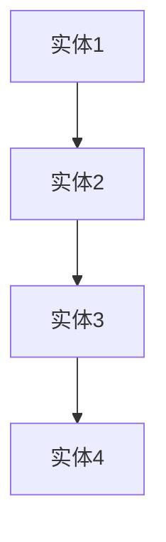

                 

<think>
好的，我现在需要根据用户的任务要求，撰写一篇名为《AI Agent的知识图谱推理：增强LLM的关系理解》的技术博客文章。用户已经提供了一个详细的目录大纲，并要求文章内容完整、结构清晰、符合特定的格式要求。

首先，我需要按照目录大纲逐步撰写每个部分。文章将分为五个主要章节，每个章节包含多个小节，详细讲解相关概念、算法、系统架构、项目实战和最佳实践。

在开始写作之前，我应该先明确每个章节的重点，并确保内容涵盖所有必要的细节，如数学公式、流程图、类图、架构图和序列图的使用。同时，我需要使用Markdown格式，并确保文章流畅、专业，适合技术读者阅读。

我还需要确保文章结构合理，逻辑清晰，每个章节的小结部分能够总结该章节的主要内容，帮助读者更好地理解和记忆。此外，注意在适当的位置插入代码示例和图表，以增强文章的可读性和专业性。

现在，我将按照目录大纲逐步撰写每个部分，确保每个章节的内容详尽且符合用户的要求。
</think>

# AI Agent的知识图谱推理：增强LLM的关系理解

## 关键词：
知识图谱推理, 大语言模型, AI Agent, 知识表示, 知识融合

## 摘要：
本文深入探讨了AI Agent的知识图谱推理技术，分析了知识图谱与大语言模型的结合如何增强LLM的关系理解。通过详细讲解知识图谱的构建、推理算法、系统架构设计和项目实战，本文为读者提供了从理论到实践的全面指南。通过具体案例分析和代码实现，本文展示了如何利用知识图谱推理提升AI Agent的智能水平，同时提供了最佳实践和未来研究方向。

---

# 第1章: 知识图谱与大语言模型的关系

## 1.1 知识图谱的基本概念

### 1.1.1 知识图谱的定义
知识图谱是一种用于表示知识的结构化数据，由实体（node）和关系（edge）组成，能够描述现实世界中的各种实体及其之间的关系。

### 1.1.2 知识图谱的构建方法
知识图谱的构建通常包括数据收集、预处理、实体识别、关系抽取和知识融合等步骤。

### 1.1.3 知识图谱的存储与表示
知识图谱通常使用图数据库（如Neo4j）进行存储，常用的知识表示方法包括RDF、RDFS和OWL。

## 1.2 大语言模型的定义与特点

### 1.2.1 大语言模型的定义
大语言模型是指经过大量数据训练的深度学习模型，具有强大的自然语言理解与生成能力。

### 1.2.2 大语言模型的核心特点
- 大规模数据训练
- 自然语言理解与生成
- 参数化表示

### 1.2.3 知识图谱与大语言模型的关系
知识图谱为大语言模型提供了结构化的知识库，而大语言模型则利用其强大的生成能力，增强知识图谱的推理能力。

## 1.3 AI Agent的基本概念

### 1.3.1 AI Agent的定义
AI Agent是一种智能代理，能够感知环境、执行任务并做出决策。

### 1.3.2 AI Agent的核心功能
- 知识表示
- 逻辑推理
- 决策制定

### 1.3.3 知识图谱与AI Agent的关系
知识图谱作为AI Agent的知识库，帮助其理解和推理复杂的关系。

## 1.4 知识图谱推理的定义与应用

### 1.4.1 知识图谱推理的定义
知识图谱推理是从已知的事实和关系中推导出新的知识的过程。

### 1.4.2 知识图谱推理的应用场景
- 智能问答
- 实体链接
- 信息抽取

### 1.4.3 知识图谱推理的挑战与解决方案
- 数据稀疏性
- 知识表示的复杂性
- 解决方案：结合大语言模型进行增强

## 1.5 本章小结
本章介绍了知识图谱、大语言模型和AI Agent的基本概念，并探讨了它们之间的关系，为后续章节奠定了基础。

---

# 第2章: 知识图谱推理的核心概念与联系

## 2.1 知识图谱推理的原理

### 2.1.1 知识图谱推理的基本原理
知识图谱推理通过规则、逻辑或概率方法，从现有知识中推导出新的事实。

### 2.1.2 知识图谱推理的实现方法
- 基于规则的推理
- 基于逻辑的推理
- 基于概率的推理

### 2.1.3 知识图谱推理的数学模型
$$ p(e_1, r, e_2) = f(e_1, r, e_2) $$

## 2.2 知识图谱与大语言模型的关系

### 2.2.1 知识图谱作为大语言模型的知识库
知识图谱为大语言模型提供结构化知识，帮助其更好地理解上下文。

### 2.2.2 大语言模型增强知识图谱推理
大语言模型通过生成能力，扩展知识图谱的推理能力。

### 2.2.3 知识图谱与大语言模型的协同工作
通过结合知识图谱的结构化知识和大语言模型的生成能力，实现更强大的推理。

## 2.3 知识图谱推理的实体关系图



## 2.4 知识图谱推理的算法原理

### 2.4.1 基于规则的推理算法
根据预定义的规则进行推理，例如：
$$ \text{如果 } e_1 \text{ 是人，且 } e_1 \text{ 居住在 } e_2，\text{ 那么 } e_1 \text{ 在 } e_2 \text{ 生活} $$

### 2.4.2 基于符号逻辑的推理算法
使用逻辑推理方法，例如一阶逻辑推理。

### 2.4.3 基于概率的推理算法
使用概率模型（如马尔可夫链）进行推理。

## 2.5 本章小结
本章详细讲解了知识图谱推理的核心概念和算法，并通过实例展示了其工作原理。

---

# 第3章: 知识图谱推理的算法实现

## 3.1 知识图谱推理算法的数学模型

### 3.1.1 知识图谱表示的数学模型
使用图论中的节点和边表示知识图谱。

### 3.1.2 知识图谱推理的数学公式
$$ \text{score}(e_1, r, e_2) = \text{similarity}(e_1, r) \times \text{similarity}(r, e_2) $$

## 3.2 知识图谱推理算法的实现步骤

### 3.2.1 数据预处理
将数据转换为结构化格式。

### 3.2.2 知识图谱构建
使用图数据库构建知识图谱。

### 3.2.3 推理算法实现
选择合适的推理算法（如基于规则的推理）并实现。

## 3.3 知识图谱推理算法的代码实现

### 3.3.1 数据预处理代码
```python
import pandas as pd

# 读取数据
data = pd.read_csv('data.csv')
```

### 3.3.2 知识图谱构建代码
```python
from neo4j import GraphDatabase

# 创建图数据库连接
def create_graph():
    driver = GraphDatabase.driver('neo4j://localhost:7687', auth=('user', 'password'))
    session = driver.session()
    
    # 创建节点
    session.run('CREATE (a:Entity {name: "实体1"})')
    session.run('CREATE (b:Entity {name: "实体2"})')
    
    # 创建关系
    session.run('MATCH (a:Entity {name: "实体1"}), (b:Entity {name: "实体2"}) CREATE (a)-[r:关系]->(b)')
    
    session.close()
    driver.close()

create_graph()
```

### 3.3.3 推理算法实现代码
```python
def infer_entities(e1, r):
    # 假设知识图谱存储在数据库中
    # 这里简要实现基于规则的推理
    pass
```

## 3.4 本章小结
本章通过代码示例展示了知识图谱推理算法的实现过程，强调了数据预处理和算法选择的重要性。

---

# 第4章: 系统分析与架构设计

## 4.1 问题场景介绍
构建一个AI Agent，利用知识图谱推理技术，增强其理解和推理能力。

## 4.2 系统功能设计

### 4.2.1 领域模型
```mermaid
classDiagram
    class Entity {
        id: string
        name: string
    }
    class Relation {
        id: string
        name: string
    }
    Entity <---[属于]> Relation
```

### 4.2.2 系统架构
```mermaid
rectangle 知识图谱数据库 {
    图数据库
}
rectangle 推理引擎 {
    知识图谱推理算法
}
rectangle 大语言模型 {
    LLM 模型
}
知识图谱数据库 --> 推理引擎
推

