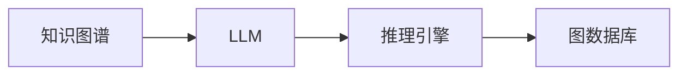
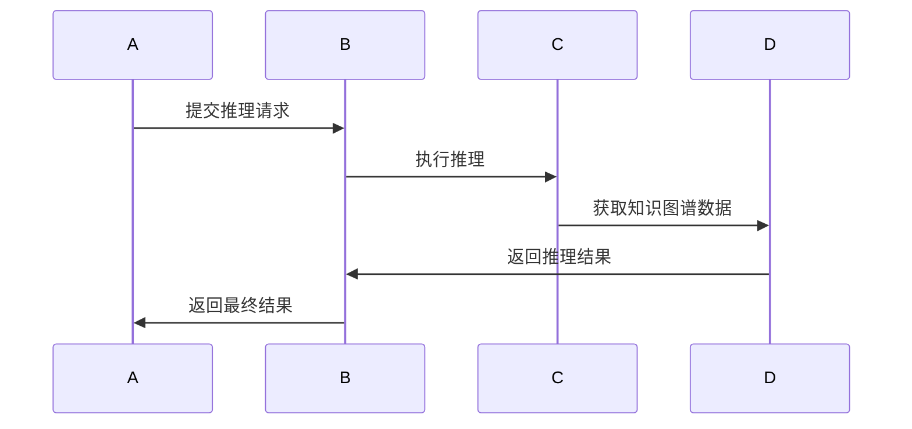

                 


# AI Agent的知识图谱推理：结合LLM与图数据库技术

> 关键词：AI Agent，知识图谱，大语言模型（LLM），图数据库，知识推理

> 摘要：本文将深入探讨AI Agent在知识图谱推理中的应用，结合大语言模型（LLM）和图数据库技术，分析其核心原理、系统架构及实际应用。通过详细的技术分析和案例研究，揭示如何利用这些技术构建高效的知识推理系统。

---

## 第一部分: AI Agent的知识图谱推理概述

### 第1章: AI Agent与知识图谱推理的背景介绍

#### 1.1 问题背景与描述
知识图谱是一种结构化的数据表示方式，通过图中的节点和边来描述实体及其关系。大语言模型（LLM）具有强大的自然语言处理和推理能力，而AI Agent作为智能体，能够通过环境交互和知识推理完成复杂任务。

#### 1.2 问题解决思路
将知识图谱与LLM结合，利用图数据库的高效查询能力，构建AI Agent的知识推理系统。通过符号逻辑推理和概率推理，实现知识的动态更新和复杂问题的解决。

#### 1.3 知识图谱推理的核心概念与体系结构
| 概念 | 定义 | 属性 | 示例 |
|------|------|------|------|
| 知识图谱 | 结构化知识的图表示 | 图节点、图边、标签 | 实体-关系-实体 |

### 第2章: 知识图谱推理的核心概念与联系

#### 2.1 知识图谱推理的原理
符号逻辑推理和概率推理是知识图谱推理的两大核心方法。符号逻辑推理通过基本逻辑运算（AND、OR、NOT）进行推理，而概率推理则基于贝叶斯定理计算概率。

#### 2.2 LLM与知识图谱的结合
LLM通过自然语言处理能力理解知识图谱中的实体和关系，并利用知识图谱的结构化数据进行推理。图数据库的高效查询能力为知识图谱推理提供了强大的技术支撑。

#### 2.3 图数据库在知识图谱中的作用
图数据库的特性使其成为知识图谱存储和查询的理想选择。通过SPARQL等查询语言，可以高效地进行复杂关系的推理和查询。

### 第3章: 知识图谱推理算法的数学模型与实现

#### 3.1 符号逻辑推理算法
符号逻辑推理通过基本逻辑运算进行推理。例如，知识图谱中的推理可以表示为：
$$ \text{如果} (A \text{是} B) \text{且} (B \text{是} C) \text{，则} A \text{是} C $$

#### 3.2 概率推理算法
概率推理基于贝叶斯定理，计算事件发生的概率。例如：
$$ P(A|B) = \frac{P(B|A)P(A)}{P(B)} $$

#### 3.3 算法实现流程


---

## 第二部分: 系统分析与架构设计

### 第4章: 系统分析与架构设计

#### 4.1 问题场景介绍
知识图谱推理系统需要解决的问题包括知识表示、推理算法实现、系统架构设计等。

#### 4.2 系统功能设计
系统功能包括知识图谱构建、LLM集成、推理算法实现等。

#### 4.3 系统架构设计


#### 4.4 接口设计
系统接口包括知识图谱的导入、推理请求的处理等。

#### 4.5 交互流程


---

## 第三部分: 项目实战

### 第5章: 知识图谱推理的项目实战

#### 5.1 环境安装
需要安装Python、图数据库（如Neo4j）和相关库（如networkx）。

#### 5.2 核心代码实现
以下是知识图谱推理的核心代码示例：
```python
from networkx import DiGraph

def construct_knowledge_graph(entities, relations):
    graph = DiGraph()
    for e1, r, e2 in relations:
        graph.add_edge(e1, e2, label=r)
    return graph

def symbolical_inference(graph, premise1, premise2):
    if graph.has_edge(premise1, premise2):
        return True
    return False
```

#### 5.3 案例分析
以推理“张三比李四高”为例，构建知识图谱并进行推理。

#### 5.4 项目总结
通过项目实战，验证了知识图谱推理系统的可行性和有效性。

---

## 第四部分: 结论与展望

### 第6章: 结论与展望

#### 6.1 结论
本文深入探讨了AI Agent的知识图谱推理，结合LLM和图数据库技术，构建了高效的知识推理系统。

#### 6.2 最佳实践Tips
- 确保知识图谱的完整性和准确性。
- 合理选择推理算法，根据需求选择符号逻辑推理或概率推理。

#### 6.3 小结
知识图谱推理是一项复杂但具有广泛应用前景的技术，未来需要进一步研究更高效的推理算法和系统架构。

#### 6.4 注意事项
- 知识图谱的构建需要领域专家的参与。
- 推理算法的选择需要根据具体问题进行调整。

#### 6.5 拓展阅读
推荐学习知识图谱相关的书籍和论文，深入了解图数据库的查询优化技术。

---

## 作者

作者：AI天才研究院/AI Genius Institute & 禅与计算机程序设计艺术 /Zen And The Art of Computer Programming

---

以上是《AI Agent的知识图谱推理：结合LLM与图数据库技术》的完整大纲内容。希望这篇文章能够为您提供有价值的技术指导和启发！

