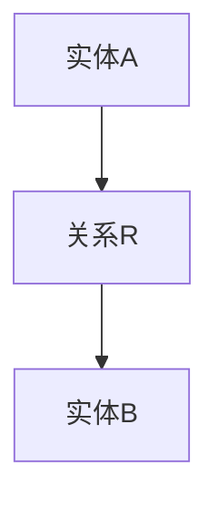
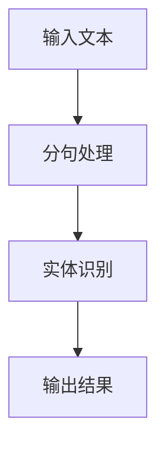
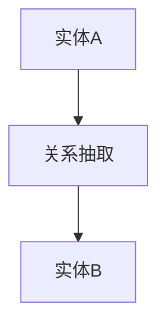
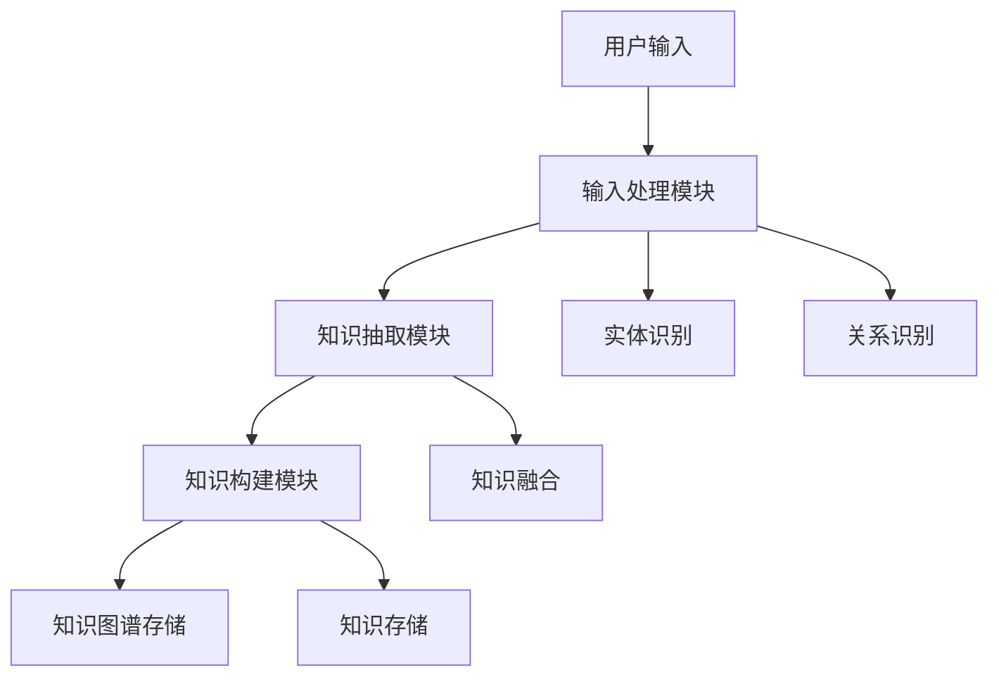
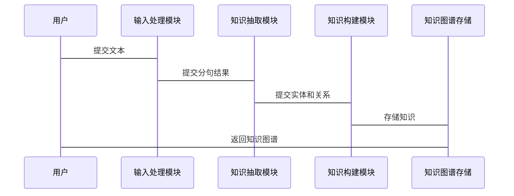

                 


# 目录大纲：《AI Agent的知识图谱构建：从LLM输出中提取结构化知识》

## 关键词：知识图谱, AI Agent, LLM, 结构化知识, 自然语言处理, 信息抽取, 数据挖掘

## 摘要：
本文系统探讨AI Agent如何从大语言模型（LLM）的输出中构建知识图谱，重点分析结构化知识的提取方法。通过详细讲解背景、核心概念、算法原理、系统架构及实战案例，本文为构建高效的知识图谱提供理论与实践指导。

## 第一部分：背景与概念

### 第1章：知识图谱与AI Agent概述

#### 1.1 知识图谱的基本概念
- 1.1.1 知识图谱的定义与特点
- 1.1.2 知识图谱的构建方法
- 1.1.3 知识图谱的应用场景

#### 1.2 AI Agent的基本概念
- 1.2.1 AI Agent的定义
- 1.2.2 AI Agent的核心功能
- 1.2.3 AI Agent与知识图谱的关系

#### 1.3 从LLM输出中提取结构化知识的背景
- 1.3.1 LLM的输出特点
- 1.3.2 知识图谱构建的需求
- 1.3.3 问题背景与目标

## 第二部分：核心概念与原理

### 第2章：知识图谱构建的核心概念

#### 2.1 实体与关系
- 2.1.1 实体的定义与分类
- 2.1.2 关系的定义与分类
- 2.1.3 实体与关系的关联

#### 2.2 知识图谱的属性特征对比
- 2.2.1 实体属性对比表
- 2.2.2 关系属性对比表
- 2.2.3 实体关系对比表

#### 2.3 知识图谱的ER实体关系图


### 第3章：AI Agent的知识获取与处理

#### 3.1 知识抽取与处理
- 3.1.1 知识抽取的目标
- 3.1.2 知识处理的步骤
- 3.1.3 知识表示的方法

#### 3.2 LLM输出的特点与挑战
- 3.2.1 LLM输出的多样性
- 3.2.2 知识提取的准确性
- 3.2.3 知识结构化的复杂性

## 第三部分：算法与数学模型

### 第4章：知识抽取算法原理

#### 4.1 分句与实体识别
- 4.1.1 分句算法流程
- 4.1.2 实体识别的实现
- 4.1.3 示例代码与流程图


#### 4.2 关系抽取与知识构建
- 4.2.1 关系抽取的算法
- 4.2.2 知识图谱的构建过程
- 4.2.3 示例代码与流程图


### 第5章：数学模型与评估指标

#### 5.1 信息抽取的评估指标
- 5.1.1 准确率公式：$$准确率 = \frac{正确识别的数量}{总识别数量}$$
- 5.1.2 召回率公式：$$召回率 = \frac{正确识别的数量}{实际存在的数量}$$
- 5.1.3 F1值公式：$$F1 = 2 \times \frac{准确率 \times 召回率}{准确率 + 召回率}$$

## 第四部分：系统设计与架构

### 第6章：系统分析与架构设计方案

#### 6.1 项目介绍
- 6.1.1 项目背景
- 6.1.2 项目目标

#### 6.2 系统功能设计
- 6.2.1 领域模型
```mermaid
classDiagram
    class 实体管理 {
        +实体列表
        +关系列表
        -实体属性
        -关系属性
        +addEntity()
        +removeEntity()
        +updateEntity()
        +addRelation()
        +removeRelation()
        +updateRelation()
    }
    class 关系抽取 {
        +输入文本
        +输出结果
        -分句处理
        -实体识别
        -关系识别
        +processText()
        +extractEntities()
        +extractRelations()
    }
    实体管理 <--| 关系抽取
```

#### 6.3 系统架构设计


#### 6.4 系统接口设计
- 6.4.1 接口描述
- 6.4.2 交互流程图


## 第五部分：项目实战

### 第7章：项目实战

#### 7.1 环境安装
- 7.1.1 安装Python
- 7.1.2 安装必要的库：numpy, pandas, spacy, networkx
- 7.1.3 安装Mermaid CLI

#### 7.2 核心代码实现
- 7.2.1 实体识别代码
```python
import spacy

nlp = spacy.load("en_core_web_sm")

def extract_entities(text):
    doc = nlp(text)
    entities = []
    for ent in doc.ents:
        entities.append((ent.start_char, ent.end_char, ent.label_, ent.text))
    return entities
```

- 7.2.2 关系抽取代码
```python
from spacy.pipeline import EntityRuler

nlp = spacy.load("en_core_web_sm")
ruler = EntityRuler(nlp)
ruler.add_pattern(
    "ORG",
    [],
    [],
    "ORG"
)

def extract_relations(doc):
    relations = []
    for sent in doc.sents:
        for token in sent:
            if token.ent_type_ == "ORG":
                relations.append((token.text, "ORG", token.text))
    return relations
```

- 7.2.3 知识图谱构建代码
```python
import networkx as nx

def build_graph(entities, relations):
    G = nx.Graph()
    for ent in entities:
        G.add_node(ent[3])
    for rel in relations:
        G.add_edge(rel[0], rel[2], rel[1])
    return G
```

#### 7.3 项目总结
- 7.3.1 项目成果
- 7.3.2 经验与教训
- 7.3.3 未来改进方向

## 第六部分：最佳实践与总结

### 第8章：最佳实践

#### 8.1 小结
- 8.1.1 核心概念回顾
- 8.1.2 算法总结
- 8.1.3 系统设计要点

#### 8.2 注意事项
- 8.2.1 数据质量的重要性
- 8.2.2 算法选择的注意事项
- 8.2.3 系统维护与优化

#### 8.3 拓展阅读
- 8.3.1 推荐书籍
- 8.3.2 推荐论文
- 8.3.3 推荐在线资源

## 作者：AI天才研究院 & 禅与计算机程序设计艺术

