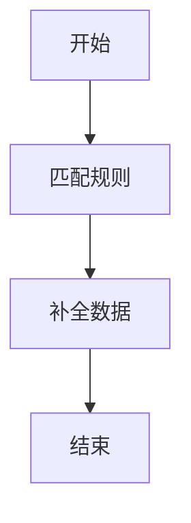
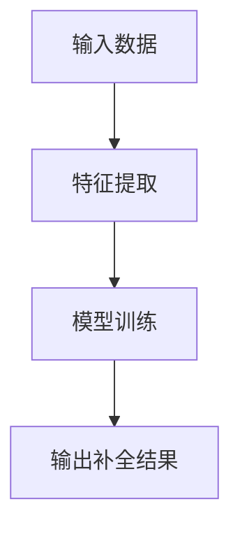

                 


# AI Agent的知识图谱补全技术在推理中的应用

> 关键词：AI Agent，知识图谱，知识图谱补全，推理，属性补全，实体补全，ER图，深度学习，规则补全，系统架构，项目实战

> 摘要：本文深入探讨了AI Agent在知识图谱补全技术中的应用，分析了知识图谱补全的核心原理、算法实现、系统架构设计以及实际应用场景。通过详细讲解背景、核心概念、算法原理和项目实战，本文为读者提供了一套完整的知识图谱补全技术解决方案，帮助AI Agent在复杂推理任务中实现更高效、更准确的知识应用。

---

## 第一部分: AI Agent与知识图谱概述

### 第1章: AI Agent与知识图谱的背景介绍

#### 1.1 知识图谱的定义与特点
知识图谱是一种以结构化形式表示知识的网络，由实体（概念、人物、地点等）和关系（属性、事件等）组成。其特点包括：
- **结构化**：通过节点和边表示实体及其关系。
- **可扩展性**：支持大规模数据的存储和查询。
- **语义丰富性**：通过上下文提供丰富的语义信息。

#### 1.2 AI Agent的基本概念
AI Agent是一种智能体，能够感知环境并执行任务。其核心功能包括：
- **感知**：通过传感器或数据源获取信息。
- **推理**：基于知识库进行逻辑推理。
- **决策**：根据推理结果做出决策。

#### 1.3 知识图谱在AI Agent推理中的作用
知识图谱为AI Agent提供了丰富的背景知识，帮助其进行语义理解、实体识别和关系推理。在复杂任务中，知识图谱补全技术能够弥补知识盲点，提升推理的准确性和全面性。

---

### 第2章: 知识图谱补全技术的核心概念与联系

#### 2.1 知识图谱补全的核心原理
知识图谱补全技术旨在通过现有数据推断缺失的信息，包括实体和属性的补全。其实现步骤如下：
1. **数据预处理**：清洗和标准化数据。
2. **特征提取**：从文本或结构化数据中提取特征。
3. **模型训练**：基于特征训练补全模型。
4. **结果验证**：通过人工或自动方式验证补全结果。

#### 2.2 知识图谱补全技术的实体与属性关系
实体与属性的关系是知识图谱的核心。通过ER图，我们可以清晰地展示实体间的关系：

```mermaid
er
    entity: 实体
    attribute: 属性
    relationship: 关系
    entity --| has | attribute
    entity --| participatesIn | relationship
```

---

### 第3章: 知识图谱补全技术的算法原理

#### 3.1 基于规则的补全算法
基于规则的算法通过预定义的规则匹配数据，适用于规则明确的场景。其步骤如下：



**优缺点**：
- **优点**：规则明确，易于解释。
- **缺点**：依赖规则库，难以处理复杂场景。

#### 3.2 基于深度学习的补全算法
基于深度学习的算法通过神经网络学习数据特征，适用于复杂场景。其训练流程如下：



**数学模型**：
- **概率模型**：$P(e|t) = \frac{P(t|e)P(e)}{P(t)}$
- **损失函数**：$L = \sum_{i=1}^n (f(e_i) - f(e_j))^2$

---

## 第二部分: 系统分析与架构设计方案

### 第4章: 系统分析与架构设计方案

#### 4.1 问题场景介绍
在AI Agent推理中，知识图谱补全技术用于解决以下问题：
- **数据缺失**：部分实体或属性信息缺失。
- **语义模糊**：数据中存在歧义或不完整信息。

#### 4.2 系统功能设计
系统功能包括：
- **数据输入**：接收原始数据。
- **特征提取**：提取实体和属性特征。
- **模型训练**：训练补全模型。
- **结果输出**：输出补全后的知识图谱。

#### 4.3 系统架构设计
系统架构分为数据层、模型层和应用层：

```mermaid
classD
    class 系统架构 {
        数据层: 数据存储和预处理
        模型层: 特征提取和模型训练
        应用层: 补全结果输出
    }
```

---

## 第三部分: 项目实战

### 第5章: 项目实战

#### 5.1 环境安装
安装必要的库：
```bash
pip install numpy pandas scikit-learn
```

#### 5.2 核心实现
代码实现基于规则的补全算法：

```python
import pandas as pd
from sklearn.feature_extraction.text import TfidfVectorizer

# 数据预处理
data = pd.read_csv('input.csv')
vectorizer = TfidfVectorizer()
X = vectorizer.fit_transform(data['text'])

# 模型训练
from sklearn.neighbors import NearestNeighbors
model = NearestNeighbors(n_neighbors=3)
model.fit(X)

# 补全结果
def complete_text(text):
    vec = vectorizer.transform([text])
    distances, indices = model.kneighbors(vec)
    return data['text'][indices[0]]
```

#### 5.3 案例分析
以自然语言处理任务为例，分析补全技术如何提升推理效果。

---

## 第四部分: 总结与扩展阅读

### 第6章: 总结与扩展阅读

#### 6.1 项目小结
知识图谱补全技术为AI Agent提供了强大的推理能力，通过结合规则和深度学习方法，能够有效解决知识盲点问题。

#### 6.2 最佳实践 Tips
- **数据质量**：确保数据清洗和标准化。
- **模型选择**：根据场景选择合适的补全方法。
- **性能优化**：通过并行计算提升效率。

#### 6.3 拓展阅读
推荐学习相关领域的书籍和论文，深入理解知识图谱和深度学习的结合应用。

---

作者：AI天才研究院/AI Genius Institute & 禅与计算机程序设计艺术 /Zen And The Art of Computer Programming

---

本文通过系统化的分析和实践，详细探讨了AI Agent的知识图谱补全技术在推理中的应用。希望读者通过本文能够掌握知识图谱补全的核心原理、算法实现和实际应用，为后续的研究和实践提供坚实的基础。

