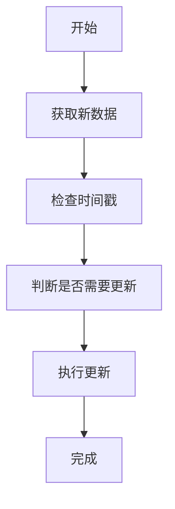
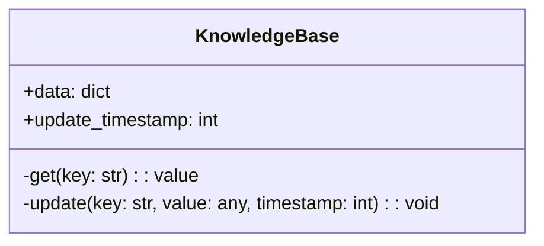
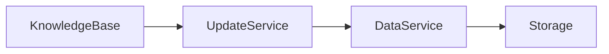
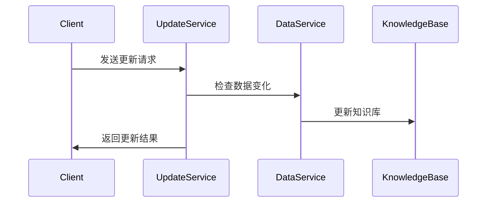

                 


# AI Agent的知识库增量更新策略：保持信息时效性

**关键词**：AI Agent，知识库，增量更新，信息时效性，算法原理，系统架构，项目实战

**摘要**：  
本文深入探讨AI Agent的知识库增量更新策略，重点分析如何保持信息的时效性。通过背景分析、核心概念、算法原理、系统架构、项目实战等多个维度，系统性地阐述知识库增量更新的实现方法和优化策略。文章旨在为AI Agent的开发人员和研究人员提供实用的技术指导和最佳实践。

---

## 第1章: AI Agent的知识库增量更新背景

### 1.1 问题背景与挑战
#### 1.1.1 AI Agent知识库的定义与作用
AI Agent（智能体）是能够感知环境、自主决策并执行任务的智能系统。其知识库是存储信息的核心，包括任务相关的知识、经验、规则等。知识库的结构化表示和高效管理是AI Agent能力的基础。

#### 1.1.2 知识库时效性问题的提出
知识库的内容会随着时间变化，例如市场数据、用户偏好等动态信息。如果知识库无法及时更新，AI Agent的决策可能基于过时的信息，导致错误或低效。

#### 1.1.3 知识库增量更新的必要性
增量更新是指仅更新知识库中的部分数据，而不是完全重载。这种方法可以减少计算资源消耗，提高更新效率，同时保证信息的实时性。

### 1.2 问题描述与目标
#### 1.2.1 知识库更新的痛点分析
知识库更新的挑战包括数据量大、更新频率高、更新冲突处理复杂等问题。此外，如何平衡更新的及时性与系统性能是关键。

#### 1.2.2 增量更新的目标与核心问题
目标是实现高效、准确的知识库更新，核心问题是如何检测变化、确定更新范围并避免冲突。

#### 1.2.3 边界与外延的界定
知识库增量更新的边界包括数据源、更新频率和更新范围；外延则涉及数据同步、分布式系统等。

### 1.3 核心概念与问题解决
#### 1.3.1 知识库增量更新的定义
通过检测变化，仅更新知识库中已修改或新增的部分。

#### 1.3.2 问题解决的基本思路
采用基于时间戳或版本号的方法，识别变化数据，并通过异步或批量处理优化更新效率。

#### 1.3.3 核心概念的结构化分析
知识库增量更新涉及数据源、变化检测、更新机制等多个环节。

---

## 第2章: AI Agent知识库结构与更新机制

### 2.1 知识库的结构化设计
#### 2.1.1 知识表示与存储方式
知识以结构化的形式存储，例如图数据库或关系型数据库。

#### 2.1.2 知识关联与网络构建
知识之间的关联构建知识网络，便于推理和更新。

#### 2.1.3 知识层次与分类体系
知识按层次和类别组织，便于高效检索和更新。

### 2.2 增量更新的机制与原理
#### 2.2.1 增量更新的基本原理
通过比较旧版本和新版本的差异，仅更新变化部分。

#### 2.2.2 知识来源与更新触发条件
数据源的变化（如新增数据或修改数据）触发增量更新。

#### 2.2.3 更新策略的选择与优化
选择合适的增量更新策略，例如基于时间戳的更新。

### 2.3 知识库更新与AI Agent行为的关系
#### 2.3.1 知识库更新对AI Agent行为的影响
及时更新知识库可以提高AI Agent的决策准确性和响应速度。

#### 2.3.2 增量更新与实时响应的平衡
增量更新需要在更新频率和系统性能之间找到平衡点。

#### 2.3.3 更新机制对系统性能的优化
增量更新减少数据传输量，降低资源消耗。

---

## 第3章: 基于时间戳的增量更新算法

### 3.1 算法原理与流程
#### 3.1.1 时间戳机制的原理
每个数据项都有一个时间戳，表示其最后修改时间。

#### 3.1.2 知识节点的版本控制
通过时间戳判断数据是否需要更新。

#### 3.1.3 更新冲突的检测与处理
检测冲突并提供解决策略，例如优先更新最新的数据。

### 3.2 算法实现与优化
#### 3.2.1 基于时间戳的更新流程图


#### 3.2.2 算法优化策略
优化数据比较和更新流程，减少不必要的操作。

### 3.3 算法数学模型与公式
#### 3.3.1 时间戳排序公式
$$ timestamp_{new} > timestamp_{old} $$

#### 3.3.2 更新权重计算公式
$$ weight = \frac{new\_weight}{old\_weight} $$

---

## 第4章: 系统功能与架构设计

### 4.1 系统应用场景与功能需求
#### 4.1.1 知识库增量更新的应用场景
例如实时数据分析、推荐系统等。

#### 4.1.2 系统功能
- 数据采集与处理
- 变化检测与更新
- 知识存储与查询

### 4.2 系统功能设计
#### 4.2.1 领域模型类图


#### 4.2.2 系统架构设计


#### 4.2.3 系统接口设计
定义RESTful API接口，如`/api/update`用于接收更新请求。

#### 4.2.4 系统交互序列图


---

## 第5章: 项目实战

### 5.1 环境安装与配置
安装Python和相关库，例如`requests`和`json`.

### 5.2 系统核心实现源代码
#### 5.2.1 知识库增量更新的Python实现
```python
def update_knowledge_base(old_data, new_data):
    # 检测变化
    changes = {key: new_data[key] for key in new_data if new_data[key] != old_data.get(key, None)}
    # 更新知识库
    if changes:
        return update_successful(changes)
    else:
        return no_changes()
```

#### 5.2.2 代码解读与分析
解析代码结构，说明每个部分的功能。

#### 5.2.3 算法实现细节
详细说明时间戳机制的实现。

### 5.3 实际案例分析
分析一个具体案例，如电商推荐系统的知识库增量更新。

---

## 第6章: 最佳实践与注意事项

### 6.1 最佳实践
- 定期检查更新策略
- 使用高效的增量更新算法
- 优化数据同步机制

### 6.2 小结与总结
知识库增量更新是保持AI Agent信息时效性的关键，需要结合具体场景选择合适的策略。

### 6.3 注意事项
- 处理更新冲突
- 保证数据一致性
- 优化性能

### 6.4 拓展阅读
推荐阅读相关论文和书籍，深入理解知识库管理的前沿技术。

---

## 作者信息

**作者：AI天才研究院/AI Genius Institute & 禅与计算机程序设计艺术 /Zen And The Art of Computer Programming**

