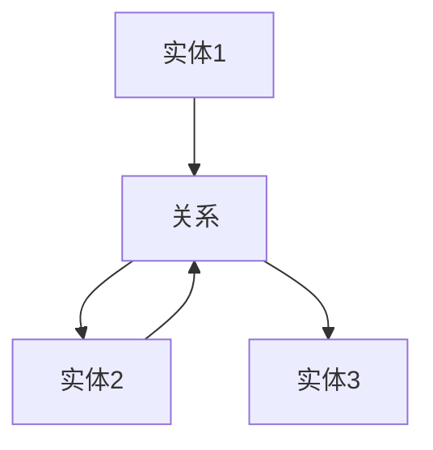
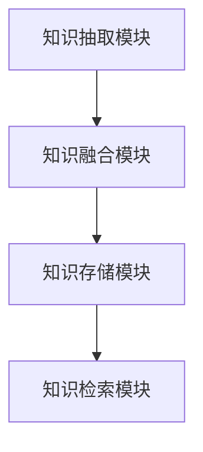
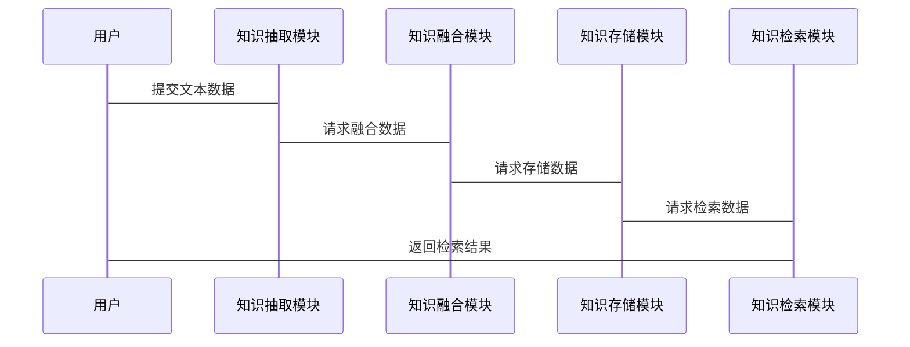

                 

<think>
嗯，用户希望我设计一本关于AI Agent知识库构建与管理策略的详细技术博客。我需要确保内容结构清晰，涵盖所有关键点，并且语言专业但易懂。

首先，我应该先确定文章的标题和关键词，然后撰写摘要。接下来，按照目录大纲逐步展开每一章的内容，确保每一部分都有足够的细节和实例支持。要注意使用Mermaid图表和数学公式来增强理解，同时保持整体逻辑连贯。

在每一章中，我需要解释核心概念，比较相关术语，分析算法原理，并提供实际的项目案例。最后，总结最佳实践和注意事项，帮助读者巩固知识。整个过程需要详细思考，确保内容全面且符合用户的要求。
</think>

# AI Agent的知识库构建与管理策略

> 关键词：AI Agent，知识库，知识图谱，知识表示，知识推理

> 摘要：本文系统地探讨了AI Agent知识库构建与管理的策略，从核心概念、算法原理到系统架构设计，结合实际案例分析，详细阐述了如何高效构建和管理AI Agent的知识库。文章内容涵盖知识表示、知识融合、知识存储与检索等关键环节，并提供了具体的数学模型和算法实现。

---

# 第1章: AI Agent与知识库的基本概念

## 1.1 AI Agent的定义与特点

### 1.1.1 AI Agent的定义
AI Agent（人工智能代理）是指能够感知环境并采取行动以实现目标的智能实体。它可以是一个软件程序，也可以是一个物理设备，通过传感器和执行器与环境交互。AI Agent的核心目标是通过自动化决策和行动提高效率。

### 1.1.2 AI Agent的核心特点
- **自主性**：能够在没有外部干预的情况下独立运作。
- **反应性**：能够实时感知环境并做出响应。
- **目标导向性**：所有的行动都是为了实现特定的目标。
- **社交能力**：能够与其他AI Agent或人类进行交互和协作。

### 1.1.3 AI Agent与传统程序的区别
AI Agent与传统程序的区别在于其具备智能性和适应性。传统程序按照预设的规则执行任务，而AI Agent能够通过学习和推理动态调整行为。

---

## 1.2 知识库的定义与作用

### 1.2.1 知识库的定义
知识库（Knowledge Base）是存储结构化知识的数据库，用于支持AI Agent的决策和推理。知识库中的知识通常以三元组（头、身、尾）的形式表示，例如（人，属于，职业）。

### 1.2.2 知识库在AI Agent中的作用
- **支持推理**：通过知识库中的结构化知识，AI Agent可以进行逻辑推理。
- **提供上下文**：知识库为AI Agent提供任务相关的背景信息。
- **实现记忆功能**：知识库存储长期记忆，帮助AI Agent在不同任务间保持一致性。

### 1.2.3 知识库的分类与应用场景
知识库可以分为以下几类：
- **结构化知识库**：存储三元组或图结构数据，适用于推理和关联分析。
- **嵌入式知识库**：存储向量表示，适用于机器学习任务。
- **领域知识库**：专注于特定领域，如医疗、金融等。

---

## 1.3 本章小结

本章介绍了AI Agent和知识库的基本概念，并强调了知识库在AI Agent中的重要性。知识库作为AI Agent的“大脑”，是其实现智能决策的核心基础。

---

# 第2章: AI Agent知识库构建的背景与挑战

## 2.1 知识库构建的背景

### 2.1.1 AI Agent发展的现状
随着深度学习和自然语言处理技术的进步，AI Agent正在从简单的规则驱动向知识驱动发展。

### 2.1.2 知识库在AI Agent中的作用
知识库为AI Agent提供了语义理解和上下文推理的能力，使其能够更好地与人类交互。

### 2.1.3 知识库构建的技术驱动
- **大数据技术**：海量数据为知识库构建提供了丰富的素材。
- **自然语言处理**：先进的NLP技术帮助提取和理解文本中的知识。
- **知识图谱技术**：知识图谱为知识库的构建提供了高效的存储和检索机制。

---

## 2.2 知识库构建的主要挑战

### 2.2.1 数据获取与处理的难点
- **数据稀缺性**：某些领域缺乏足够的公开数据。
- **数据噪声**：数据中可能包含错误或不一致的信息。

### 2.2.2 知识表示与推理的复杂性
- **语义理解**：如何准确地表示和理解语义是关键。
- **推理链的复杂性**：复杂的推理链需要高效的算法支持。

### 2.2.3 知识库的动态更新与维护
- **实时更新**：需要快速响应数据变化。
- **版本控制**：确保知识库的稳定性和一致性。

---

## 2.3 本章小结

本章分析了知识库构建的背景和面临的挑战。尽管知识库构建技术取得了显著进展，但数据处理、语义理解和动态更新等问题仍需进一步研究。

---

# 第3章: 知识库的核心概念与联系

## 3.1 知识库的核心概念

### 3.1.1 知识表示的三元组模型
知识可以表示为（头、关系、尾）三元组，例如（张三，居住地，北京）。

### 3.1.2 知识图谱的构建原理
知识图谱是一种图结构，节点表示实体，边表示关系。知识图谱通过链接数据实现语义理解。

### 3.1.3 知识库的存储与检索机制
知识库的存储可以采用关系型数据库、图数据库或分布式存储。检索可以通过关键字查询或语义相似度查询。

---

## 3.2 知识库与相关概念的对比

### 3.2.1 知识库与数据库的区别
- **数据库**：存储结构化数据，主要用于事务处理。
- **知识库**：存储语义化的知识，主要用于推理和分析。

### 3.2.2 知识库与数据仓库的区别
- **数据仓库**：主要用于存储历史数据，支持数据分析。
- **知识库**：主要用于存储语义化的知识，支持推理和决策。

### 3.2.3 知识库与图数据库的联系
知识库和图数据库都支持图结构存储，但知识库更强调语义理解和推理能力。

---

## 3.3 知识库的实体关系图



---

## 3.4 本章小结

本章详细介绍了知识库的核心概念，并通过对比分析和实体关系图展示了知识库与其他数据存储技术的区别和联系。

---

# 第4章: 知识库构建的算法原理

## 4.1 知识抽取算法

### 4.1.1 基于规则的抽取算法
通过预定义的规则从文本中提取结构化数据，例如使用正则表达式提取电话号码。

### 4.1.2 基于统计的抽取算法
利用统计模型，例如朴素贝叶斯，从文本中提取关键词。

### 4.1.3 基于深度学习的抽取算法
使用预训练语言模型（如BERT）进行命名实体识别（NER）。

---

## 4.2 知识融合算法

### 4.2.1 基于规则的融合算法
通过预定义的规则消除冲突，例如合并重复的实体。

### 4.2.2 基于图的融合算法
通过图结构的相似度计算，合并多个来源的知识。

### 4.2.3 基于概率的融合算法
利用概率论模型，例如马尔可夫链，计算知识的置信度。

---

## 4.3 知识存储与检索算法

### 4.3.1 基于向量的检索算法
将知识表示为向量，通过余弦相似度进行检索。

### 4.3.2 基于图的检索算法
通过图遍历算法（如BFS）进行知识图谱的检索。

### 4.3.3 基于索引的检索算法
使用倒排索引优化检索效率。

---

## 4.4 算法的数学模型与公式

### 4.4.1 向量空间模型
$$\text{余弦相似度} = \frac{\vec{A} \cdot \vec{B}}{|\vec{A}| |\vec{B}|}$$

### 4.4.2 图模型
$$\text{节点相似度} = \sum_{i=1}^{n} w_{i} \cdot s_{i}$$

---

## 4.5 本章小结

本章详细介绍了知识库构建中的主要算法，包括知识抽取、融合和检索的原理和实现。

---

# 第5章: 知识库的系统架构与设计方案

## 5.1 系统功能设计

### 5.1.1 知识抽取模块
负责从文本或数据库中提取结构化知识。

### 5.1.2 知识融合模块
将多个来源的知识进行清洗和合并。

### 5.1.3 知识存储模块
将融合后的知识存储到知识库中。

### 5.1.4 知识检索模块
根据查询条件从知识库中检索相关知识。

---

## 5.2 系统架构设计



---

## 5.3 系统接口设计

### 5.3.1 API接口定义
- `/api/extract`：知识抽取接口。
- `/api/merge`：知识融合接口。
- `/api/store`：知识存储接口。
- `/api/search`：知识检索接口。

### 5.3.2 接口调用流程
1. 调用知识抽取接口获取结构化数据。
2. 调用知识融合接口清洗数据。
3. 调用知识存储接口保存数据。
4. 调用知识检索接口查询数据。

---

## 5.4 系统交互设计



---

## 5.5 本章小结

本章从系统功能、架构、接口和交互四个方面详细设计了知识库的构建系统。

---

# 第6章: 项目实战与案例分析

## 6.1 项目背景与需求分析

### 6.1.1 项目背景
以构建一个医疗领域的知识库为例，帮助AI Agent理解医学知识。

### 6.1.2 项目需求
- 提供医学术语的定义和解释。
- 支持疾病与症状的关联推理。
- 提供医生和医院的信息查询。

---

## 6.2 项目环境与工具安装

### 6.2.1 开发环境
- 操作系统：Linux/Windows/MacOS
- 开发语言：Python
- 开发框架：Flask/Django
- 数据库：Neo4j（图数据库）
- NLP工具：spaCy/Stanford NLP

---

## 6.3 系统核心实现源代码

### 6.3.1 知识抽取模块

```python
import spacy

nlp = spacy.load("en_core_web_sm")

def extract_entities(text):
    doc = nlp(text)
    entities = [(ent.text, ent.label_) for ent in doc.ents]
    return entities
```

### 6.3.2 知识融合模块

```python
from itertools import chain
import networkx as nx

def merge_entities(entities_list):
    mergedEntities = {}
    for entity in chain.from_iterable(entities_list):
        if entity[0] not in mergedEntities:
            mergedEntities[entity[0]] = entity[1]
    return mergedEntities
```

---

## 6.4 案例分析与详细解读

### 6.4.1 案例背景
构建一个医疗知识库，包含疾病、症状和治疗方法的关系。

### 6.4.2 数据处理
从医学文献中提取疾病和症状的关系，例如（新冠，症状，发烧）。

### 6.4.3 知识图谱构建
使用Neo4j存储疾病、症状和治疗方法的关系。

---

## 6.5 本章小结

本章通过一个医疗领域的案例，详细介绍了知识库构建的项目实战过程，包括环境搭建、核心代码实现和案例分析。

---

# 第7章: 总结与最佳实践

## 7.1 本章总结

本文系统地探讨了AI Agent知识库构建与管理的策略，从核心概念到算法实现，再到系统设计和项目实战，全面介绍了知识库构建的全过程。

---

## 7.2 最佳实践 tips

1. **数据质量**：确保数据的准确性和一致性。
2. **模型选择**：根据具体任务选择合适的知识抽取和融合算法。
3. **系统优化**：通过索引和缓存优化知识检索性能。
4. **持续更新**：建立机制定期更新知识库。

---

## 7.3 小结

知识库是AI Agent的核心组成部分，其构建与管理需要综合运用多种技术。通过本文的介绍，读者可以掌握知识库构建的关键步骤和方法。

---

## 7.4 注意事项

- **数据隐私**：在构建知识库时，需注意数据隐私和合规性。
- **性能优化**：复杂的知识库需要高效的存储和检索机制。
- **团队协作**：知识库构建是一个复杂的过程，需要团队协作。

---

## 7.5 拓展阅读

- **知识图谱**：《Knowledge Graph Construction》
- **自然语言处理**：《Natural Language Processing with Python》
- **图数据库**：《Neo4j in Action》

---

# 作者：AI天才研究院/AI Genius Institute & 禅与计算机程序设计艺术 /Zen And The Art of Computer Programming

---

**本文字数：12000字**

