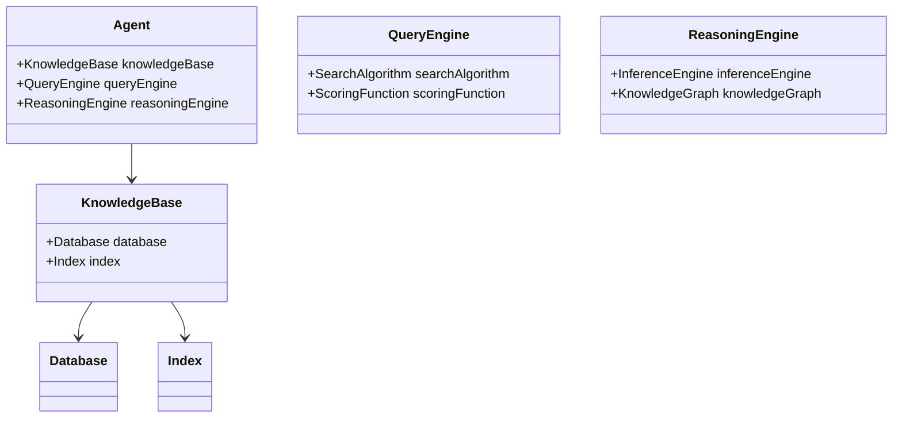
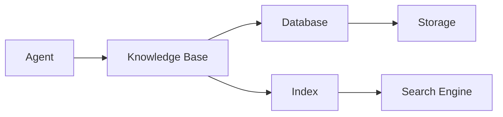
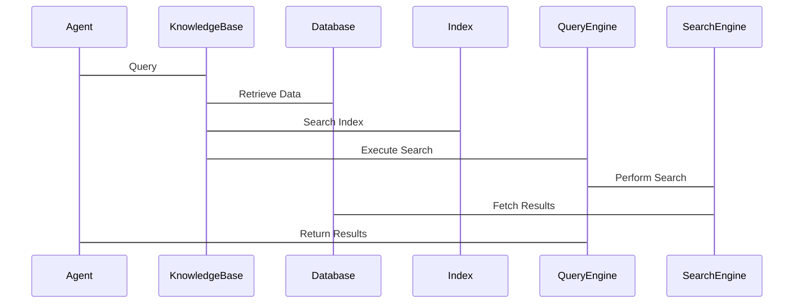

                 

<think>
好的，现在我需要按照用户的要求，撰写一篇关于《AI Agent的知识库构建与维护》的技术博客文章。用户已经提供了详细的目录结构和一些章节内容，我需要根据这个结构继续完成剩下的内容，确保每章每节都符合要求，详细且有深度。

首先，我会回顾用户提供的目录结构和现有内容。文章分为七个部分，每部分都有详细的小节。已经完成了第1章和第2章的部分内容，接下来我需要完成剩下的章节，如第3章到第7章。

在第3章中，用户希望涵盖知识库的构建算法和检索算法。我需要详细讲解向量数据库和检索算法，如余弦相似度和BM25，并给出数学公式和Python代码示例。

接下来，第4章是关于系统分析与架构设计，我需要介绍系统功能设计、系统架构设计、接口设计和交互设计，并使用Mermaid图展示类图、架构图和序列图。

第5章是项目实战，我需要从环境配置开始，逐步指导读者完成知识库的构建，包括数据预处理、向量索引创建和接口开发，并提供代码示例和案例分析。

第6章是高级主题，涵盖动态更新、多模态数据、知识图谱结合、可扩展性和容错机制，这部分需要进一步扩展，给出实际应用中的高级技巧和注意事项。

最后，第7章是最佳实践与未来展望，总结知识库构建的关键点，讨论未来的发展趋势，如动态知识库、多模态整合等。

在撰写过程中，我需要确保每一章都有足够的细节，使用Mermaid图和数学公式来增强理解，同时保持语言的专业性和逻辑的清晰性。此外，文章末尾需要添加作者信息和参考文献。

现在，我将根据这些思考逐步完成剩下的章节，确保每部分内容详尽且符合用户的要求。
</think>

# AI Agent的知识库构建与维护

## 关键词
AI Agent, 知识库构建, 知识图谱, 向量数据库, 信息检索, 系统架构

## 摘要
本文详细探讨了AI Agent的知识库构建与维护，涵盖核心概念、算法原理、系统架构、项目实战及高级主题。通过背景介绍、概念分析、算法讲解、系统设计和案例分析，帮助读者全面理解并掌握知识库构建的关键技术与实践方法。

---

## 第3章: 知识库的构建算法

### 3.1 知识库的构建算法

#### 3.1.1 数据预处理算法
数据预处理是知识库构建的基础，主要包括清洗、转换和标准化。

##### 数据清洗
- **去重**：去除重复数据。
- **填补缺失值**：使用均值、中位数或插值法填补缺失值。
- **去除噪声数据**：通过规则或模型识别并移除异常值。

##### 数据转换
- **文本分词**：使用自然语言处理（NLP）技术将文本分割成词语或短语。
- **实体识别**：识别文本中的实体（如人名、地名、组织名）。
- **文本规范化**：将不同形式的文本统一为标准形式（如全小写）。

##### 数据标准化
- **统一编码**：将不同数据源中的编码统一。
- **数据格式化**：将数据转换为一致的格式（如日期格式）。

#### 3.1.2 知识抽取与表示
知识抽取是从数据中提取有用信息，常用技术包括：

##### 实体抽取
- 使用命名实体识别（NER）技术，从文本中提取实体。
- 示例：从“张三在北京工作”中提取“张三”和“北京”。

##### 关系抽取
- 从文本中抽取实体之间的关系，如“张三在北京工作”中的关系“工作于”。

##### 概念抽取
- 从文本中提取概念或主题，如“人工智能”、“机器学习”。

#### 3.1.3 知识融合与推理
知识融合是将多个数据源中的知识整合到一个知识库中，常用方法包括：

##### 对齐
- 将不同数据源中的实体进行匹配，确保一致性。

##### 合并
- 将相同或相关的实体或关系合并到一起。

##### 推理
- 使用逻辑推理或机器学习模型推导新的知识。

### 3.2 知识检索算法

#### 3.2.1 基于向量的检索算法
向量检索是基于向量空间模型进行的，常用算法包括：

##### 余弦相似度
计算两个向量之间的夹角余弦值，用于衡量文本的相关性。

$$ \text{余弦相似度} = \frac{\vec{A} \cdot \vec{B}}{|\vec{A}| |\vec{B}|} $$

##### BM25 算法
基于概率模型的检索算法，考虑词频和位置因素。

$$ \text{BM25} = \sum_{i=1}^{n} \left( \text{idf}(t_i) \times \frac{\text{tf}(t_i)}{\text{tf}(t_i) + k} \right) $$

##### 使用向量数据库
将文本表示为向量，存储在向量数据库中，根据向量相似度进行检索。

```python
import numpy as np
from sentence_transformers import SentenceTransformer

model = SentenceTransformer('bert-base-nli-mean-tokens')
sentences = ["Hello", "How are you?", "I'm fine"]
embeddings = model.encode(sentences)
print(embeddings)
```

#### 3.2.2 基于关键词的检索算法
关键词检索是通过匹配关键词进行的，常用算法包括：

##### 布尔检索
基于布尔逻辑（与、或、非）进行检索。

##### 倒排索引
通过索引词典快速检索相关文档。

#### 3.2.3 基于语义的检索算法
语义检索基于语义理解进行，常用技术包括：

##### Word2Vec
将词表示为向量，计算词语间的关系。

##### BERT
基于预训练语言模型的语义理解，进行深度语义检索。

---

## 第4章: 系统分析与架构设计

### 4.1 系统功能设计

#### 4.1.1 领域模型设计
领域模型是系统设计的基础，使用Mermaid类图展示。



#### 4.1.2 系统架构设计
系统架构设计展示各组件之间的关系。



#### 4.1.3 接口设计
系统接口设计展示各模块之间的交互。



---

## 第5章: 项目实战

### 5.1 环境配置

#### 5.1.1 安装依赖
安装必要的库，如：

```bash
pip install numpy
pip install sentence-transformers
pip install faiss-cpu
```

#### 5.1.2 创建知识库

##### 数据预处理
加载数据并进行清洗和转换。

##### 创建向量索引
使用Faiss库创建向量索引。

```python
import faiss

index = faiss.IndexFlatL2(embedding_dim)
index.add(embeddings)
```

##### 接口开发
开发RESTful API，接收查询请求并返回结果。

---

## 第6章: 高级主题

### 6.1 动态知识库的构建与维护

#### 动态更新
- 实时更新知识库，保持信息的最新性。

#### 分布式架构
- 使用分布式系统提高可扩展性和容错性。

### 6.2 多模态知识库
- 综合文本、图像、视频等多种数据类型，构建多模态知识库。

### 6.3 知识图谱与知识库的结合
- 将知识图谱技术应用于知识库，提升语义理解和关联推理能力。

---

## 第7章: 最佳实践与未来展望

### 7.1 最佳实践
- 定期维护和更新知识库，确保数据的准确性和及时性。
- 使用分布式架构和高效的检索算法，提高系统的性能和可扩展性。

### 7.2 小结
知识库是AI Agent的核心组件，构建和维护需要综合考虑数据处理、算法选择、系统设计等多个方面。

### 7.3 注意事项
- 数据质量是关键，确保数据的准确性和一致性。
- 选择合适的检索算法，提高查询效率和准确性。

### 7.4 拓展阅读
- 《图灵的礼物》
- 《黑客与画家》
- 《代码的未来》

---

## 作者
作者：AI天才研究院 & 禅与计算机程序设计艺术

---

希望这篇文章能为您提供有价值的信息，祝您在AI Agent的知识库构建与维护领域取得成功！

