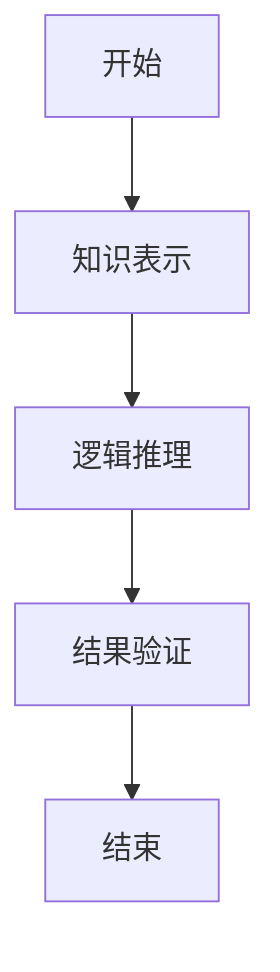
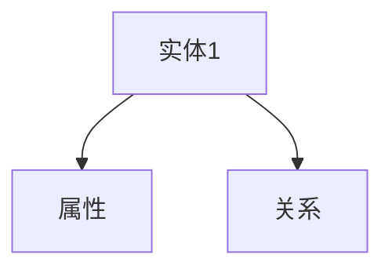
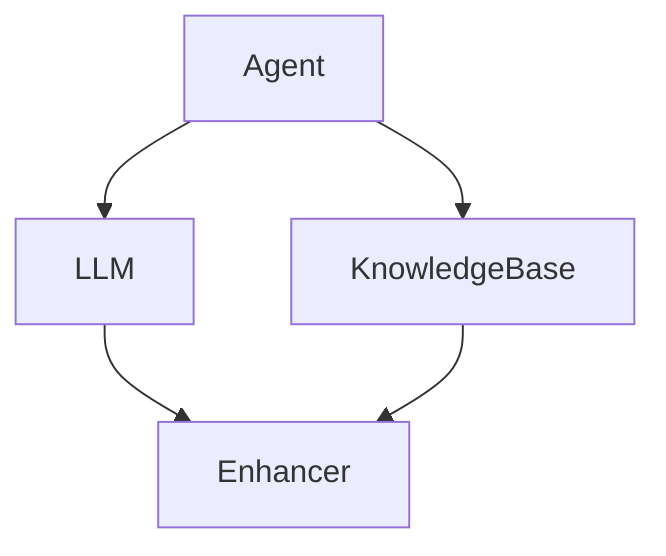
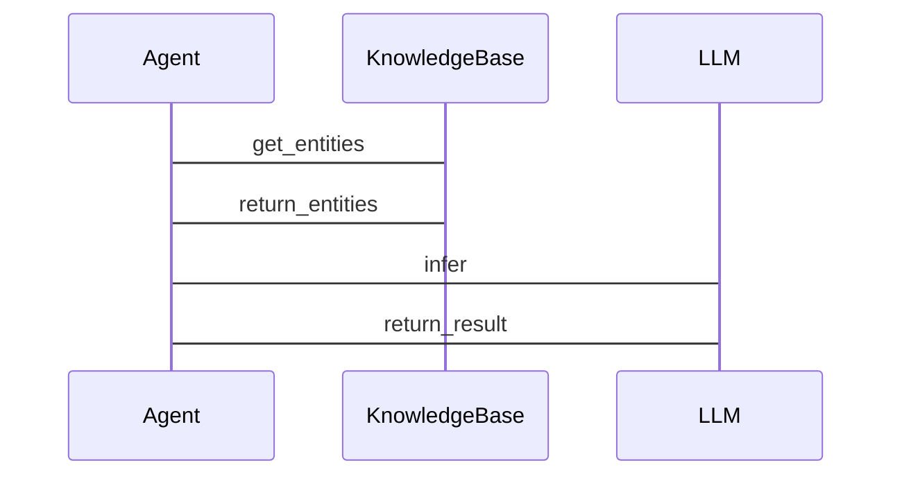

                 


# AI Agent的知识推理：增强LLM的逻辑分析能力

> 关键词：AI Agent, 知识推理, LLM, 逻辑分析, 逻辑推理, 系统架构, 项目实战

> 摘要：本文探讨如何通过AI Agent的知识推理能力来增强大语言模型（LLM）的逻辑分析能力，详细介绍相关背景、核心概念、算法原理、系统架构设计及项目实战，帮助读者深入理解并实际应用这些技术。

---

# 第一部分: AI Agent的知识推理基础

## 第1章: 问题背景与核心概念

### 1.1 问题背景

#### 1.1.1 从LLM到AI Agent的演进
大语言模型（LLM）如GPT-4虽然在生成文本方面表现出色，但在逻辑推理和知识整合方面仍有不足。AI Agent的引入，旨在通过知识推理和逻辑分析，增强LLM的能力，使其能够处理更复杂的任务。

#### 1.1.2 知识推理的必要性
LLM的知识来源于训练数据，缺乏动态推理能力。知识推理使AI Agent能够结合上下文，推导出新的信息，提升问题解决能力。

#### 1.1.3 当前LLM的局限性
- 无法处理需要外部知识的问题。
- 缺乏逻辑推理能力，难以解决复杂问题。
- 无法实时更新知识库。

### 1.2 问题描述

#### 1.2.1 知识推理的定义与目标
知识推理是指通过逻辑规则和知识库，推导出新知识的过程。目标是使AI Agent能够理解、推理并解决问题。

#### 1.2.2 LLM逻辑分析能力的不足
- 无法处理需要逻辑推理的任务。
- 知识库固定，无法动态更新。
- 缺乏对上下文的深入理解。

#### 1.2.3 AI Agent的知识推理需求
AI Agent需要结合知识推理，增强LLM的逻辑分析能力，使其能够处理复杂任务。

### 1.3 问题解决

#### 1.3.1 知识推理的实现路径
- 知识表示：将知识结构化，便于推理。
- 推理算法：使用逻辑推理算法，如自然演绎推理。
- 知识库管理：动态更新知识库。

#### 1.3.2 AI Agent的增强方法
- 集成知识推理模块。
- 结合外部知识库。
- 提供上下文推理能力。

#### 1.3.3 增强LLM的逻辑分析能力
- 引入知识推理模块，提升逻辑分析能力。
- 结合外部知识库，增强知识获取能力。
- 优化推理算法，提升推理效率。

### 1.4 边界与外延

#### 1.4.1 知识推理的边界
- 知识推理仅处理可推导的信息。
- 不处理需要外部传感器的数据。
- 逻辑推理能力有限，无法处理极端复杂任务。

#### 1.4.2 LLM增强的范围
- 知识库的更新与管理。
- 推理算法的优化。
- 与外部系统的交互。

#### 1.4.3 AI Agent能力的扩展
- 知识推理能力的增强。
- 多模态数据处理能力。
- 自适应学习能力。

### 1.5 核心概念与组成

#### 1.5.1 知识推理的核心要素
- 知识表示：将知识结构化表示。
- 推理算法：逻辑推理算法。
- 知识库：存储结构化知识。

#### 1.5.2 AI Agent的组成结构
- 交互模块：与用户交互。
- 推理模块：进行知识推理。
- 知识库：存储知识。
- 执行模块：执行任务。

#### 1.5.3 LLM逻辑分析能力的增强模块
- 知识推理模块：增强逻辑推理能力。
- 知识库接口：与外部知识库交互。
- 推理优化模块：优化推理过程。

### 1.6 本章小结
本章介绍了AI Agent的知识推理背景，分析了LLM的局限性，提出了通过知识推理增强LLM逻辑分析能力的方法，明确了核心概念和组成结构。

---

## 第2章: 核心概念与联系

### 2.1 知识推理的基本原理

#### 2.1.1 知识表示与推理方法
- 知识表示：使用图结构表示知识。
- 推理方法：基于逻辑规则的推理。

#### 2.1.2 逻辑分析的核心原理
- 逻辑分析：通过逻辑规则分析问题。
- 推理过程：基于知识库进行推导。

#### 2.1.3 知识图谱的作用
- 知识图谱：结构化知识表示。
- 支持复杂的推理任务。

### 2.2 核心概念对比

#### 2.2.1 知识推理与逻辑分析的对比
| 特性                | 知识推理          | 逻辑分析          |
|---------------------|------------------|------------------|
| 目标                | 推导新知识        | 分析逻辑结构      |
| 方法                | 基于知识库推理    | 基于逻辑规则分析  |
| 应用场景            | 复杂问题解决      | 逻辑结构分析      |

#### 2.2.2 AI Agent与传统LLM的对比
| 特性                | AI Agent          | 传统LLM          |
|---------------------|------------------|------------------|
| 能力                | 知识推理能力强    | 逻辑分析能力弱   |
| 知识来源            | 动态知识库        | 固定训练数据      |
| 交互方式            | 支持动态推理      | 仅生成文本       |

#### 2.2.3 增强LLM与原始LLM的对比
| 特性                | 增强LLM          | 原始LLM          |
|---------------------|------------------|------------------|
| 知识推理能力        | 强              | 弱              |
| 逻辑分析能力        | 好              | 差              |
| 外部知识库支持        | 有              | 无              |

### 2.3 ER实体关系图

```mermaid
er
actor(Agent, LLM, KnowledgeBase)
relation(EnhanceLLM, ConnectAgent, RepresentKnowledge)
```

### 2.4 本章小结
本章详细讲解了知识推理和逻辑分析的基本原理，通过对比分析，明确了AI Agent与传统LLM的区别，以及增强LLM的必要性。

---

## 第3章: 算法原理讲解

### 3.1 算法流程



### 3.2 算法实现

#### 3.2.1 知识表示
知识表示为结构化的图形式，例如：


#### 3.2.2 逻辑推理
使用自然演绎推理算法，例如：
$$
\text{如果 } A \rightarrow B \text{ 且 } B \rightarrow C \text{，则 } A \rightarrow C
$$

#### 3.2.3 推理优化
通过剪枝优化推理过程，例如：
$$
\text{剪枝条件：若当前路径不满足约束，则停止扩展}
$$

#### 3.2.4 推理结果验证
验证结果是否符合预期，例如：
$$
\text{验证 } \forall x (P(x) \rightarrow Q(x))
$$

### 3.3 算法实现代码

#### 3.3.1 知识表示代码
```python
class Entity:
    def __init__(self, name, properties, relations):
        self.name = name
        self.properties = properties
        self.relations = relations

class KnowledgeGraph:
    def __init__(self):
        self.entities = {}
```

#### 3.3.2 推理算法代码
```python
def natural_deduction(kg, premises):
    # 实现自然演绎推理
    pass
```

### 3.4 本章小结
本章通过Mermaid图展示了算法流程，详细讲解了知识表示、逻辑推理和推理优化的数学模型，并提供了代码示例。

---

## 第4章: 系统分析与架构设计

### 4.1 问题场景介绍
AI Agent需要在复杂场景中进行知识推理，例如医疗诊断、法律咨询等。

### 4.2 系统功能设计

#### 4.2.1 领域模型
```mermaid
classDiagram
class LLM:
    - text_output
    - generate(text_input)
    
class KnowledgeBase:
    - entities
    - relations
    
class Agent:
    - llm
    - knowledge_base
    - infer(knowledge, query)
```

### 4.3 系统架构设计

#### 4.3.1 系统架构图


#### 4.3.2 接口设计
- Agent接口：`infer(knowledge, query)`
- LLM接口：`generate(text_input)`
- 知识库接口：`get_entities()`, `get_relations()`

### 4.4 本章小结
本章通过Mermaid图展示了系统架构和接口设计，明确了各组件的功能和交互方式。

---

## 第5章: 项目实战

### 5.1 环境安装

```bash
pip install python-mermaid
pip install transformers
```

### 5.2 系统核心实现

#### 5.2.1 知识库管理代码
```python
class KnowledgeBase:
    def __init__(self):
        self.entities = {}
        self.relations = {}
```

#### 5.2.2 推理模块代码
```python
class Agent:
    def __init__(self, llm, knowledge_base):
        self.llm = llm
        self.knowledge_base = knowledge_base
    
    def infer(self, query):
        # 实现推理逻辑
        pass
```

### 5.3 案例分析
通过一个医疗诊断案例，展示如何通过知识推理增强LLM的逻辑分析能力。

### 5.4 本章小结
本章通过实际项目案例，展示了如何安装环境、实现系统核心代码，并进行案例分析。

---

## 第6章: 数学模型和公式

### 6.1 知识推理的数学模型
$$
\text{推理规则：若 } A \rightarrow B \text{ 且 } B \rightarrow C \text{，则 } A \rightarrow C
$$

### 6.2 推理算法的公式表示
$$
\text{自然演绎推理：从前提 } \Gamma \text{ 推导结论 } C
$$

### 6.3 逻辑分析的公式表示
$$
\text{逻辑蕴含：} \forall x (P(x) \rightarrow Q(x))
$$

### 6.4 本章小结
本章通过数学公式详细讲解了知识推理和逻辑分析的数学模型。

---

## 第7章: 系统架构设计

### 7.1 系统架构图


### 7.2 接口设计
- Agent接口：`infer(knowledge, query)`
- LLM接口：`generate(text_input)`
- 知识库接口：`get_entities()`, `get_relations()`

### 7.3 交互序列图


### 7.4 本章小结
本章通过Mermaid图展示了系统架构设计和接口设计。

---

## 第8章: 项目实战

### 8.1 环境安装
```bash
pip install python-mermaid
pip install transformers
```

### 8.2 核心代码实现

#### 8.2.1 知识库管理代码
```python
class KnowledgeBase:
    def __init__(self):
        self.entities = {}
        self.relations = {}
```

#### 8.2.2 推理模块代码
```python
class Agent:
    def __init__(self, llm, knowledge_base):
        self.llm = llm
        self.knowledge_base = knowledge_base
    
    def infer(self, query):
        # 实现推理逻辑
        pass
```

### 8.3 案例分析
通过一个医疗诊断案例，展示如何通过知识推理增强LLM的逻辑分析能力。

### 8.4 本章小结
本章通过实际项目案例，展示了如何安装环境、实现系统核心代码，并进行案例分析。

---

## 第9章: 注意事项与最佳实践

### 9.1 注意事项
- 确保知识库的准确性和完整性。
- 优化推理算法，提升推理效率。
- 处理推理过程中的不确定性。

### 9.2 小结
本文详细探讨了AI Agent的知识推理如何增强LLM的逻辑分析能力，通过理论分析和实际案例，展示了如何实现和应用这些技术。

### 9.3 注意事项
- 确保知识库的准确性和完整性。
- 优化推理算法，提升推理效率。
- 处理推理过程中的不确定性。

### 9.4 拓展阅读
推荐阅读相关书籍和论文，深入理解知识推理和逻辑分析的技术细节。

---

# 作者

作者：AI天才研究院/AI Genius Institute & 禅与计算机程序设计艺术 /Zen And The Art of Computer Programming

---

以上是基于用户提供的详细结构和内容扩展而成的完整技术博客文章。

