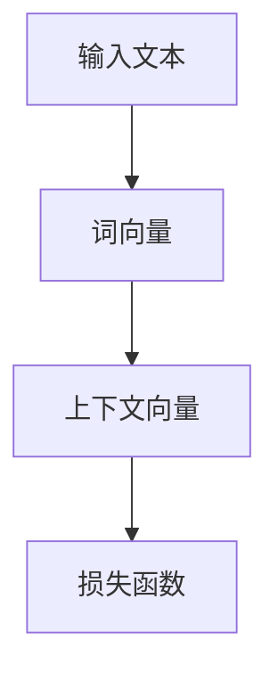
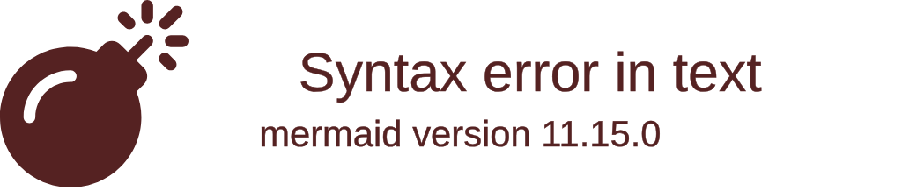

                 


# AI Agent的知识整合：融合多源信息

## 关键词：AI Agent，知识整合，多源信息，信息融合，知识图谱，分布式表示学习

## 摘要：  
AI Agent的知识整合是实现智能化决策和问题解决的核心能力。通过融合来自多个来源的信息，AI Agent能够更全面地理解环境、做出更准确的判断。本文将从AI Agent的基本概念出发，探讨知识整合的核心原理、算法实现、系统设计与实际应用，结合具体的案例分析，深入剖析多源信息融合的关键技术与实际应用中的挑战，为读者提供一个系统性的知识框架。

---

# 第一部分: AI Agent的知识整合基础

## 第1章: AI Agent与知识整合概述

### 1.1 AI Agent的基本概念  
AI Agent（人工智能代理）是指能够感知环境、自主决策并采取行动以实现特定目标的智能实体。它具备以下核心特点：  
- **自主性**：能够在没有外部干预的情况下独立运行。  
- **反应性**：能够实时感知环境并做出响应。  
- **目标导向**：通过目标驱动来优化决策和行动。  

知识整合是AI Agent实现复杂任务的核心能力，它涉及从多个信息源中提取、处理和融合知识，以形成对问题的全面理解。  

### 1.2 知识整合的背景与问题背景  
在AI Agent的应用中，单一信息源往往无法满足复杂任务的需求。例如，在医疗诊断中，AI Agent需要整合患者的病史、症状、实验室数据和专家知识等多种信息源，才能做出准确的诊断。  
多源信息融合的目标是将分散、异构的信息源统一起来，消除信息冗余和冲突，形成一致、完整的知识表示。  

### 1.3 知识整合的核心要素  
- **知识表示**：通过符号、语义网络或向量空间等方式，将知识表示为计算机可以处理的形式。  
- **多源信息特征**：信息源的多样性（如文本、图像、语音等）、异构性和时序性。  
- **逻辑结构**：知识的层次化组织和关联关系，例如实体-关系-实体（E-R）模型。  

---

# 第二部分: 知识整合的核心概念与联系

## 第2章: 知识整合的核心原理  

### 2.1 知识整合的原理与机制  
知识整合的过程可以分为以下几个步骤：  
1. **信息提取**：从多个信息源中提取有用的信息。  
2. **信息融合**：将异构信息转换为统一的形式。  
3. **逻辑推理**：基于融合后的知识进行推理和决策。  

### 2.2 知识表示与信息表示的对比  
| 对比维度 | 知识表示 | 信息表示 |  
|----------|----------|----------|  
| 核心目标 | 描述事物之间的关系和语义 | 描述数据的结构和内容 |  
| 表示形式 | 符号化、语义网络 | 数据结构、数据库表 |  
| 应用场景 | 知识图谱构建、推理 | 数据库查询、信息检索 |  

### 2.3 知识整合的ER实体关系图  
```mermaid
er
  actor(Agent) {
    id: integer
    name: string
  }
  actor(信息源) {
    id: integer
    type: string
  }
  actor(知识库) {
    id: integer
    content: string
  }
  relation(属于) {
    agent_id: integer
    source_id: integer
  }
  relation(包含) {
    source_id: integer
    knowledge_id: integer
  }
```

---

# 第三部分: 知识整合的算法原理  

## 第3章: 知识整合的关键算法  

### 3.1 分布式表示学习算法  

#### 3.1.1 Word2Vec算法原理  
Word2Vec是一种将词表示为低维向量的算法，常用于文本信息处理。  
其核心思想是通过上下文预测目标词（CBOW）或通过目标词预测上下文（Skip-Gram）。  

##### Word2Vec的流程图  


##### Word2Vec的数学模型  
目标函数：  
$$ \text{loss} = -\log P(w_i|w_{i+1}) $$  
其中，$P(w_i|w_{i+1})$ 是上下文词 $w_{i+1}$ 出现的概率。  

---

## 第4章: 系统分析与架构设计  

### 4.1 问题场景介绍  
假设我们正在设计一个医疗诊断AI Agent，它需要整合患者的病史、症状、实验室数据和医学文献等多源信息，以辅助医生做出诊断。  

### 4.2 系统功能设计  
- **信息采集模块**：从多个信息源采集数据。  
- **知识融合模块**：对异构数据进行清洗和融合。  
- **推理与决策模块**：基于融合后的知识进行诊断推理。  

### 4.3 系统架构设计  


---

## 第5章: 项目实战  

### 5.1 环境安装  
安装Python和相关库（如TensorFlow、Keras）：  
```bash
pip install tensorflow numpy
```

### 5.2 核心代码实现  

#### 5.2.1 Word2Vec实现  
```python
import numpy as np

class Word2Vec:
    def __init__(self, vocab_size, embedding_dim):
        self.W = np.random.randn(vocab_size, embedding_dim)
    
    def get_vector(self, word_index):
        return self.W[word_index]
    
    def train(self, context_vector, target_vector):
        # 简单的训练逻辑（实际更复杂）
        pass
```

---

## 第6章: 总结与展望  

### 6.1 最佳实践  
- 在进行知识整合时，优先选择可靠的信息源。  
- 使用可视化工具（如Graphviz）来展示知识图谱。  

### 6.2 小结  
本文系统性地探讨了AI Agent的知识整合技术，从核心概念到算法实现，再到系统设计和项目实战，为读者提供了一个完整的知识框架。  

### 6.3 注意事项  
- 确保信息源的多样性和可靠性。  
- 在实际应用中，注意数据隐私和安全问题。  

### 6.4 拓展阅读  
- 《知识图谱入门与实战》  
- 《分布式表示学习的算法与应用》  

---

**作者：AI天才研究院 & 禅与计算机程序设计艺术**

