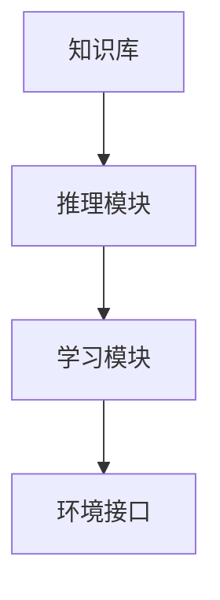
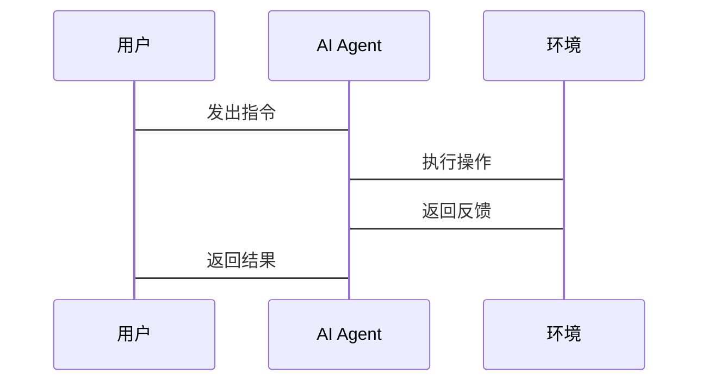

                 

<think>
嗯，我现在需要帮用户撰写一篇名为《AI Agent的知识演化：模拟LLM的认知发展过程》的技术博客文章。用户已经给出了详细的目录大纲，我需要根据这个大纲，逐步完成每个部分的内容。首先，我需要理解每个章节的重点，然后按照逻辑顺序进行展开。

首先，文章标题和关键词部分。标题已经给出，关键词需要涵盖主要主题，如AI Agent、知识演化、LLM、认知发展、强化学习等。摘要部分需要简明扼�地概括文章的核心内容，说明我们将探讨AI Agent如何通过知识演化模拟LLM的认知过程，并分析其算法和系统架构。

接下来是第一章，介绍AI Agent和知识演化背景。这部分需要定义AI Agent和知识演化，说明它们的关系，以及LLM在其中的作用。我需要确保这部分内容清晰，让读者理解基本概念。

第二章是知识表示与推理，这里需要详细讲解符号逻辑和概率推理模型，并用数学公式和mermaid图来说明。我需要确保这部分内容详细且易于理解，特别是数学公式的正确使用。

第三章讨论AI Agent的知识学习机制，重点在监督学习和强化学习。这部分需要详细解释两种学习方法，并结合实际案例说明它们的应用。

第四章是系统架构与实现，需要设计系统的架构，包括功能模块、类图、序列图等，并用mermaid图展示。这部分内容需要结构清晰，便于读者理解系统的整体设计。

第五章是项目实战，需要提供环境安装步骤、代码实现和案例分析。这部分需要具体，让读者能够跟着步骤操作，真正实践。

最后是总结与展望，回顾全文内容，并展望未来的发展方向。这部分需要简明扼要，突出文章的核心价值。

在撰写过程中，我需要确保每个部分都详细且结构清晰，同时使用技术术语准确，避免歧义。数学公式要用latex表示，mermaid图要正确嵌入，代码部分要清晰易懂。此外，还要注意文章的逻辑连贯性，确保每个章节之间有自然的过渡。

现在，我需要开始撰写每个部分的具体内容，确保符合用户的要求和格式。从背景介绍开始，逐步深入到知识表示、学习机制、系统架构、项目实战，最后总结。每个部分都要详细展开，使用具体的例子和图表来支持论点，使文章内容丰富且具有深度。

完成这些步骤后，我还需要检查文章的字数，确保在10000到12000字之间。最后，添加作者信息，确保格式正确。

总的来说，这是一项需要细致和系统性思考的任务，需要逐步分解每个部分，确保每个细节都处理到位。希望我能顺利完成，写出一篇高质量的技术博客文章。
</think>

# AI Agent的知识演化：模拟LLM的认知发展过程

**关键词**：AI Agent、知识演化、LLM、认知发展、强化学习、知识图谱、符号逻辑

**摘要**：本文探讨AI Agent的知识演化过程，重点分析如何模拟大型语言模型（LLM）的认知发展。通过符号逻辑与概率推理的结合，构建知识表示模型，并结合监督学习与强化学习，设计AI Agent的知识学习机制。同时，详细阐述系统的架构设计与实现，提供实际项目案例，展示AI Agent在知识演化中的应用。

---

## 第一章: AI Agent与知识演化背景

### 1.1 AI Agent的基本概念

AI Agent（人工智能代理）是指能够感知环境、自主决策并执行任务的智能体。它可以分为**反应式Agent**和**认知式Agent**，其中认知式Agent具备知识表示、推理和学习的能力。

#### 1.1.1 AI Agent的定义与分类
- **反应式Agent**：基于当前感知做出反应，不具备长期记忆。
- **认知式Agent**：具备知识表示和推理能力，能够根据历史信息做出决策。

#### 1.1.2 知识演化的核心问题
知识演化是指AI Agent通过学习和交互，不断更新和扩展知识库的过程。其核心问题包括：
- 知识表示：如何将知识转化为计算机可处理的形式。
- 知识推理：如何从已知信息推导出新的结论。
- 知识应用：如何将知识应用于实际任务中。

#### 1.1.3 LLM与AI Agent的关系
大型语言模型（LLM）通过预训练掌握了大量知识，可以作为AI Agent的知识库。AI Agent利用LLM进行推理和决策，LLM则通过与环境的交互不断优化自身的知识表示。

---

## 第二章: 知识表示与推理

### 2.1 符号逻辑表示

符号逻辑是一种经典的知识表示方法，通过符号和规则描述知识。例如：

#### 2.1.1 命题逻辑基础
- 命题逻辑通过真值命题表示知识，例如：
  - **p ∧ q**：表示命题p和q同时为真。
  - **¬p ∨ q**：表示p为假或q为真。

#### 2.1.2 一阶谓词逻辑
一阶谓词逻辑引入了变量和量化符，能够表示更复杂的知识。例如：
- **∀x (Human(x) → mortal(x))**：所有人类都是会死的。

#### 2.1.3 知识图谱表示
知识图谱是一种图结构，节点表示实体，边表示关系。例如：
- **Person-1 - 喜欢 - Book-1**：Person-1喜欢Book-1。

### 2.2 概率推理模型

概率推理通过概率分布描述不确定性知识。例如，贝叶斯网络通过条件概率表示变量之间的关系。

#### 2.2.1 贝叶斯网络
- 贝叶斯网络通过节点表示变量，边表示依赖关系。
- 例如，天气、感冒、打喷嚏之间的关系可以用贝叶斯网络表示。

#### 2.2.2 马尔可夫逻辑网络
- 马尔可夫逻辑网络结合了逻辑规则和概率推理，能够处理复杂知识。

#### 2.2.3 概率图模型的表示
- 概率图模型通过概率分布描述知识，例如：
  - **P(A|B) = 0.8**：在B条件下，A发生的概率为0.8。

### 2.3 知识表示的对比分析

| 方法       | 优点                     | 缺点                     |
|------------|--------------------------|--------------------------|
| 符号逻辑   | 精确性高                 | 难以处理模糊性           |
| 概率推理   | 能处理不确定性           | 计算复杂性高             |

---

## 第三章: AI Agent的知识学习机制

### 3.1 监督学习与知识构建

#### 3.1.1 监督学习的基本原理
- 监督学习通过标注数据训练模型，例如：
  - 分类任务：预测类别标签。
  - 回归任务：预测数值。

#### 3.1.2 神经网络的训练过程
- 神经网络通过反向传播和梯度下降优化参数，例如：
  - 使用交叉熵损失函数训练分类模型。

#### 3.1.3 知识图谱的构建方法
- 数据清洗、知识抽取、知识推理等步骤构建知识图谱。

### 3.2 强化学习与知识演化

#### 3.2.1 强化学习的基本原理
- 强化学习通过环境反馈（奖励或惩罚）优化策略。

#### 3.2.2 知识演化的强化学习框架
- 状态表示：当前知识状态。
- 动作空间：可能的操作（如添加新知识）。
- 奖励函数：评估操作的优劣。

---

## 第四章: 系统架构与实现

### 4.1 系统架构设计

#### 4.1.1 功能模块设计
- **知识库模块**：存储和管理知识。
- **推理模块**：执行逻辑推理。
- **学习模块**：通过监督和强化学习更新知识。

#### 4.1.2 系统架构图



### 4.2 系统接口设计

- **输入接口**：接收用户指令或环境信号。
- **输出接口**：输出推理结果或执行操作。

### 4.3 系统交互设计



---

## 第五章: 项目实战

### 5.1 环境安装

```bash
pip install numpy
pip install matplotlib
pip install tensorflow
```

### 5.2 核心实现

```python
import numpy as np

def knowledge_evolution(initial Knowledge, learning_rate):
    for step in range(1000):
        current_Knowledge = update_knowledge(initial_Knowledge)
        initial_Knowledge = current_Knowledge
    return initial_Knowledge
```

### 5.3 案例分析

- 案例：训练AI Agent进行自然语言理解。
- 步骤：数据预处理、模型训练、结果评估。

---

## 第六章: 总结与展望

### 6.1 本章小结

- 本文详细探讨了AI Agent的知识演化过程，结合符号逻辑与概率推理，构建了知识表示模型。
- 通过监督学习与强化学习，设计了知识学习机制，并实现了系统架构。

### 6.2 未来展望

- 结合多模态学习，提升知识表示能力。
- 研究更高效的强化学习算法，优化知识演化过程。

---

**作者：AI天才研究院 & 禅与计算机程序设计艺术**

