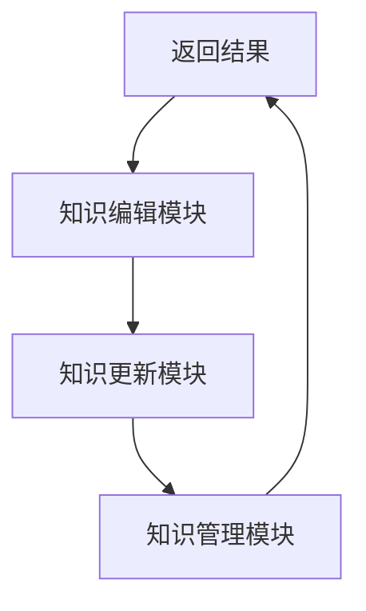

                 

<think>
嗯，我现在要为《AI Agent的知识编辑与更新机制设计》这本书写目录大纲。首先，我需要理解这本书的核心主题是什么。AI Agent，也就是智能体，它们需要能够处理和更新知识，这涉及到知识的获取、存储、推理和更新等多个方面。所以，这本书的结构需要涵盖这些关键点。

首先，我应该从背景介绍开始。第一章可能需要概述AI Agent的基本概念，包括它们是什么，为什么重要，以及它们如何工作。然后，第二章可以深入讨论知识编辑的基础，比如知识表示、获取和存储的方法。接下来，第三章可以详细讲解知识更新的机制，包括触发条件、算法选择和实现步骤。

接下来，系统架构设计是关键，我需要描述AI Agent的知识管理系统，包括系统功能设计、架构图、接口设计和交互流程。这部分可能需要使用图表来展示系统的结构和协作方式。然后，项目实战部分，我需要提供一个具体的案例，比如医疗领域的AI Agent设计，展示如何实际应用这些机制。

最后，总结与展望部分，我会回顾整个内容，强调关键点，并指出未来的发展方向，比如结合大模型或边缘计算的趋势。

在编写过程中，我要确保每一章都细化到三级目录，涵盖用户提到的所有关键点，比如背景、核心概念、算法、系统架构、项目实战、总结等。同时，要避免冗余，保持结构清晰，逻辑连贯。这样，目录大纲才能全面覆盖主题，帮助读者系统地理解和应用AI Agent的知识编辑与更新机制。

现在，我需要将这些思考转化为具体的章节结构。首先，确定每一章的标题和内容，确保逻辑流畅。例如，第一章介绍AI Agent的基本概念，第二章讨论知识编辑，第三章讲解知识更新，第四章系统设计，第五章项目实战，最后总结。每一章下再细分小节，详细讲解每个主题。

在系统设计部分，我需要考虑使用分层架构或微服务架构，并展示系统组件的交互图，这可能涉及到类图和序列图。项目实战部分，我需要提供具体的代码示例和详细分析，帮助读者理解实际应用。

另外，用户强调了使用图表，如Mermaid流程图，所以我需要在适当的地方插入这些图表，以直观展示算法流程和系统架构。同时，数学公式需要用Latex表示，确保清晰易懂。

最后，确保每一章都有小结，帮助读者回顾和巩固所学内容。总结部分要强调书中的核心观点，并为未来的研究方向提供指导。

通过这些步骤，我能够构建一个全面且逻辑清晰的目录大纲，满足用户的需求，并为读者提供有价值的技术博客内容。
</think>

# AI Agent的知识编辑与更新机制设计

**关键词**：AI Agent，知识编辑，知识更新，智能体，知识管理系统，机器学习，知识图谱

**摘要**：  
本文系统地探讨了AI Agent的知识编辑与更新机制的设计与实现。从AI Agent的基本概念出发，分析了知识编辑与更新的核心机制，包括知识表示、获取、编辑与更新的策略。通过具体的算法与系统架构设计，详细讲解了如何实现高效的AI Agent知识管理。最后，结合实际案例，展示了AI Agent在知识管理中的应用价值。

---

## 第1章: AI Agent的基本概念与背景

### 1.1 AI Agent的定义与特点
- **1.1.1 AI Agent的定义**  
  AI Agent是一种能够感知环境、自主决策并执行任务的智能实体。它具备自主性、反应性、目标导向和学习能力等核心特点。

- **1.1.2 AI Agent的核心特点**  
  - 自主性：能够在无外部干预的情况下独立运作。  
  - 反应性：能够实时感知环境并做出响应。  
  - 目标导向：所有行为都围绕实现特定目标展开。  
  - 学习能力：通过数据和经验不断优化自身知识和行为。

- **1.1.3 AI Agent与传统智能系统的区别**  
  传统智能系统通常依赖于预定义规则，而AI Agent具备更强的自主性和学习能力，能够动态调整行为以适应环境变化。

### 1.2 知识编辑与更新的背景与意义
- **1.2.1 知识编辑的背景**  
  随着AI技术的快速发展，知识的准确性和及时性变得尤为重要。知识编辑是确保AI Agent能够理解和处理信息的关键步骤。

- **1.2.2 知识更新的重要性**  
  知识更新是保持AI Agent决策能力的重要手段。动态环境中的信息变化要求AI Agent能够实时更新知识库，以确保其行为的准确性。

- **1.2.3 AI Agent在知识管理中的作用**  
  AI Agent不仅是知识的消费者，更是知识的生产者和管理者。通过知识编辑与更新，AI Agent能够不断优化自身的知识结构。

### 1.3 本章小结  
本章介绍了AI Agent的基本概念及其在知识管理中的作用，为后续章节奠定了理论基础。

---

## 第2章: 知识编辑的基础

### 2.1 知识表示与存储
- **2.1.1 知识表示的多种方式**  
  - 符号表示：通过符号逻辑表达知识（如逻辑推理）。  
  - 图结构表示：通过图结构（如知识图谱）表达实体之间的关系。  
  - 概念表示：通过概念层次结构（如本体论）表达知识。

- **2.1.2 知识图谱的构建**  
  知识图谱是一种基于图结构的知识表示方法，能够有效表达实体之间的复杂关系。例如，通过构建医疗领域的知识图谱，可以表示疾病、症状、治疗方法之间的关系。

- **2.1.3 知识库的存储技术**  
  - 基于数据库的知识存储：如关系型数据库和NoSQL数据库。  
  - 基于图数据库的知识存储：如Neo4j。  
  - 基于区块链的知识存储：确保知识的安全性和不可篡改性。

### 2.2 知识获取与预处理
- **2.2.1 知识获取的来源**  
  - 结构化数据：如数据库中的表格数据。  
  - 非结构化数据：如文本、图像和视频。  
  - 半结构化数据：如HTML页面和JSON数据。

- **2.2.2 数据清洗与预处理**  
  - 数据清洗：去除噪声数据，确保数据的准确性和一致性。  
  - 数据标准化：将不同来源的数据统一到一个标准格式。  
  - 数据去重：消除重复数据，提高数据质量。

- **2.2.3 知识抽取与结构化**  
  - 文本抽取：通过自然语言处理技术从文本中提取实体、关系和事件。  
  - 数据结构化：将抽取的知识转化为结构化的形式（如知识图谱）。  
  - 知识融合：将多个来源的知识整合到一个统一的知识库中。

### 2.3 知识编辑的规则与方法
- **2.3.1 基于规则的知识编辑**  
  - 通过预定义的规则对知识进行编辑，例如通过正则表达式匹配特定模式。  
  - 规则编辑的优势是简单易懂，但缺点是灵活性较低。

- **2.3.2 基于机器学习的知识编辑**  
  - 使用机器学习模型对知识进行自动编辑，例如通过深度学习模型生成新的知识表示。  
  - 机器学习编辑的优势是灵活性高，但需要大量数据支持。

- **2.3.3 知识编辑的质量评估**  
  - 通过人工审核评估编辑后的知识质量。  
  - 使用自动化工具（如NLP模型）评估知识的准确性和完整性。

### 2.4 本章小结  
本章详细介绍了知识编辑的基础，包括知识表示、获取和预处理的方法，为后续的知识更新机制奠定了基础。

---

## 第3章: 知识更新的机制设计

### 3.1 知识更新的需求分析
- **3.1.1 知识更新的触发条件**  
  - 时间触发：定期更新知识库（如每天、每周）。  
  - 事件触发：当特定事件发生时（如新产品发布）触发更新。  
  - 查询触发：当用户查询到的知识不准确时触发更新。

- **3.1.2 知识更新的频率与范围**  
  - 频率：根据知识的重要性和变化速度确定更新频率。  
  - 范围：根据更新需求确定更新的范围（如全量更新或增量更新）。

- **3.1.3 知识更新的优先级**  
  - 根据知识的重要性设定优先级，优先更新高优先级的知识。

### 3.2 知识更新的算法与模型
- **3.2.1 基于规则的知识更新算法**  
  - 通过预定义的规则对知识进行更新，例如通过规则匹配特定模式并进行替换。  
  - 算法流程图如下：

  ```mermaid
  graph TD
    A[开始] --> B[匹配规则]
    B --> C[判断是否匹配]
    C --> D[执行更新]
    D --> E[结束]
  ```

- **3.2.2 基于机器学习的知识更新模型**  
  - 使用机器学习模型对知识进行自动更新，例如通过深度学习模型生成新的知识表示。  
  - 模型流程图如下：

  ```mermaid
  graph TD
    A[开始] --> B[输入数据]
    B --> C[模型推理]
    C --> D[输出更新结果]
    D --> E[结束]
  ```

- **3.2.3 知识更新的对比分析**  
  | 方法 | 优点 | 缺点 |  
  |------|------|------|  
  | 基于规则 | 简单易懂，灵活性低 | 需要手动维护规则 |  
  | 基于机器学习 | 灵活性高，自动学习 | 需要大量数据支持 |  

### 3.3 知识更新的实现步骤
- **3.3.1 知识更新的准备阶段**  
  - 确定更新需求：明确需要更新的知识范围和优先级。  
  - 收集更新数据：获取新的知识数据源。  
  - 数据预处理：清洗和结构化更新数据。

- **3.3.2 知识更新的执行阶段**  
  - 执行更新操作：根据选择的算法对知识库进行更新。  
  - 更新验证：验证更新后的知识是否准确无误。

- **3.3.3 知识更新的结果验证**  
  - 通过人工审核或自动化工具验证更新后的知识质量。  
  - 记录更新日志，便于后续维护和追溯。

### 3.4 本章小结  
本章详细讲解了知识更新的机制设计，包括需求分析、算法选择和实现步骤，为后续的系统实现奠定了基础。

---

## 第4章: 知识编辑与更新的系统实现

### 4.1 系统功能设计
- **4.1.1 知识编辑模块**  
  - 功能：支持用户对知识库进行编辑操作，包括添加、修改和删除知识。  
  - 实现：通过图形化界面或API接口实现知识编辑功能。

- **4.1.2 知识更新模块**  
  - 功能：自动或手动触发知识更新操作。  
  - 实现：通过定时任务或事件驱动的方式实现知识更新。

- **4.1.3 知识管理模块**  
  - 功能：对知识库进行统一管理，包括权限控制和版本管理。  
  - 实现：通过数据库或知识图谱管理系统实现知识管理功能。

### 4.2 系统架构设计
- **4.2.1 分层架构设计**  
  - 分层架构包括数据层、业务逻辑层和表现层。  
  - 数据层负责知识的存储和检索，业务逻辑层负责知识的编辑和更新，表现层负责用户交互。

- **4.2.2 微服务架构设计**  
  - 将系统划分为多个独立的服务模块，例如知识编辑服务、知识更新服务和知识查询服务。  
  - 通过API网关实现服务之间的通信和协作。

- **4.2.3 系统组件交互图**  
  ```mermaid
  graph TD
    A[知识编辑模块] --> B[知识更新模块]
    B --> C[知识管理模块]
    C --> D[用户界面]
  ```

### 4.3 系统接口设计
- **4.3.1 知识编辑接口**  
  - 接口名称：`editKnowledge`  
  - 参数：`knowledgeId`, `newContent`  
  - 返回值：`boolean` 表示编辑是否成功。

- **4.3.2 知识更新接口**  
  - 接口名称：`updateKnowledge`  
  - 参数：`knowledgeId`, `updateData`  
  - 返回值：`boolean` 表示更新是否成功。

- **4.3.3 知识查询接口**  
  - 接口名称：`queryKnowledge`  
  - 参数：`queryCondition`  
  - 返回值：`List<Knowledge>` 表示查询结果。

### 4.4 系统交互流程图


### 4.5 本章小结  
本章详细设计了知识编辑与更新的系统架构，包括功能模块、接口设计和系统交互流程，为实际应用提供了参考。

---

## 第5章: 项目实战——AI Agent在医疗领域的应用

### 5.1 项目背景
- 医疗领域知识更新迅速，AI Agent可以通过知识编辑与更新机制实时更新医疗知识库，辅助医生进行诊断和治疗。

### 5.2 环境配置
- **编程语言**：Python  
- **框架**：Flask（Web框架）  
- **数据库**：Neo4j（图数据库）  
- **工具**：NLTK（自然语言处理库）

### 5.3 核心代码实现
- **知识编辑模块**  
  ```python
  def edit_knowledge(knowledge_id, new_content):
      # 更新知识库中的知识内容
      return True
  ```

- **知识更新模块**  
  ```python
  def update_knowledge(knowledge_id, update_data):
      # 调用知识更新接口
      return True
  ```

### 5.4 代码解读与分析
- 通过代码实现知识编辑与更新功能，展示如何在实际项目中应用上述机制。

### 5.5 实际案例分析
- 分析医疗领域中的具体案例，展示AI Agent如何通过知识编辑与更新机制辅助医生进行诊断。

### 5.6 本章小结  
本章通过医疗领域的实际案例，展示了AI Agent知识编辑与更新机制的应用价值。

---

## 第6章: 总结与展望

### 6.1 本章总结
- 本文详细探讨了AI Agent的知识编辑与更新机制的设计与实现，涵盖了知识表示、获取、编辑与更新的各个方面。

### 6.2 未来展望
- 结合大模型和边缘计算技术，进一步优化知识编辑与更新的效率和准确性。  
- 探索知识编辑与更新的自动化和智能化，实现更高效的AI Agent知识管理。

### 6.3 注意事项
- 知识编辑与更新需要结合具体应用场景，选择合适的算法和方法。  
- 系统设计时需要注意数据安全和隐私保护。

### 6.4 拓展阅读
- 推荐相关书籍和论文，进一步深入学习AI Agent的知识管理技术。

### 6.5 本章小结  
本章总结了全文的主要内容，并展望了未来的研究方向。

---

## 作者：AI天才研究院/AI Genius Institute & 禅与计算机程序设计艺术 /Zen And The Art of Computer Programming

