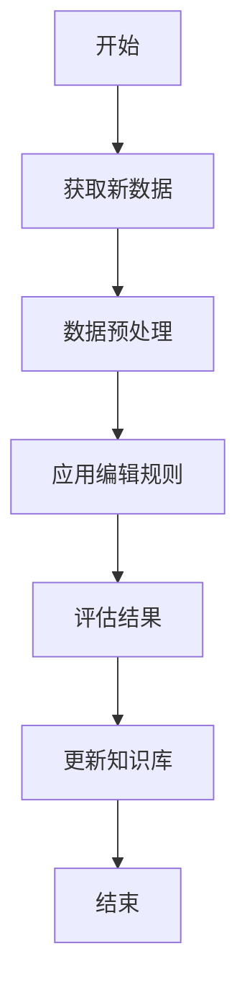
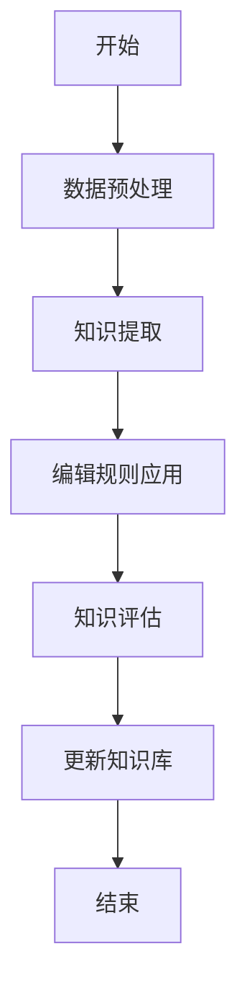
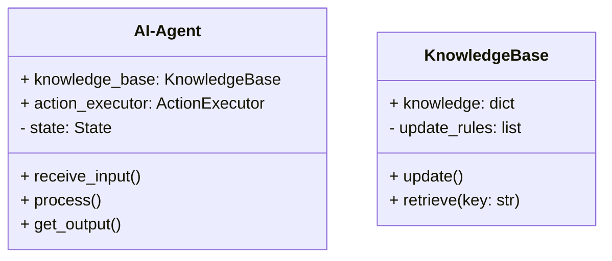
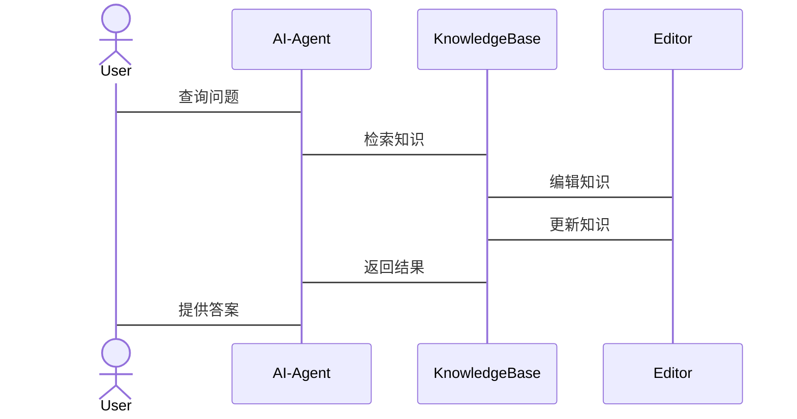

                 


# AI Agent的知识编辑系统：动态管理LLM的知识库

> 关键词：AI Agent，知识编辑系统，LLM，动态知识库，系统设计

> 摘要：本文探讨AI Agent如何通过知识编辑系统动态管理大型语言模型（LLM）的知识库。文章从背景、核心概念、算法原理、系统架构到项目实战，全面解析这一过程，提供详细的实现方法和实际案例分析。

---

## 目录大纲

1. [背景介绍](#背景介绍)
2. [核心概念与联系](#核心概念与联系)
3. [算法原理讲解](#算法原理讲解)
4. [系统分析与架构设计](#系统分析与架构设计)
5. [项目实战](#项目实战)
6. [最佳实践](#最佳实践)

---

## 背景介绍

### 1.1 问题背景

AI Agent（人工智能代理）是一种能够感知环境并采取行动以实现目标的智能实体。随着AI技术的发展，AI Agent在各个领域的应用日益广泛，如智能助手、推荐系统和自动化系统等。然而，AI Agent的能力高度依赖其知识库的质量和相关性。在动态变化的环境中，知识库需要实时更新和优化，以确保AI Agent能够准确理解和响应用户需求。

大型语言模型（LLM）如GPT-3和BERT等，具备强大的文本生成和理解能力，但其性能严重依赖于训练数据的质量和数量。动态管理LLM的知识库，即实时更新和优化其知识库，是提升AI Agent性能的关键。

### 1.2 问题描述

在实际应用中，AI Agent的知识库可能面临以下问题：
- 数据陈旧：知识库中的信息可能过时，导致AI Agent无法提供准确的答案。
- 数据冗余：知识库中可能存在重复或低效的数据，影响性能。
- 数据不足：面对新的查询或任务，知识库可能缺乏相关数据，导致AI Agent无法有效响应。
- 知识更新：动态环境中的变化（如新产品发布、政策调整等）需要知识库快速更新。

### 1.3 问题解决方法

动态管理LLM的知识库需要结合AI Agent的实时反馈和数据挖掘技术，实现知识的自动更新和优化。具体方法包括：
- 实时反馈机制：通过用户反馈不断优化知识库内容。
- 数据挖掘与分析：从新的数据源中提取有用信息，补充知识库。
- 知识图谱构建：利用知识图谱技术，提升知识的组织和关联性。

### 1.4 概念结构与核心要素

- AI Agent：具备感知和行动能力的智能实体，依赖知识库进行决策。
- 知识编辑系统：用于动态更新和优化知识库的系统，包括数据预处理、编辑策略和评估机制。
- LLM：大型语言模型，依赖于高质量的知识库以提供准确的生成和理解能力。

---

## 核心概念与联系

### 2.1 核心概念解析

#### AI Agent
- **定义与功能**：AI Agent能够感知环境、理解用户需求，并采取相应行动。其功能包括信息检索、决策制定和任务执行。
- **与传统程序的区别**：AI Agent具备自主性、反应性和目标导向性，能够适应动态环境。

#### 知识编辑系统
- **系统功能**：包括数据预处理、知识提取、编辑规则制定和知识评估。
- **编辑规则**：基于领域知识和用户反馈制定规则，指导知识库的更新。

#### LLM
- **模型特点**：LLM具备强大的文本生成和理解能力，但其性能依赖于训练数据的质量和多样性。
- **在知识管理中的应用**：LLM可以作为知识编辑系统的一部分，辅助知识的生成和验证。

### 2.2 对比分析

| 概念       | 功能                         | 应用场景               | 优缺点                     |
|------------|------------------------------|------------------------|---------------------------|
| AI Agent   | 感知环境、执行任务           | 智能助手、推荐系统等    | 自主性强，适应性强         |
| 知识编辑系统| 更新和优化知识库             | 数据管理、知识库维护   | 高效性，准确性             |
| LLM        | 生成和理解文本               | 问答系统、文本生成等   | 强大的生成能力，依赖数据质量 |

### 2.3 ER实体关系图

```mermaid
er
actor(AI Agent) -->
    entity(知识库) -->
        attribute(知识单元)
    entity(编辑规则) -->
        attribute(规则条件)
```

### 2.4 知识编辑流程图



---

## 算法原理讲解

### 3.1 算法流程与实现

#### 3.1.1 算法流程图



#### 3.1.2 Python代码实现

```python
def knowledge_editing_system():
    # 数据预处理
    data = preprocess_data()
    # 知识提取
    extracted_knowledge = extract_knowledge(data)
    # 编辑规则应用
    edited_knowledge = apply_editing_rules(extracted_knowledge)
    # 知识评估
    assessment = assess_knowledge(edited_knowledge)
    # 更新知识库
    update_knowledge_base(edited_knowledge, assessment)

knowledge_editing_system()
```

#### 3.1.3 数学模型与公式

- **相似度计算**：使用余弦相似度衡量两个向量之间的相似性。
  $$ \text{相似度} = \frac{\vec{a} \cdot \vec{b}}{||\vec{a}|| \cdot ||\vec{b}||} $$
- **权重分配**：基于TF-IDF算法计算关键词权重。
  $$ \text{TF-IDF}(t) = \text{TF}(t) \times \text{IDF}(t) $$
- **概率计算**：使用贝叶斯定理进行分类。
  $$ P(A|B) = \frac{P(B|A) \cdot P(A)}{P(B)} $$

---

## 系统分析与架构设计

### 4.1 问题场景介绍

AI Agent需要在动态环境中实时更新知识库，以应对用户查询的变化和新信息的涌入。例如，在电子商务场景中，AI Agent需要及时更新产品信息、促销活动等数据，确保用户的查询得到准确响应。

### 4.2 系统功能设计

#### 功能模块
- 知识获取：从多源数据中获取信息。
- 知识编辑：应用规则和算法优化知识。
- 知识存储：将优化后的知识存储在知识库中。
- 知识检索：根据用户查询快速检索相关知识。

#### 领域模型



### 4.3 系统架构设计

#### 系统架构图


#### 接口与交互设计



---

## 项目实战

### 5.1 环境安装

- **Python 3.8+**
- **安装库**：
  ```bash
  pip install numpy
  pip install pandas
  pip install spacy
  ```

### 5.2 核心代码实现

#### 代码示例：知识编辑模块

```python
import spacy

def preprocess_data(text):
    nlp = spacy.load("en_core_web_sm")
    doc = nlp(text)
    return [token.text for token in doc]

def extract_knowledge(data):
    # 示例：提取关键词
    return data

def apply_editing_rules(extracted_knowledge):
    # 示例：去除冗余
    unique_knowledge = list(set(extracted_knowledge))
    return unique_knowledge

def assess_knowledge(edited_knowledge):
    # 示例：计算相似度
    return [1.0 for _ in edited_knowledge]

def update_knowledge_base(edited_knowledge, assessment):
    # 示例：存储到数据库
    pass

# 示例调用
text = "The quick brown fox jumps over the lazy dog."
knowledge_editing_system()
```

### 5.3 案例分析与讲解

假设有一个电子商务场景，AI Agent需要实时更新产品信息。当新产品发布时，知识编辑系统会自动提取产品描述、规格等信息，并更新知识库。用户查询时，AI Agent能够快速检索最新信息，提供准确的产品推荐和详细说明。

---

## 最佳实践

### 6.1 小结

本文详细探讨了AI Agent动态管理LLM知识库的背景、核心概念、算法原理、系统架构及项目实战。通过理论与实践结合，展示了如何优化知识库，提升AI Agent的性能和用户体验。

### 6.2 注意事项

- **数据质量**：确保数据来源可靠，避免引入错误信息。
- **规则优化**：定期评估和更新编辑规则，以适应新变化。
- **性能监控**：实时监控系统性能，及时发现和解决问题。

### 6.3 拓展阅读

- 推荐阅读《Large Language Models: A Comprehensive Overview》深入理解LLM的工作原理。
- 参考《Knowledge Management Systems: Design and Implementation》学习知识管理系统的设计方法。

---

## 作者

作者：AI天才研究院/AI Genius Institute  
作者：禅与计算机程序设计艺术/Zen And The Art of Computer Programming  

---

通过以上结构和内容，文章全面解析了AI Agent的知识编辑系统，为读者提供了从理论到实践的详细指导，帮助他们理解和应用动态管理LLM的知识库。

