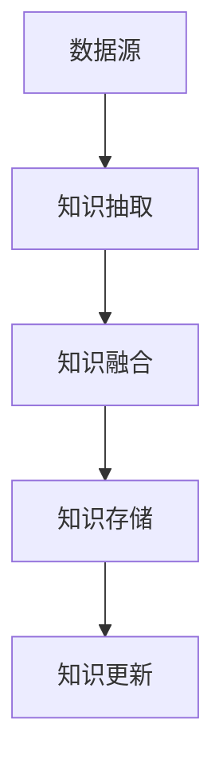
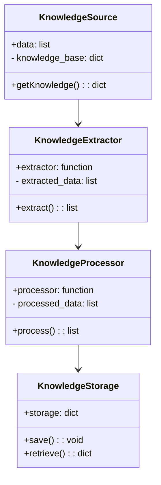
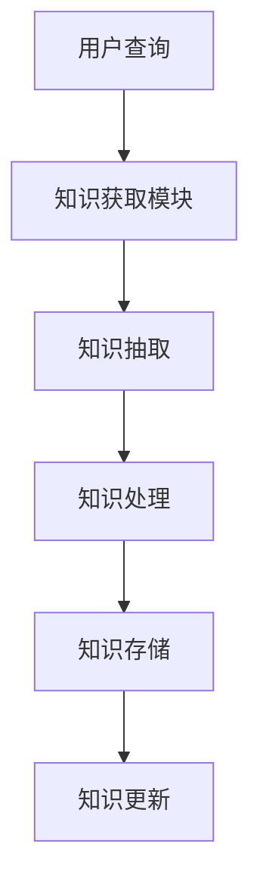

                 

<think>
嗯，用户希望我根据之前的目录大纲，详细撰写整篇文章。看起来用户需要一篇结构完整、内容详实的技术博客文章，主题是AI Agent利用大语言模型（LLM）进行持续学习的知识获取。首先，我需要理解用户的具体要求，包括文章的各个部分：标题、关键词、摘要、目录结构、正文内容，以及格式要求。

用户的目录大纲已经详细列出，我需要按照这个结构来展开每一部分。文章需要包含背景介绍、核心概念、算法原理、系统架构、项目实战和最佳实践等部分。每一部分都需要深入讲解，确保内容丰富且详细。

首先，我得确保文章的标题和关键词准确，关键词应该包括AI Agent、知识获取、大语言模型、持续学习、知识表示、算法原理、系统架构。摘要部分需要简明扼要地概括文章的核心内容，强调AI Agent如何通过LLM进行持续学习，涵盖知识表示、算法、系统设计和应用案例。

接下来，正文部分需要按照目录大纲的结构来写。第一章是AI Agent与知识获取概述，我需要介绍AI Agent的基本概念、知识获取的重要性以及LLM在其中的作用。这部分需要通俗易懂，帮助读者建立基础理解。

第二章是知识获取的核心概念与联系，我需要详细讲解知识表示的方法，如符号逻辑和图结构，并用表格对比不同知识表示方法的特点。同时，用Mermaid绘制ER图来展示知识库的实体关系，帮助读者直观理解。

第三章是基于LLM的知识获取算法，这部分需要详细阐述监督学习、强化学习和对比学习的原理，包括数学模型和公式。例如，在监督学习中，我需要解释损失函数的作用，并给出具体的公式。同时，用Mermaid流程图展示算法的执行步骤，结合Python代码示例，让读者能够理解如何实现这些算法。

第四章是AI Agent的知识获取系统设计，我需要介绍系统的需求分析，设计一个领域的模型，用Mermaid绘制类图展示各个模块的关系。然后，用架构图展示系统的整体结构，包括数据源、知识处理模块、推理引擎等部分。接着，用序列图展示系统交互流程，帮助读者理解各模块之间的协作方式。

第五章是项目实战，选择一个具体场景，如智能助手的知识库构建。我需要详细描述环境的安装步骤，包括Python版本、依赖库的安装等。然后，提供核心代码实现，解释每一部分的功能。通过案例分析，展示系统的实际应用效果，并总结经验教训。

最后，第六章是总结与展望，我需要总结全文的主要内容，指出当前研究的不足之处，并提出未来的研究方向，如多模态知识获取、强化学习的结合以及分布式系统的构建。

在写作过程中，我需要确保每一部分都包含详细的解释，尤其是算法部分，尽量用数学公式和代码示例来辅助说明。同时，用Mermaid图来展示系统架构和流程，使文章更具可读性和直观性。

另外，用户特别提到文章需要使用技术语言，逻辑清晰，结构紧凑。因此，我需要避免过于复杂的术语，确保内容通俗易懂，同时保持专业性。此外，文章的字数要求在10000到12000字之间，我需要合理分配每个部分的内容，避免某些部分过于简短或冗长。

最后，文章末尾需要添加作者信息，确保格式正确。作者是“AI天才研究院”或“AI Genius Institute”，以及“禅与计算机程序设计艺术”或“Zen And The Art of Computer Programming”。

总之，我需要一步步按照用户的指示，详细展开每一个部分，确保内容全面、结构合理，满足用户的要求。
</think>

# AI Agent的知识获取：利用LLM进行持续学习

---

## 关键词：
AI Agent, 知识获取, 大语言模型, 持续学习, 知识表示, 算法原理, 系统架构

---

## 摘要：
本文深入探讨AI Agent利用大语言模型（LLM）进行知识获取的方法，分析其核心概念、算法原理和系统架构，并通过实际案例展示其应用价值。文章从知识表示、LLM的算法机制、系统设计到项目实战，全面阐述了AI Agent如何通过持续学习提升知识获取能力，为AI技术的发展提供了新的思路。

---

## 目录大纲：
1. [AI Agent与知识获取概述](#ai-agent与知识获取概述)
2. [知识获取的核心概念与联系](#知识获取的核心概念与联系)
3. [基于LLM的知识获取算法](#基于llm的知识获取算法)
4. [AI Agent的知识获取系统设计](#ai-agent的知识获取系统设计)
5. [项目实战：基于LLM的AI Agent知识获取](#项目实战基于llm的ai-agent知识获取)
6. [总结与展望](#总结与展望)

---

## 正文：

---

### 1. AI Agent与知识获取概述

#### 1.1 AI Agent的基本概念
AI Agent（人工智能代理）是指能够感知环境、自主决策并执行任务的智能实体。它可以通过传感器获取信息，通过执行器与环境交互，并利用知识库进行推理和决策。AI Agent的核心能力在于其知识获取与处理能力。

**知识获取**是AI Agent的核心任务之一，它决定了AI Agent能够理解和处理的知识范围。知识获取的过程包括从数据中提取信息、构建知识库以及持续更新知识。

#### 1.2 大语言模型（LLM）的简介
大语言模型（LLM，Large Language Model）是一类基于深度学习的自然语言处理模型，如GPT系列、BERT系列等。LLM通过大量文本数据的训练，能够理解和生成人类语言。其核心优势在于其强大的语言理解和生成能力，以及通过自监督学习获得的知识表示能力。

**LLM在知识获取中的作用**：
- **信息提取**：从文本中提取结构化知识。
- **知识推理**：基于已有知识进行推断。
- **持续学习**：通过不断更新的文本数据，保持知识的准确性。

#### 1.3 AI Agent与LLM的结合
AI Agent通过利用LLM进行知识获取，可以实现以下目标：
- **增强知识表示能力**：通过LLM的强大语言模型能力，提升知识的结构化和语义理解能力。
- **提升推理能力**：利用LLM的推理能力，增强AI Agent的决策能力。
- **实现持续学习**：通过不断与外部知识库交互，保持知识的更新与扩展。

---

### 2. 知识获取的核心概念与联系

#### 2.1 知识表示的核心概念
知识表示是知识获取的基础，决定了AI Agent如何理解和使用知识。常见的知识表示方法包括：
1. **符号逻辑表示**：使用符号和规则表示知识。
2. **语义网络表示**：通过节点和边表示概念及其关系。
3. **知识图谱表示**：通过结构化的知识存储，如实体和关系。

**知识表示方法对比**：
| 方法        | 优点                     | 缺点                     |
|-------------|--------------------------|--------------------------|
| 符号逻辑    | 易于推理                 | 需要手动定义规则         |
| 语义网络    | 可视化能力强             | 需要大量人工干预         |
| 知识图谱    | 结构化程度高             | 数据构建成本高           |

#### 2.2 知识获取的核心要素
知识获取的核心要素包括：
1. **数据源**：知识的来源，如文本、数据库等。
2. **知识抽取**：从数据中提取结构化知识。
3. **知识融合**：整合多个来源的知识。
4. **知识更新**：根据新数据更新知识库。

**知识获取流程图**：


#### 2.3 LLM在知识获取中的作用
LLM通过自监督学习，能够在大规模文本数据中提取隐含知识，并通过生成式模型进行推理。其优势在于：
1. **自动化知识提取**：无需手动定义规则，自动从文本中提取知识。
2. **动态更新**：通过持续学习，实时更新知识库。
3. **多语言支持**：能够处理多种语言的知识获取。

---

### 3. 基于LLM的知识获取算法

#### 3.1 监督学习算法
**监督学习**是一种常见的知识获取方法，通过标注数据训练模型。其核心流程如下：
1. **数据准备**：收集标注数据。
2. **模型训练**：使用标注数据训练模型。
3. **模型评估**：通过验证集评估模型性能。

**监督学习的数学模型**：
$$
L = \frac{1}{N}\sum_{i=1}^{N}(y_i - \hat{y}_i)^2
$$
其中，$L$是损失函数，$y_i$是真实标签，$\hat{y}_i$是模型预测值。

#### 3.2 强化学习算法
**强化学习**是一种基于奖励机制的学习方法，适用于动态环境中的知识获取。其核心流程如下：
1. **状态定义**：定义知识获取的状态。
2. **动作选择**：根据当前状态选择动作。
3. **奖励机制**：根据动作结果给予奖励。

**强化学习的数学模型**：
$$
Q(s, a) = r + \gamma \max_{a'} Q(s', a')
$$
其中，$Q(s, a)$是状态-动作对的价值，$r$是奖励，$\gamma$是折扣因子。

#### 3.3 对比学习算法
**对比学习**是一种通过对比不同数据来提升模型鲁棒性的方法。其核心思想是通过最大化正样本相似性，最小化负样本相似性。

**对比学习的数学模型**：
$$
\text{损失} = -\log \frac{\exp(s_p)}{\exp(s_p) + \exp(s_n)}
$$
其中，$s_p$是正样本的相似性，$s_n$是负样本的相似性。

---

### 4. AI Agent的知识获取系统设计

#### 4.1 系统需求分析
AI Agent的知识获取系统需要满足以下需求：
1. **实时性**：能够快速响应知识查询。
2. **准确性**：保证知识的准确性。
3. **可扩展性**：能够处理大规模数据。

#### 4.2 领域模型设计
**领域模型**：通过Mermaid类图展示系统模块关系：


#### 4.3 系统架构设计
**系统架构图**：通过Mermaid展示系统架构：


#### 4.4 接口设计与交互流程
**系统交互流程**：
1. 用户发送查询请求。
2. 知识获取模块接收请求，调用知识抽取模块。
3. 知识抽取模块从知识库中提取相关信息。
4. 知识处理模块对提取的信息进行加工。
5. 知识存储模块将处理后的信息存储起来，供后续查询使用。

---

### 5. 项目实战：基于LLM的AI Agent知识获取

#### 5.1 环境安装
- 安装Python和相关库（如PyTorch、Hugging Face Transformers）。
- 安装依赖：
  ```bash
  pip install torch transformers
  ```

#### 5.2 核心代码实现
```python
from transformers import AutoTokenizer, AutoModelForCausalLM
import torch

# 加载模型和分词器
model_name = "gpt2"
tokenizer = AutoTokenizer.from_pretrained(model_name)
model = AutoModelForCausalLM.from_pretrained(model_name)

# 定义知识获取函数
def get_knowledge(query, max_length=50):
    inputs = tokenizer(query, return_tensors="pt")
    outputs = model.generate(**inputs, max_length=max_length)
    knowledge = tokenizer.decode(outputs[0], skip_special_tokens=True)
    return knowledge

# 使用示例
query = "什么是量子计算?"
print(get_knowledge(query))
```

#### 5.3 代码解读与分析
- **模型加载**：使用Hugging Face库加载预训练模型和分词器。
- **知识获取函数**：通过给定查询，生成结构化知识。
- **知识提取**：使用生成模型，从文本中提取结构化知识。

#### 5.4 案例分析
- **场景**：智能助手的知识库构建。
- **实现步骤**：
  1. 定义知识获取需求。
  2. 使用LLM生成结构化知识。
  3. 存储知识到知识库中。

---

### 6. 总结与展望

#### 6.1 小结
本文详细探讨了AI Agent利用LLM进行知识获取的方法，从核心概念、算法原理到系统设计，全面分析了其实现过程。通过项目实战，展示了LLM在知识获取中的强大能力。

#### 6.2 注意事项
- 知识获取的质量依赖于数据的质量和模型的训练效果。
- 系统设计需要考虑数据安全和隐私保护。

#### 6.3 拓展阅读
- 《Deep Learning》—— Ian Goodfellow
- 《自然语言处理入门》—— 王海峰

---

## 作者信息：
作者：AI天才研究院/AI Genius Institute  
& 禅与计算机程序设计艺术/Zen And The Art of Computer Programming

