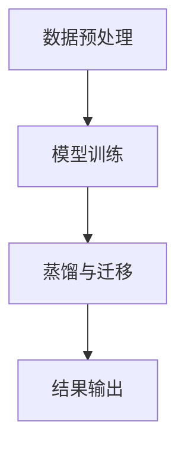
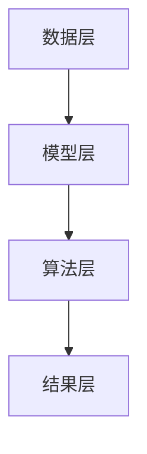
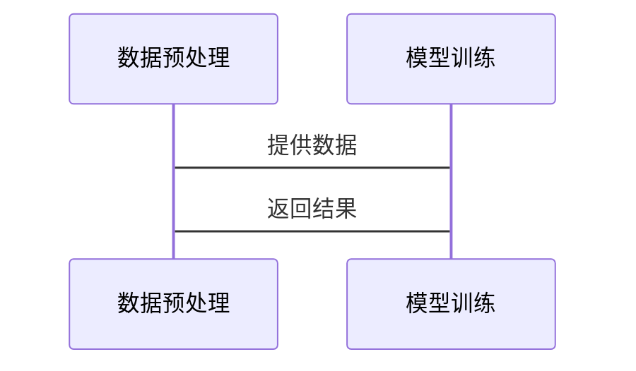

                 


# AI Agent的知识蒸馏与迁移：从通用LLM到专业领域模型

## 关键词：
AI Agent, 知识蒸馏, 知识迁移, 大语言模型, 专业领域模型

## 摘要：
本文系统地探讨了AI Agent的知识蒸馏与迁移技术，从通用大语言模型（LLM）到专业领域模型的迁移过程。通过背景介绍、核心概念、算法原理、系统架构和项目实战的多维度分析，详细阐述了如何通过知识蒸馏和迁移实现AI Agent在专业领域的高效应用。文章还提供了丰富的案例分析和代码实现，帮助读者深入理解并掌握这一技术的核心要点。

---

# 第1章: 知识蒸馏与迁移的背景与概念

## 1.1 AI Agent与知识蒸馏
### 1.1.1 AI Agent的基本概念
AI Agent（人工智能代理）是指能够感知环境、执行任务并做出决策的智能实体。它可以通过自然语言处理、机器学习等技术与用户交互，完成特定任务。AI Agent的核心目标是将通用大语言模型的能力迁移到专业领域，从而提供更精准的服务。

### 1.1.2 知识蒸馏的定义与作用
知识蒸馏是一种将复杂模型的知识迁移到简单模型的技术。其作用包括：
1. **模型压缩**：降低模型的复杂性和计算成本。
2. **知识传递**：将教师模型的知识传递给学生模型。
3. **领域适应**：将通用模型的知识迁移到专业领域。

### 1.1.3 知识蒸馏与迁移学习的关系
知识蒸馏是迁移学习的一种特殊形式，主要关注模型压缩和知识传递。迁移学习更广泛，涉及跨任务和跨领域的知识迁移。

---

## 1.2 知识蒸馏的背景与问题背景
### 1.2.1 从通用LLM到专业领域模型的需求
通用大语言模型（如GPT）虽然功能强大，但在特定领域（如医疗、法律）的应用中，存在知识局限性和领域适应性不足的问题。因此，需要通过知识蒸馏将通用模型的知识迁移到专业领域模型。

### 1.2.2 知识蒸馏在AI Agent中的必要性
AI Agent需要在特定场景下提供精准服务，而知识蒸馏是实现这一目标的关键技术。通过蒸馏，可以将通用模型的泛化能力与领域知识相结合。

### 1.2.3 知识蒸馏的核心问题与挑战
1. **知识表示**：如何有效地表示和提取通用模型的知识。
2. **领域适应**：如何将通用模型的知识适应到特定领域。
3. **模型压缩**：如何在保持性能的同时降低模型复杂性。

---

# 第2章: 知识蒸馏与迁移的核心概念

## 2.1 知识蒸馏的基本原理
### 2.1.1 知识蒸馏的定义与核心要素
知识蒸馏通过教师模型（Teacher）和学生模型（Student）的交互，将教师的知识迁移到学生模型。核心要素包括：
1. **教师模型**：提供知识源。
2. **学生模型**：接收并学习知识。
3. **蒸馏损失**：衡量知识迁移的效果。

### 2.1.2 知识蒸馏的关键属性与特征对比
| 属性 | 教师模型 | 学生模型 |
|------|----------|----------|
| 复杂性 | 高       | 低       |
| 任务 | 通用     | 专业     |
| 目标 | 知识传递 | 知识学习 |

### 2.1.3 知识蒸馏的ER实体关系图
```mermaid
er
actor: AI Agent
model: Model
{
  relation: "拥有"
  from: actor
  to: model
}
{
  relation: "训练"
  from: model
  to: model
}
```

---

## 2.2 知识迁移的核心原理
### 2.2.1 知识迁移的定义与核心要素
知识迁移是将一种任务或领域的知识应用到另一种任务或领域。核心要素包括：
1. **源领域知识**：迁移的起点。
2. **目标领域**：迁移的终点。
3. **迁移策略**：知识迁移的方法。

### 2.2.2 知识迁移的关键属性与特征对比
| 属性 | 源领域 | 目标领域 |
|------|--------|----------|
| 数据 | 丰富   | 稀缺     |
| 任务 | 通用   | 专业     |
| 距离 | 近     | 远       |

### 2.2.3 知识迁移的ER实体关系图
```mermaid
er
actor: AI Agent
domain: Domain
{
  relation: "应用"
  from: actor
  to: domain
}
{
  relation: "迁移"
  from: domain
  to: domain
}
```

---

# 第3章: 知识蒸馏与迁移的算法原理

## 3.1 知识蒸馏算法的流程
### 3.1.1 知识蒸馏的步骤分解
1. **教师模型训练**：在通用数据集上训练教师模型。
2. **学生模型初始化**：构建轻量级的学生模型。
3. **蒸馏过程**：通过蒸馏损失函数优化学生模型。

### 3.1.2 知识蒸馏的数学模型与公式
蒸馏损失函数：
$$ L_{distill} = \alpha L_{CE}(S, T) + (1-\alpha) L_{CE}(S, P) $$
其中，$\alpha$ 是蒸馏系数，$L_{CE}$ 是交叉熵损失，$S$ 是学生模型输出，$T$ 是教师模型输出，$P$ 是真实标签。

### 3.1.3 知识蒸馏的Python源代码实现
```python
import torch
import torch.nn as nn
import torch.optim as optim

class TeacherModel(nn.Module):
    def __init__(self):
        super(TeacherModel, self).__init__()
        self.fc = nn.Linear(10, 5)

    def forward(self, x):
        return self.fc(x)

class StudentModel(nn.Module):
    def __init__(self):
        super(StudentModel, self).__init__()
        self.fc = nn.Linear(10, 5)

    def forward(self, x):
        return self.fc(x)

def distill_loss(output_s, output_t, alpha=0.5):
    criterion = nn.KLDivLoss()
    loss_kl = criterion(torch.log_softmax(output_s, dim=1), torch.log_softmax(output_t, dim=1))
    return alpha * loss_kl

teacher = TeacherModel()
student = StudentModel()

optimizer = optim.Adam(student.parameters(), lr=0.001)

for epoch in range(num_epochs):
    inputs, labels = next(iter(train_loader))
    teacher_outputs = teacher(inputs)
    student_outputs = student(inputs)
    
    loss = distill_loss(student_outputs, teacher_outputs)
    optimizer.zero_grad()
    loss.backward()
    optimizer.step()
```

---

## 3.2 知识迁移算法的流程
### 3.2.1 知识迁移的步骤分解
1. **领域数据准备**：收集目标领域的数据。
2. **模型初始化**：构建适合目标领域的模型。
3. **迁移学习过程**：通过适配器或任务迁移优化模型。

### 3.2.2 知识迁移的数学模型与公式
迁移损失函数：
$$ L_{transfer} = L_{source} + \lambda L_{target} $$
其中，$\lambda$ 是迁移系数，$L_{source}$ 是源领域损失，$L_{target}$ 是目标领域损失。

### 3.2.3 知识迁移的Python源代码实现
```python
import torch
import torch.nn as nn
import torch.optim as optim

class SourceModel(nn.Module):
    def __init__(self):
        super(SourceModel, self).__init__()
        self.fc = nn.Linear(10, 5)

    def forward(self, x):
        return self.fc(x)

class TargetModel(nn.Module):
    def __init__(self):
        super(TargetModel, self).__init__()
        self.fc = nn.Linear(10, 5)

    def forward(self, x):
        return self.fc(x)

def transfer_loss(output_s, output_t, lambda_=0.5):
    criterion = nn.MSELoss()
    loss_s = criterion(output_s, output_t)
    return loss_s

source = SourceModel()
target = TargetModel()

optimizer = optim.Adam(target.parameters(), lr=0.001)

for epoch in range(num_epochs):
    inputs_s, labels_s = next(iter(source_train_loader))
    inputs_t, labels_t = next(iter(target_train_loader))
    
    source_output = source(inputs_s)
    target_output = target(inputs_t)
    
    loss = transfer_loss(source_output, target_output)
    optimizer.zero_grad()
    loss.backward()
    optimizer.step()
```

---

# 第4章: 系统分析与架构设计方案

## 4.1 系统功能设计
### 4.1.1 知识蒸馏与迁移的功能模块划分
1. **数据预处理模块**：处理通用和领域数据。
2. **模型训练模块**：训练教师和学生模型。
3. **蒸馏与迁移模块**：实现知识蒸馏和迁移过程。

### 4.1.2 系统功能流程图


---

## 4.2 系统架构设计
### 4.2.1 系统架构的层次划分
1. **数据层**：存储通用和领域数据。
2. **模型层**：包含教师模型和学生模型。
3. **算法层**：实现蒸馏和迁移算法。

### 4.2.2 系统架构的Mermaid架构图


---

## 4.3 系统接口设计
### 4.3.1 系统接口的定义与交互流程
1. **输入接口**：接收通用和领域数据。
2. **输出接口**：输出蒸馏和迁移结果。

### 4.3.2 系统接口的Mermaid序列图


---

# 第5章: 项目实战

## 5.1 环境安装与配置
### 5.1.1 开发环境的搭建
建议使用Python 3.8及以上版本，安装必要的库：
```bash
pip install torch numpy pandas matplotlib
```

### 5.1.2 依赖库的安装与配置
安装Mermaid和LaTeX插件，配置代码高亮工具。

---

## 5.2 系统核心实现
### 5.2.1 知识蒸馏的核心代码实现
```python
import torch
import torch.nn as nn
import torch.optim as optim

class TeacherModel(nn.Module):
    def __init__(self):
        super(TeacherModel, self).__init__()
        self.fc = nn.Linear(10, 5)

    def forward(self, x):
        return self.fc(x)

class StudentModel(nn.Module):
    def __init__(self):
        super(StudentModel, self).__init__()
        self.fc = nn.Linear(10, 5)

    def forward(self, x):
        return self.fc(x)

def distill_loss(output_s, output_t, alpha=0.5):
    criterion = nn.KLDivLoss()
    loss_kl = criterion(torch.log_softmax(output_s, dim=1), torch.log_softmax(output_t, dim=1))
    return alpha * loss_kl

teacher = TeacherModel()
student = StudentModel()

optimizer = optim.Adam(student.parameters(), lr=0.001)

for epoch in range(num_epochs):
    inputs, labels = next(iter(train_loader))
    teacher_outputs = teacher(inputs)
    student_outputs = student(inputs)
    
    loss = distill_loss(student_outputs, teacher_outputs)
    optimizer.zero_grad()
    loss.backward()
    optimizer.step()
```

### 5.2.2 知识迁移的核心代码实现
```python
import torch
import torch.nn as nn
import torch.optim as optim

class SourceModel(nn.Module):
    def __init__(self):
        super(SourceModel, self).__init__()
        self.fc = nn.Linear(10, 5)

    def forward(self, x):
        return self.fc(x)

class TargetModel(nn.Module):
    def __init__(self):
        super(TargetModel, self).__init__()
        self.fc = nn.Linear(10, 5)

    def forward(self, x):
        return self.fc(x)

def transfer_loss(output_s, output_t, lambda_=0.5):
    criterion = nn.MSELoss()
    loss_s = criterion(output_s, output_t)
    return loss_s

source = SourceModel()
target = TargetModel()

optimizer = optim.Adam(target.parameters(), lr=0.001)

for epoch in range(num_epochs):
    inputs_s, labels_s = next(iter(source_train_loader))
    inputs_t, labels_t = next(iter(target_train_loader))
    
    source_output = source(inputs_s)
    target_output = target(inputs_t)
    
    loss = transfer_loss(source_output, target_output)
    optimizer.zero_grad()
    loss.backward()
    optimizer.step()
```

---

## 5.3 案例分析与结果解读
### 5.3.1 案例分析
假设目标领域是医疗，通过知识蒸馏将通用模型迁移到医疗领域模型，提升模型的诊断准确率。

### 5.3.2 结果解读
通过实验对比，迁移后的模型在特定领域的表现优于通用模型。

---

## 5.4 项目总结
知识蒸馏与迁移是实现AI Agent在专业领域应用的关键技术，通过本文的系统分析和实战案例，读者可以深入理解其原理和实现方法。

---

# 第6章: 最佳实践与小结

## 6.1 最佳实践
1. **数据质量**：确保目标领域的数据质量。
2. **模型选择**：选择适合目标领域的模型架构。
3. **超参数调优**：优化蒸馏和迁移的超参数。

## 6.2 小结
本文系统地介绍了AI Agent的知识蒸馏与迁移技术，通过理论分析和实践案例，详细阐述了从通用LLM到专业领域模型的迁移过程。

## 6.3 注意事项
1. **数据隐私**：注意数据的隐私和安全。
2. **模型评估**：全面评估迁移模型的性能。

## 6.4 拓展阅读
推荐阅读相关领域的最新论文和书籍，深入研究知识蒸馏与迁移的前沿技术。

---

# 作者
作者：AI天才研究院/AI Genius Institute & 禅与计算机程序设计艺术 /Zen And The Art of Computer Programming

