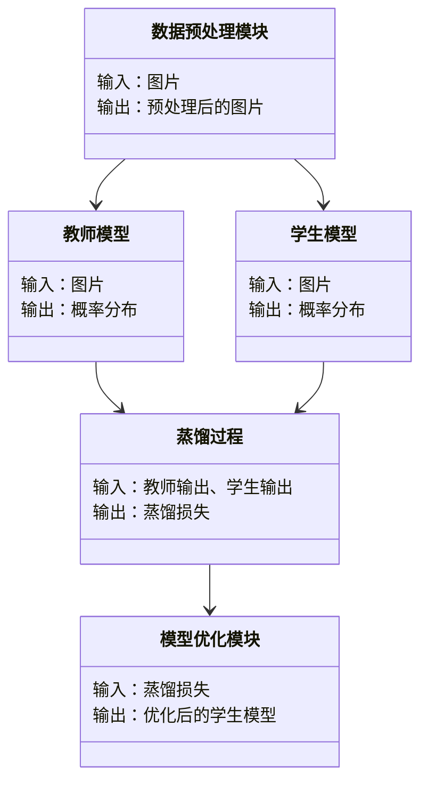

                 


# AI Agent的知识蒸馏在模型压缩中的应用

> 关键词：AI Agent，知识蒸馏，模型压缩，深度学习，神经网络

> 摘要：本文探讨了AI Agent在知识蒸馏技术中的应用，特别是在模型压缩领域的实践。通过系统地分析知识蒸馏的原理、算法实现以及在模型压缩中的具体应用，本文旨在为读者提供一个全面而深入的理解，帮助他们掌握如何利用AI Agent进行高效的模型压缩，优化模型性能和计算效率。

---

## 第一部分: AI Agent的知识蒸馏与模型压缩基础

### 第1章: AI Agent与知识蒸馏概述

#### 1.1 AI Agent的基本概念
##### 1.1.1 AI Agent的定义与分类
AI Agent（人工智能代理）是指能够感知环境、采取行动以实现目标的智能实体。AI Agent可以分为两类：**反应式Agent**（基于当前感知做出反应）和**认知式Agent**（具备复杂推理和规划能力）。AI Agent在知识蒸馏中的角色通常作为教师模型，将知识传递给学生模型。

##### 1.1.2 知识蒸馏的定义与核心思想
知识蒸馏（Knowledge Distillation）是一种将复杂模型（教师模型）的知识迁移到简单模型（学生模型）的技术。其核心思想是通过教师模型的输出概率分布，指导学生模型进行学习，从而实现模型压缩和性能优化。

##### 1.1.3 模型压缩的背景与意义
模型压缩是减少深度学习模型大小和计算成本的关键技术。随着深度学习模型的不断复杂化，模型压缩在资源受限的场景（如移动设备）中变得尤为重要。知识蒸馏是模型压缩的重要方法之一，通过教师-学生框架实现知识转移。

#### 1.2 知识蒸馏与模型压缩的关系
##### 1.2.1 知识蒸馏在模型压缩中的作用
知识蒸馏通过将教师模型的知识迁移到学生模型，实现了模型的轻量化。这种方法不仅保留了教师模型的性能，还显著降低了模型的计算和存储需求。

##### 1.2.2 模型压缩的目标与方法
模型压缩的目标是减少模型的参数数量，同时保持或提升模型的性能。常用方法包括剪枝（Pruning）、量化（Quantization）和知识蒸馏（Distillation）。

##### 1.2.3 AI Agent在知识蒸馏中的应用场景
AI Agent作为教师模型，可以用于图像分类、自然语言处理等多种任务中的知识蒸馏，帮助学生模型快速学习并实现模型压缩。

### 第2章: 知识蒸馏的核心原理

#### 2.1 知识蒸馏的基本原理
##### 2.1.1 知识蒸馏的流程
知识蒸馏的典型流程包括：
1. **教师模型训练**：训练一个复杂的模型作为教师。
2. **蒸馏过程**：通过教师模型的输出，指导学生模型学习。
3. **学生模型优化**：通过蒸馏损失函数优化学生模型，使其接近教师模型的输出。

##### 2.1.2 蒸馏损失函数的定义
蒸馏损失函数通常由两部分组成：**软标签损失**和**硬标签损失**。软标签损失基于教师模型的输出概率分布，硬标签损失基于真实标签。

##### 2.1.3 蒸馏过程中的关键参数
关键参数包括蒸馏温度（Temperature）、教师模型的权重（Alpha）和蒸馏损失的权重（Lambdas）。

#### 2.2 模型压缩的实现方法
##### 2.2.1 参数剪枝
参数剪枝通过移除不重要的参数或连接来减少模型大小。

##### 2.2.2 知识蒸馏
通过教师模型的输出概率分布，指导学生模型学习。

##### 2.2.3 模型量化
通过将模型参数量化为较低位数（如8位整数）来减少模型大小。

---

## 第二部分: 知识蒸馏的算法原理与实现

### 第3章: 知识蒸馏算法的数学模型

#### 3.1 知识蒸馏的数学表达
##### 3.1.1 蒸馏损失函数的公式推导
$$\mathcal{L}_{distill} = -\sum_{i=1}^{n} (y_i^{soft}) \cdot \log(y_i^{student})$$
其中，$y_i^{soft}$是教师模型的输出概率，$y_i^{student}$是学生模型的输出概率。

##### 3.1.2 KL散度的计算
KL散度衡量两个概率分布之间的差异：
$$KL(P || Q) = \sum P_i \log \frac{P_i}{Q_i}$$

##### 3.1.3 蒸馏过程中的优化目标
优化目标是通过蒸馏损失函数最小化模型的差距：
$$\min \mathcal{L}_{total} = \mathcal{L}_{distill} + \mathcal{L}_{CE}$$
其中，$\mathcal{L}_{CE}$是交叉熵损失。

#### 3.2 算法的优化与改进
##### 3.2.1 蒸馏温度的调整
蒸馏温度$T$用于平滑教师模型的输出概率分布：
$$P(y|x) = \text{Softmax}(\frac{Z}{T})$$

##### 3.2.2 多教师蒸馏
使用多个教师模型进行蒸馏，以提高学生模型的泛化能力。

---

## 第三部分: 系统分析与架构设计方案

### 第4章: 问题场景与系统设计

#### 4.1 问题场景介绍
知识蒸馏在图像分类任务中的应用，教师模型为ResNet-50，学生模型为MobileNet。

#### 4.2 系统功能设计
##### 4.2.1 领域模型


#### 4.3 系统架构设计


#### 4.4 系统接口设计
##### 4.4.1 教师模型接口
```python
def teacher_forward(x, T=1.0):
    features = teacher_model(x)
    outputs = F.softmax(features / T, dim=1)
    return outputs
```

##### 4.4.2 学生模型接口
```python
def student_forward(x):
    features = student_model(x)
    outputs = F.softmax(features, dim=1)
    return outputs
```

---

## 第四部分: 项目实战

### 第5章: 项目实现与案例分析

#### 5.1 环境安装
使用PyTorch和Vision库进行环境搭建。

#### 5.2 核心实现代码
```python
import torch
import torch.nn as nn
import torch.optim as optim
from torch.utils.data import DataLoader
import torchvision.datasets as datasets
import torchvision.transforms as transforms

# 定义教师模型和学生模型
class TeacherModel(nn.Module):
    def __init__(self):
        super(TeacherModel, self).__init__()
        self.fc = nn.Linear(784, 10)

class StudentModel(nn.Module):
    def __init__(self):
        super(StudentModel, self).__init__()
        self.fc = nn.Linear(784, 10)

# 定义蒸馏损失函数
class DistillLoss(nn.Module):
    def __init__(self, T=1.0, alpha=0.5):
        super(DistillLoss, self).__init__()
        self.T = T
        self.alpha = alpha

    def forward(self, y_pred, y_teacher, y_true):
        # 计算软标签损失
        soft_loss = self.kl_div(y_pred, y_teacher)
        # 计算硬标签损失
        hard_loss = F.cross_entropy(y_pred, y_true)
        # 综合损失
        total_loss = self.alpha * soft_loss + (1 - self.alpha) * hard_loss
        return total_loss

    def kl_div(self, y_pred, y_teacher):
        y_pred = F.softmax(y_pred / self.T, dim=1)
        y_teacher = F.softmax(y_teacher / self.T, dim=1)
        loss = torch.sum(y_teacher * torch.log(y_teacher / y_pred))
        return loss

# 训练过程
teacher_model = TeacherModel()
student_model = StudentModel()
distill_loss = DistillLoss(T=2.0, alpha=0.5)
optimizer = optim.Adam(student_model.parameters(), lr=0.001)

# 数据加载
transform = transforms.Compose([transforms.ToTensor()])
train_dataset = datasets.MNIST(root='./data', train=True, download=True, transform=transform)
train_loader = DataLoader(train_dataset, batch_size=64, shuffle=True)
```

#### 5.3 实际案例分析
使用MNIST数据集进行训练，比较蒸馏前后学生的模型性能和模型大小。

#### 5.4 项目小结
知识蒸馏能够有效减少模型大小，同时保持较高的分类准确率。通过调整蒸馏温度和教师模型的选择，可以进一步优化蒸馏效果。

---

## 第五部分: 总结与展望

### 第6章: 最佳实践与总结

#### 6.1 最佳实践
##### 6.1.1 选择合适的教师模型
教师模型的性能直接影响蒸馏效果，通常选择预训练的大型模型作为教师。

##### 6.1.2 蒸馏温度的调整
合理的蒸馏温度可以平衡教师模型的软标签分布，通常在1.0到3.0之间。

##### 6.1.3 数据分布的影响
数据分布不均时，需要调整蒸馏策略，确保学生模型在各数据类别上的均衡学习。

#### 6.2 未来研究方向
##### 6.2.1 多教师蒸馏
探索使用多个教师模型进行蒸馏，以提高学生的泛化能力。

##### 6.2.2 跨任务蒸馏
研究跨任务的知识蒸馏，提高模型的多任务学习能力。

##### 6.2.3 模型压缩的自动化
结合自动化技术，实现模型压缩的自动化流程。

### 6.3 总结
知识蒸馏通过教师模型的指导，有效实现了模型压缩，提升了模型的部署效率和计算效率。AI Agent在这一过程中扮演了关键角色，推动了知识蒸馏技术的发展。

---

## 作者信息

作者：AI天才研究院/AI Genius Institute & 禅与计算机程序设计艺术 /Zen And The Art of Computer Programming

---

本文通过系统地分析知识蒸馏的原理、算法实现以及在模型压缩中的具体应用，为读者提供了一个全面而深入的理解。通过实际案例的分析和代码实现，帮助读者掌握如何利用AI Agent进行高效的模型压缩，优化模型性能和计算效率。

