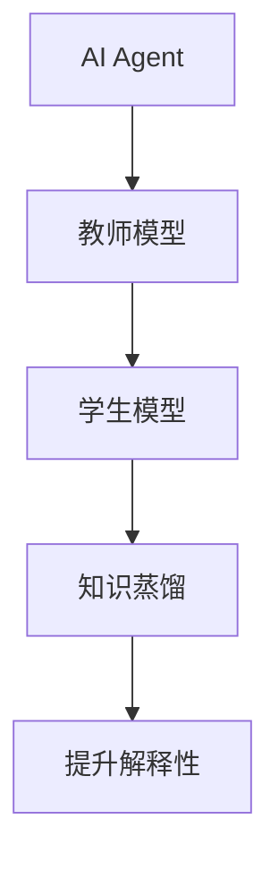
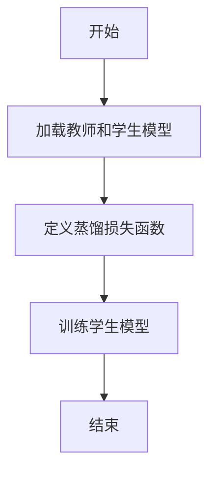
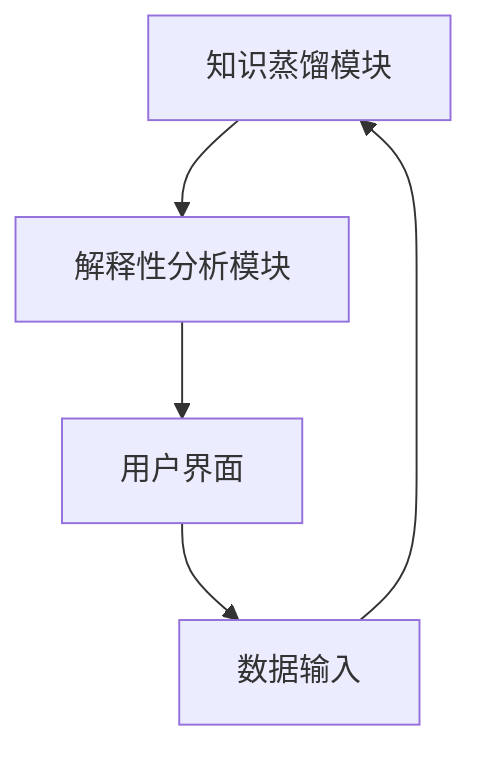

                 

<think>
好的，现在我需要根据用户的要求，逐步分析如何撰写《AI Agent的知识蒸馏在模型解释性中的应用》这篇技术博客。首先，我需要明确文章的结构和各部分内容。

首先，文章标题已经确定，接下来是关键词。我需要从文章中提取核心关键词，如知识蒸馏、AI Agent、模型解释性等，确保涵盖主要主题。

摘要部分需要简明扼要，概述文章的核心内容，包括知识蒸馏技术及其在提升AI Agent解释性中的应用，以及其对模型理解的重要性。

接下来是目录大纲，分为背景介绍、核心概念、算法原理、系统分析、项目实战和最佳实践六个部分。每个部分下有详细的小节，确保内容全面且结构清晰。

在背景介绍中，我需要定义AI Agent和知识蒸馏，解释它们的背景和重要性，以及它们在模型解释性中的结合。这部分需要让读者理解为什么知识蒸馏对AI Agent如此重要。

核心概念部分，我需要详细讲解知识蒸馏的原理和方法，并使用表格和图表进行对比分析。这有助于读者理解不同蒸馏方法的优缺点，以及它们如何影响AI Agent的性能。

算法原理部分，我需要展示数学模型和公式，如KL散度的应用，以及蒸馏损失函数的推导。使用mermaid流程图展示算法步骤，并提供Python代码示例，帮助读者理解和实现。

系统分析与设计部分，我需要考虑如何将知识蒸馏应用于AI Agent系统。包括系统功能设计、架构图、接口和交互流程图，确保各模块协同工作。

项目实战部分，我需要提供具体的实现步骤，包括环境安装、代码实现和案例分析，帮助读者掌握实际操作技能。

最后，最佳实践部分总结经验和注意事项，推荐进一步阅读的资料，帮助读者深入学习和扩展知识。

在撰写过程中，我需要确保每一部分都详细、具体，并且使用专业的技术语言，同时保持逻辑清晰和结构紧凑。此外，数学公式和图表需要准确嵌入，确保读者能够轻松理解。

现在，我需要将这些思考转化为实际的文章内容，逐步完成每个部分的撰写，确保符合用户的要求和结构。
</think>

# AI Agent的知识蒸馏在模型解释性中的应用

**关键词：** 知识蒸馏、AI Agent、模型解释性、机器学习、深度学习

**摘要：**  
本文探讨了AI Agent的知识蒸馏技术在提升模型解释性中的应用。通过背景介绍、核心概念、算法原理、系统设计、项目实战及最佳实践，详细分析了知识蒸馏如何帮助AI Agent提高可解释性，增强模型的理解与应用能力。

---

## 第一部分：AI Agent与知识蒸馏的背景介绍

### 第1章：AI Agent与知识蒸馏概述

#### 1.1 AI Agent的基本概念
- **1.1.1 AI Agent的定义与分类**
  AI Agent是具有自主决策能力的智能实体，可分为简单反射型、基于模型的反射型、目标驱动型和实用驱动型。
  
- **1.1.2 AI Agent的核心特征与功能**
  包括自主性、反应性、目标导向性和社会性。AI Agent能够感知环境、执行任务并做出决策。

- **1.1.3 AI Agent的应用场景与挑战**
  应用于自动驾驶、智能助手等领域，但模型解释性不足成为主要挑战。

#### 1.2 知识蒸馏的基本概念
- **1.2.1 知识蒸馏的定义与原理**
  知识蒸馏是将大模型的知识迁移到小模型的技术，通过教师模型指导学生模型学习。

- **1.2.2 知识蒸馏的主要方法与技术**
  包括软标签蒸馏、硬标签蒸馏和非标签蒸馏，各有优缺点。

- **1.2.3 知识蒸馏在AI Agent中的作用**
  提升模型解释性，降低复杂性，增强可解释性。

#### 1.3 AI Agent与知识蒸馏的结合
- **1.3.1 知识蒸馏在AI Agent中的应用背景**
  解决AI Agent模型复杂、难以解释的问题。

- **1.3.2 知识蒸馏如何提升AI Agent的解释性**
  通过蒸馏过程，简化模型结构，提高可解释性。

- **1.3.3 知识蒸馏在AI Agent中的优势与局限性**
  优势：提升效率，增强解释性；局限性：知识损失，可能影响性能。

---

## 第二部分：知识蒸馏的核心概念与原理

### 第2章：知识蒸馏的核心概念与联系

#### 2.1 知识蒸馏的原理与机制
- **2.1.1 教师模型与学生模型的角色**
  教师模型提供指导，学生模型学习。

- **2.1.2 知识蒸馏的关键步骤与流程**
  包括知识表示、蒸馏损失计算和优化。

#### 2.2 核心概念对比分析
- **2.2.1 不同蒸馏方法的特征对比（表格）**

| 方法       | 特征               | 优缺点               |
|------------|--------------------|----------------------|
| 软标签蒸馏 | 使用概率分布       | 高准确性，但计算量大  |
| 硬标签蒸馏 | 使用类别标签       | 计算简单，但准确性低  |
| 非标签蒸馏 | 不依赖标签         | 适用于无监督学习，但效果不稳定 |

- **2.2.2 实体关系图（Mermaid流程图）**



---

## 第三部分：知识蒸馏的算法原理

### 第3章：知识蒸馏的算法原理

#### 3.1 知识蒸馏的数学模型与公式
- **3.1.1 KL散度的定义与应用**
  KL散度衡量两个概率分布的差异，用于衡量教师和学生模型的预测差异。

- **3.1.2 蒸馏损失函数的数学表达**
  蒸馏损失函数：$$ L_{\text{distill}} = \lambda \text{KL}(P, Q) $$，其中$\lambda$是权重因子。

- **3.1.3 示例计算（使用公式）**
  示例：教师模型输出为$P = [0.2, 0.3, 0.5]$，学生模型输出为$Q = [0.1, 0.4, 0.5]$，计算KL散度。

#### 3.2 算法实现与流程
- **3.2.1 蒸馏算法的步骤分解（Mermaid流程图）**



- **3.2.2 Python代码实现示例**

```python
import torch.nn as nn
import torch.optim as optim

class TeacherModel(nn.Module):
    def __init__(self):
        super(TeacherModel, self).__init__()
        self.fc = nn.Linear(10, 3)

class StudentModel(nn.Module):
    def __init__(self):
        super(StudentModel, self).__init__()
        self.fc = nn.Linear(10, 3)

def distillation_loss(outputs_s, outputs_t, alpha=0.5):
    criterion = nn.KLDivLoss(reduction='batchmean')
    loss = criterion(torch.log_softmax(outputs_s, dim=1), torch.softmax(outputs_t, dim=1))
    return alpha * loss

teacher_model = TeacherModel()
student_model = StudentModel()
optimizer = optim.Adam(student_model.parameters())

for epoch in range(num_epochs):
    for inputs, labels in dataloaders:
        outputs_t = teacher_model(inputs)
        outputs_s = student_model(inputs)
        loss = distillation_loss(outputs_s, outputs_t)
        optimizer.zero_grad()
        loss.backward()
        optimizer.step()
```

- **3.2.3 代码解读与分析**
  代码实现了教师模型和学生模型的定义，以及蒸馏损失函数的计算和优化过程。

---

## 第四部分：AI Agent知识蒸馏系统的分析与设计

### 第4章：AI Agent知识蒸馏系统的分析与设计

#### 4.1 系统功能设计
- **4.1.1 知识蒸馏模块**
  负责知识提取和蒸馏过程。

- **4.1.2 解释性分析模块**
  负责模型解释性的评估与优化。

#### 4.2 系统架构设计（Mermaid架构图）



#### 4.3 系统接口与交互（Mermaid序列图）

```mermaid
sequenceDiagram
    participant A as 用户
    participant B as 知识蒸馏模块
    participant C as 解释性分析模块
    A -> B: 提供输入数据
    B -> C: 请求解释性分析
    C -> B: 返回解释性结果
    A <- B: 显示解释性结果
```

---

## 第五部分：AI Agent知识蒸馏的项目实战

### 第5章：AI Agent知识蒸馏的项目实战

#### 5.1 项目环境与工具安装
- 安装Python、PyTorch、TensorFlow等工具。

#### 5.2 项目核心代码实现
- 实现教师模型和学生模型，定义蒸馏损失函数并进行优化。

#### 5.3 代码应用解读与分析
- 通过实际案例分析代码的运行过程和结果。

#### 5.4 实际案例分析与详细讲解
- 分析蒸馏过程对模型解释性的影响，展示实验结果。

---

## 第六部分：AI Agent知识蒸馏的最佳实践

### 第6章：最佳实践与小结

#### 6.1 最佳实践 tips
- 选择合适的蒸馏方法，确保数据质量，合理设置超参数。

#### 6.2 小结
- 知识蒸馏有效提升AI Agent的解释性，但需注意模型性能和知识损失的平衡。

#### 6.3 注意事项
- 蒸馏过程可能引入偏差，需谨慎选择教师模型和蒸馏方法。

#### 6.4 拓展阅读
- 推荐阅读相关文献，深入学习知识蒸馏的最新进展。

---

**作者：AI天才研究院/AI Genius Institute & 禅与计算机程序设计艺术 /Zen And The Art of Computer Programming**

