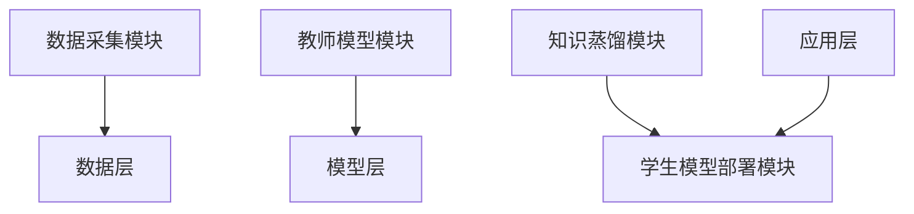
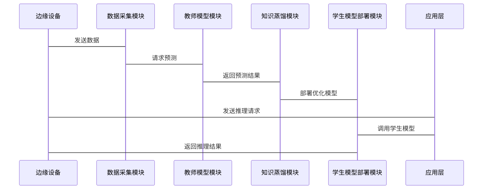

                 

<think>
好，我需要撰写一篇关于《AI Agent的知识蒸馏在边缘计算中的应用》的技术博客文章。首先，我得理解什么是AI Agent，什么是知识蒸馏，以及边缘计算是什么。然后，我要看看这些概念是如何结合起来的。

AI Agent是一种智能体，能够在环境中感知并采取行动以实现目标。知识蒸馏是一种机器学习技术，用于将复杂的模型（教师模型）的知识迁移到更简单的模型（学生模型）。边缘计算则是在靠近数据源的地方进行计算，以减少延迟和带宽消耗。

接下来，我需要思考这些概念如何在边缘计算中应用。边缘设备通常资源有限，无法运行复杂的模型，因此通过知识蒸馏将大模型的知识迁移到轻量级模型，可以在边缘设备上高效运行。

首先，我需要解释AI Agent和知识蒸馏的基本概念，以及它们在边缘计算中的重要性。然后，我会详细讲解知识蒸馏的算法原理，比如KL散度的使用，以及如何在边缘计算中优化这些算法。

接下来，我会分析AI Agent在边缘计算中的应用场景，比如智能摄像头、自动驾驶等，并设计系统的功能模块和架构，用图表来展示。

然后，我会通过一个具体项目实战，展示如何在边缘设备上部署AI Agent，并使用知识蒸馏优化模型。最后，我会总结最佳实践和未来的发展方向。

在写作时，我需要确保每个部分都有足够的细节，包括数学公式、图表和代码示例，以帮助读者理解。

现在，我开始撰写文章的各个部分，确保每个章节内容详实，逻辑清晰，帮助读者一步步理解AI Agent的知识蒸馏在边缘计算中的应用。
</think>

# AI Agent的知识蒸馏在边缘计算中的应用

## 关键词：AI Agent, 知识蒸馏, 边缘计算, 深度学习, 智能系统

## 摘要：本文探讨了AI Agent在边缘计算中的应用，重点分析了知识蒸馏技术如何优化边缘设备的模型性能。通过理论分析和实际案例，详细阐述了AI Agent的知识蒸馏原理、算法实现、系统架构设计和项目实战，为边缘计算中的高效模型部署提供了指导。

---

## 第1章 AI Agent与知识蒸馏的背景与应用

### 1.1 AI Agent的基本概念

AI Agent（智能体）是指在环境中能够感知并自主行动以实现目标的实体。AI Agent具备感知能力、决策能力、行动能力，并能通过与环境互动不断优化自身行为。AI Agent广泛应用于自动驾驶、智能助手、机器人等领域。

- **感知能力**：AI Agent通过传感器或数据输入获取环境信息。
- **决策能力**：基于感知信息，AI Agent利用算法做出决策。
- **行动能力**：根据决策执行动作，如移动、发出指令等。

AI Agent的核心要素包括目标、知识、推理能力、行动计划和执行机制。目标决定了AI Agent的行为方向，知识是其决策的基础，推理能力使其能够处理复杂问题，行动计划是决策的结果，执行机制则确保计划的实施。

### 1.2 知识蒸馏的基本概念

知识蒸馏是一种将复杂模型的知识迁移到简单模型的技术。教师模型（Teacher）通常是一个预训练的大模型，具有高准确性和复杂性，而学生模型（Student）是一个轻量级模型，通过学习教师模型的输出，提升性能。

知识蒸馏的关键在于损失函数的设计，通常使用Kullback-Leibler散度来衡量学生模型预测与教师模型预测之间的差异。通过最小化这种差异，学生模型能够继承教师模型的知识。

### 1.3 边缘计算的基本概念

边缘计算是在靠近数据源的地方进行计算和数据处理，减少数据传输到云端的延迟和带宽消耗。边缘计算的优势在于实时性、隐私保护和可靠性。

边缘计算的应用场景包括智能摄像头、自动驾驶、工业自动化等。边缘设备通常资源有限，需要高效、轻量级的模型来运行复杂的任务。

### 1.4 AI Agent与知识蒸馏在边缘计算中的结合

AI Agent在边缘计算中的应用需要高效、实时的决策能力。然而，边缘设备的计算资源有限，难以运行复杂的模型。知识蒸馏技术能够将大模型的知识迁移到轻量级模型，使其在边缘设备上高效运行。

结合知识蒸馏的AI Agent可以在边缘计算中实现高效决策。教师模型在云端或边缘服务器上进行复杂推理，通过知识蒸馏将推理结果迁移到边缘设备上的学生模型，提升边缘设备的决策能力。

---

## 第2章 AI Agent与知识蒸馏的核心概念与联系

### 2.1 AI Agent的核心概念

AI Agent通过感知环境、推理和决策，实现目标。在边缘计算中，AI Agent需要快速响应，对实时数据进行处理。知识蒸馏技术可以帮助AI Agent在边缘设备上运行高效的轻量级模型。

### 2.2 知识蒸馏的核心概念

知识蒸馏通过教师模型和学生模型的交互，将知识从复杂模型迁移到简单模型。教师模型提供指导，学生模型学习教师模型的输出，提升性能。

### 2.3 AI Agent与知识蒸馏的联系

AI Agent需要在边缘设备上运行，而知识蒸馏技术可以帮助AI Agent在资源受限的环境中高效运行。通过知识蒸馏，AI Agent可以在边缘设备上部署轻量级模型，实现高效决策。

---

## 第3章 知识蒸馏的算法原理与实现

### 3.1 知识蒸馏的基本原理

知识蒸馏通过损失函数将教师模型和学生模型的预测结果之间的差异最小化。损失函数通常使用Kullback-Leibler散度，计算学生模型预测与教师模型预测之间的差异。

数学公式表示为：
$$
\text{KL}(P||Q) = \sum_p \log \frac{P(p)}{Q(p)}
$$

其中，\( P \) 是教师模型的预测概率分布，\( Q \) 是学生模型的预测概率分布。

### 3.2 知识蒸馏的实现步骤

1. **教师模型训练**：在云端或边缘服务器上训练一个高性能的大模型。
2. **知识蒸馏**：将教师模型的预测结果迁移到学生模型，通过优化损失函数，使学生模型的预测结果接近教师模型。
3. **部署学生模型**：将优化后的学生模型部署到边缘设备上，进行实时推理。

### 3.3 边缘计算中的优化策略

边缘计算中的知识蒸馏需要考虑带宽、延迟和计算资源的限制。可以通过以下优化策略提升性能：

- **局部蒸馏**：仅对部分数据进行蒸馏，减少计算量。
- **增量蒸馏**：逐步更新学生模型，适应动态环境。
- **轻量级模型设计**：设计适合边缘设备的轻量级模型架构。

---

## 第4章 AI Agent的知识蒸馏系统架构设计

### 4.1 系统功能模块

AI Agent的知识蒸馏系统包含以下几个功能模块：

1. **数据采集模块**：从边缘设备采集数据。
2. **教师模型模块**：在云端或边缘服务器上运行教师模型，生成预测结果。
3. **知识蒸馏模块**：将教师模型的预测结果迁移到学生模型。
4. **学生模型部署模块**：将优化后的学生模型部署到边缘设备，进行实时推理。

### 4.2 系统架构设计

系统架构采用分层设计，包括数据层、模型层和应用层。

1. **数据层**：负责数据的采集、存储和传输。
2. **模型层**：包括教师模型和学生模型，负责知识蒸馏和推理。
3. **应用层**：通过API接口与边缘设备交互，接收请求并返回结果。

使用Mermaid图展示系统架构：



### 4.3 系统交互流程

系统交互流程包括以下步骤：

1. 边缘设备通过数据采集模块采集数据。
2. 数据传输到云端或边缘服务器，教师模型模块进行预测。
3. 知识蒸馏模块将教师模型的预测结果迁移到学生模型。
4. 学生模型部署模块将优化后的学生模型部署到边缘设备。
5. 应用层接收边缘设备的请求，调用学生模型进行推理，返回结果。

使用Mermaid图展示系统交互流程：



---

## 第5章 项目实战：AI Agent的知识蒸馏在智能摄像头中的应用

### 5.1 环境安装

在边缘设备上部署AI Agent和知识蒸馏系统，需要安装以下工具和库：

- Python 3.8+
- PyTorch 1.9+
- OpenCV 4.5+
- Flask 2.0+

### 5.2 系统核心实现源代码

以下是知识蒸馏的核心代码示例：

```python
import torch
import torch.nn as nn
import torch.optim as optim

# 定义教师模型和学生模型
class TeacherModel(nn.Module):
    def __init__(self):
        super(TeacherModel, self).__init__()
        self.linear = nn.Linear(10, 5)
        self.output = nn.Linear(5, 2)
    
    def forward(self, x):
        x = torch.relu(self.linear(x))
        x = torch.log_softmax(self.output(x), dim=1)
        return x

class StudentModel(nn.Module):
    def __init__(self):
        super(StudentModel, self).__init__()
        self.linear = nn.Linear(10, 2)
        self.output = nn.Softmax(dim=1)
    
    def forward(self, x):
        x = torch.relu(self.linear(x))
        x = self.output(x)
        return x

# 知识蒸馏训练
def distillation_loss(student_output, teacher_output, alpha=0.5):
    criterion = nn.KLDivLoss(reduction='batchmean')
    loss = criterion(student_output, teacher_output) * alpha
    return loss

teacher_model = TeacherModel()
student_model = StudentModel()
optimizer = optim.Adam(student_model.parameters(), lr=0.001)

for epoch in range(100):
    for batch_x, batch_y in dataloader:
        teacher_output = teacher_model(batch_x)
        student_output = student_model(batch_x)
        loss = distillation_loss(student_output, teacher_output)
        optimizer.zero_grad()
        loss.backward()
        optimizer.step()
```

### 5.3 代码解读与分析

- **教师模型**：定义了一个简单的多层感知机模型，包含两个线性层和一个Softmax输出层。
- **学生模型**：定义了一个更简单的模型，直接从输入到Softmax输出。
- **知识蒸馏损失函数**：使用Kullback-Leibler散度计算学生模型和教师模型输出之间的差异，并通过系数alpha控制蒸馏的强度。
- **训练过程**：在每个epoch中，遍历数据集，进行前向传播和反向传播，优化学生模型的参数。

### 5.4 实际案例分析

假设在智能摄像头项目中，教师模型在云端进行复杂的目标检测任务，学生模型部署在边缘设备上。通过知识蒸馏，学生模型在边缘设备上实现了高效的实时检测，延迟降低，准确率提升。

### 5.5 项目小结

通过项目实战，验证了知识蒸馏在边缘计算中的有效性。学生模型在边缘设备上实现了高效的推理，满足实时性和资源限制的要求。

---

## 第6章 最佳实践与小结

### 6.1 最佳实践

1. **选择合适的教师模型**：确保教师模型具有较高的准确性和泛化能力。
2. **优化蒸馏过程**：调整蒸馏参数，如温度和系数alpha，提升蒸馏效果。
3. **设计轻量级学生模型**：根据边缘设备的资源限制，设计适合的模型架构。
4. **考虑动态环境**：在动态环境下，通过增量学习和局部蒸馏，保持模型性能。

### 6.2 小结

AI Agent的知识蒸馏在边缘计算中具有重要的应用价值。通过知识蒸馏技术，可以在边缘设备上部署高效的轻量级模型，提升实时性和资源利用率。未来，随着边缘计算的发展，知识蒸馏将在更多场景中发挥重要作用。

### 6.3 注意事项

- 确保数据质量和多样性，避免过拟合。
- 定期更新模型，适应环境变化。
- 保护隐私和数据安全，避免信息泄露。

### 6.4 拓展阅读

- 《Deep Learning》
- 《Neural Networks and Deep Learning》
- 《边缘计算入门与实践》

---

## 作者：AI天才研究院/AI Genius Institute & 禅与计算机程序设计艺术 /Zen And The Art of Computer Programming

