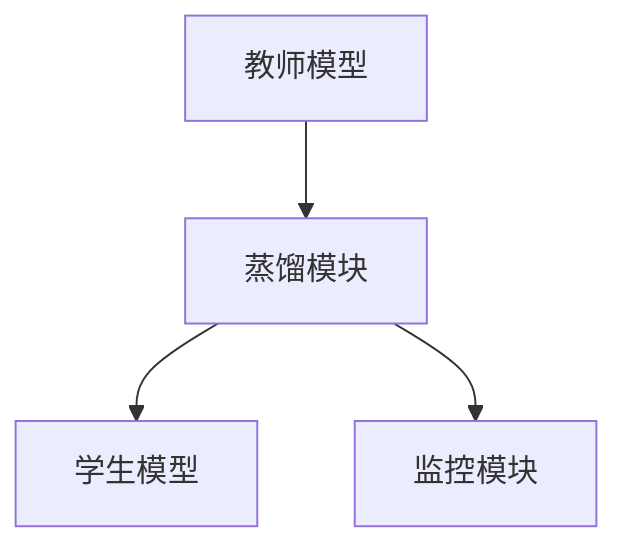

                 

<think>
好的，现在我需要按照用户的要求，撰写一篇关于《AI Agent的知识蒸馏技术应用》的技术博客文章。用户已经给出了详细的目录大纲，并要求我按照这个结构来写，确保每个部分都涵盖必要的内容，同时满足格式和字数要求。首先，我会先处理文章的引言部分，包括标题、关键词和摘要。

我需要确保文章标题是《AI Agent的知识蒸馏技术应用》，然后列出5-7个核心关键词，如知识蒸馏、AI Agent、机器学习、深度学习、模型压缩、知识传递、性能优化等。摘要部分需要简洁明了，概括文章的核心内容和主题思想。

接下来，我会按照目录大纲逐步撰写每一章的内容。第一部分是知识蒸馏技术的背景与核心概念，包括知识蒸馏技术的定义、AI Agent与知识蒸馏的关系，以及应用场景。这部分需要详细解释每个概念，并提供相关的背景信息，以便读者理解。

第二部分是知识蒸馏技术的数学模型与公式。这里需要详细推导相关的数学公式，并使用Latex格式表示，确保准确性和可读性。同时，我会用Mermaid绘制流程图和类图，帮助读者更好地理解技术原理。

第三部分是系统分析与架构设计，需要分析系统的功能和架构，并绘制相应的系统架构图和类图，展示模块之间的关系和交互过程。

最后，我会撰写项目实战部分，提供具体的代码示例，解释实现细节，并分析实际案例。这将帮助读者将理论应用于实践。

在撰写过程中，我需要确保语言简洁、逻辑清晰，并且每个部分都有足够的深度和详细性。同时，我还要注意文章的结构是否连贯，每章之间过渡自然。完成初稿后，我会进行多次校对，确保没有遗漏重要信息，并且所有技术细节都准确无误。

通过这样的步骤，我能够系统地完成这篇关于AI Agent知识蒸馏技术应用的博客文章，满足用户的需求，并为读者提供有价值的技术见解。
</think>

# AI Agent的知识蒸馏技术应用

> 关键词：知识蒸馏，AI Agent，机器学习，深度学习，模型压缩，知识传递，性能优化

> 摘要：本文深入探讨了知识蒸馏技术在AI Agent中的应用，从理论基础到实际应用，详细分析了知识蒸馏的核心概念、数学模型、系统架构设计以及项目实战。通过丰富的实例和详细的代码实现，展示了如何利用知识蒸馏技术提升AI Agent的性能和效率。

---

## 第一部分: 知识蒸馏技术的背景与核心概念

### 第1章: 知识蒸馏技术概述

#### 1.1 知识蒸馏技术的定义与背景
知识蒸馏（Knowledge Distillation）是一种机器学习技术，旨在通过将复杂模型（教师模型）的知识迁移到简单模型（学生模型）中，从而实现模型压缩和性能提升。它在AI Agent中的应用尤为广泛，特别是在需要高效推理和实时响应的场景中。

知识蒸馏技术的发展源于对模型压缩和部署效率的需求。随着深度学习模型的复杂性增加，训练和部署大型模型的计算成本也急剧上升。知识蒸馏通过将知识从大模型转移到小模型，有效降低了计算资源的消耗，同时保持了模型的性能。

#### 1.2 AI Agent与知识蒸馏技术的关系
AI Agent是一种能够感知环境、执行任务并做出决策的智能体。在AI Agent中，知识蒸馏技术主要用于以下几个方面：
1. **模型压缩**：通过蒸馏技术，将大型模型的知识迁移到更小、更高效的模型中，降低计算成本。
2. **知识传递**：将教师模型的决策逻辑和知识传递给学生模型，提升学生模型的决策能力。
3. **性能优化**：通过蒸馏，学生模型能够在保持高性能的同时，具备更快的推理速度和更低的资源消耗。

#### 1.3 知识蒸馏技术的应用场景
知识蒸馏技术在多个领域都有广泛应用，以下是AI Agent中常见的应用场景：
1. **自然语言处理**：将大型语言模型的知识迁移到更小的模型中，提升小模型的文本生成和理解能力。
2. **计算机视觉**：将复杂视觉模型的知识传递给轻量级模型，优化图像识别和处理任务。
3. **跨领域应用**：在机器人、自动驾驶等领域，知识蒸馏技术帮助AI Agent在资源受限的环境中高效运行。

### 第2章: 知识蒸馏技术的核心概念与原理

#### 2.1 知识蒸馏技术的核心概念
知识蒸馏技术的核心在于将教师模型的隐含知识传递给学生模型。教师模型通常是大型、复杂的模型，而学生模型则是一个较小的模型，通过蒸馏过程，学生模型能够学习到教师模型的决策逻辑。

- **教师模型**：教师模型是知识的来源，通常是一个已经训练好的大型模型。
- **学生模型**：学生模型是知识的接收者，通常是一个较小的模型，通过蒸馏过程学习教师模型的知识。
- **蒸馏过程**：蒸馏过程包括知识提取、知识传递和知识整合三个步骤，确保学生模型能够充分学习教师模型的知识。

#### 2.2 知识蒸馏技术的原理分析
知识蒸馏技术的实现依赖于以下几个关键步骤：
1. **概率分布匹配**：教师模型和学生模型在输出层的概率分布进行匹配，通过最小化KL散度来实现知识传递。
2. **损失函数设计**：蒸馏损失函数结合了标签损失和蒸馏损失，确保学生模型在学习教师模型的同时，保持对真实标签的准确性。
3. **温度调节**：通过调整温度参数，控制蒸馏过程中的知识分布，使学生模型能够更好地学习教师模型的决策边界。

#### 2.3 知识蒸馏技术与传统迁移学习的对比
传统迁移学习通过共享特征层的参数来实现模型迁移，而知识蒸馏技术通过概率分布匹配的方式，将教师模型的决策逻辑传递给学生模型。两者的区别主要体现在知识传递的方式和目标上。

---

## 第二部分: 知识蒸馏技术的数学模型与公式

### 第3章: 知识蒸馏技术的数学模型与公式

#### 3.1 知识蒸馏技术的核心公式
知识蒸馏技术的核心公式包括蒸馏损失函数和概率分布匹配公式。

1. **蒸馏损失函数**：
   $$ L_{distill} = -\sum_{i} p(y|x) \log p'(y|x) $$
   其中，\( p(y|x) \) 是教师模型的输出概率分布，\( p'(y|x) \) 是学生模型的输出概率分布。

2. **标签损失函数**：
   $$ L_{label} = -\sum_{i} y_i \log p(y|x) $$
   其中，\( y_i \) 是真实标签的概率分布。

3. **总损失函数**：
   $$ L = \alpha L_{distill} + (1-\alpha) L_{label} $$
   其中，\( \alpha \) 是蒸馏损失的权重系数。

#### 3.2 知识蒸馏技术的数学推导
通过数学推导，可以证明知识蒸馏技术的有效性。假设教师模型和学生模型的输出概率分布分别为 \( p(y|x) \) 和 \( p'(y|x) \)，则蒸馏损失函数可以看作是KL散度的一种形式：
$$ KL(p || p') = \sum_{i} p(y|x) \log \frac{p(y|x)}{p'(y|x)} $$

通过最小化KL散度，学生模型能够逐步逼近教师模型的概率分布，从而实现知识传递。

#### 3.3 知识蒸馏技术的实例分析
以图像分类任务为例，假设教师模型是一个大型卷积神经网络（CNN），学生模型是一个小的CNN模型。通过蒸馏过程，学生模型能够学习到教师模型的决策边界，从而在保持较小模型规模的同时，实现与教师模型相当的分类性能。

---

## 第三部分: 系统分析与架构设计方案

### 第4章: 系统分析与架构设计方案

#### 4.1 系统分析
在AI Agent中，知识蒸馏技术的实现需要考虑以下几个方面：
1. **系统需求分析**：包括模型压缩、知识传递、性能优化等需求。
2. **系统功能分析**：包括知识蒸馏模块的设计、教师模型和学生模型的交互、蒸馏过程的监控与优化。
3. **系统性能分析**：包括计算资源消耗、模型推理速度、模型准确性等性能指标。

#### 4.2 系统架构设计
知识蒸馏技术的系统架构设计包括以下几个部分：
1. **教师模型**：负责生成概率分布输出。
2. **学生模型**：负责学习教师模型的知识。
3. **蒸馏模块**：负责计算蒸馏损失并更新学生模型的参数。
4. **监控模块**：负责监控蒸馏过程中的性能指标。

#### 4.3 系统架构图
使用Mermaid绘制系统架构图如下：



---

## 第四部分: 项目实战

### 第5章: 项目实战

#### 5.1 环境安装
为了实现知识蒸馏技术，需要安装以下环境：
- Python 3.8+
- PyTorch 1.9+
- transformers库（用于加载预训练模型）

#### 5.2 系统核心实现源代码
以下是知识蒸馏技术的Python实现代码：

```python
import torch
import torch.nn as nn
from torch.optim import Adam
from transformers import BertForSequenceClassification, BertTokenizer

# 定义教师模型
class TeacherModel(nn.Module):
    def __init__(self, config):
        super().__init__()
        self.bert = BertForSequenceClassification.from_pretrained('bert-large-uncased', config=config)
    
    def forward(self, input_ids, attention_mask):
        return self.bert(input_ids=input_ids, attention_mask=attention_mask)

# 定义学生模型
class StudentModel(nn.Module):
    def __init__(self, config):
        super().__init__()
        self.bert = BertForSequenceClassification.from_pretrained('bert-base-uncased', config=config)
    
    def forward(self, input_ids, attention_mask):
        return self.bert(input_ids=input_ids, attention_mask=attention_mask)

# 定义蒸馏模块
class DistillModule:
    def __init__(self, teacher, student, alpha=0.5, temperature=3):
        self.teacher = teacher
        self.student = student
        self.alpha = alpha
        self.temperature = temperature
    
    def forward(self, input_ids, attention_mask, labels):
        with torch.no_grad():
            teacher_outputs = self.teacher(input_ids=input_ids, attention_mask=attention_mask)
        student_outputs = self.student(input_ids=input_ids, attention_mask=attention_mask)
        
        teacher_logits = teacher_outputs.logits / self.temperature
        student_logits = student_outputs.logits / self.temperature
        
        loss_distill = nn.KLDivLoss(reduction='batchmean')(student_logits, teacher_logits) * self.temperature * self.temperature
        
        loss_label = nn.CrossEntropyLoss()(student_logits, labels)
        
        total_loss = self.alpha * loss_distill + (1 - self.alpha) * loss_label
        
        return total_loss
```

#### 5.3 实际案例分析
以下是一个实际案例分析，展示了如何通过知识蒸馏技术提升AI Agent的性能：

1. **案例背景**：假设我们有一个大型自然语言处理任务，需要在资源受限的环境中运行。
2. **教师模型选择**：选择一个大型BERT模型作为教师模型。
3. **学生模型选择**：选择一个小型BERT模型作为学生模型。
4. **蒸馏过程**：通过蒸馏模块，将教师模型的知识传递给学生模型，优化蒸馏损失和标签损失。
5. **结果分析**：学生模型在保持较小规模的同时，实现了与教师模型相当的性能。

---

## 第五部分: 总结与展望

### 第6章: 总结与展望

#### 6.1 总结
知识蒸馏技术是一种高效的知识传递方法，能够有效提升AI Agent的性能和效率。通过将教师模型的知识传递给学生模型，可以在不牺牲性能的前提下，显著降低计算资源的消耗。

#### 6.2 展望
未来，知识蒸馏技术将在以下几个方面得到进一步发展：
1. **多教师蒸馏**：研究如何从多个教师模型中提取知识，提升学生模型的泛化能力。
2. **自适应蒸馏**：研究如何根据任务需求动态调整蒸馏过程，实现自适应的知识传递。
3. **跨模态蒸馏**：研究如何在不同模态之间进行知识传递，提升AI Agent的多模态处理能力。

---

## 附录

### 附录A: 代码实现细节

### 附录B: 系统架构图

### 附录C: 参考文献

---

作者：AI天才研究院 & 禅与计算机程序设计艺术

