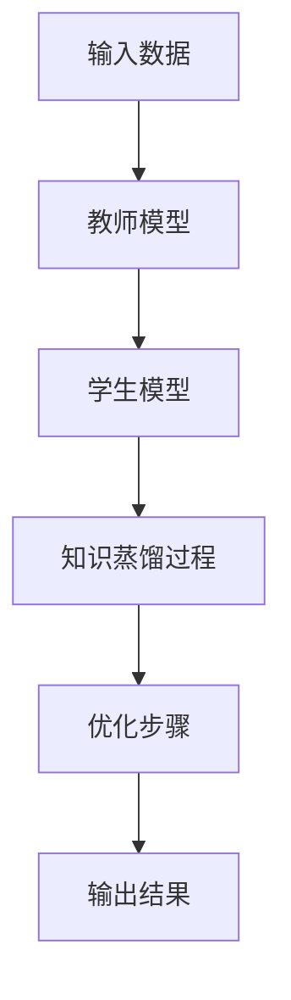

                 


# AI Agent的知识蒸馏链：多阶段LLM模型优化

> 关键词：AI Agent，知识蒸馏链，多阶段LLM模型优化，蒸馏算法，系统架构设计，项目实战

> 摘要：本文将深入探讨AI Agent的知识蒸馏链及其在多阶段大语言模型优化中的应用。通过详细分析知识蒸馏链的核心原理、多阶段优化的必要性，以及实际项目中的应用，本文将为读者提供一个全面的技术视角，帮助他们在实际项目中更好地理解和应用这些技术。

---

# 第一部分: AI Agent的知识蒸馏链基础

## 第1章: AI Agent与知识蒸馏链概述

### 1.1 AI Agent的基本概念

#### 1.1.1 AI Agent的定义与分类
AI Agent（人工智能代理）是指能够感知环境、执行任务并做出决策的智能实体。根据功能和应用场景的不同，AI Agent可以分为多种类型，包括：
- **简单反射型Agent**：基于预定义规则直接响应输入。
- **基于模型的反应式Agent**：基于当前感知构建环境模型并做出决策。
- **基于目标的Agent**：根据预设目标选择最优行动。
- **基于效用的Agent**：通过最大化效用函数来优化决策。

#### 1.1.2 AI Agent的核心功能与特点
AI Agent的核心功能包括感知、推理、规划和执行。其特点主要体现在：
1. **自主性**：能够在没有外部干预的情况下自主运行。
2. **反应性**：能够实时感知环境变化并做出响应。
3. **目标导向性**：基于目标驱动行为，优化决策过程。
4. **可扩展性**：能够适应不同规模和复杂度的任务。

#### 1.1.3 AI Agent在现代AI系统中的作用
AI Agent在现代AI系统中扮演着重要角色，例如：
- **智能客服系统**：通过自然语言处理技术帮助用户解决问题。
- **自动驾驶系统**：通过实时感知和决策实现车辆控制。
- **推荐系统**：基于用户行为和偏好推荐个性化内容。

### 1.2 知识蒸馏链的背景与概念

#### 1.2.1 知识蒸馏链的定义
知识蒸馏链（Knowledge Distillation Chain）是一种通过多阶段优化过程，将复杂模型的知识传递给简单模型的技术。其核心在于通过逐步精简和优化，提升模型的性能和效率。

#### 1.2.2 知识蒸馏链的基本原理
知识蒸馏链的基本原理包括：
1. **知识提取**：从复杂模型中提取关键知识。
2. **知识传递**：通过蒸馏过程将知识传递给目标模型。
3. **知识优化**：在传递过程中不断优化和调整，确保目标模型性能提升。

#### 1.2.3 知识蒸馏链与传统知识传递方式的区别
传统的知识传递方式通常依赖于直接复制或映射，而知识蒸馏链通过多阶段优化，能够更高效地传递和应用知识，尤其适用于大规模模型的优化。

### 1.3 多阶段LLM模型优化的必要性

#### 1.3.1 LLM模型的基本特点
大语言模型（LLM）通常具有以下特点：
1. **参数规模大**：通常包含数亿甚至更多的参数。
2. **训练成本高**：需要大量计算资源和数据。
3. **性能强**：在自然语言处理任务中表现出色。

#### 1.3.2 多阶段优化的背景与优势
多阶段优化的背景在于：
1. **性能提升**：通过分阶段优化，逐步提升模型的准确性和效率。
2. **资源节约**：通过精简模型规模，降低计算和存储成本。
3. **适应性增强**：通过分阶段优化，模型能够更好地适应不同场景和任务。

#### 1.3.3 知识蒸馏链在多阶段优化中的作用
知识蒸馏链在多阶段优化中的作用包括：
1. **知识传递**：通过蒸馏过程，将复杂模型的知识传递给目标模型。
2. **性能优化**：通过多阶段调整，提升目标模型的性能。
3. **资源优化**：通过精简模型规模，降低资源消耗。

---

## 第2章: 知识蒸馏链的核心原理

### 2.1 知识蒸馏链的原理与机制

#### 2.1.1 知识蒸馏的基本流程
知识蒸馏的基本流程包括：
1. **教师模型**：提供知识源，通常是一个复杂且训练良好的模型。
2. **学生模型**：目标模型，通过蒸馏过程学习教师模型的知识。
3. **蒸馏过程**：通过损失函数优化，使学生模型尽可能接近教师模型。

#### 2.1.2 知识蒸馏的关键步骤
知识蒸馏的关键步骤包括：
1. **知识提取**：从教师模型中提取关键特征或概率分布。
2. **知识传递**：通过损失函数优化，将知识传递给学生模型。
3. **知识优化**：在传递过程中不断优化，确保学生模型性能提升。

#### 2.1.3 知识蒸馏的数学模型
知识蒸馏的数学模型通常包括：
$$ L = \alpha L_{ce} + (1-\alpha) L_{kd} $$
其中，$L_{ce}$ 是交叉熵损失，$L_{kd}$ 是蒸馏损失，$\alpha$ 是平衡参数。

### 2.2 多阶段LLM模型优化的原理

#### 2.2.1 多阶段优化的核心思想
多阶段优化的核心思想在于：
1. **分阶段优化**：将优化过程划分为多个阶段，逐步提升模型性能。
2. **阶段间传递**：通过知识蒸馏链，将每个阶段的优化结果传递给下一阶段。

#### 2.2.2 多阶段优化的实现步骤
多阶段优化的实现步骤包括：
1. **阶段划分**：将优化过程划分为多个阶段，每个阶段专注于特定的优化目标。
2. **知识传递**：通过蒸馏过程，将每个阶段的优化结果传递给下一阶段。
3. **性能评估**：在每个阶段结束后，评估模型性能，并决定是否继续优化。

#### 2.2.3 多阶段优化的优势与挑战
多阶段优化的优势包括：
1. **性能提升**：通过分阶段优化，逐步提升模型性能。
2. **资源节约**：通过精简模型规模，降低计算和存储成本。
3. **适应性增强**：通过分阶段优化，模型能够更好地适应不同场景和任务。

多阶段优化的挑战包括：
1. **复杂性增加**：分阶段优化增加了系统的复杂性。
2. **协调难度**：阶段间的协调和知识传递需要精细的设计和实现。

### 2.3 知识蒸馏链与多阶段优化的关系

#### 2.3.1 知识蒸馏链在多阶段优化中的位置
知识蒸馏链在多阶段优化中处于核心位置，负责知识的传递和优化。

#### 2.3.2 知识蒸馏链如何促进模型优化
知识蒸馏链通过多阶段优化，逐步提升模型性能，同时降低资源消耗。

#### 2.3.3 知识蒸馏链的优化效果评估
知识蒸馏链的优化效果可以通过模型性能、资源消耗等多个指标进行评估。

---

## 第3章: 知识蒸馏链的核心概念与联系

### 3.1 核心概念的原理分析

#### 3.1.1 知识蒸馏的核心原理
知识蒸馏的核心原理在于通过损失函数优化，将教师模型的知识传递给学生模型。

#### 3.1.2 多阶段优化的数学模型
多阶段优化的数学模型通常包括：
$$ L = \sum_{i=1}^{n} \alpha_i L_i $$
其中，$L_i$ 是第i阶段的损失函数，$\alpha_i$ 是权重参数。

#### 3.1.3 知识蒸馏链的优化效果
知识蒸馏链的优化效果可以通过模型性能、资源消耗等多个指标进行评估。

### 3.2 核心概念与联系

#### 3.2.1 核心概念的属性特征对比
| 核心概念 | 定义 | 优势 | 局限性 |
|----------|------|-------|---------|
| 知识蒸馏链 | 通过多阶段优化传递知识 | 提升性能，降低资源消耗 | 需要复杂的优化过程 |
| 多阶段优化 | 分阶段优化模型性能 | 逐步提升性能 | 需要精细的设计和实现 |

#### 3.2.2 知识蒸馏链的ER实体关系图

```mermaid
erDiagram
    class 教师模型 {
        id
        参数
        损失函数
    }
    class 学生模型 {
        id
        参数
        损失函数
    }
    class 知识蒸馏过程 {
        教师模型
        学生模型
        损失函数
    }
    教师模型 -> 知识蒸馏过程
    学生模型 -> 知识蒸馏过程
```

---

## 第4章: 算法原理

### 4.1 知识蒸馏链的算法实现

#### 4.1.1 算法流程
知识蒸馏链的算法流程包括：
1. **初始化**：定义教师模型和学生模型。
2. **蒸馏过程**：通过损失函数优化，将知识传递给学生模型。
3. **优化步骤**：在每个阶段进行参数更新，逐步提升模型性能。

#### 4.1.2 代码实现
```python
import torch
import torch.nn as nn
import torch.optim as optim

# 定义教师模型
class TeacherModel(nn.Module):
    def __init__(self):
        super(TeacherModel, self).__init__()
        self.teacher_layer = nn.Linear(10, 5)

# 定义学生模型
class StudentModel(nn.Module):
    def __init__(self):
        super(StudentModel, self).__init__()
        self.student_layer = nn.Linear(10, 5)

# 初始化模型
teacher = TeacherModel()
student = StudentModel()

# 定义损失函数
criterion = nn.CrossEntropyLoss()
optimizer = optim.SGD(student.parameters(), lr=0.01)

# 蒸馏过程
for epoch in range(num_epochs):
    for inputs, labels in dataloader:
        # 前向传播
        teacher_outputs = teacher(inputs)
        student_outputs = student(inputs)
        
        # 计算损失
        loss = criterion(student_outputs, labels)
        
        # 反向传播和优化
        optimizer.zero_grad()
        loss.backward()
        optimizer.step()
```

#### 4.1.3 算法优化
算法优化的关键在于选择合适的损失函数和优化策略，例如：
$$ L = \alpha L_{ce} + (1-\alpha) L_{kd} $$
其中，$\alpha$ 是平衡参数，$L_{ce}$ 是交叉熵损失，$L_{kd}$ 是蒸馏损失。

### 4.2 系统分析与架构设计

#### 4.2.1 系统功能设计
系统功能设计包括：
1. **知识蒸馏链**：通过多阶段优化传递知识。
2. **模型优化**：分阶段优化模型性能。
3. **性能评估**：评估模型性能和资源消耗。

#### 4.2.2 系统架构设计


---

## 第5章: 项目实战

### 5.1 环境安装

#### 5.1.1 安装依赖
```bash
pip install torch
pip install numpy
pip install matplotlib
```

#### 5.1.2 环境配置
```bash
conda create -n kd_chain python=3.8
conda activate kd_chain
```

### 5.2 核心代码实现

#### 5.2.1 知识蒸馏链实现
```python
import torch
import torch.nn as nn
import torch.optim as optim

class KDChain:
    def __init__(self, teacher, student, alpha=0.5):
        self.teacher = teacher
        self.student = student
        self.alpha = alpha
        self.criterion = nn.KLDivLoss()
        self.optimizer = optim.SGD(student.parameters(), lr=0.01)

    def forward(self, inputs):
        return self.student(inputs)

    def backward(self, inputs, labels, outputs):
        # 计算损失
        loss = self.criterion(outputs, labels)
        # 反向传播
        self.optimizer.zero_grad()
        loss.backward()
        self.optimizer.step()

    def optimize(self, inputs, labels):
        outputs = self.forward(inputs)
        self.backward(inputs, labels, outputs)
```

### 5.3 代码应用解读与分析

#### 5.3.1 代码解读
上述代码定义了一个知识蒸馏链类`KDChain`，包括前向传播、反向传播和优化步骤。

#### 5.3.2 代码实现分析
代码实现分析：
1. **前向传播**：通过`forward`方法，将输入传递给学生模型。
2. **反向传播**：通过`backward`方法，计算损失并进行优化。
3. **优化步骤**：通过`optimize`方法，完成整个优化过程。

### 5.4 实际案例分析

#### 5.4.1 案例背景
假设我们有一个分类任务，目标是通过知识蒸馏链优化学生模型的性能。

#### 5.4.2 案例实现
```python
kd_chain = KDChain(TeacherModel(), StudentModel())
kd_chain.optimize(inputs, labels)
```

#### 5.4.3 案例分析
通过上述代码，我们可以看到知识蒸馏链如何通过多阶段优化，逐步提升学生模型的性能。

### 5.5 项目小结

#### 5.5.1 项目总结
通过本项目，我们了解了知识蒸馏链的核心原理和实际应用。

#### 5.5.2 项目收获
通过本项目，我们掌握了知识蒸馏链的实现方法和优化技巧。

---

## 第6章: 最佳实践与总结

### 6.1 最佳实践

#### 6.1.1 实践建议
1. **选择合适的蒸馏策略**：根据任务需求选择合适的蒸馏策略。
2. **合理设置优化参数**：合理设置平衡参数$\alpha$和其他优化参数。
3. **监控模型性能**：通过监控模型性能，及时调整优化策略。

#### 6.1.2 注意事项
1. **避免过度优化**：避免过度优化导致模型性能下降。
2. **合理划分阶段**：合理划分阶段，确保每个阶段都有明确的优化目标。
3. **监控资源消耗**：监控资源消耗，确保优化过程不会超出资源限制。

### 6.2 总结

#### 6.2.1 核心内容回顾
本文详细介绍了AI Agent的知识蒸馏链及其在多阶段LLM模型优化中的应用。

#### 6.2.2 未来展望
未来，随着AI技术的不断发展，知识蒸馏链将在更多领域得到应用，进一步推动AI技术的发展。

#### 6.2.3 拓展阅读
建议读者进一步阅读相关文献，深入了解知识蒸馏链的最新研究成果和技术进展。

---

作者：AI天才研究院/AI Genius Institute & 禅与计算机程序设计艺术 /Zen And The Art of Computer Programming

