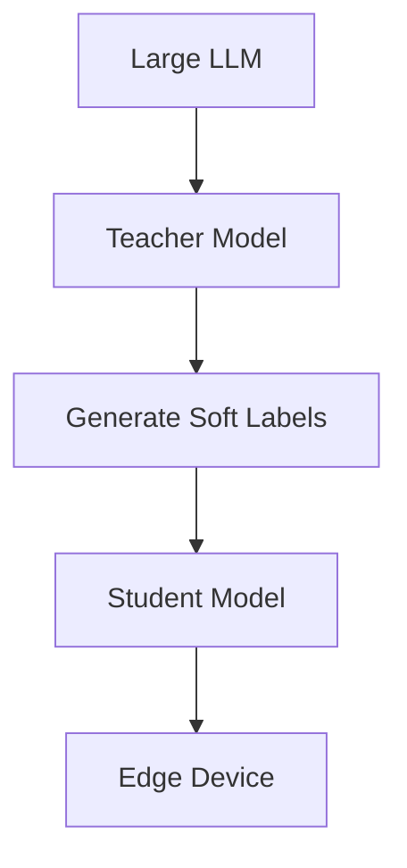
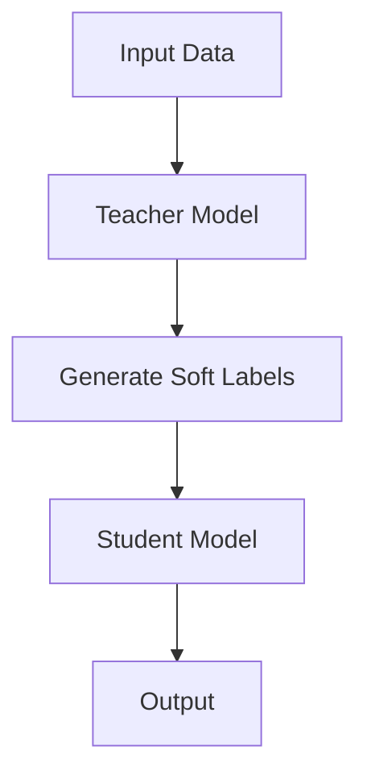
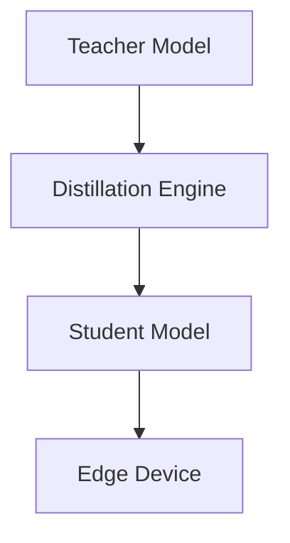

                 

<think>
嗯，用户希望我撰写一篇关于AI Agent知识蒸馏的技术博客文章，并且已经提供了一个详细的目录结构。我需要按照这个结构，逐步分析每个部分，确保内容详实，逻辑清晰。

首先，我需要理解知识蒸馏的背景和基本概念。知识蒸馏是一种将大型模型的知识迁移到小型模型的技术，这对于边缘设备部署非常重要。我应该先介绍知识蒸馏的定义、目的，以及为什么需要它。

接下来，我得详细讲解知识蒸馏的核心原理，包括教师模型和学生模型的关系，以及如何通过软标签等方法进行知识传递。这部分可能需要一些数学公式来说明，比如蒸馏损失函数。

然后，我需要讨论如何将知识蒸馏应用于AI Agent，特别是在边缘设备中的实现。这涉及到系统架构设计，可能需要用mermaid图来展示教师模型和学生模型的交互。

在算法部分，我需要详细分析蒸馏算法的步骤，可能用mermaid流程图来展示整个过程，并提供Python代码示例，帮助读者理解实现细节。

系统设计章节需要涵盖边缘设备的架构、通信协议、数据预处理和模型部署，这部分可能需要更多的mermaid图来展示系统结构。

项目实战部分，我需要提供具体的代码实现，包括环境配置、核心代码和案例分析，帮助读者实际操作。最后，总结整个过程，并给出一些注意事项和未来的研究方向。

总的来说，我需要确保每个章节都包含足够的细节和例子，使读者能够理解并应用知识蒸馏技术。同时，要注意文章的结构和逻辑，确保内容连贯，符合技术博客的风格。
</think>

# AI Agent的知识蒸馏：从大型LLM到边缘设备模型

> 关键词：知识蒸馏，AI Agent，大型语言模型，边缘设备，模型压缩，深度学习

> 摘要：  
本文深入探讨了AI Agent的知识蒸馏技术，从大型语言模型（LLM）到边缘设备模型的迁移与优化。通过分析知识蒸馏的核心原理、算法实现、系统设计和实际应用，本文为读者提供了从理论到实践的全面指导。我们还将讨论如何在边缘设备上高效部署AI Agent，以及在实际应用中需要注意的关键问题和最佳实践。

---

# 第一部分: AI Agent的知识蒸馏背景与基础

## 第1章: 知识蒸馏与AI Agent概述

### 1.1 知识蒸馏的概念与背景

#### 1.1.1 知识蒸馏的定义  
知识蒸馏（Knowledge Distillation）是一种将大型模型的知识迁移到小型模型的技术。通过模拟“教师”与“学生”的关系，教师模型将复杂的知识以更简洁的形式传递给学生模型，从而实现模型的压缩与优化。

#### 1.1.2 大型LLM模型的局限性  
大型语言模型（如GPT-4、PaLM）在性能和准确性上表现出色，但在边缘设备（如物联网设备、移动终端）上的部署面临以下挑战：  
- **计算资源不足**：边缘设备的计算能力有限，无法直接运行复杂的大型模型。  
- **存储限制**：大型模型的参数量巨大，难以在边缘设备上存储。  
- **延迟问题**：频繁与云端通信会导致延迟增加，影响用户体验。  

#### 1.1.3 知识蒸馏的必要性与应用场景  
知识蒸馏通过将大型模型的知识迁移到小型模型，解决了上述问题。其应用场景包括：  
- 边缘设备上的实时推理  
- 低带宽环境下的本地化服务  
- 高效、低成本的模型部署  

---

### 1.2 AI Agent的发展与挑战

#### 1.2.1 AI Agent的基本概念  
AI Agent是一种能够感知环境、执行任务并做出决策的智能实体。它可以是一个软件程序，也可以是一个物理设备，通过与用户交互或与其他系统协作完成特定目标。

#### 1.2.2 大型LLM在AI Agent中的作用  
大型LLM为AI Agent提供了强大的自然语言处理能力，使其能够理解用户意图、生成自然语言回复，并执行复杂任务。然而，这些模型通常运行在云端，导致边缘设备上的AI Agent面临性能瓶颈。

#### 1.2.3 边缘设备中的AI Agent需求  
边缘设备上的AI Agent需要满足以下需求：  
- **实时性**：快速响应用户的请求。  
- **本地化处理**：减少对云端的依赖，降低延迟。  
- **资源效率**：在计算和存储资源有限的情况下运行。  

---

### 1.3 知识蒸馏在AI Agent中的应用

#### 1.3.1 知识蒸馏的目标  
通过知识蒸馏，将大型LLM的知识迁移到边缘设备上的小型模型，使其具备与原模型相似的性能，同时显著降低计算和存储需求。

#### 1.3.2 知识蒸馏的核心问题  
- **如何提取教师模型的知识？**  
- **如何设计学生模型以高效学习教师的知识？**  
- **如何优化蒸馏过程以提高性能？**

#### 1.3.3 知识蒸馏的边界与外延  
知识蒸馏不仅适用于语言模型，还可以扩展到其他类型的模型（如视觉模型）。此外，蒸馏过程可以与模型压缩、量化等技术结合，进一步优化模型性能。

---

## 第2章: 知识蒸馏的核心概念与原理

### 2.1 知识蒸馏的基本原理

#### 2.1.1 知识蒸馏的定义  
知识蒸馏通过将教师模型的输出（软标签）传递给学生模型，指导其学习，从而实现知识的迁移。

#### 2.1.2 知识蒸馏的关键要素  
- **教师模型**：通常是一个大型、复杂的模型，具有较高的准确性和丰富的知识。  
- **学生模型**：一个较小的模型，目标是通过蒸馏过程学习教师的知识。  
- **蒸馏损失函数**：衡量学生模型输出与教师模型输出的差异，用于优化学生模型。  

#### 2.1.3 知识蒸馏的数学模型  
蒸馏损失函数可以表示为：  
$$ \mathcal{L}_{distill} = \lambda \cdot \mathcal{L}_{KL}(P, Q) $$  
其中，$\lambda$ 是蒸馏温度，$\mathcal{L}_{KL}$ 是KL散度，$P$是教师模型的输出概率分布，$Q$是学生模型的输出概率分布。

---

### 2.2 知识蒸馏的核心概念对比

#### 2.2.1 知识蒸馏与模型压缩的对比  
| 特性 | 知识蒸馏 | 模型压缩 |  
|------|----------|----------|  
| 目标 | 将教师的知识迁移到学生模型 | 减少模型参数，降低计算需求 |  
| 方法 | 使用软标签指导学习 | 剪枝、量化、知识蒸馏 |  
| 适用场景 | 需要保持模型性能的前提下优化部署 | 适用于所有模型，尤其是边缘设备 |  

#### 2.2.2 知识蒸馏与模型量化的关系  
知识蒸馏与模型量化可以结合使用：  
- 先通过蒸馏将知识迁移到小型模型，再通过量化进一步减少模型大小。  

#### 2.2.3 知识蒸馏与模型剪枝的联系  
知识蒸馏可以与模型剪枝结合：  
- 剪枝减少冗余参数，蒸馏优化剩余参数的性能。

---

### 2.3 知识蒸馏的实体关系图



---

## 第3章: 知识蒸馏的算法原理

### 3.1 知识蒸馏算法的直觉与动机

#### 3.1.1 知识蒸馏的直觉  
通过教师模型的软标签，学生模型可以学习到更细粒度的信息，而不仅仅是分类结果。这使得学生模型能够更好地捕捉教师模型的决策边界。

#### 3.1.2 知识蒸馏的动机  
- 提高学生模型的性能  
- 减少学生模型的计算需求  
- 降低学生模型的存储开销  

---

### 3.2 知识蒸馏算法的流程

#### 3.2.1 算法步骤  
1. **预训练教师模型**：训练一个大型模型作为教师。  
2. **初始化学生模型**：设计一个小型模型作为学生。  
3. **蒸馏过程**：  
   - 输入一批数据，获取教师模型的软标签。  
   - 使用软标签指导学生模型的训练，优化蒸馏损失函数。  
4. **蒸馏后微调**：在真实标签上对学生模型进行微调，以适应实际任务。

#### 3.2.2 算法流程图  



---

### 3.3 知识蒸馏算法的实现细节

#### 3.3.1 蒸馏温度的设置  
蒸馏温度 $\lambda$ 是知识蒸馏的关键超参数。通常，$\lambda$ 在0.5到2之间，较大的温度值会增加软标签的不确定性，较小的温度值会更接近真实标签。

#### 3.3.2 软标签的计算  
教师模型的输出概率分布可以通过Softmax函数计算得到：  
$$ P_i = \text{softmax}(\frac{Z_i}{\lambda}) $$  
其中，$Z_i$ 是教师模型的 logits，$\lambda$ 是蒸馏温度。

---

## 第4章: 知识蒸馏在AI Agent中的应用

### 4.1 知识蒸馏与AI Agent的结合

#### 4.1.1 边缘设备上的AI Agent需求  
边缘设备需要本地化的AI推理能力，知识蒸馏是实现这一目标的关键技术。

#### 4.1.2 知识蒸馏在AI Agent中的具体应用  
- **对话生成**：通过蒸馏将大型LLM的对话能力迁移到边缘设备。  
- **任务执行**：将复杂任务的决策逻辑迁移到边缘设备。  
- **实时推理**：在边缘设备上实现低延迟的实时推理。

---

### 4.2 知识蒸馏的优化与挑战

#### 4.2.1 知识蒸馏的优化方法  
- **多教师蒸馏**：使用多个教师模型进行蒸馏，提高学生模型的泛化能力。  
- **动态蒸馏**：根据输入数据的分布动态调整蒸馏温度。  
- **混合蒸馏**：结合软标签和硬标签进行蒸馏，平衡多样性和准确性。

#### 4.2.2 知识蒸馏的挑战  
- **性能损失**：蒸馏后模型的性能可能低于原模型。  
- **计算效率**：蒸馏过程可能需要大量的计算资源。  
- **模型适应性**：不同任务可能需要不同的蒸馏策略。

---

## 第5章: 知识蒸馏的系统设计与实现

### 5.1 系统架构设计

#### 5.1.1 系统功能模块  
- **教师模型**：提供软标签。  
- **学生模型**：学习教师的知识。  
- **蒸馏引擎**：协调蒸馏过程。  
- **边缘设备**：部署优化后的模型。

#### 5.1.2 系统架构图  



---

### 5.2 系统实现细节

#### 5.2.1 教师模型的选择  
教师模型通常是大型语言模型（如GPT-3、PaLM）。选择教师模型时，需考虑其性能、规模和适用场景。

#### 5.2.2 学生模型的设计  
学生模型通常是轻量级的Transformer或基于LSTM的模型。设计时需考虑模型的参数数量、计算效率和部署需求。

#### 5.2.3 蒸馏引擎的实现  
蒸馏引擎负责协调教师模型和学生模型的交互，优化蒸馏过程。通常采用分布式训练或在线微调的方式。

---

## 第6章: 知识蒸馏的项目实战

### 6.1 环境配置与依赖管理

#### 6.1.1 环境安装  
- **Python 3.8+**  
- **TensorFlow/PyTorch**  
- **Hugging Face Transformers**  

#### 6.1.2 代码实现  
```python
import torch
from torch import nn
from torch.nn import functional as F

class Distillation(nn.Module):
    def __init__(self, teacher, student, temp=1.0):
        super(Distillation, self).__init__()
        self.teacher = teacher
        self.student = student
        self.temp = temp

    def forward(self, input):
        with torch.no_grad():
            teacher_logits = self.teacher(input)
        student_logits = self.student(input)
        soft_labels = F.softmax(teacher_logits / self.temp, dim=-1)
        loss = F.kl_div(F.log_softmax(student_logits, dim=-1), soft_labels, reduction='batchmean')
        return loss
```

---

### 6.2 核心代码实现

#### 6.2.1 蒸馏过程的实现  
```python
def distillation_train(model, optimizer, distillation_loss_fn, epochs=100):
    for epoch in range(epochs):
        for batch in dataloader:
            optimizer.zero_grad()
            loss = distillation_loss_fn(batch)
            total_loss += loss.item()
            optimizer.step()
```

#### 6.2.2 模型微调的实现  
```python
def fine_tuning(model, optimizer, criterion, dataloader, epochs=10):
    for epoch in range(epochs):
        for batch in dataloader:
            optimizer.zero_grad()
            outputs = model(batch)
            loss = criterion(outputs, labels)
            total_loss += loss.item()
            optimizer.step()
```

---

### 6.3 实际案例分析

#### 6.3.1 案例背景  
假设我们需要将一个大型语言模型迁移到边缘设备上的小型模型，用于对话生成任务。

#### 6.3.2 模型训练与评估  
- **训练数据**：准备一批对话数据。  
- **蒸馏过程**：使用教师模型生成软标签，训练学生模型。  
- **微调过程**：在真实标签上对学生模型进行微调。  
- **评估指标**：BLEU分数、困惑度（Perplexity）。  

---

## 第7章: 总结与展望

### 7.1 本章小结  
知识蒸馏是一种高效的技术，能够将大型语言模型的知识迁移到边缘设备上的小型模型。通过优化蒸馏过程，可以在保证性能的前提下显著降低计算和存储需求。

### 7.2 未来研究方向  
- **多教师蒸馏**：研究如何利用多个教师模型进行知识蒸馏。  
- **动态蒸馏**：探索动态调整蒸馏温度的方法。  
- **混合蒸馏**：结合软标签和硬标签进行蒸馏。  

---

## 附录: 工具与代码参考

### 附录A: 工具安装指南  
- **Python**：https://www.python.org/  
- **TensorFlow**：https://tensorflow.org/  
- **PyTorch**：https://pytorch.org/  
- **Hugging Face Transformers**：https://huggingface.co/transformers  

### 附录B: 核心代码参考  
```python
import torch
import torch.nn as nn
from torch.nn import functional as F

class Distillation(nn.Module):
    def __init__(self, teacher, student, temp=1.0):
        super(Distillation, self).__init__()
        self.teacher = teacher
        self.student = student
        self.temp = temp

    def forward(self, input):
        with torch.no_grad():
            teacher_logits = self.teacher(input)
        student_logits = self.student(input)
        soft_labels = F.softmax(teacher_logits / self.temp, dim=-1)
        loss = F.kl_div(F.log_softmax(student_logits, dim=-1), soft_labels, reduction='batchmean')
        return loss
```

---

## 作者：AI天才研究院/AI Genius Institute & 禅与计算机程序设计艺术 /Zen And The Art of Computer Programming

