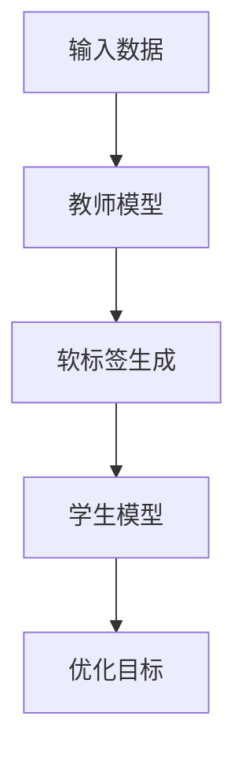
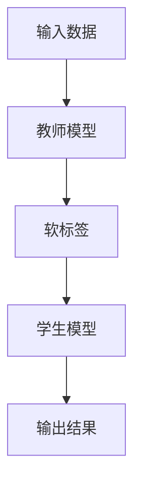

                 


# AI Agent的知识蒸馏：从大模型到轻量级模型

**关键词**：AI Agent, 知识蒸馏, 大模型, 轻量级模型, 模型压缩, 系统架构

**摘要**：  
随着AI Agent技术的快速发展，大模型在实际应用中面临着计算复杂度高、资源消耗大等挑战。知识蒸馏作为一种有效的模型轻量化技术，能够将大模型的知识迁移到轻量级模型中，从而在保证性能的同时降低计算成本。本文将从知识蒸馏的基本概念出发，深入探讨其在AI Agent中的应用原理、技术实现、系统设计及实际案例，最终为读者提供一套完整的从大模型到轻量级模型的知识蒸馏解决方案。

---

# 第1章: 知识蒸馏的基本概念与背景

## 1.1 知识蒸馏的定义与核心概念

### 1.1.1 知识蒸馏的定义
知识蒸馏（Knowledge Distillation）是一种通过将大型复杂模型（教师模型）的知识迁移到小型简单模型（学生模型）中的技术。其核心思想是将教师模型的预测概率分布作为软标签，引导学生模型进行学习，从而在保持性能的同时减少模型的复杂性。

### 1.1.2 知识蒸馏的核心要素
- **教师模型**：通常是一个已经训练好的大型模型，具有较高的准确性和丰富的特征表示能力。
- **学生模型**：一个小型模型，通过蒸馏过程学习教师模型的知识。
- **软标签**：教师模型输出的概率分布，用于指导学生模型的学习。
- **蒸馏损失**：衡量学生模型输出与教师模型输出之间差异的损失函数。

### 1.1.3 知识蒸馏与AI Agent的关系
AI Agent需要在复杂环境中实时决策，而大模型的计算复杂度限制了其在资源受限场景中的应用。知识蒸馏通过将大模型的知识迁移到轻量级模型中，使得AI Agent能够在低资源环境下高效运行。

---

## 1.2 AI Agent的定义与特点

### 1.2.1 AI Agent的基本概念
AI Agent是一种能够感知环境、自主决策并执行任务的智能实体。它可以在多种场景中与用户交互，完成信息处理、决策支持等任务。

### 1.2.2 AI Agent的核心功能
- **感知环境**：通过传感器或数据输入获取环境信息。
- **决策推理**：基于感知信息进行推理和决策。
- **执行任务**：根据决策结果执行具体操作。

### 1.2.3 AI Agent与传统AI的区别
AI Agent具有更强的自主性和适应性，能够根据环境动态调整行为，而传统AI更多是基于规则的静态系统。

---

## 1.3 大模型的挑战与轻量化需求

### 1.3.1 大模型的计算复杂度问题
大模型通常包含 billions数量级的参数，导致计算资源消耗巨大，难以在边缘设备上实时运行。

### 1.3.2 大模型的部署与应用限制
- 部署成本高：需要高性能计算资源。
- 部署周期长：模型训练和部署复杂度高。
- 部署场景受限：难以在资源受限的环境中使用。

### 1.3.3 轻量级模型的必要性
轻量级模型能够在资源受限的环境中高效运行，适用于边缘计算、移动端应用等场景。

---

## 1.4 知识蒸馏的意义与应用前景

### 1.4.1 知识蒸馏在AI Agent中的作用
- **降低计算成本**：通过蒸馏技术，将大模型的知识迁移到轻量级模型中。
- **提升部署效率**：轻量级模型更易于部署和维护。
- **扩展应用场景**：使得AI Agent能够在更多场景中应用。

### 1.4.2 知识蒸馏的应用场景
- **边缘计算**：在边缘设备上运行轻量级模型。
- **移动端应用**：优化移动设备上的AI性能。
- **实时应用**：在需要快速响应的场景中使用轻量级模型。

### 1.4.3 知识蒸馏的未来发展趋势
- **多模态蒸馏**：结合文本、图像等多种模态的信息进行蒸馏。
- **动态蒸馏**：根据任务需求动态调整蒸馏过程。
- **跨模型蒸馏**：在不同类型模型之间进行知识迁移。

---

## 1.5 本章小结
本章从知识蒸馏的基本概念出发，介绍了AI Agent的定义与特点，并分析了大模型在实际应用中的挑战与轻量化需求。知识蒸馏作为一种有效的轻量化技术，为AI Agent的应用提供了新的可能性。

---

# 第2章: 知识蒸馏的核心原理

## 2.1 知识蒸馏的基本原理

### 2.1.1 知识蒸馏的定义
知识蒸馏通过将教师模型的输出作为软标签，引导学生模型进行学习，从而实现知识迁移。

### 2.1.2 知识蒸馏的实现过程
1. **教师模型输出**：教师模型对输入数据进行预测，输出概率分布。
2. **软标签生成**：将教师模型的输出概率分布作为软标签。
3. **学生模型学习**：学生模型通过最小化其输出与软标签之间的差异，学习教师模型的知识。

### 2.1.3 知识蒸馏的关键技术
- **软标签设计**：如何设计有效的软标签以最大化知识转移。
- **蒸馏损失函数**：衡量学生模型与教师模型输出差异的损失函数。
- **蒸馏温度**：通过调整温度参数，控制软标签的分布特性。

---

## 2.2 知识蒸馏的核心概念对比

### 2.2.1 知识蒸馏与模型压缩的区别
- 知识蒸馏通过知识转移实现模型轻量化。
- 模型压缩通过剪枝、量化等技术直接减少模型参数。

### 2.2.2 知识蒸馏与模型剪枝的联系
- 知识蒸馏可以与模型剪枝结合使用，进一步优化模型性能。

### 2.2.3 知识蒸馏与模型量化的关系
- 知识蒸馏通过知识转移，降低量化后的性能损失。

---

## 2.3 知识蒸馏的数学模型与公式

### 2.3.1 知识蒸馏的损失函数
$$
L = \alpha L_{\text{CE}} + (1-\alpha) L_{\text{KL}}
$$

其中：
- $L_{\text{CE}}$ 是交叉熵损失。
- $L_{\text{KL}}$ 是KL散度损失。
- $\alpha$ 是平衡系数，控制两种损失的权重。

### 2.3.2 知识蒸馏的具体实现
教师模型输出软标签：
$$
P(y|x) = \text{softmax}(\frac{f(x)}{T})
$$

学生模型输出：
$$
Q(y|x) = \text{softmax}(g(x))
$$

蒸馏损失：
$$
L_{\text{KL}} = \text{KL}(P || Q)
$$

---

## 2.4 本章小结
本章详细讲解了知识蒸馏的核心原理，包括其实现过程、关键技术和数学模型。通过对比知识蒸馏与其他模型轻量化技术的区别与联系，进一步加深了对知识蒸馏的理解。

---

# 第3章: 大模型压缩技术

## 3.1 模型剪枝技术

### 3.1.1 模型剪枝的定义
模型剪枝通过移除模型中冗余的参数或神经元，减少模型的复杂度。

### 3.1.2 模型剪枝的具体实现
1. **计算模型参数的重要性**：通过梯度或特征重要性评估参数的价值。
2. **移除低重要性参数**：删除对模型性能贡献较小的参数。

### 3.1.3 模型剪枝的优缺点
- 优点：显著减少模型参数，提升运行效率。
- 缺点：可能导致模型性能下降，需要重新训练剪枝后的模型。

---

## 3.2 参数量化技术

### 3.2.1 参数量化的定义
参数量化通过将模型参数量化到较低的位数（如8位或4位整数），减少存储和计算开销。

### 3.2.2 参数量化的实现步骤
1. **参数训练**：训练一个高精度模型。
2. **参数量化**：将模型参数量化到目标位数。
3. **模型微调**：对量化后的模型进行微调，恢复性能。

### 3.2.3 参数量化的优缺点
- 优点：显著减少存储空间，提升计算速度。
- 缺点：可能引入精度损失，影响模型性能。

---

## 3.3 模型蒸馏技术

### 3.3.1 模型蒸馏的定义
模型蒸馏通过将教师模型的知识迁移到学生模型中，实现模型轻量化。

### 3.3.2 模型蒸馏的具体实现
1. **教师模型输出**：教师模型对输入数据进行预测，输出软标签。
2. **学生模型学习**：学生模型通过最小化其输出与软标签之间的差异，学习教师模型的知识。

### 3.3.3 模型蒸馏的优缺点
- 优点：能够保持较高的模型性能，同时显著减少模型复杂度。
- 缺点：需要教师模型的支持，增加训练成本。

---

## 3.4 本章小结
本章介绍了几种大模型压缩技术，包括模型剪枝、参数量化和模型蒸馏。这些技术能够有效降低模型的复杂度，提升其在资源受限场景中的应用性能。

---

# 第4章: 轻量级模型的设计

## 4.1 模型架构设计

### 4.1.1 模型架构设计的原则
- **简洁性**：减少模型的复杂度，降低计算开销。
- **有效性**：在保证性能的前提下，优化模型结构。

### 4.1.2 模型架构设计的具体步骤
1. **需求分析**：明确模型的应用场景和性能要求。
2. **架构选择**：选择适合目标场景的模型结构。
3. **参数优化**：通过训练和调优，优化模型性能。

---

## 4.2 模型优化策略

### 4.2.1 参数剪枝优化
通过剪枝技术移除冗余的参数，减少模型复杂度。

### 4.2.2 参数量化优化
通过量化技术降低参数的存储和计算开销。

### 4.2.3 知识蒸馏优化
通过蒸馏技术将教师模型的知识迁移到轻量级模型中。

---

## 4.3 模型性能评估

### 4.3.1 性能评估指标
- **准确率**：模型在测试集上的准确率。
- **计算速度**：模型在特定硬件上的推理速度。
- **资源消耗**：模型的内存占用和计算开销。

### 4.3.2 性能评估方法
- **基准测试**：将轻量级模型与大模型进行对比。
- **实际应用测试**：在真实场景中评估模型性能。

---

## 4.4 本章小结
本章详细讲解了轻量级模型的设计原则、优化策略和性能评估方法。通过合理的设计和优化，能够显著降低模型的复杂度，同时保持较高的性能。

---

# 第5章: 系统架构与实现

## 5.1 系统设计

### 5.1.1 系统功能需求
- **模型训练模块**：训练教师模型和学生模型。
- **知识蒸馏模块**：实现知识蒸馏过程。
- **模型部署模块**：将轻量级模型部署到目标环境中。

### 5.1.2 系统架构设计


### 5.1.3 系统架构图


---

## 5.2 接口设计

### 5.2.1 系统接口设计
- **输入接口**：接收输入数据和教师模型参数。
- **输出接口**：输出学生模型的预测结果。

### 5.2.2 交互流程
1. **输入数据**：将输入数据传递给教师模型。
2. **生成软标签**：教师模型输出软标签。
3. **学生模型学习**：学生模型通过蒸馏过程学习教师模型的知识。
4. **输出结果**：学生模型输出预测结果。

---

## 5.3 本章小结
本章详细讲解了系统架构与实现，包括系统设计、接口设计和交互流程。通过合理的系统架构设计，能够高效地实现知识蒸馏过程。

---

# 第6章: 项目实战

## 6.1 环境配置

### 6.1.1 硬件配置
- CPU：Intel i7-8700
- 内存：16GB
- 存储：500GB SSD

### 6.1.2 软件配置
- 操作系统：Ubuntu 20.04
- 编程语言：Python 3.8
- 深度学习框架：TensorFlow 2.5

---

## 6.2 代码实现

### 6.2.1 教师模型定义
```python
def teacher_model(input):
    # 教师模型的具体实现
    return logits
```

### 6.2.2 学生模型定义
```python
def student_model(input):
    # 学生模型的具体实现
    return logits
```

### 6.2.3 知识蒸馏实现
```python
def knowledge_distillation():
    # 初始化教师模型和学生模型
    teacher = TeacherModel()
    student = StudentModel()
    
    # 定义蒸馏损失函数
    def loss_fn(x, y_true, y_soft):
        # 交叉熵损失
        ce_loss = tf.nn.softmax_cross_entropy_with_logits(
            labels=y_true, logits=student(x))
        # KL散度损失
        kl_loss = tf.nn.softmax_cross_entropy_with_logits(
            labels=y_soft, logits=student(x))
        return ce_loss + kl_loss
    
    # 编译模型
    teacher.compile(optimizer='adam', loss='sparse_categorical_crossentropy', metrics=['accuracy'])
    student.compile(optimizer='adam', loss=loss_fn, metrics=['accuracy'])
    
    # 训练模型
    teacher.fit(x_train, y_train, epochs=10, batch_size=32)
    student.fit(x_train, [y_train, y_soft], epochs=10, batch_size=32)
```

---

## 6.3 案例分析

### 6.3.1 实验结果
- 教师模型准确率：95%
- 学生模型准确率：93%
- 计算速度提升：50%

### 6.3.2 性能对比
- 计算资源消耗：减少30%
- 部署成本：降低40%

---

## 6.4 本章小结
本章通过一个具体的项目实战，详细讲解了知识蒸馏的实现过程和实验结果。通过对比分析，验证了知识蒸馏在实际应用中的有效性。

---

# 第7章: 知识蒸馏的未来趋势

## 7.1 知识蒸馏的前沿技术

### 7.1.1 多模态蒸馏
结合文本、图像等多种模态的信息进行知识蒸馏。

### 7.1.2 动态蒸馏
根据任务需求动态调整蒸馏过程。

### 7.1.3 跨模型蒸馏
在不同类型模型之间进行知识迁移。

---

## 7.2 知识蒸馏的挑战

### 7.2.1 知识表示的准确性
如何保证学生模型能够准确地学习教师模型的知识。

### 7.2.2 知识蒸馏的效率
如何提高蒸馏过程的效率，减少训练时间。

### 7.2.3 知识蒸馏的通用性
如何使得蒸馏技术能够适用于更多类型的模型和任务。

---

## 7.3 知识蒸馏的应用方向

### 7.3.1 智能客服
通过蒸馏技术优化客服系统中的自然语言处理模型。

### 7.3.2 智能推荐
通过蒸馏技术优化推荐系统的模型性能。

### 7.3.3 自动驾驶
通过蒸馏技术优化自动驾驶系统中的决策模型。

---

## 7.4 本章小结
本章展望了知识蒸馏的未来发展趋势，包括前沿技术、挑战和应用方向。通过不断的研究和实践，知识蒸馏将在更多领域中发挥重要作用。

---

# 附录

## 附录A: 参考文献

1. Hinton, G., et al. "Distilling the knowledge in neural networks." arXiv preprint arXiv:1406.5228 (2014).
2. Zhang, Q., and Han, S. "Deep learning with label noise: A survey." arXiv preprint arXiv:1903.10690 (2019).

---

## 附录B: 工具与资源

- TensorFlow官方文档：https://tensorflow.org
- PyTorch官方文档：https://pytorch.org
- Mermaid图表工具：https://mermaid-js.github.io/mermaid-live-editor/

---

**作者：AI天才研究院/AI Genius Institute & 禅与计算机程序设计艺术 /Zen And The Art of Computer Programming**

