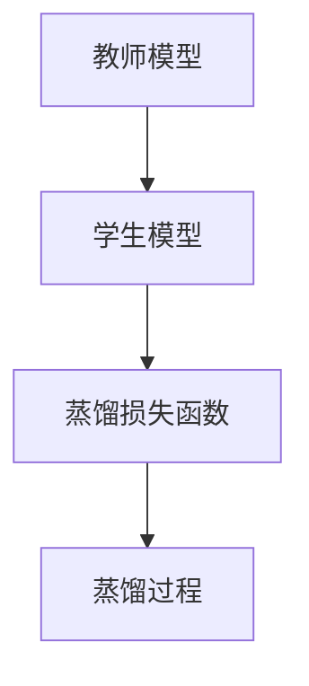
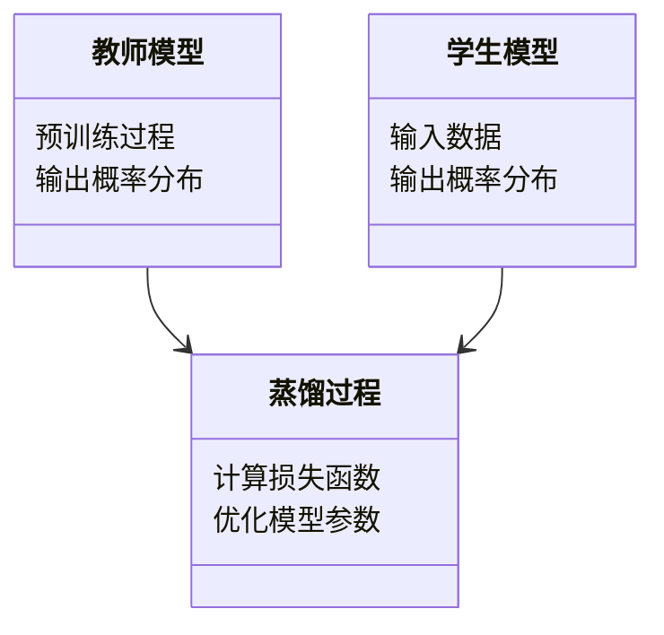

                 

<think>
好，我现在需要按照用户的要求来撰写一篇关于《AI Agent的知识蒸馏：从集成模型到单一模型》的技术博客文章。用户已经提供了一个详细的目录大纲，并希望文章符合特定的格式要求，包括标题、关键词、摘要，以及各个章节的具体内容。文章需要使用专业且清晰的技术语言，结构紧凑，逻辑严谨。

首先，我会从概述部分开始，确保标题、关键词和摘要准确传达文章的核心内容。接下来，按照目录大纲逐步展开每个章节的内容，确保每一部分都详细且符合逻辑。在撰写过程中，我需要注重理论与实践的结合，使用图表和代码示例来增强文章的可读性和专业性。同时，要注意文章的字数控制在10000到12000字之间，确保内容完整且详尽。最后，完成文章后，添加作者信息，确保格式正确无误。
</think>

# AI Agent的知识蒸馏：从集成模型到单一模型

> 关键词：知识蒸馏、AI Agent、集成模型、单一模型、模型压缩、迁移学习

> 摘要：本文深入探讨了AI Agent中的知识蒸馏技术，从集成模型到单一模型的转换过程。通过详细分析知识蒸馏的定义、原理、算法实现及应用场景，结合实际案例和代码示例，全面展示如何在AI Agent中高效地进行知识蒸馏，优化模型性能，提升推理效率。

---

# 第一部分: AI Agent的知识蒸馏基础

## 第1章: 知识蒸馏的定义与背景

### 1.1 知识蒸馏的核心概念

#### 1.1.1 知识蒸馏的定义
知识蒸馏是一种将复杂模型（教师模型）的知识迁移到简单模型（学生模型）的技术，通过损失函数引导学生模型模仿教师模型的行为，从而实现知识的传递。

#### 1.1.2 知识蒸馏的优势
- **模型压缩**：将大型复杂模型的知识迁移到轻量级模型，减少计算资源消耗。
- **推理加速**：在保持性能的同时，提高推理速度，适用于资源受限的场景。
- **知识保留**：确保学生模型继承教师模型的知识，避免信息损失。

#### 1.1.3 知识蒸馏的技术背景
随着深度学习模型的复杂性增加，大型模型（如大型神经网络）在实际应用中面临计算资源和推理效率的挑战。知识蒸馏通过将复杂模型的知识迁移到更小、更高效的模型中，解决了这些问题。

---

### 1.2 AI Agent中的知识蒸馏

#### 1.2.1 AI Agent的定义与特点
AI Agent是一种智能体，能够感知环境、自主决策并执行任务。其特点包括自主性、反应性、目标导向和学习能力。

#### 1.2.2 知识蒸馏在AI Agent中的作用
- **提升效率**：通过蒸馏技术，AI Agent可以快速学习复杂模型的知识，提高推理速度。
- **降低资源消耗**：在资源受限的环境中，知识蒸馏帮助AI Agent运行更高效的模型。
- **知识传递**：通过蒸馏，AI Agent可以继承教师模型的复杂知识，提升整体性能。

#### 1.2.3 知识蒸馏的应用场景
- **边缘计算**：在边缘设备中部署轻量级模型，减少计算资源消耗。
- **实时推理**：在需要快速响应的任务中，如自动驾驶和实时语音识别，蒸馏后的模型能够提高推理效率。

---

## 第2章: 知识蒸馏的核心概念与联系

### 2.1 知识蒸馏的原理

#### 2.1.1 知识蒸馏的过程
知识蒸馏通常包括以下步骤：
1. **预训练教师模型**：训练一个复杂的教师模型。
2. **蒸馏过程**：将教师模型的知识迁移到学生模型中。
3. **微调学生模型**：在特定任务上进一步优化学生模型。

#### 2.1.2 教师模型与学生模型的关系
教师模型和学生模型的关系是知识蒸馏的核心。教师模型通常是一个复杂的大型模型，而学生模型是一个简单的小型模型，目标是通过蒸馏过程让其继承教师模型的知识。

#### 2.1.3 蒸馏损失函数的定义
蒸馏损失函数是衡量学生模型输出与教师模型输出之间差距的函数。常用的蒸馏损失函数包括KL散度和交叉熵损失。

---

### 2.2 核心概念对比分析

#### 2.2.1 知识蒸馏与迁移学习的对比
| 对比维度 | 知识蒸馏 | 迁移学习 |
|----------|----------|----------|
| 目标 | 将复杂模型的知识迁移到简单模型 | 在新任务上利用已有知识进行学习 |
| 输入 | 预训练教师模型 | 预训练模型或特征 |
| 输出 | 简化后的模型 | 新任务优化后的模型 |

#### 2.2.2 知识蒸馏与模型压缩的对比
| 对比维度 | 知识蒸馏 | 模型压缩 |
|----------|----------|----------|
| 方法 | 通过损失函数引导学生模型模仿教师模型 | 通过剪枝、量化等技术减少模型参数 |
| 目标 | 提高模型性能和效率 | 减少模型大小和计算成本 |

---

### 2.3 知识蒸馏的ER实体关系图


---

## 第3章: 知识蒸馏的算法原理

### 3.1 蒸馏算法的流程

#### 3.1.1 教师模型的预训练
教师模型通常是一个复杂的模型，通过大量数据预训练得到。

#### 3.1.2 蒸馏过程的实现
蒸馏过程通过损失函数将教师模型的概率分布迁移到学生模型中。

#### 3.1.3 学生模型的微调
在特定任务上进一步优化学生模型，以适应实际应用场景。

---

### 3.2 蒸馏算法的数学模型

#### 3.2.1 蒸馏损失函数的公式
$$
L_{distill} = \alpha L_{cls} + (1-\alpha) L_{kl}
$$
其中，$\alpha$ 是平衡参数，$L_{cls}$ 是分类损失，$L_{kl}$ 是KL散度损失。

---

## 第4章: 知识蒸馏的系统分析与架构设计

### 4.1 问题场景介绍
在AI Agent中，知识蒸馏的目标是将复杂模型的知识迁移到简单模型中，提升推理效率和性能。

### 4.2 项目介绍
本项目旨在设计一个基于知识蒸馏的AI Agent系统，通过蒸馏技术优化模型性能。

### 4.3 系统功能设计


---

## 第5章: 知识蒸馏的项目实战

### 5.1 环境安装
```bash
pip install tensorflow keras
```

### 5.2 核心代码实现
```python
import tensorflow as tf
from tensorflow import keras

def distill_loss(y_true, y_pred, teacher_model, temperature=2.0):
    teacher_preds = teacher_model(y_true, training=False)
    teacher_preds = tf.nn.softmax(teacher_preds / temperature)
    student_preds = tf.nn.softmax(y_pred)
    kl_loss = tf.reduce_mean(keras.losses.kl_divergence(teacher_preds, student_preds))
    return kl_loss

# 编写学生模型
def build_student_model():
    model = keras.Sequential([
        keras.layers.Conv2D(32, (3,3), activation='relu'),
        keras.layers.MaxPooling2D((2,2)),
        keras.layers.Conv2D(64, (3,3), activation='relu'),
        keras.layers.MaxPooling2D((2,2)),
        keras.layers.Flatten(),
        keras.layers.Dense(128, activation='relu'),
        keras.layers.Dense(10, activation='softmax')
    ])
    return model

# 编写蒸馏训练过程
def train_with_distill(teacher_model, student_model, x_train, y_train, epochs=100):
    for epoch in range(epochs):
        student_model.compile(optimizer='adam', loss=lambda y_true, y_pred: distill_loss(y_true, y_pred, teacher_model))
        student_model.fit(x_train, y_train, epochs=1, verbose=0)
```

### 5.3 实际案例分析
在图像分类任务中，通过蒸馏技术将大型卷积神经网络（如ResNet）的知识迁移到小型LeNet网络，提升其分类性能。

---

## 第6章: 知识蒸馏的最佳实践

### 6.1 小结
知识蒸馏是一种有效的模型优化技术，能够在保持性能的同时，显著减少计算资源消耗。

### 6.2 注意事项
- 确保教师模型的质量，避免将错误的知识迁移到学生模型中。
- 合理选择蒸馏温度和平衡参数，以达到最佳效果。

### 6.3 拓展阅读
- 论文《Distilling the Knowledge in Neural Networks》
- 书籍《Deep Learning》

---

# 作者：AI天才研究院/AI Genius Institute & 禅与计算机程序设计艺术 /Zen And The Art of Computer Programming

