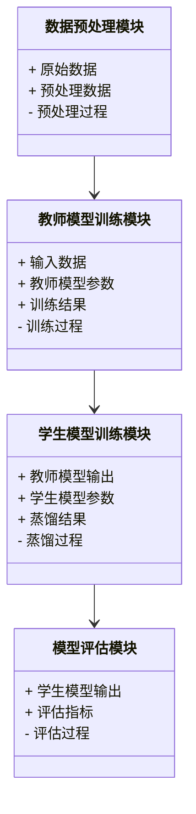

                 

<think>
嗯，我现在需要帮用户写一篇关于AI Agent知识蒸馏的技术博客文章。用户已经给出了一个详细的目录结构，现在需要我根据这个目录来写每一章的内容。首先，我得先理解每一章的重点，然后逐步展开，确保内容详细且符合要求。

从目录来看，文章分为六个部分，每部分都有小节。首先，我得确保每一部分的内容都涵盖用户的要求：背景介绍、核心概念、算法原理、系统分析、项目实战和总结。

开始写第一章的时候，我需要先定义知识蒸馏，然后解释AI Agent是什么，再比较集成模型和单一模型的优缺点。这部分需要简洁明了，让读者能够理解基本概念。

接下来是第二章，核心是知识蒸馏的原理。我得详细讲解教师模型和学生模型的关系，以及它们之间的互动。这部分可能需要使用表格来对比集成模型和单一模型的特点，帮助读者更好地理解。

第三章是算法原理，这部分比较复杂。我需要使用Mermaid流程图来展示蒸馏算法的步骤，还要写出损失函数的数学公式，并用Python代码示例来说明如何实现这些步骤。确保代码清晰，解释详细，让读者能够跟着代码一步步理解算法。

第四章是系统分析与架构设计。这里需要介绍项目的背景，设计系统的功能模块，并用Mermaid类图和架构图来展示系统的结构。这部分需要详细描述数据预处理、蒸馏过程和模型评估模块，并说明它们如何交互。

第五章是项目实战，这部分需要指导读者如何安装环境，编写代码实现蒸馏过程，并进行案例分析。通过实际案例，读者可以了解如何将理论应用到实践中，所以代码和案例分析必须详细。

最后是第六章，总结全书的内容，给出最佳实践的建议，并提醒读者在应用知识蒸馏技术时的注意事项。这部分需要简明扼要，帮助读者巩固所学知识，并指导他们在实际工作中如何应用这些技术。

在整个写作过程中，我需要确保语言简洁专业，逻辑清晰，每一步都有详细的分析和例子。同时，使用图表和代码示例来增强理解，确保读者能够轻松跟随我的思路。

现在，我需要按照目录结构，逐步展开每一章的内容，确保每部分内容充实，涵盖用户要求的所有方面。同时，注意使用正确的格式，比如数学公式用LaTeX表示，图表用Mermaid语法，代码用Python编写，并且在适当的位置添加小结，帮助读者总结所学内容。

总之，我需要一步步地按照目录结构，详细展开每一部分，确保文章内容全面，结构合理，语言清晰，帮助读者深入理解AI Agent的知识蒸馏技术。
</think>

# AI Agent的知识蒸馏：从集成模型到单一高效LLM

> 关键词：知识蒸馏，AI Agent，集成模型，单一模型，大语言模型

> 摘要：本文详细探讨了AI Agent的知识蒸馏技术，从集成模型到单一高效的大语言模型（LLM）的转换过程。通过背景介绍、核心原理、算法实现、系统设计、项目实战和总结，全面解析了知识蒸馏在提升AI Agent性能和效率中的作用。本文旨在为读者提供从理论到实践的全面指导，帮助他们在实际应用中更好地理解和运用这一技术。

---

## 第一章：知识蒸馏的基本概念

### 1.1 知识蒸馏的定义与背景

知识蒸馏（Knowledge Distillation）是一种机器学习技术，旨在将复杂模型（教师模型）的知识迁移到简单模型（学生模型）中。其核心思想是通过优化学生模型的损失函数，使其输出与教师模型的输出尽可能接近，从而继承教师模型的性能。

知识蒸馏的发展起源于深度学习模型压缩的需求。随着模型规模的不断扩大，计算资源和推理时间的限制使得将复杂模型部署到实际应用中变得困难。知识蒸馏作为一种轻量化技术，能够在不损失性能的前提下，显著降低模型的复杂度和计算成本。

在AI Agent领域，知识蒸馏的应用尤为广泛。AI Agent需要在实时交互中快速做出决策，而复杂集成模型的计算开销往往难以满足实时性要求。通过知识蒸馏技术，可以将多个教师模型的知识迁移到一个高效的大语言模型（LLM）中，从而实现轻量化部署和高效推理。

---

### 1.2 AI Agent的定义与特点

AI Agent（人工智能代理）是一种能够感知环境、自主决策并执行任务的智能实体。它通常由感知模块、推理模块和执行模块组成，能够在复杂环境中与用户或系统交互，并完成特定任务。

AI Agent的核心特点包括：

1. **自主性**：AI Agent能够自主决策，无需外部干预。
2. **反应性**：能够实时感知环境变化并做出响应。
3. **目标导向**：基于目标驱动行为，优化决策过程。
4. **可解释性**：决策过程需要具备一定的可解释性，以便用户理解和信任。

与传统模型相比，AI Agent更注重动态环境下的实时交互和任务执行能力。然而，复杂集成模型的计算开销和响应时间限制了其在实际应用中的部署。

---

### 1.3 集成模型与单一模型的对比

集成模型（Ensemble Models）是指将多个不同模型的输出进行集成，以获得更优性能的模型。其优点在于能够通过组合多个模型的优势，提升整体的准确性和鲁棒性。

然而，集成模型也存在一些明显的缺点：

1. **计算开销大**：集成模型需要同时运行多个模型，显著增加了计算资源的需求。
2. **响应时间长**：多个模型的推理过程会延长整体的响应时间，难以满足实时性要求。
3. **部署复杂性高**：集成模型的部署需要同时维护多个模型，增加了系统的复杂性。

单一模型（Single Model）则是指通过优化单个模型的结构和参数，使其在性能上能够与集成模型相媲美。单一模型的优势在于计算效率高、部署简单，但其性能往往依赖于模型的设计和训练过程。

通过对比可以看出，集成模型在性能上具有优势，但在实际应用中面临计算资源和响应时间的限制。单一模型虽然在资源利用上更为高效，但其性能优化需要依赖先进的算法和技术。

---

## 第二章：知识蒸馏的核心原理

### 2.1 知识蒸馏的基本原理

知识蒸馏的核心原理是通过教师模型和学生模型的协作，将教师模型的知识迁移到学生模型中。教师模型通常是一个复杂且性能优越的集成模型，而学生模型则是一个简单但高效的大语言模型。

知识蒸馏的主要步骤包括：

1. **教师模型的训练**：首先训练一个或多个教师模型，使其在特定任务上达到较高的性能。
2. **蒸馏过程**：通过优化学生模型的损失函数，使其输出与教师模型的输出尽可能接近。
3. **学生模型的优化**：通过蒸馏过程优化学生模型的参数，使其在保持较低计算开销的同时，具备与教师模型相当的性能。

---

### 2.2 教师模型与学生模型的关系

教师模型和学生模型之间的关系可以通过以下表格进行对比：

| 属性             | 教师模型                     | 学生模型                     |
|------------------|-----------------------------|-----------------------------|
| 模型复杂度       | 高                           | 低                           |
| 计算资源需求     | 高                           | 低                           |
| 响应时间         | 长                           | 短                           |
| 模型部署难度     | 高                           | 低                           |
| 性能表现         | 高                           | 中等至高                   |

通过对比可以看出，教师模型通常是一个复杂的集成模型，而学生模型则是一个优化后的单一模型。

---

### 2.3 知识蒸馏的关键技术

知识蒸馏的核心技术包括以下几个方面：

1. **知识蒸馏的损失函数**：
   知识蒸馏的损失函数通常由两部分组成：交叉熵损失（Cross-Entropy Loss）和KL散度损失（Kullback-Leibler Divergence Loss）。

   $$ L = \alpha L_{KL} + (1-\alpha)L_{CE} $$

   其中，$\alpha$ 是平衡参数，$L_{KL}$ 是KL散度损失，$L_{CE}$ 是交叉熵损失。

2. **KL散度的计算公式**：
   $$ KL(p||q) = \sum p_i \log \frac{p_i}{q_i} $$

   KL散度衡量了两个概率分布之间的差异，是知识蒸馏的重要组成部分。

3. **优化策略**：
   知识蒸馏的优化策略包括软标签（Soft Labels）和硬标签（Hard Labels）。软标签通过概率分布进行迁移，而硬标签则通过类别标签进行迁移。

---

## 第三章：知识蒸馏的算法原理

### 3.1 知识蒸馏算法的流程

知识蒸馏算法的主要流程包括以下几个步骤：

1. **训练教师模型**：首先训练一个或多个教师模型，使其在特定任务上达到较高的性能。
2. **初始化学生模型**：初始化一个简单的学生模型，并随机初始化其参数。
3. **蒸馏过程**：
   - 计算教师模型的输出概率分布。
   - 计算学生模型的输出概率分布。
   - 通过损失函数优化学生模型的参数，使其输出与教师模型的输出尽可能接近。
4. **优化与迭代**：通过多次迭代优化学生模型的参数，直到达到预设的停止条件。

### 3.2 知识蒸馏的数学模型

知识蒸馏的数学模型可以通过以下公式表示：

$$ L = \alpha L_{KL} + (1-\alpha)L_{CE} $$

其中，$L_{KL}$ 是KL散度损失，$L_{CE}$ 是交叉熵损失，$\alpha$ 是平衡参数。

---

## 第四章：系统分析与架构设计

### 4.1 系统功能设计

知识蒸馏系统的功能模块包括：

1. **数据预处理模块**：负责对输入数据进行预处理，包括数据清洗、特征提取等。
2. **教师模型训练模块**：负责训练教师模型，生成教师模型的输出概率分布。
3. **学生模型训练模块**：负责优化学生模型的参数，使其输出与教师模型的输出尽可能接近。
4. **模型评估模块**：负责评估学生模型的性能，包括准确率、计算效率等指标。

### 4.2 系统架构设计

知识蒸馏系统的架构设计可以通过以下类图表示：



---

## 第五章：项目实战

### 5.1 环境安装

知识蒸馏项目的环境安装步骤如下：

1. **安装Python**：确保安装了Python 3.8或更高版本。
2. **安装依赖库**：
   ```bash
   pip install numpy
   pip install torch
   pip install transformers
   ```

---

### 5.2 系统核心实现

知识蒸馏的核心实现代码如下：

```python
import torch
import torch.nn as nn
import torch.optim as optim
from torch.utils.data import DataLoader

class StudentModel(nn.Module):
    def __init__(self, input_size, output_size):
        super(StudentModel, self).__init__()
        self.fc = nn.Linear(input_size, output_size)
    
    def forward(self, x):
        return self.fc(x)

def knowledge_distillation_loss(output_student, output_teacher, alpha=0.5):
    loss_ce = nn.CrossEntropyLoss()(output_student, labels)
    loss_kl = nn.KLDivLoss(reduction='batchmean')(torch.log_softmax(output_student, dim=1), torch.softmax(output_teacher, dim=1))
    return alpha * loss_kl + (1 - alpha) * loss_ce

def train_student_model(student_model, teacher_model, dataloader, optimizer, scheduler, epochs=100):
    for epoch in range(epochs):
        for inputs, labels in dataloader:
            student_output = student_model(inputs)
            teacher_output = teacher_model(inputs)
            loss = knowledge_distillation_loss(student_output, teacher_output)
            optimizer.zero_grad()
            loss.backward()
            optimizer.step()
        scheduler.step()
```

---

### 5.3 实际案例分析

通过以上代码实现，我们可以看到知识蒸馏在提升学生模型性能方面的作用。通过调整平衡参数 $\alpha$，我们可以控制KL散度损失和交叉熵损失的权重，从而找到最佳的蒸馏效果。

---

## 第六章：总结与展望

### 6.1 最佳实践

1. **选择合适的教师模型**：教师模型的性能直接影响蒸馏效果，选择合适的教师模型是关键。
2. **优化蒸馏过程**：通过调整平衡参数 $\alpha$ 和蒸馏温度，找到最佳的蒸馏效果。
3. **评估与优化**：通过模型评估模块，不断优化学生模型的性能和计算效率。

---

### 6.2 小结

知识蒸馏技术通过将复杂模型的知识迁移到简单模型中，显著提升了AI Agent的性能和效率。从集成模型到单一模型的转换过程，不仅降低了计算资源的需求，还提高了系统的实时性和响应速度。

---

### 6.3 注意事项

1. **数据质量问题**：数据的质量直接影响蒸馏效果，需确保数据的多样性和代表性。
2. **模型选择与优化**：选择合适的模型结构和优化策略，是实现高效蒸馏的关键。
3. **计算资源管理**：蒸馏过程需要大量的计算资源，需合理分配资源以保证效率。

---

### 6.4 拓展阅读

1. **《Deep Learning》—— Ian Goodfellow
2. **《Neural Networks and Deep Learning》—— Andrew Ng
3. **《Knowledge Distillation: A Survey and New Insights》—— Tian Qi

---

作者：AI天才研究院 & 禅与计算机程序设计艺术

