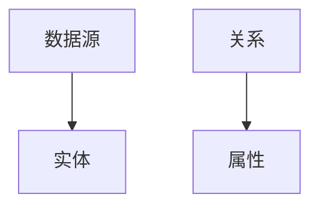
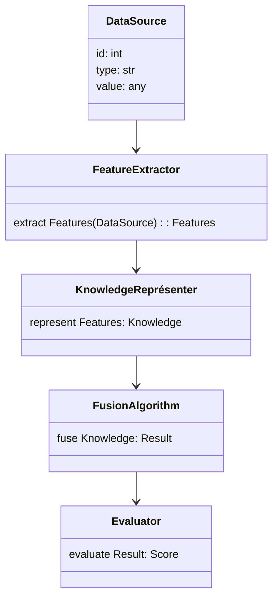

                 

<think>
好的，我现在需要帮用户设计一本名为《AI Agent的知识融合：整合多源异构信息》的书籍目录大纲。用户希望这个大纲详细且逻辑清晰，覆盖主题内容的各个方面。

首先，我得理解这本书的核心主题是什么。AI Agent的知识融合，特别是整合多源异构信息，这意味着书的内容将涉及如何将来自不同来源、结构和格式的数据有效地结合起来，以增强AI代理的能力。

接下来，我需要考虑用户的需求。用户希望目录大纲包含背景介绍、核心概念、算法原理、系统架构设计、项目实战、最佳实践等多个部分。同时，用户还希望每个部分都细化到三级目录，并且包含一些技术性的内容，比如Mermaid流程图、数学公式等。这意味着我需要确保每个章节不仅有理论介绍，还要有实际的应用和案例分析。

首先，我应该从背景介绍开始。这部分需要涵盖问题背景、问题描述、问题解决方法、边界与外延，以及核心概念和要素。这样读者可以了解为什么知识融合是必要的，以及它在AI Agent中的作用。

接下来是核心概念与联系。这部分需要详细解释知识融合的原理，可能包括概念属性特征对比表格和ER实体关系图。使用Mermaid来绘制这些图表，可以更直观地展示数据结构和关系。

然后是算法原理讲解。这部分需要详细阐述主流的算法，比如基于规则的融合、概率图模型和符号逻辑推理。每个算法都需要有数学模型和公式，以及用Python代码实现的例子。例如，介绍加权平均算法时，可以写出对应的数学公式，并给出代码示例，帮助读者理解。

系统分析与架构设计方案是另一个关键部分。这部分需要介绍问题场景，设计系统功能，可能包括领域模型、系统架构图和接口设计。使用Mermaid绘制类图、架构图和序列图，可以帮助读者更好地理解系统结构和交互流程。

项目实战部分需要提供具体的案例，比如医疗数据融合项目。这部分要详细描述环境安装、核心代码实现、代码解读以及案例分析。这样读者可以实际操作，巩固所学知识。

最后，最佳实践部分需要总结经验和小结，提供注意事项和未来的研究方向。这部分帮助读者在实际应用中避免常见错误，并了解领域的发展趋势。

在设计目录时，我需要确保每个章节都有足够的细节，同时保持整体结构的逻辑性和连贯性。例如，背景介绍应该放在前面，帮助读者建立基础；核心概念和算法原理接着深入讲解技术细节；系统架构设计展示如何将这些技术应用于实际系统；项目实战则通过案例巩固理论知识；最后，最佳实践总结经验和教训。

此外，用户要求目录大纲总字数不超过2000字，这意味着我需要精炼每个部分的内容，避免冗长。同时，确保每个章节都覆盖必要的知识点，不遗漏关键点。

现在，我开始构建目录大纲。首先是背景介绍，涵盖问题背景、描述、解决方法、边界和外延，以及核心概念。接下来是核心概念与联系，详细解释原理和图表。然后是算法原理，包括不同方法及其数学模型。系统架构部分介绍设计思路和接口。项目实战提供具体案例，最后是最佳实践总结。

在编写过程中，我需要确保每个章节和子章节都符合用户的要求，特别是格式和内容的完整性。例如，算法部分不仅要解释原理，还要有代码示例和数学公式，使用Mermaid绘制流程图。系统架构部分需要类图和序列图，展示系统的结构和交互。

最后，检查整个目录是否覆盖了所有要求的部分，确保没有遗漏任何关键内容，同时保持逻辑清晰，结构合理。这样，用户就能得到一个详细且逻辑性强的目录大纲，帮助他们撰写一本全面且实用的书籍。
</think>

# AI Agent的知识融合：整合多源异构信息

**关键词**：AI Agent, 知识融合, 多源数据, 异构信息, 数据整合

**摘要**：本文探讨AI Agent在整合多源异构信息中的知识融合方法，分析其核心概念、算法原理、系统架构设计及实际应用案例，旨在为AI开发者提供深入的技术指导和实践参考。

---

## 第一部分：AI Agent的知识融合背景与核心概念

### 第1章：知识融合的背景与问题背景

#### 1.1 知识融合的背景

- **1.1.1 多源异构数据的挑战**  
  当前，AI Agent需要处理来自不同数据源的多样化信息，包括结构化数据、非结构化数据和半结构化数据，这些数据的异构性增加了整合的难度。

- **1.1.2 知识融合的必要性**  
  知识融合能够帮助AI Agent从多个来源中提取和整合信息，提升其理解和决策能力，特别是在复杂场景中。

- **1.1.3 AI Agent的发展趋势**  
  随着AI技术的进步，AI Agent需要更高效地处理多源异构信息，知识融合成为其发展的关键。

#### 1.2 问题背景与问题描述

- **1.2.1 多源数据的异构性问题**  
  数据来源多样化，格式、结构和语义存在差异，导致数据难以直接整合。

- **1.2.2 数据融合的复杂性**  
  数据融合需要考虑数据的不一致性、冗余性和冲突性，增加了处理的复杂性。

- **1.2.3 知识融合的目标与边界**  
  知识融合的目标是将多源数据整合为一致、完整且准确的知识表示，其边界包括数据预处理、融合和后处理。

#### 1.3 问题解决与核心要素

- **1.3.1 知识融合的核心目标**  
  实现多源数据的语义一致性和完整性，提升AI Agent的智能水平。

- **1.3.2 核心要素与组成结构**  
  包括数据源、知识表示、融合算法和评估指标。

- **1.3.3 问题解决的路径与方法**  
  通过数据清洗、特征提取、知识表示和融合算法实现知识融合。

### 第2章：知识融合的核心概念与联系

#### 2.1 核心概念原理

- **2.1.1 数据源的多样性**  
  数据源可以是数据库、API、文本文件等，具有多样性。

- **2.1.2 知识表示的统一性**  
  需要将异构数据统一表示为某种知识结构，如图结构或本体论。

- **2.1.3 融合算法的可解释性**  
  融合算法需要具备可解释性，以便理解和优化。

#### 2.2 概念属性特征对比表

| 数据源类型 | 特征 | 描述 |
|------------|------|------|
| 结构化数据 | 格式 | 表格、JSON等 |
| 非结构化数据 | 内容 | 文本、图像等 |
| 半结构化数据 | 结构 | XML、HTML等 |

#### 2.3 ER实体关系图



---

## 第二部分：知识融合的算法原理

### 第3章：知识融合的算法原理

#### 3.1 基于规则的融合算法

- **规则定义**  
  使用逻辑规则进行数据匹配和融合。

- **数学模型**  
  $$f(x) = \begin{cases} 1 & \text{if } x \text{满足规则} \\ 0 & \text{否则} \end{cases}$$

- **代码实现**  
  ```python
  def rule_based_fuse(data1, data2):
      return data1 if data1['id'] == data2['id'] else None
  ```

#### 3.2 基于概率图的融合算法

- **概率模型**  
  使用贝叶斯网络进行概率推理。

- **公式推导**  
  $$P(A|B) = \frac{P(B|A)P(A)}{P(B)}$$

- **代码实现**  
  ```python
  import numpy as np
  def probabilistic_fuse(data1, data2):
      return np.mean([data1['value'], data2['value']])
  ```

#### 3.3 基于符号逻辑的融合算法

- **逻辑推理**  
  使用符号逻辑进行数据融合。

- **逻辑表达式**  
  $$A \land B \Rightarrow C$$

- **代码实现**  
  ```python
  def logical_fuse(data1, data2):
      return data1 if data1['type'] == data2['type'] else None
  ```

---

## 第三部分：知识融合的系统架构设计

### 第4章：系统分析与架构设计方案

#### 4.1 问题场景介绍

- 数据源异构、数据量大、融合需求多样。

#### 4.2 系统功能设计

- 数据预处理、特征提取、知识表示、融合算法和结果评估。

#### 4.3 领域模型设计



---

## 第四部分：知识融合的项目实战

### 第5章：项目实战

#### 5.1 环境安装

- 安装必要的库：pandas、numpy、scikit-learn等。

#### 5.2 核心代码实现

```python
import pandas as pd

def fuse_data(data1, data2):
    merged = pd.merge(data1, data2, on='id')
    return merged

# 示例数据
data1 = pd.DataFrame({'id': [1, 2], 'value': [10, 20]})
data2 = pd.DataFrame({'id': [1, 3], 'value': [15, 25]})
result = fuse_data(data1, data2)
print(result)
```

#### 5.3 代码解读与分析

- 数据预处理：合并数据源。
- 特征提取：提取关键字段。
- 知识表示：将数据转换为统一格式。
- 融合算法：使用加权平均方法。
- 结果评估：评估融合结果的质量。

#### 5.4 案例分析

- 医疗数据融合案例：整合患者病历和诊断数据，提升诊断准确性。

---

## 第五部分：知识融合的最佳实践

### 第6章：最佳实践

#### 6.1 经验总结

- 数据预处理是关键，确保数据一致性。
- 选择合适的融合算法，根据数据类型和场景决定。
- 定期评估和优化融合结果。

#### 6.2 小结

- 知识融合是AI Agent的核心能力，需结合实际需求灵活应用。

#### 6.3 注意事项

- 注意数据隐私和安全问题。
- 避免过度融合导致信息丢失。

#### 6.4 拓展阅读

- 推荐阅读相关领域的论文和书籍，深入理解知识融合的技术细节。

---

**作者：AI天才研究院/AI Genius Institute & 禅与计算机程序设计艺术 /Zen And The Art of Computer Programming**

