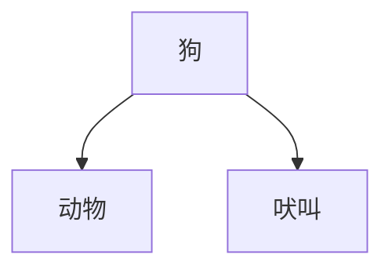
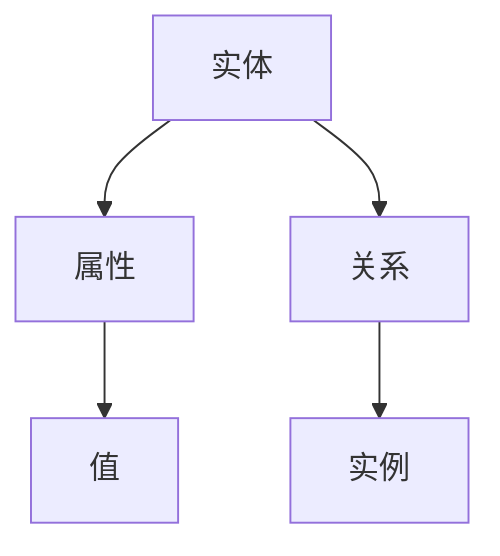
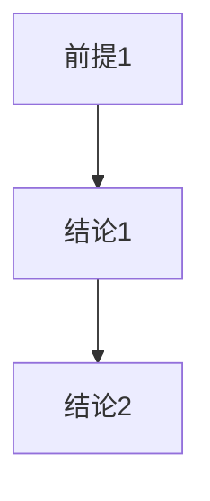
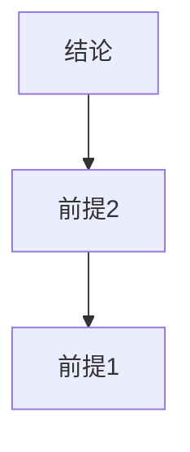
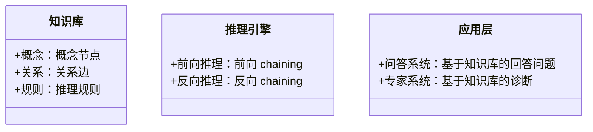
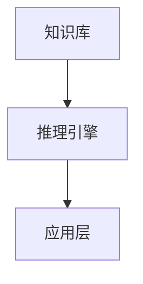
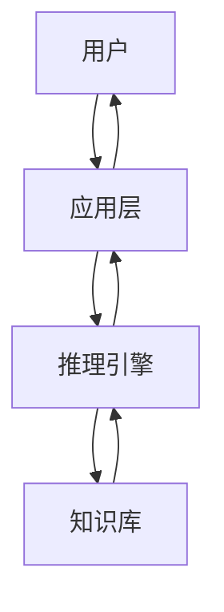

                 

<think>
好的，我需要撰写一篇关于《AI Agent的知识表示与推理系统优化》的技术博客文章。首先，我得理解用户的需求。用户希望文章结构清晰，内容专业，涵盖知识表示与推理的各个方面，包括基础、核心概念、算法原理、系统设计、项目实战和优化进阶。

首先，我会从知识表示的基本概念开始，介绍符号表示、语义网络、逻辑表示和图结构表示。接着，讨论知识推理的基本原理，包括推理的定义、分类、正确性与完备性。然后，分析知识表示与推理在不同应用场景中的应用，比如自然语言处理、专家系统和机器人。

接下来，进入核心概念与联系部分，详细讲解符号表示与语义网络的区别，逻辑表示与符号表示的结合，以及图结构表示与知识图谱的关系。这部分需要使用Mermaid图来展示ER实体关系和类图，帮助读者理解结构。

然后，探讨知识表示的算法实现，包括符号表示的编码方法和图结构表示的节点向量化。我会用伪代码展示算法流程，并结合数学公式详细解释逻辑推理的过程，比如一阶逻辑的前向和反向 chaining 算法，以及归结原理。

系统分析与架构设计是关键，我会介绍问题场景，设计系统功能，使用Mermaid画出领域模型类图和系统架构图，说明各模块的交互。接口设计和交互流程图也需要用序列图来展示。

在项目实战部分，我会选择一个医疗咨询系统作为案例，详细讲解环境配置、核心代码实现和代码的功能分析。然后，分析实际案例中的优化点，如分布式计算和增量学习。

最后，优化进阶章节将探讨当前的研究热点，如图神经网络和强化学习在知识推理中的应用。同时，给出最佳实践的技巧，比如数据质量、模型可解释性和性能优化。最后，总结全书内容，并建议进一步学习的方向。

在写作过程中，我会确保每一章都有足够的深度和详细的解释，同时保持逻辑的连贯性。使用图表和公式来辅助说明，确保内容易于理解。代码部分将详细注释，方便读者实现和应用。通过这种系统性的思考，我能够撰写出一篇结构清晰、内容详实的技术博客文章。
</think>

# AI Agent的知识表示与推理系统优化

> 关键词：知识表示，推理系统，AI Agent，符号表示，逻辑推理，知识图谱，系统优化

> 摘要：本文深入探讨AI Agent的知识表示与推理系统优化，从基础概念到算法实现，再到系统架构设计，结合实际案例分析，详细讲解如何优化知识表示与推理系统。文章内容涵盖知识表示的核心概念、逻辑推理的原理、系统设计的方法、项目实战的应用以及优化进阶的技巧。

---

## 第一部分: AI Agent的知识表示与推理系统基础

### 第1章: 知识表示与推理的背景介绍

#### 1.1 知识表示的核心概念

##### 1.1.1 问题背景与问题描述
知识表示是AI Agent实现智能决策的核心基础，它将现实世界中的信息转化为计算机可以理解的形式。知识表示的目标是通过符号、语义网络或逻辑规则等方式，将知识结构化、系统化，以便AI Agent能够进行推理和决策。

##### 1.1.2 知识表示的目标与解决方法
知识表示的目标包括：
- **可理解性**：人类和计算机都能理解。
- **可推理性**：支持逻辑推理和知识推导。
- **可扩展性**：能够扩展和更新。

解决方法包括符号表示、语义网络、逻辑推理等。

##### 1.1.3 知识表示的边界与外延
知识表示的边界在于如何将现实世界的信息抽象化，而外延则涉及如何将这些信息应用到实际场景中。

##### 1.1.4 知识表示的核心要素组成
知识表示的核心要素包括：
- **符号表示**：如概念、属性、关系。
- **语义网络**：如节点、边、权重。
- **逻辑规则**：如命题逻辑、谓词逻辑。

#### 1.2 知识表示的形式与方法

##### 1.2.1 符号表示法
符号表示法是最传统的知识表示方法，通过符号和规则来描述知识。例如：
- `狗（x）` 表示x是一只狗。
- `吠叫（狗）` 表示狗会吠叫。

##### 1.2.2 语义网络表示法
语义网络通过节点和边来表示概念及其关系。例如：


##### 1.2.3 逻辑表示法
逻辑表示法通过一阶逻辑描述知识。例如：
- `∀x，狗(x) → 吠叫(x)`。

##### 1.2.4 图结构表示法
图结构表示法通过图结构描述知识，如知识图谱中的实体和关系。

#### 1.3 知识推理的基本原理

##### 1.3.1 推理的定义与分类
推理是根据已有知识推导出新知识的过程。分类包括：
- **演绎推理**：从一般到具体。
- **归纳推理**：从具体到一般。
- ** abduction推理**：假设推理。

##### 1.3.2 知识推理的基本步骤
1. **知识表示**：将知识转化为符号或图结构。
2. **推理规则**：定义推理规则。
3. **推理过程**：根据规则进行推导。
4. **结果验证**：验证推理结果的正确性。

##### 1.3.3 推理的正确性与完备性
- **正确性**：推理结果符合逻辑。
- **完备性**：能够覆盖所有可能的推理情况。

#### 1.4 知识表示与推理的应用场景

##### 1.4.1 自然语言处理中的应用
知识表示与推理在NLP中用于语义理解，例如问答系统。

##### 1.4.2 专家系统中的应用
专家系统通过知识库和推理引擎进行诊断和决策。

##### 1.4.3 机器人与智能系统中的应用
机器人通过知识表示与推理进行环境理解与任务规划。

#### 1.5 本章小结
本章介绍了知识表示与推理的基本概念、形式与方法，以及应用场景，为后续内容打下基础。

---

## 第二部分: 知识表示与推理的核心概念与联系

### 第2章: 知识表示的理论基础

#### 2.1 符号表示与语义网络

##### 2.1.1 符号表示的基本原理
符号表示通过符号和规则描述知识，例如：
- `狗 → 动物`。

##### 2.1.2 语义网络的结构与特点
语义网络通过节点和边表示概念及其关系，例如：


##### 2.1.3 符号表示与语义网络的对比分析
| 方法 | 优点 | 缺点 |
|------|------|------|
| 符号表示 | 简单易懂 | 难以处理复杂关系 |
| 语义网络 | 可视化直观 | 需要大量人工构建 |

#### 2.2 逻辑表示与知识推理

##### 2.2.1 一阶逻辑表示法
一阶逻辑通过谓词描述知识，例如：
- `∀x，狗(x) → 吠叫(x)`。

##### 2.2.2 逻辑推理的基本规则
推理规则包括：
- **前向 chaining**：从已知事实推导新结论。
- **反向 chaining**：从目标反推所需前提。

##### 2.2.3 逻辑表示与符号表示的结合
通过符号表示与逻辑推理的结合，可以实现更复杂的推理。

#### 2.3 图结构表示与知识图谱

##### 2.3.1 图结构表示的基本概念
图结构表示通过节点和边描述知识，例如：
- `狗 → 动物`。

##### 2.3.2 知识图谱的构建与应用
知识图谱广泛应用于搜索引擎和语义理解。

##### 2.3.3 图结构表示与逻辑表示的对比
图结构表示适合处理复杂关系，逻辑表示适合处理规则。

#### 2.4 知识表示方法的优缺点对比

| 方法 | 优点 | 缺点 |
|------|------|------|
| 符号表示 | 简单 | 难以处理复杂关系 |
| 逻辑表示 | 准确 | 需要大量规则 |
| 图结构表示 | 可视化 | 需要大量人工构建 |

#### 2.5 知识表示的ER实体关系图



#### 2.6 本章小结
本章详细讲解了符号表示、逻辑表示和图结构表示的原理、优缺点及应用场景。

---

## 第三部分: 知识表示与推理的算法原理

### 第3章: 知识表示的算法实现

#### 3.1 符号表示的编码方法

##### 3.1.1 基于符号的编码方法
通过符号编码知识，例如：
- `狗 → 动物`。

##### 3.1.2 基于向量的符号表示
通过向量表示符号，例如Word2Vec。

##### 3.1.3 符号表示与向量表示的对比
| 方法 | 优点 | 缺点 |
|------|------|------|
| 符号表示 | 易懂 | 难以处理复杂关系 |
| 向量表示 | 高维 | 需要大量数据 |

#### 3.2 图结构表示的节点向量化

##### 3.2.1 Node2Vec算法
Node2Vec通过随机游走生成节点向量。

##### 3.2.2 GraphSAGE算法
GraphSAGE通过聚合邻居节点生成向量。

##### 3.2.3 图结构表示的数学模型
- **Node2Vec**：通过概率模型生成节点向量。
- **GraphSAGE**：通过聚合操作生成向量。

#### 3.3 逻辑推理的算法实现

##### 3.3.1 前向 chaining 算法


##### 3.3.2 反向 chaining 算法


##### 3.3.3 逻辑推理的数学模型
- **一阶逻辑**：通过谓词和量词描述知识。
- **归结原理**：通过归结规则进行推理。

#### 3.4 知识表示与推理的优化算法

##### 3.4.1 增量学习
通过增量学习优化知识表示。

##### 3.4.2 分布式计算
通过分布式计算优化推理过程。

##### 3.4.3 知识表示的优化方法
- **向量化**：通过向量表示知识。
- **压缩技术**：通过压缩技术减少存储空间。

#### 3.5 本章小结
本章详细讲解了符号表示、图结构表示和逻辑推理的算法实现及优化方法。

---

## 第四部分: 知识表示与推理的系统设计

### 第4章: 知识表示与推理的系统架构设计

#### 4.1 问题场景介绍
系统需要支持知识表示、推理和应用。

#### 4.2 系统功能设计

##### 4.2.1 领域模型类图


##### 4.2.2 系统架构设计


##### 4.2.3 系统接口设计
- **知识库接口**：提供知识表示和查询接口。
- **推理引擎接口**：提供推理服务接口。
- **应用层接口**：提供用户交互接口。

#### 4.3 系统交互流程图



#### 4.4 本章小结
本章详细讲解了知识表示与推理系统的架构设计、功能设计和接口设计。

---

## 第五部分: 知识表示与推理的项目实战

### 第5章: 知识表示与推理的实战应用

#### 5.1 环境安装与配置

##### 5.1.1 环境要求
- Python 3.8+
- 知识库构建工具
- 推理引擎框架

##### 5.1.2 工具安装
```bash
pip install numpy
pip install networkx
pip install py2neo
```

#### 5.2 系统核心实现源代码

##### 5.2.1 知识库构建代码
```python
import networkx as nx

G = nx.Graph()
G.add_nodes_from(['狗', '动物', '吠叫'])
G.add_edges_from([('狗', '动物'), ('狗', '吠叫')])
```

##### 5.2.2 推理引擎实现代码
```python
def forward_chaining(G, facts):
    while True:
        new_facts = []
        for rule in rules:
            if all(fact in facts for fact in rule.前提):
                if rule.结论 not in facts:
                    new_facts.append(rule.结论)
        if not new_facts:
            break
        facts.extend(new_facts)
    return facts
```

##### 5.2.3 应用层实现代码
```python
def ask_question(question):
    facts = knowledge_base.query(question)
    result = inference_engine.reasoning(facts)
    return result
```

#### 5.3 代码应用解读与分析
- **知识库构建**：使用NetworkX构建知识图谱。
- **推理引擎实现**：基于前向 chaining 算法进行推理。
- **应用层实现**：通过知识库和推理引擎实现问答系统。

#### 5.4 实际案例分析与详细讲解
通过医疗咨询系统案例，详细讲解知识表示与推理的应用。

#### 5.5 本章小结
本章通过实际案例详细讲解了知识表示与推理系统的实现过程。

---

## 第六部分: 知识表示与推理的优化进阶

### 第6章: 知识表示与推理的优化方法

#### 6.1 知识表示的优化策略

##### 6.1.1 数据质量优化
通过数据清洗和特征提取优化知识表示。

##### 6.1.2 模型优化
通过模型压缩和模型并行优化知识表示。

#### 6.2 知识推理的优化策略

##### 6.2.1 分布式推理
通过分布式计算优化推理过程。

##### 6.2.2 增量推理
通过增量学习优化推理效率。

#### 6.3 知识表示与推理的结合优化

##### 6.3.1 图神经网络
通过图神经网络优化知识表示与推理。

##### 6.3.2 强化学习
通过强化学习优化推理过程。

#### 6.4 知识表示与推理的性能优化

##### 6.4.1 硬件优化
通过硬件加速优化性能。

##### 6.4.2 算法优化
通过算法优化提升性能。

#### 6.5 本章小结
本章详细讲解了知识表示与推理的优化策略和方法。

---

## 第七部分: 总结与展望

### 7.1 全文总结
本文系统地介绍了AI Agent的知识表示与推理系统优化，从基础概念到算法实现，再到系统设计和项目实战，详细讲解了优化方法。

### 7.2 未来展望
未来，知识表示与推理将朝着图神经网络、强化学习和分布式计算方向发展。

---

## 作者：AI天才研究院/AI Genius Institute & 禅与计算机程序设计艺术 /Zen And The Art of Computer Programming

---

以上是《AI Agent的知识表示与推理系统优化》的技术博客文章的完整大纲，按照上述大纲进行内容扩展和编写，可以完成一篇高质量的技术博客文章。

