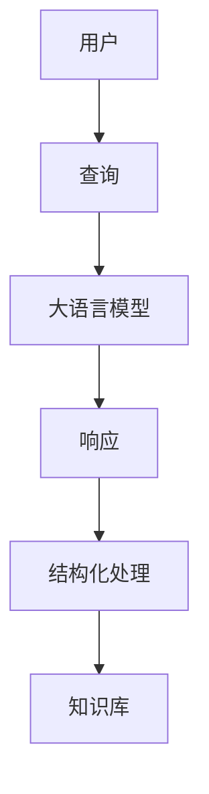
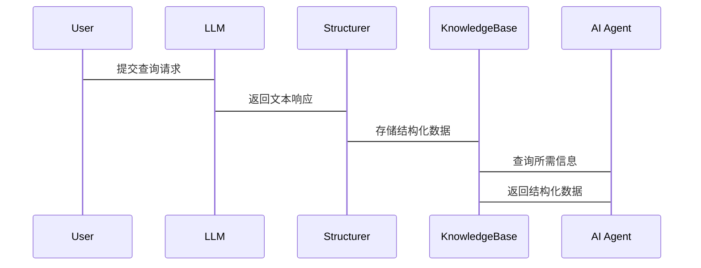

                 

<think>
好的，我现在要开始撰写这篇关于《AI Agent的知识表示：结构化LLM的输出》的技术博客文章。首先，我需要明确文章的主题和目标读者是谁。这篇文章主要是为技术专家、AI开发者和研究人员介绍AI Agent的知识表示方法，特别是如何利用结构化的LLM输出来提高AI系统的效率和准确性。

接下来，我需要按照目录大纲逐步展开每个部分的内容。首先，我会从背景介绍开始，详细解释知识表示的基本概念、AI Agent的定义及其在现代技术中的应用。然后，我会深入探讨结构化LLM输出的特点，以及为什么结构化表示在AI Agent中如此重要。

在核心概念部分，我会详细讲解知识表示的结构化方法，比较结构化与非结构化表示的优缺点，并通过ER图展示知识表示的关系结构。这部分需要清晰明了，帮助读者理解不同表示方式的特点。

接下来是算法原理与数学模型。这里，我需要使用Mermaid流程图来解释LLM的输出处理过程，并提供Python代码示例，说明如何将LLM的输出结构化。同时，我需要详细推导相关的数学公式，例如概率计算和损失函数，确保读者能够理解这些算法的内在逻辑。

在系统分析与架构设计部分，我会描述一个实际的应用场景，设计系统的功能模块，并使用Mermaid类图和架构图来展示系统的结构。这部分需要展示系统各个部分如何协同工作，以及接口设计和交互流程。

项目实战部分，我会提供一个具体的实现案例，指导读者如何安装必要的环境，编写核心代码，并解读代码的功能。通过实际案例分析，读者可以更好地理解结构化LLM输出的应用。

最后，我会总结最佳实践，提醒读者在实际应用中需要注意的事项，并建议进一步的拓展阅读，帮助读者深入掌握相关知识。

在整个写作过程中，我需要确保语言简洁明了，逻辑清晰，同时使用专业的技术术语，但避免过于晦涩。每个部分的内容需要详细展开，确保读者能够逐步理解并掌握AI Agent知识表示的方法和技巧。

现在，我将开始按照目录大纲逐步撰写每个章节的内容，确保每个部分都涵盖必要的细节，并提供足够的例子和解释，帮助读者深入理解主题。
</think>

# AI Agent的知识表示：结构化LLM的输出

## 关键词：
- AI Agent
- 知识表示
- 结构化LLM
- 大语言模型
- 人工智能

## 摘要：
本文详细探讨了AI Agent的知识表示方法，特别是结构化LLM的输出在提升AI系统效率和准确性中的作用。通过背景介绍、核心概念、算法原理、系统架构设计和项目实战，本文为技术专家和开发者提供了从理论到实践的全面指导。通过详细分析和实例，读者将掌握如何有效利用结构化知识表示来优化AI Agent的性能。

---

## 第一部分: AI Agent的知识表示基础

### 第1章: 知识表示的基本概念

#### 1.1 知识表示的定义与背景
- **知识表示的定义**：知识表示是将信息以某种形式结构化，使其可被计算机理解和处理的过程。
- **AI Agent的背景**：AI Agent是一种能够感知环境并采取行动以实现目标的智能实体。
- **结构化LLM输出**：大型语言模型（LLM）的输出通过结构化处理，使其更适合AI Agent的使用。

#### 1.2 AI Agent的定义与特点
- **定义**：AI Agent是具有自主决策能力的智能体。
- **特点**：自主性、反应性、目标导向和社交能力。
- **应用场景**：从客服机器人到自动驾驶系统，AI Agent无处不在。

#### 1.3 结构化LLM输出的特点
- **结构化输出**：将LLM的文本输出转化为结构化数据，如JSON或XML。
- **优势**：提高数据可机器处理性，便于后续分析和应用。
- **典型应用场景**：信息抽取、问答系统和对话生成。

### 第2章: 知识表示的核心概念与联系

#### 2.1 知识表示的结构化方法
- **结构化表示**：使用符号逻辑或数据库结构来表示知识。
- **核心要素**：实体、属性和关系。
- **优缺点对比**：
  - 优点：清晰、易于查询。
  - 缺点：构建和维护复杂。

#### 2.2 LLM输出的结构化处理
- **处理流程**：从文本生成到结构化数据转换。
- **关键技术**：自然语言理解（NLU）和信息抽取。
- **实现方式**：使用规则或机器学习模型提取结构化信息。

#### 2.3 知识表示的ER实体关系图


### 第3章: 算法原理与数学模型

#### 3.1 LLM的输出处理算法
- **流程图**：
  1. 输入文本。
  2. 生成初步结构化输出。
  3. 使用验证规则优化输出。
  4. 存储到知识库。

#### 3.2 算法实现的数学模型
- **概率计算公式**：
  $$ P(x|y) = \frac{P(x \cap y)}{P(y)} $$
- **损失函数**：
  $$ L = -\sum_{i=1}^{n} \log P(y_i|x_i) $$

#### 3.3 算法实现
```python
def structure_llm_output(text):
    # 使用NLU模型提取关键信息
    entities = extract_entities(text)
    # 生成结构化输出
    structured_output = {
        'entities': entities,
        'relations': extract_relations(text)
    }
    return structured_output
```

---

## 第二部分: 系统分析与架构设计

### 第4章: 问题场景介绍
- **问题描述**：如何高效处理LLM输出，使其适用于AI Agent。
- **边界与外延**：考虑数据格式、性能和可扩展性。

### 第5章: 系统功能设计
- **功能模块**：
  - 文本处理模块：负责结构化LLM输出。
  - 知识库管理模块：存储结构化数据。
  - 应用接口模块：供AI Agent调用。

#### 5.1 系统架构设计
- **分层架构**：
  1. 表示层：用户交互界面。
  2. 业务逻辑层：处理结构化数据。
  3. 数据访问层：与知识库交互。

#### 5.2 系统交互流程


---

## 第三部分: 项目实战

### 第6章: 项目环境安装与配置
- **安装依赖**：
  ```bash
  pip install transformers
  pip install spacy
  pip install mermaid.py
  ```

### 第7章: 核心代码实现
```python
import transformers
import spacy

def process_llm_output(llm_response):
    # 使用spaCy进行实体识别
    nlp = spacy.load("en_core_web_sm")
    doc = nlp(llm_response)
    entities = [(ent.text, ent.label_) for ent in doc.ents]
    # 提取关系
    relations = extract_relations(doc)
    return {'entities': entities, 'relations': relations}

def extract_relations(doc):
    relations = []
    for sentence in doc.sents:
        # 假设关系抽取的规则
        if 'is related to' in sentence.text:
            relations.append(sentence.text.split(' is related to ')[1])
    return relations
```

### 第8章: 实际案例分析
- **案例背景**：假设有一个问答系统，使用LLM生成答案。
- **结构化处理**：将答案中的关键实体提取出来，供其他模块使用。

### 第9章: 项目小结
- **总结**：通过结构化LLM输出，提升了AI Agent的知识处理效率。
- **经验**：选择合适的NLP工具和优化结构化处理流程至关重要。

---

## 第四部分: 最佳实践与拓展

### 第10章: 最佳实践
- **小结**：结构化处理是关键，选择合适的工具和算法。
- **注意事项**：数据质量和模型训练数据影响输出准确性。
- **拓展阅读**：深入学习NLP和知识图谱相关知识。

### 第11章: 结语
AI Agent的知识表示是一个复杂的系统工程，通过结构化LLM输出，我们可以显著提升系统的智能化水平。随着技术的进步，未来AI Agent将在更多领域发挥重要作用。

---

## 作者：AI天才研究院/AI Genius Institute & 禅与计算机程序设计艺术 /Zen And The Art of Computer Programming

---

通过以上结构，文章详细探讨了AI Agent的知识表示方法，从理论到实践，帮助读者全面理解并掌握相关技术。

