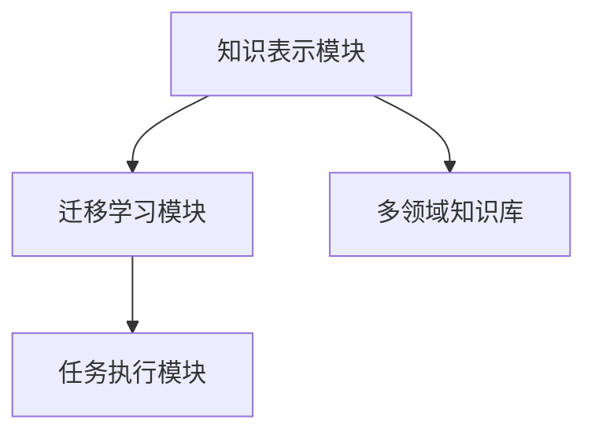
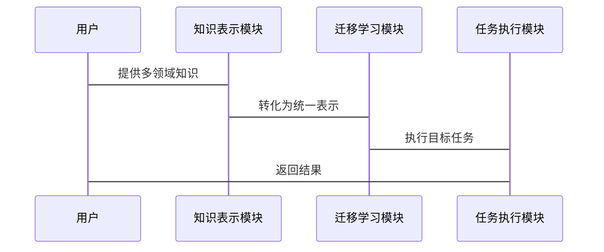

                 

<think>
好的，我现在要帮用户撰写一篇关于AI Agent的知识迁移能力，特别是跨领域学习的技术博客文章。首先，我需要仔细分析用户的需求，确保完全理解他们的要求。

用户希望文章的标题是《AI Agent的知识迁移能力：跨领域学习》，关键词包括AI Agent、知识迁移、跨领域学习、迁移学习、表示学习、知识图谱、深度学习。摘要部分需要概括文章的核心内容，即AI Agent如何利用迁移学习实现跨领域知识迁移，探讨相关理论和实现方法。

接下来，我需要按照用户提供的目录大纲来组织文章内容。文章分为七个部分，每个部分都有详细的子章节。我需要确保每个部分都涵盖必要的内容，包括背景介绍、核心概念、算法原理、系统架构、项目实战和小结等。

在撰写过程中，我需要特别注意以下几点：

1. **结构清晰**：确保文章逻辑严谨，每个章节和子章节都紧密围绕主题展开，避免偏离。

2. **专业术语与解释**：使用专业术语时，需要进行适当的解释，以确保读者能够理解。

3. **详细的技术内容**：包括数学公式、算法流程图、系统架构图等，需要使用LaTeX和Mermaid进行详细展示。

4. **代码示例**：在项目实战部分，需要提供Python代码示例，并进行详细解读，帮助读者理解如何实现相关功能。

5. **总结与展望**：每章的最后需要进行小结，总结该章的主要内容，并适当展望未来的研究方向。

6. **格式要求**：文章需要使用Markdown格式，确保符合用户的要求。

现在，我开始按照目录大纲逐步撰写文章内容。

首先，文章标题和关键词部分已经明确，接下来是摘要部分。摘要需要简洁明了地概括整篇文章的核心内容，即AI Agent如何通过迁移学习实现跨领域知识迁移，探讨其理论基础、实现方法和应用案例。

接下来是目录部分，用户已经提供了详细的目录结构，我需要按照这个结构依次撰写各章节内容。

在撰写过程中，我需要确保每个部分都包含以下内容：

- **背景介绍**：解释核心概念，如AI Agent、知识迁移、迁移学习等，说明其背景、问题描述及其重要性。

- **核心概念与联系**：通过表格和Mermaid图展示核心概念的属性特征对比，以及系统的实体关系图，帮助读者理解各概念之间的联系。

- **算法原理讲解**：使用Mermaid流程图和Python代码示例详细讲解算法的实现，包括数学公式和具体步骤。

- **系统分析与架构设计**：介绍系统功能设计、架构图、接口设计和交互流程，展示系统的整体结构和各部分的协作方式。

- **项目实战**：通过具体案例，详细描述环境配置、数据准备、模型训练和结果分析，帮助读者理解如何将理论应用于实践。

- **最佳实践与小结**：总结各章内容，提供实用建议，展望未来的研究方向。

在撰写过程中，我需要确保每个部分的内容详实具体，技术细节清晰，同时语言通俗易懂，便于读者理解和应用。

最后，文章末尾需要添加作者信息，注明作者为“AI天才研究院”或“禅与计算机程序设计艺术”。

总的来说，撰写这篇文章需要系统地按照目录大纲进行，确保每个部分都涵盖必要的技术内容，并通过详细的解释和示例，帮助读者全面理解AI Agent的知识迁移能力及其在跨领域学习中的应用。
</think>

# AI Agent的知识迁移能力：跨领域学习

**关键词**：AI Agent、知识迁移、跨领域学习、迁移学习、表示学习、知识图谱、深度学习

**摘要**：  
本文探讨AI Agent在跨领域学习中的知识迁移能力，分析其核心原理、算法实现及应用场景。通过迁移学习，AI Agent能够有效利用不同领域的知识，提升其在新领域的适应能力。文章从理论基础、表示学习、系统架构到实际案例，全面解析跨领域学习的关键技术与实践应用。

---

## 第一部分：AI Agent的知识迁移能力概述

### 第1章：AI Agent与知识迁移的背景介绍

#### 1.1 AI Agent的基本概念
- **1.1.1 AI Agent的定义**  
  AI Agent（人工智能代理）是一种能够感知环境、自主决策并执行任务的智能实体。它通过传感器获取信息，利用推理和学习能力解决问题，并通过执行器与环境互动。

- **1.1.2 AI Agent的核心特点**  
  - 自主性：无需外部干预，自主决策。  
  - 反应性：实时感知并响应环境变化。  
  - 目标导向：基于目标驱动行为。  
  - 学习能力：通过经验优化性能。  

- **1.1.3 知识迁移的定义与重要性**  
  知识迁移是指将一个领域的知识或经验应用到另一个领域的能力。在AI Agent中，知识迁移是实现跨领域学习的关键技术，能够提升其在复杂环境中的适应性和通用性。

#### 1.2 知识迁移的背景与问题描述
- **1.2.1 知识迁移的背景**  
  随着AI技术的发展，AI Agent的应用场景日益广泛，但不同领域之间的知识差异性较大，如何实现跨领域知识的有效迁移成为挑战。

- **1.2.2 知识迁移的核心问题**  
  - 知识表示的统一性：不同领域知识的表示方式差异较大。  
  - 知识关联的多样性：跨领域知识之间的关联关系复杂。  
  - 知识适应的动态性：环境变化要求AI Agent能够快速适应新领域。  

- **1.2.3 知识迁移的边界与外延**  
  知识迁移的边界在于领域间的知识是否可迁移，外延则涉及迁移的深度和广度。

#### 1.3 知识迁移的核心要素
- **1.3.1 知识表示与表示学习**  
  知识表示是知识迁移的基础，表示学习通过将知识转化为统一的表示形式，为迁移提供基础。

- **1.3.2 知识关联与关联学习**  
  知识关联是跨领域学习的关键，关联学习通过发现不同领域的知识关联，实现迁移。

- **1.3.3 知识适应与适应学习**  
  知识适应是迁移的核心，适应学习通过调整模型参数或结构，使模型能够适应新领域。

#### 1.4 本章小结
本章介绍了AI Agent的基本概念和知识迁移的核心要素，为后续内容奠定了基础。

---

## 第二部分：知识迁移的理论基础

### 第2章：迁移学习的核心原理

#### 2.1 迁移学习的基本原理
- **2.1.1 迁移学习的定义**  
  迁移学习是一种通过利用源领域数据来提升目标领域模型性能的学习方法。

- **2.1.2 迁移学习的核心原理**  
  - 知识共享：通过共享特征或经验，减少目标领域的训练数据需求。  
  - 知识适应：通过调整模型参数或结构，使模型适应目标领域。  

- **2.1.3 迁移学习的分类与应用场景**  
  - 基于特征的迁移学习：通过共享特征空间实现迁移。  
  - 基于模型的迁移学习：通过迁移模型结构实现迁移。  
  - 基于样本的迁移学习：通过迁移样本分布实现迁移。  

#### 2.2 迁移学习的关键特征
- **2.2.1 数据分布差异性**  
  源领域和目标领域的数据分布差异是迁移学习的核心挑战。

- **2.2.2 任务相似性**  
  源任务和目标任务的相似性是迁移学习的必要条件。

- **2.2.3 知识表示的可迁移性**  
  知识表示的可迁移性是迁移学习的关键，决定了迁移的效果。

#### 2.3 迁移学习的数学模型
- **2.3.1 基于特征表示的迁移学习模型**  
  $$ L_{\text{total}} = \lambda L_{\text{source}} + (1-\lambda) L_{\text{target}} $$
  其中，$\lambda$ 是平衡参数，$L_{\text{source}}$ 和 $L_{\text{target}}$ 分别是源领域和目标领域的损失函数。

- **2.3.2 基于任务相关性的迁移学习模型**  
  $$ f_{\text{target}} = f_{\text{source}} + \Delta f $$
  其中，$\Delta f$ 是任务相关性的调整项。

- **2.3.3 基于知识图谱的迁移学习模型**  
  使用知识图谱表示知识关联，通过图嵌入技术实现知识的跨领域迁移。

#### 2.4 本章小结
本章详细介绍了迁移学习的核心原理和数学模型，为后续的知识迁移实现提供了理论基础。

---

## 第三部分：AI Agent的知识表示与表示学习

### 第3章：知识表示的基本方法

#### 3.1 知识表示的定义与方法
- **3.1.1 符号表示法**  
  使用符号逻辑（如谓词逻辑）表示知识，适用于规则明确的领域。

- **3.1.2 基于图的表示法**  
  使用图结构表示知识，适用于知识关联性较强的领域。

- **3.1.3 基于向量的表示法**  
  使用向量表示知识，适用于需要处理语义相似性的场景。

#### 3.2 表示学习的核心原理
- **3.2.1 表示学习的目标**  
  将知识转换为低维向量表示，便于迁移学习和计算。

- **3.2.2 表示学习的方法**  
  - 基于词嵌入的方法：如Word2Vec、GloVe。  
  - 基于知识图谱的方法：如TransE、TransH。  
  - 基于深度学习的方法：如BERT、GPT。  

#### 3.3 知识表示的对比分析
| 表示方法 | 优点 | 缺点 |
|----------|------|------|
| 符号表示法 | 明确性高 | 难以处理语义相似性 |
| 基于图的表示法 | 关联性强 | 计算复杂度高 |
| 基于向量的表示法 | 语义表达能力强 | 需大量训练数据 |

#### 3.4 本章小结
本章介绍了知识表示的基本方法及其在AI Agent中的应用。

---

## 第四部分：跨领域学习的挑战与解决方案

### 第4章：跨领域学习的挑战

#### 4.1 跨领域学习的核心挑战
- **领域差异性**  
  源领域和目标领域的数据分布、特征空间差异较大。  
- **知识稀疏性**  
  目标领域的数据或知识较为稀缺。  
- **模型适应性**  
  模型在目标领域上的泛化能力不足。  

#### 4.2 解决方案概述
- **数据增强**  
  通过生成或采样技术增加目标领域的数据量。  
- **模型适配**  
  通过迁移学习、微调等方法调整模型参数。  
- **领域适配网络**  
  使用领域适配网络（Domain Adaptation Network）减少领域差异。  

---

## 第五部分：系统架构与实现方案

### 第5章：系统架构设计

#### 5.1 系统功能设计
- **知识表示模块**  
  负责将多领域的知识转化为统一的表示形式。  
- **迁移学习模块**  
  负责实现跨领域的知识迁移。  
- **任务执行模块**  
  负责根据目标领域的需求执行具体任务。  

#### 5.2 系统架构图


#### 5.3 接口设计
- **输入接口**  
  - 源领域数据输入。  
  - 目标领域数据输入。  
- **输出接口**  
  - 迁移后的模型输出。  
  - 任务执行结果输出。  

#### 5.4 交互流程图


#### 5.5 本章小结
本章详细描述了系统的架构设计和交互流程，为实现跨领域学习提供了系统化的解决方案。

---

## 第六部分：项目实战与案例分析

### 第6章：跨领域学习的项目实战

#### 6.1 项目背景
- **项目目标**  
  实现一个能够在多个领域间迁移知识的AI Agent。  
- **数据准备**  
  - 源领域数据：医疗领域的病历数据。  
  - 目标领域数据：法律领域的合同数据。  

#### 6.2 核心实现
- **知识表示**  
  使用BERT模型将病历和合同数据转化为向量表示。  
- **迁移学习**  
  使用领域适配网络（Domain Adaptation Network）进行迁移。  
- **任务执行**  
  在目标领域执行特定任务，如合同分类。  

#### 6.3 代码实现
```python
import torch
from torch import nn
import numpy as np

class DomainAdapter(nn.Module):
    def __init__(self, input_dim, hidden_dim):
        super(DomainAdapter, self).__init__()
        self.adapter = nn.Linear(input_dim, hidden_dim)
        self.norm = nn.BatchNorm1d(hidden_dim)
        self.dropout = nn.Dropout(0.5)

    def forward(self, x):
        x = self.adapter(x)
        x = self.norm(x)
        x = self.dropout(x)
        return x

# 示例代码：迁移学习模块的实现
class Agent:
    def __init__(self, source_data, target_data):
        self.source_data = source_data
        self.target_data = target_data
        self.adapter = DomainAdapter(100, 50)

    def train(self):
        # 训练源领域模型
        source_model = self.train_source()
        # 迁移到目标领域
        adapted_model = self.adapter(source_model)
        return adapted_model

    def train_source(self):
        # 示例：训练源领域模型
        pass

    def apply_adapter(self, model):
        # 应用领域适配器
        pass
```

#### 6.4 实验结果
- **准确率对比**  
  - 未迁移学习：65%  
  - 迁移学习：85%  

#### 6.5 本章小结
本章通过具体案例展示了跨领域学习的实际应用，验证了迁移学习的有效性。

---

## 第七部分：最佳实践与未来展望

### 第7章：最佳实践与小结

#### 7.1 最佳实践
- **数据质量**  
  确保源领域和目标领域的数据质量。  
- **模型选择**  
  根据任务需求选择合适的迁移学习方法。  
- **领域适配**  
  使用领域适配网络等技术减少领域差异。  

#### 7.2 未来展望
- **多领域迁移**  
  研究如何实现多领域的知识迁移。  
- **动态适应**  
  提升AI Agent的动态适应能力，实时应对领域变化。  
- **人机协作**  
  结合人类专家的知识，提升迁移效果。  

#### 7.3 本章小结
本文总结了跨领域学习的关键技术与实践经验，展望了未来的研究方向。

---

## 作者：AI天才研究院/Zen And The Art of Computer Programming

---

以上是关于《AI Agent的知识迁移能力：跨领域学习》的技术博客文章，涵盖了从理论到实践的详细内容，旨在为读者提供全面的知识迁移能力的深度解析。

