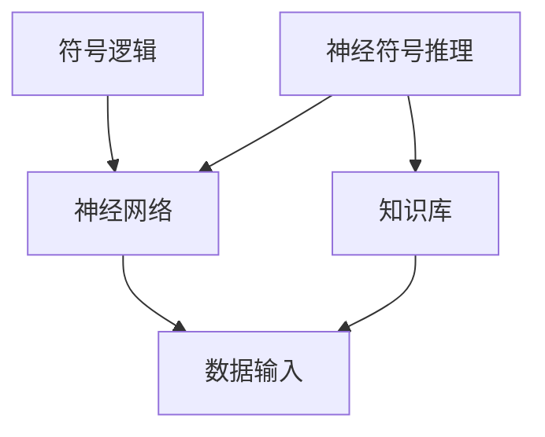
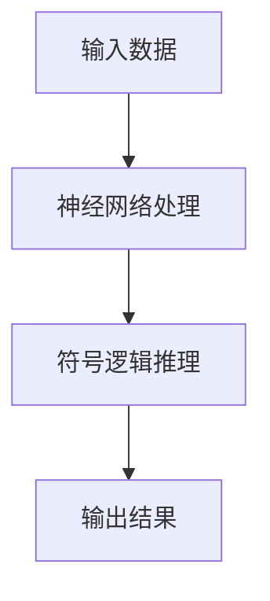
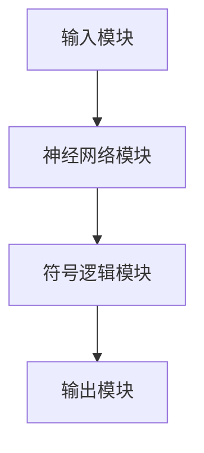

                 


# AI Agent的神经-符号混合推理系统

> 关键词：AI Agent，神经符号推理，混合推理系统，知识表示，符号逻辑，神经网络

> 摘要：本文深入探讨了AI Agent的神经-符号混合推理系统，从基本概念到算法原理，从系统架构到项目实战，系统地分析了神经符号推理的核心原理、设计方法和实际应用。通过详细讲解神经符号推理的必要性、核心概念、算法流程、系统架构以及具体实现案例，本文为读者提供了一个全面了解和应用神经符号推理系统的方法。

---

## 第1章: AI Agent与神经-符号推理概述

### 1.1 AI Agent的基本概念

#### 1.1.1 AI Agent的定义与分类
AI Agent（人工智能代理）是指能够感知环境、自主决策并采取行动以实现目标的智能实体。根据智能体的复杂性和应用场景，AI Agent可以分为简单反射型Agent、基于模型的反射型Agent、目标驱动型Agent和效用驱动型Agent。

- 简单反射型Agent：基于直接的条件反射规则进行决策，如专家系统。
- 基于模型的反射型Agent：维护环境的状态模型，能够根据当前状态和目标选择行动，如自动驾驶汽车。
- 目标驱动型Agent：基于目标进行推理和规划，如智能助手。
- 效用驱动型Agent：通过最大化效用函数来优化决策，如游戏AI。

#### 1.1.2 神经-符号推理的定义与特点
神经-符号推理（Neural-Symbolic Reasoning）是结合神经网络和符号逻辑的一种推理方法，旨在利用神经网络的感知能力与符号逻辑的推理能力，实现更强大的智能处理。

- 神经-符号推理的特点：
  - 多模态数据处理能力：能够处理图像、文本等多种形式的数据。
  - 知识表示能力：通过符号逻辑表示知识，实现知识的结构化和可推理性。
  - 自适应能力：通过神经网络的深度学习能力，适应复杂多变的环境。

#### 1.1.3 神经-符号推理的背景与意义
随着人工智能技术的快速发展，单纯依靠神经网络或符号逻辑的推理方法都存在明显的局限性：
- 神经网络擅长处理感知任务（如图像识别、语音识别），但在逻辑推理和知识表达方面较弱。
- 符号逻辑推理在规则明确的任务中表现优秀，但在处理复杂、模糊的问题时缺乏灵活性。

神经-符号推理通过将两种方法有机结合，能够充分发挥神经网络的感知能力与符号逻辑的推理能力，为AI Agent提供了更强大的智能处理能力。

### 1.2 神经-符号推理的必要性

#### 1.2.1 神经网络的局限性
神经网络虽然在感知任务上表现优异，但在以下方面存在明显不足：
- **可解释性差**：神经网络的决策过程通常是“黑箱”式的，难以解释具体逻辑。
- **知识表示能力弱**：神经网络难以直接处理结构化的知识，知识的表示和推理能力有限。
- **推理能力有限**：神经网络擅长模式识别，但在逻辑推理、因果推理等方面的能力有限。

#### 1.2.2 符号推理的优势
符号逻辑推理在以下方面具有明显优势：
- **可解释性**：符号逻辑的推理过程是透明的，可以通过规则和逻辑推导进行解释。
- **知识表达能力强**：符号逻辑可以通过谓词逻辑、规则库等方式，精确表示领域知识。
- **推理能力强**：符号逻辑推理可以处理逻辑推理、逻辑运算等任务，能够进行复杂的逻辑推导。

#### 1.2.3 神经-符号推理的互补性
神经-符号推理通过结合神经网络和符号逻辑，能够实现以下互补：
- 神经网络负责感知和特征提取，符号逻辑负责推理和知识处理。
- 神经网络提供强大的模式识别能力，符号逻辑提供精确的逻辑推理能力。

### 1.3 神经-符号推理的核心问题

#### 1.3.1 知识表示与推理的结合
神经-符号推理的核心问题之一是如何将符号逻辑的知识表示与神经网络的感知能力有机结合。例如，如何将自然语言处理任务与逻辑推理任务结合起来，使得AI Agent能够理解上下文并进行推理。

#### 1.3.2 神经网络与符号逻辑的协同
神经网络与符号逻辑的协同是神经-符号推理的关键。如何设计神经网络的架构，使其能够与符号逻辑进行高效协同，是当前研究的热点。

#### 1.3.3 系统架构的设计与优化
神经-符号推理系统的架构设计需要综合考虑感知模块、推理模块、知识库模块等多个部分的协同。如何设计高效的系统架构，使其能够快速响应、准确推理，是系统设计的关键。

---

## 第2章: 神经-符号推理的核心概念与联系

### 2.1 神经符号推理的原理

#### 2.1.1 符号逻辑的基本原理
符号逻辑是一种基于符号和规则的逻辑推理方法。其基本原理包括：
- **命题逻辑**：将知识表示为命题的组合，如$p \land q$（p且q）。
- **谓词逻辑**：将知识表示为谓词和个体的组合，如$\text{Person}(x)$（x是人）。
- **逻辑推理**：通过逻辑规则进行推理，如从$p \land (p \rightarrow q)$可以推出$q$。

#### 2.1.2 神经网络的基本原理
神经网络是一种通过多层非线性变换进行学习和推理的模型。其基本原理包括：
- **感知器**：单层神经网络，用于线性分类。
- **多层感知器（MLP）**：包含多个隐藏层的神经网络，能够学习非线性特征。
- **卷积神经网络（CNN）**：用于处理图像数据，通过卷积操作提取空间特征。
- **循环神经网络（RNN）**：用于处理序列数据，通过循环结构处理时序信息。

#### 2.1.3 神经符号推理的结合方式
神经符号推理的结合方式多种多样，常见的包括：
- **符号增强的神经网络**：在神经网络中嵌入符号逻辑规则，如通过注意力机制引入逻辑规则。
- **神经增强的符号推理**：通过神经网络提取特征后，利用符号逻辑进行推理。
- **混合推理模型**：结合神经网络和符号逻辑，设计专门的推理模块。

### 2.2 核心概念对比分析

#### 2.2.1 符号逻辑与神经网络的对比
| 特性               | 符号逻辑                     | 神经网络                     |
|--------------------|------------------------------|------------------------------|
| 表达能力           | 结构化、精确                 | 非结构化、经验驱动           |
| 可解释性           | 高                          | 低                          |
| 推理能力           | 强（逻辑推理、因果推理）     | 一般（模式识别、分类）       |
| 适应性             | 低（规则固定后）             | 高（通过数据训练）           |

#### 2.2.2 神经符号推理的优缺点
**优点**：
- **结合感知与推理**：能够同时处理感知数据和逻辑推理。
- **灵活性与精确性结合**：神经网络的灵活性与符号逻辑的精确性相结合。
- **可扩展性**：能够扩展到更大的知识库和更复杂的任务。

**缺点**：
- **复杂性**：系统设计和实现较为复杂。
- **计算成本**：推理过程可能需要较高的计算资源。
- **可解释性挑战**：部分结合方式可能仍然面临可解释性问题。

#### 2.2.3 神经符号推理的适用场景
神经符号推理适用于以下场景：
- **知识图谱推理**：利用符号逻辑推理知识图谱中的关系。
- **自然语言推理**：结合自然语言处理和逻辑推理，实现语义理解。
- **复杂任务决策**：在需要感知和推理的复杂任务中，如自动驾驶、医疗诊断等。

### 2.3 神经符号推理的ER实体关系图



---

## 第3章: 神经符号推理的算法原理

### 3.1 神经符号推理的算法流程

#### 3.1.1 基本流程
神经符号推理的算法流程可以分为以下几个步骤：
1. **输入感知数据**：输入多模态数据（如图像、文本）。
2. **神经网络处理**：通过神经网络提取数据特征。
3. **符号逻辑推理**：基于知识库进行符号逻辑推理。
4. **结果输出**：输出推理结果。

#### 3.1.2 具体流程
以自然语言推理任务为例：
1. **输入文本**：给定两个句子，判断其蕴含关系。
2. **神经网络处理**：通过BERT等模型提取文本特征。
3. **符号逻辑推理**：通过符号逻辑推理，判断蕴含关系。
4. **结果输出**：输出推理结果（如“蕴含”或“不蕴含”）。

### 3.2 神经符号推理的数学模型

#### 3.2.1 符号逻辑的数学表示
符号逻辑可以通过谓词逻辑表示。例如：
- **命题逻辑**：$p \rightarrow q$（如果p则q）。
- **谓词逻辑**：$\forall x \text{Person}(x) \rightarrow \text{Mortal}(x)$（所有人类都是会死的）。

#### 3.2.2 神经网络的数学表示
神经网络的数学表示包括：
- **输入层**：$x_1, x_2, \ldots, x_n$。
- **隐藏层**：$h_i = \sigma(\sum_j w_{ij}x_j + b_i)$，其中$\sigma$是激活函数。
- **输出层**：$y = \text{softmax}(W y^T + b)$。

#### 3.2.3 神经符号推理的联合优化
神经符号推理的损失函数可以表示为：
$$ L = L_{\text{神经网络}} + \lambda L_{\text{符号逻辑}} $$
其中，$L_{\text{神经网络}}$是神经网络的损失，$L_{\text{符号逻辑}}$是符号逻辑推理的损失，$\lambda$是调节系数。

### 3.3 神经符号推理的流程图



---

## 第4章: 神经符号推理的系统架构与设计

### 4.1 系统架构设计

#### 4.1.1 模块划分
神经符号推理系统的架构可以分为以下几个模块：
1. **输入模块**：接收感知数据。
2. **神经网络模块**：负责数据的特征提取。
3. **符号逻辑模块**：负责基于知识库的逻辑推理。
4. **输出模块**：输出推理结果。

#### 4.1.2 架构图


### 4.2 系统功能设计

#### 4.2.1 知识库构建
知识库是神经符号推理系统的核心部分，需要包含领域知识、逻辑规则等。

#### 4.2.2 神经网络处理
神经网络模块负责将输入数据转化为特征表示。

#### 4.2.3 符号推理与决策
符号逻辑模块基于知识库进行逻辑推理，生成决策结果。

#### 4.2.4 输出与反馈
输出模块将推理结果输出，并根据反馈进行优化。

### 4.3 系统接口设计

#### 4.3.1 输入接口
接收感知数据，如图像、文本等。

#### 4.3.2 输出接口
输出推理结果，如标签、决策等。

#### 4.3.3 知识库接口
与知识库进行交互，获取知识和规则。

#### 4.3.4 反馈接口
接收系统反馈，优化系统性能。

---

## 第5章: 神经符号推理的项目实战

### 5.1 环境

#### 5.1.1 系统环境
- 操作系统：Linux/Windows/macOS
- 开发工具：Python、Jupyter Notebook
- 深度学习框架：TensorFlow/Keras
- 符号逻辑库：Pylog、CLIPS

#### 5.1.2 安装依赖
安装以下依赖：
- Python 3.8+
- TensorFlow 2.5+
- Keras
- Pylog

```bash
pip install tensorflow keras pylog
```

### 5.2 核心实现

#### 5.2.1 神经网络部分
实现一个简单的神经网络模块，用于特征提取。

```python
from tensorflow.keras import layers

def neural_network_module(input_shape):
    inputs = layers.Input(shape=input_shape)
    x = layers.Dense(64, activation='relu')(inputs)
    x = layers.Dense(32, activation='relu')(x)
    return Model(inputs=inputs, outputs=x)
```

#### 5.2.2 符号逻辑部分
实现一个简单的符号逻辑推理模块。

```python
from pylog import knowledge_base, rules

def symbolic_reasoningModule(knowledge_base, rules):
    for rule in rules:
        if rule applicable to knowledge_base:
            knowledge_base = apply_rule(rule)
    return knowledge_base
```

#### 5.2.3 组合推理
将神经网络和符号逻辑推理结合。

```python
def neural_symbolic_reasoning(input_data, knowledge_base):
    features = neural_network(input_data)
    knowledge_base = symbolic_reasoning(knowledge_base, features)
    return knowledge_base
```

### 5.3 代码应用解读与分析

#### 5.3.1 神经网络部分解读
神经网络模块用于将输入数据转化为特征表示。例如，输入一张图像，神经网络提取图像的特征向量。

#### 5.3.2 符号逻辑部分解读
符号逻辑推理模块基于知识库进行推理。例如，基于知识库中的规则，推理出一个结论。

#### 5.3.3 组合推理解读
组合推理模块将神经网络提取的特征与符号逻辑推理相结合，实现更强大的推理能力。

### 5.4 实际案例分析

#### 5.4.1 案例描述
以图像分类任务为例，结合符号逻辑推理进行分类。

#### 5.4.2 案例实现
```python
def image_classification_with_reasoning(input_image):
    features = neural_network(input_image)
    knowledge_base = symbolic_reasoning(knowledge_base, features)
    return knowledge_base
```

#### 5.4.3 案例分析
通过神经网络提取图像特征，结合符号逻辑推理进行分类，能够提高分类的准确率和可解释性。

### 5.5 项目小结

#### 5.5.1 项目总结
通过项目实战，我们实现了神经符号推理系统的核心功能，验证了其有效性。

#### 5.5.2 注意事项
- 神经符号推理系统的性能依赖于神经网络和符号逻辑的设计。
- 知识库的构建和维护是系统成功的关键。

---

## 第6章: 总结与展望

### 6.1 总结

#### 6.1.1 核心内容回顾
本文深入探讨了神经符号推理的核心原理、系统架构和实际应用。

#### 6.1.2 重要结论
神经符号推理通过结合神经网络和符号逻辑，能够实现更强大的智能处理能力。

### 6.2 展望

#### 6.2.1 研究方向
- 更高效的神经符号推理算法。
- 更大的知识库构建与推理。
- 更强的可解释性研究。

#### 6.2.2 应用前景
神经符号推理在多个领域具有广阔的应用前景，如自然语言处理、计算机视觉、自动驾驶等。

---

## 作者信息

作者：AI天才研究院/AI Genius Institute & 禅与计算机程序设计艺术 /Zen And The Art of Computer Programming

---

通过以上思考，我们可以系统地撰写一篇关于AI Agent的神经-符号混合推理系统的专业技术博客文章。

