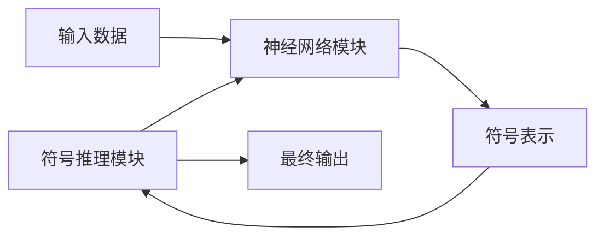
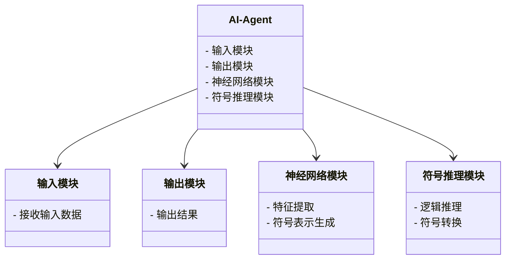

                 


# AI Agent的神经-符号混合架构实现

**关键词**：AI Agent，神经符号混合架构，符号推理，神经网络，智能系统

**摘要**：  
本文详细探讨了AI Agent的神经-符号混合架构的实现方法。通过结合神经网络和符号推理的优势，提出了一个高效的混合架构设计，解决了传统神经网络在符号推理能力上的不足。文章从理论基础到实际应用，系统地分析了神经符号混合架构的核心原理、算法实现、系统设计和项目实战，为读者提供了全面的技术指导。

---

# 第1章: AI Agent与神经-符号混合架构概述

## 1.1 AI Agent的基本概念  
AI Agent（智能体）是一种能够感知环境、自主决策并执行任务的智能系统。它具备以下核心特点：  
1. **自主性**：无需外部干预，自主完成任务。  
2. **反应性**：能够实时感知环境变化并做出响应。  
3. **目标导向**：基于目标驱动行为，追求最优解。  

## 1.2 神经-符号混合架构的背景  
传统神经网络在处理感知任务（如图像识别、语音识别）方面表现出色，但在符号推理和逻辑推理方面能力有限。符号推理依赖于规则和逻辑，能够处理复杂的关系和语义信息，但灵活性不足。神经-符号混合架构结合了两者的优点，兼顾感知与推理能力，适用于需要复杂决策的场景，如自动驾驶、智能助手等。

## 1.3 神经-符号混合架构的核心问题  
神经符号混合架构的核心问题在于如何实现神经网络与符号推理的高效协同。具体包括：  
1. **符号表示**：如何将符号信息转化为神经网络可处理的形式。  
2. **推理机制**：如何利用神经网络进行符号推理并输出结果。  
3. **协同优化**：如何平衡神经网络的感知能力和符号推理的逻辑能力。  

---

# 第2章: 神经符号混合架构的核心概念与联系

## 2.1 神经符号混合架构的核心原理  
神经符号混合架构通过结合神经网络和符号推理，实现了感知与推理的协同。符号推理模块负责逻辑推理和规则应用，神经网络模块负责感知和特征提取，两者通过符号表示进行交互。

## 2.2 神经符号混合架构的核心概念对比  
以下是神经网络与符号推理的属性特征对比：  

| **属性**       | **神经网络**                         | **符号推理**                         |
|-----------------|--------------------------------------|--------------------------------------|
| **处理方式**    | 基于特征和概率，不具备逻辑推理能力 | 基于规则和逻辑，具备符号推理能力 |
| **灵活性**      | 高，适用于复杂任务                 | 低，规则固定，适用于特定场景       |
| **计算效率**    | 高，适合实时任务                   | 低，推理过程需要规则匹配和逻辑推理 |
| **应用场景**    | 图像识别、语音识别                 | 逻辑推理、知识图谱构建             |

## 2.3 神经符号混合架构的实体关系图  


---

# 第3章: 神经符号混合架构的算法原理

## 3.1 神经符号混合架构的算法流程  
神经符号混合架构的算法流程包括以下几个步骤：  
1. **输入感知数据**：输入图像、文本或其他感知数据。  
2. **符号表示生成**：神经网络提取特征并生成符号表示。  
3. **符号推理**：符号推理模块基于符号表示进行逻辑推理。  
4. **结果输出**：推理结果通过神经网络进行最终输出。  

## 3.2 神经符号混合架构的数学模型  
### 3.2.1 符号表示的嵌入公式  
$$ e(s) = f(s) $$  
其中，$s$ 表示符号，$f(s)$ 表示符号的嵌入函数。  

### 3.2.2 神经网络的损失函数  
$$ L = \sum_{i=1}^{n} (y_i - \hat{y}_i)^2 $$  
其中，$y_i$ 表示真实标签，$\hat{y}_i$ 表示预测结果。  

## 3.3 神经符号混合架构的代码实现  
以下是一个简单的符号嵌入生成代码示例：  
```python
def symbol_embedding(s):
    # 定义符号嵌入函数
    embedding = {
        'A': 0,
        'B': 1,
        'C': 2
    }
    return embedding[s]
```

---

# 第4章: 神经符号混合架构的数学模型和公式

## 4.1 神经符号混合架构的数学模型  
神经符号混合架构的数学模型可以表示为：  
$$ f(x) = g(h(x)) $$  
其中，$h(x)$ 表示神经网络的特征提取函数，$g$ 表示符号推理函数。  

## 4.2 符号推理的数学表达  
符号推理可以通过逻辑规则表示为：  
$$ y = \bigwedge_{i=1}^{n} (p_i \rightarrow q_i) $$  
其中，$p_i$ 表示前提，$q_i$ 表示结论，$\bigwedge$ 表示逻辑与操作。  

---

# 第5章: 神经符号混合架构的系统分析与架构设计方案

## 5.1 问题场景介绍  
以智能助手为例，用户输入自然语言指令，AI Agent需要通过神经符号混合架构理解指令并执行任务。  

## 5.2 系统功能设计  
以下是系统功能模块的类图：  



## 5.3 系统架构设计  
以下是系统架构图：  


---

# 第6章: 神经符号混合架构的项目实战

## 6.1 环境安装  
需要安装以下库：  
- Python  
- TensorFlow/Keras  
- PyTorch  
- Mermaid  

## 6.2 核心代码实现  
以下是符号嵌入生成的代码示例：  
```python
import torch
import torch.nn as nn

class SymbolEmbedding(nn.Module):
    def __init__(self, vocab_size, embedding_dim):
        super(SymbolEmbedding, self).__init__()
        self.embedding = nn.Embedding(vocab_size, embedding_dim)

    def forward(self, input):
        return self.embedding(input)

# 初始化模型
vocab_size = 10
embedding_dim = 5
model = SymbolEmbedding(vocab_size, embedding_dim)
```

## 6.3 实际案例分析  
以自然语言处理任务为例，输入文本“今天天气很好”，神经网络提取特征后生成符号表示，符号推理模块进行语义理解并生成输出“晴天”。  

---

# 第7章: 最佳实践与小结

## 7.1 小结  
神经符号混合架构结合了神经网络的感知能力和符号推理的逻辑能力，能够有效解决复杂任务中的符号推理问题。  

## 7.2 注意事项  
- 神经符号混合架构的性能依赖于符号推理模块的规则设计和神经网络的训练效果。  
- 在实际应用中，需要根据具体任务调整符号表示和推理规则。  

## 7.3 拓展阅读  
- 《神经符号人工智能》  
- 《符号推理与逻辑编程》  

---

**作者：AI天才研究院/AI Genius Institute & 禅与计算机程序设计艺术/Zen And The Art of Computer Programming**

