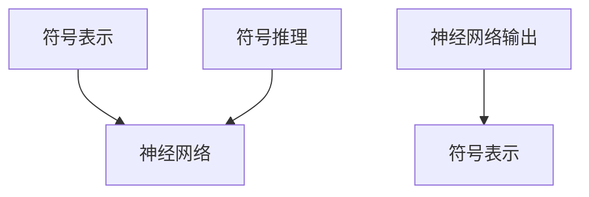
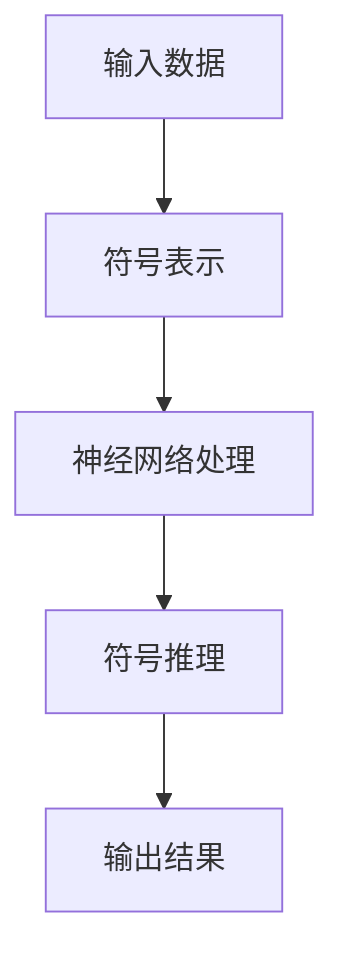
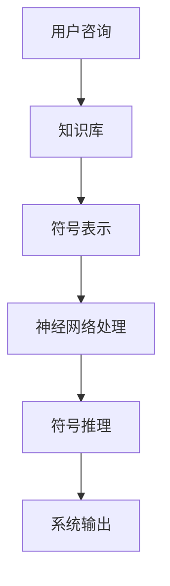

                 


# AI Agent的神经符号整合学习方法

> 关键词：AI Agent，神经符号学习，符号推理，知识图谱，深度学习，可解释性人工智能

> 摘要：神经符号整合学习方法是当前人工智能领域的研究热点，它结合了符号推理和神经网络的优势，能够有效提升AI Agent的知识表示、推理能力和可解释性。本文将系统介绍神经符号整合的背景、核心概念、算法原理、系统架构及实际应用，帮助读者全面理解并掌握这一前沿技术。

---

# 第1章: 神经符号学习的背景与意义

## 1.1 神经符号学习的背景

### 1.1.1 传统符号推理的局限性
传统符号推理方法（如逻辑推理和规则引擎）在处理复杂、模糊或动态变化的问题时表现有限，主要体现在以下方面：
- **规则维护复杂**：随着知识复杂度的增加，规则数量急剧上升，难以维护。
- **缺乏对模糊数据的处理能力**：符号推理依赖明确的逻辑规则，难以处理不完整或模糊的数据。
- **难以与机器学习结合**：传统符号推理方法难以与现代机器学习技术（如深度学习）无缝结合。

### 1.1.2 神经网络的局限性
深度学习虽然在模式识别、自然语言处理等领域取得了突破性进展，但存在以下不足：
- **可解释性差**：深度神经网络的决策过程通常被视为“黑箱”，难以解释。
- **知识表示能力有限**：神经网络难以处理结构化的知识，难以支持复杂的推理任务。
- **数据依赖性强**：深度学习模型需要大量标注数据，难以处理知识推理中的逻辑关系。

### 1.1.3 神经符号整合的必要性
神经符号整合学习（Neural-Symbolic Integration）通过结合符号推理和神经网络的优势，能够解决上述问题，具有重要的研究价值和应用潜力。

## 1.2 AI Agent的基本概念

### 1.2.1 AI Agent的定义与特点
AI Agent（智能体）是一种能够感知环境、自主决策并执行任务的智能系统，具有以下特点：
- **自主性**：能够在没有外部干预的情况下自主运行。
- **反应性**：能够实时感知环境并做出响应。
- **目标导向性**：具备明确的目标，能够采取行动以实现目标。
- **学习能力**：能够通过经验改进自身的性能。

### 1.2.2 知识表示与推理在AI Agent中的作用
知识表示和推理是AI Agent实现智能决策的核心能力：
- **知识表示**：通过某种形式（如符号、知识图谱）表示问题领域的知识。
- **推理能力**：基于知识表示进行逻辑推理，得出新的结论或制定决策。

### 1.2.3 神经符号整合在AI Agent中的应用前景
神经符号整合学习为AI Agent提供了以下优势：
- **增强可解释性**：符号推理的引入使AI Agent的决策过程更加透明。
- **提升推理能力**：结合神经网络的特征提取能力和符号推理的逻辑推理能力，能够处理复杂的推理任务。
- **支持动态环境**：神经符号整合方法能够更好地适应动态变化的环境。

## 1.3 神经符号整合学习的意义

### 1.3.1 提高AI Agent的推理能力
神经符号整合学习通过结合符号推理和神经网络，能够实现更复杂的推理任务，如逻辑推理、知识图谱推理等。

### 1.3.2 增强AI Agent的可解释性
符号推理的引入使得AI Agent的决策过程更加透明，有助于提升系统的可信度。

### 1.3.3 神经符号整合的未来发展趋势
随着神经符号整合研究的深入，AI Agent将在更多领域（如自动驾驶、智能助手、机器人等）展现出更强的智能性。

---

# 第2章: 神经符号学习的核心概念与联系

## 2.1 神经符号学习的核心原理

### 2.1.1 符号表示与神经网络的关系
符号表示为神经网络提供结构化的知识，而神经网络则通过数据驱动的方式增强符号推理的能力。

### 2.1.2 神经符号学习的基本流程
神经符号学习的基本流程包括：
1. **符号表示**：将问题领域中的知识表示为符号形式（如逻辑规则、知识图谱）。
2. **神经网络处理**：利用神经网络对输入数据进行特征提取和表示。
3. **符号推理**：结合符号表示和神经网络输出进行逻辑推理，得到最终结果。

### 2.1.3 神经符号学习的数学基础
神经符号学习的数学基础包括符号逻辑和概率推理，主要涉及以下内容：
- **符号逻辑**：包括命题逻辑、谓词逻辑等。
- **概率推理**：包括贝叶斯推理等方法。

## 2.2 神经符号学习的属性特征对比

### 2.2.1 符号表示的特征
| 特性 | 描述 |
|------|------|
| 确定性 | 符号表示通常基于明确的逻辑规则，具有确定性。 |
| 结构化 | 符号表示具有明确的结构，如知识图谱。 |
| 可解释性 | 符号表示的决策过程通常可以被人类理解。 |

### 2.2.2 神经网络的特征
| 特性 | 描述 |
|------|------|
| 数据驱动 | 神经网络依赖大量数据进行训练。 |
| 非线性表示 | 神经网络能够捕捉数据中的非线性关系。 |
| 黑箱性 | 神经网络的决策过程通常是不可解释的。 |

### 2.2.3 神经符号整合的特征
| 特性 | 描述 |
|------|------|
| 可解释性 | 神经符号整合方法结合了符号推理和神经网络的优势，具有较高的可解释性。 |
| 表达能力 | 神经符号整合方法能够同时处理结构化知识和非结构化数据。 |
| 灵活性 | 神经符号整合方法能够适应不同的应用场景。 |

## 2.3 神经符号学习的ER实体关系图



---

# 第3章: 神经符号学习的算法原理

## 3.1 神经符号学习的基本算法

### 3.1.1 符号增强的神经网络
符号增强的神经网络是一种将符号知识嵌入到神经网络中的方法，主要包括以下步骤：
1. **知识表示**：将符号知识表示为某种形式（如逻辑规则、知识图谱）。
2. **知识嵌入**：将符号知识嵌入到向量空间中，生成知识向量。
3. **神经网络训练**：将知识向量与输入数据一起输入到神经网络中，进行联合训练。

### 3.1.2 神经驱动的符号推理
神经驱动的符号推理是一种利用神经网络生成符号推理规则的方法，主要包括以下步骤：
1. **符号规则生成**：利用神经网络生成符号推理规则。
2. **符号推理**：基于生成的符号推理规则进行逻辑推理，得到最终结果。

### 3.1.3 神经符号混合网络
神经符号混合网络是一种结合符号和神经网络的混合模型，主要包括以下步骤：
1. **符号表示**：将符号知识表示为某种形式。
2. **神经网络处理**：利用神经网络对输入数据进行特征提取。
3. **符号推理**：结合符号表示和神经网络输出进行逻辑推理，得到最终结果。

## 3.2 神经符号学习的实现步骤



## 3.3 神经符号学习的Python实现

### 3.3.1 知识表示与嵌入
以下是一个符号知识嵌入的Python代码示例：

```python
import numpy as np

# 定义符号知识
knowledge = {
    'A': 1,
    'B': 2,
    'C': 3
}

# 嵌入符号知识
def embed_knowledge(knowledge):
    embedding = np.random.rand(len(knowledge), 100)
    return embedding

# 调用嵌入函数
embedding = embed_knowledge(knowledge)
print(embedding)
```

### 3.3.2 神经网络实现
以下是一个简单的神经网络实现示例：

```python
import torch
import torch.nn as nn

# 定义神经网络
class NeuralNetwork(nn.Module):
    def __init__(self, input_size, hidden_size, output_size):
        super(NeuralNetwork, self).__init__()
        self.fc1 = nn.Linear(input_size, hidden_size)
        self.fc2 = nn.Linear(hidden_size, output_size)
    
    def forward(self, x):
        x = torch.relu(self.fc1(x))
        x = self.fc2(x)
        return x

# 初始化网络
input_size = 10
hidden_size = 20
output_size = 5
network = NeuralNetwork(input_size, hidden_size, output_size)
print(network)
```

### 3.3.3 符号推理实现
以下是一个符号推理的Python代码示例：

```python
# 定义符号推理函数
def symbolic_reasoning(knowledge, embedding):
    # 简单的逻辑推理示例
    result = 0
    for key, value in knowledge.items():
        if value > embedding[key]:
            result += 1
    return result

# 调用符号推理函数
result = symbolic_reasoning(knowledge, embedding)
print(result)
```

## 3.4 神经符号学习的数学模型

### 3.4.1 符号逻辑的表示
符号逻辑的表示通常采用谓词逻辑形式，例如：
$$ P(x) \rightarrow Q(x) $$

### 3.4.2 神经网络的损失函数
神经网络的损失函数通常采用交叉熵损失：
$$ L = -\frac{1}{N}\sum_{i=1}^{N} y_i \log p_i + (1-y_i)\log (1-p_i) $$

### 3.4.3 神经符号混合模型
神经符号混合模型的数学表示可以表示为：
$$ f(x) = g(h(x)) $$
其中，$h(x)$是神经网络的输出，$g$是符号推理函数。

---

# 第4章: 神经符号学习的系统架构设计

## 4.1 系统分析与设计

### 4.1.1 问题场景介绍
以智能客服系统为例，系统需要实现以下功能：
1. 用户咨询问题分类。
2. 自动生成回复内容。
3. 实时更新知识库。

### 4.1.2 系统功能设计
系统功能设计包括：
1. **知识库管理**：管理用户咨询问题和回复内容。
2. **符号表示**：将知识库中的知识表示为符号形式。
3. **神经网络处理**：利用神经网络对输入数据进行特征提取。
4. **符号推理**：基于符号表示和神经网络输出进行逻辑推理，生成最终回复。

### 4.1.3 系统架构设计



## 4.2 系统实现与优化

### 4.2.1 知识库管理
知识库管理模块需要实现以下功能：
- 知识库的存储与检索。
- 知识库的动态更新。

### 4.2.2 神经符号混合模型实现
神经符号混合模型的实现包括：
1. 符号知识的嵌入。
2. 神经网络的训练。
3. 符号推理的实现。

### 4.2.3 系统优化策略
系统优化策略包括：
1. 参数优化：采用Adam优化器。
2. 模型压缩：采用知识蒸馏等技术进行模型压缩。
3. 并行计算：利用GPU进行并行计算，提高推理速度。

---

# 第5章: 神经符号学习的项目实战

## 5.1 项目背景与目标

### 5.1.1 项目背景
以智能客服系统为例，项目旨在实现用户咨询问题分类和自动回复生成。

## 5.1.2 项目目标
1. 实现用户咨询问题分类。
2. 自动生成回复内容。
3. 实时更新知识库。

## 5.2 项目实现

### 5.2.1 环境安装
需要安装以下依赖：
- Python 3.8+
- PyTorch
- Transformers
- NetworkX

### 5.2.2 核心代码实现

```python
# 知识库管理模块
class KnowledgeBase:
    def __init__(self):
        self.knowledge = {}

    def add_knowledge(self, key, value):
        self.knowledge[key] = value

    def get_knowledge(self, key):
        return self.knowledge.get(key, None)

# 神经网络模块
class NeuralNetwork:
    def __init__(self, input_size, hidden_size, output_size):
        self.fc1 = nn.Linear(input_size, hidden_size)
        self.fc2 = nn.Linear(hidden_size, output_size)

    def forward(self, x):
        x = torch.relu(self.fc1(x))
        x = self.fc2(x)
        return x

# 符号推理模块
class SymbolicReasoning:
    def __init__(self, knowledge_base):
        self.knowledge_base = knowledge_base

    def reason(self, input_data):
        result = 0
        for key, value in self.knowledge_base.knowledge.items():
            if value > input_data:
                result += 1
        return result

# 主程序
def main():
    knowledge_base = KnowledgeBase()
    knowledge_base.add_knowledge('A', 1)
    knowledge_base.add_knowledge('B', 2)
    knowledge_base.add_knowledge('C', 3)

    network = NeuralNetwork(10, 20, 5)
    input_data = torch.randn(10)
    output_data = network(input_data)
    result = SymbolicReasoning(knowledge_base).reason(output_data)
    print(result)

if __name__ == '__main__':
    main()
```

### 5.2.3 系统功能展示
系统功能展示包括：
1. 知识库管理模块的使用。
2. 神经网络模块的训练与推理。
3. 符号推理模块的应用。

---

# 第6章: 神经符号学习的最佳实践

## 6.1 小结
神经符号整合学习方法结合了符号推理和神经网络的优势，能够有效提升AI Agent的知识表示、推理能力和可解释性。

## 6.2 注意事项
1. 神经符号整合方法的实现需要结合具体应用场景。
2. 神经符号整合方法的训练需要大量高质量的数据。
3. 神经符号整合方法的实现需要考虑计算资源的消耗。

## 6.3 拓展阅读
推荐以下书籍和论文：
- 《Neural-Symbolic Learning: A Survey》
- 《Deep Learning and Symbolic Reasoning》
- 《Neural-Symbolic Integration for Knowledge Graphs》

---

# 作者：AI天才研究院/AI Genius Institute & 禅与计算机程序设计艺术 /Zen And The Art of Computer Programming

---

通过以上章节的详细讲解，读者可以系统地掌握AI Agent的神经符号整合学习方法，包括其背景、核心概念、算法原理、系统架构及实际应用。希望本文能够为读者提供有价值的参考和启发。

