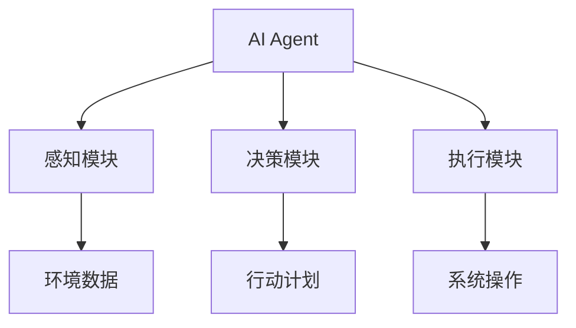
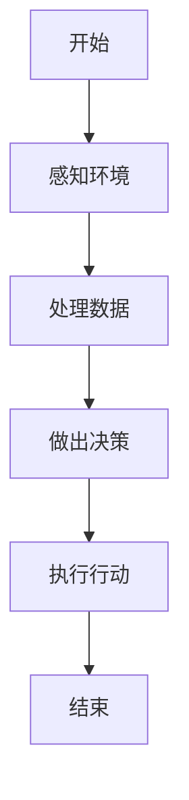
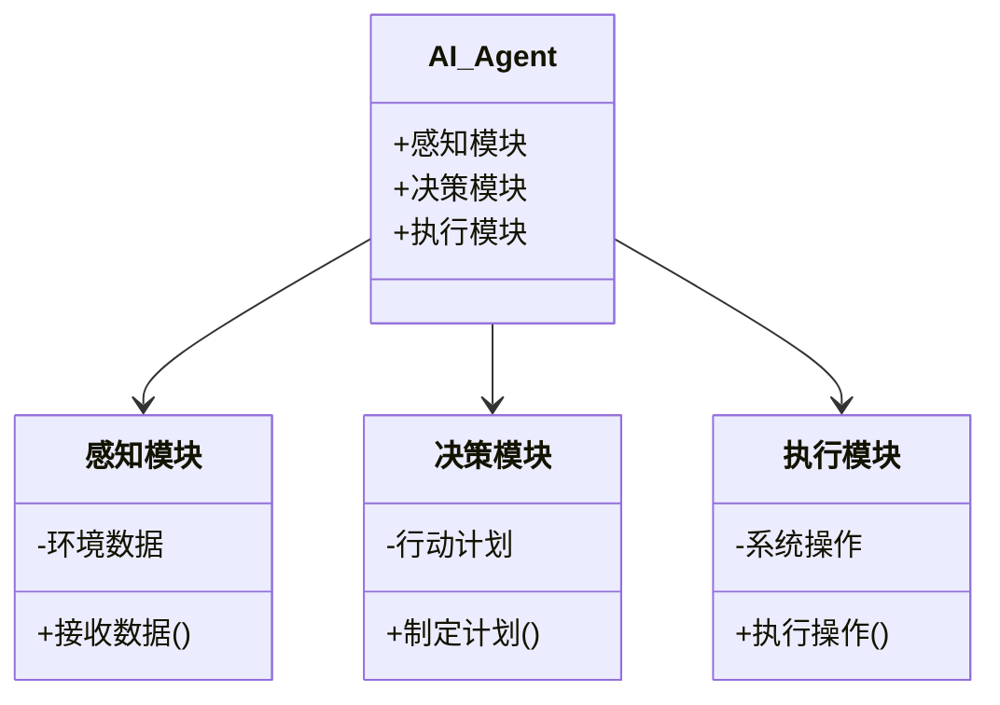

                 

<think>
好，我现在需要根据用户的要求，逐步完成关于《AI Agent的系统架构设计与实现》的技术博客文章。让我一步步来思考和组织内容。

首先，我需要理解用户的需求。用户希望撰写一篇结构清晰、内容详实的技术博客，涵盖AI Agent的系统架构设计与实现，包括背景、核心概念、算法、系统设计、项目实战以及最佳实践等方面。文章需要使用专业技术语言，逻辑清晰，结构紧凑，适合技术读者阅读。

接下来，我按照用户提供的目录大纲开始撰写。首先是第一部分：AI Agent的系统架构设计与实现基础。包括背景介绍、核心概念和算法原理三章。

在背景介绍部分，我需要先定义AI Agent，解释其特点，然后讨论其应用背景和主要应用场景。这部分需要让读者理解AI Agent的基本概念和它在现实中的应用价值。

核心概念部分，我需要详细讲解AI Agent的感知、决策和执行模块，对比不同类型AI Agent的特点，并绘制实体关系图。这需要我使用对比表和Mermaid图来帮助读者理解。

算法原理部分，我需要分析AI Agent的感知和决策算法，介绍数学模型和公式，并绘制流程图。这部分需要结合具体的算法，如Q-learning，并用Python代码示例来解释实现过程。

接下来，第二部分是系统分析与架构设计。我需要介绍系统分析的步骤，包括问题场景、系统功能设计、架构设计等。这部分需要使用Mermaid图来展示领域模型类图、架构图和交互流程。

项目实战部分，我需要选择一个具体的案例，如智能助手的设计与实现，详细讲解环境安装、核心代码实现、案例分析和总结。这需要读者能够通过实际案例理解AI Agent的实现过程。

最后，最佳实践部分包括小结、注意事项和扩展阅读，帮助读者巩固所学内容，并指导进一步的学习方向。

在撰写过程中，我需要确保每个部分都包含必要的细节，如数学公式、算法流程图、类图和序列图。同时，要注意使用正确的格式，如Mermaid语法和LaTeX公式。

现在，我开始撰写每个章节的内容，确保内容详实、逻辑清晰，并符合用户的要求。
</think>

# AI Agent的系统架构设计与实现

> 关键词：AI Agent, 系统架构, 强化学习, 决策算法, 实体关系图, 系统设计

> 摘要：本文详细探讨了AI Agent的系统架构设计与实现，从基本概念到算法原理，再到系统设计和项目实战，全面解析AI Agent的核心原理和实际应用。通过对比分析和案例研究，深入阐述了AI Agent在感知、决策和执行模块中的实现细节，为读者提供了系统化的知识框架和实践指南。

---

# 第1章: AI Agent的基本概念与背景

## 1.1 AI Agent的定义与特点

### 1.1.1 什么是AI Agent
AI Agent（人工智能代理）是一种能够感知环境、做出决策并采取行动的智能实体。它通过与环境交互，实现特定目标，如解决问题、优化流程或提供服务。

### 1.1.2 AI Agent的核心特点
- **自主性**：能够独立运作，无需外部干预。
- **反应性**：能实时感知环境变化并做出反应。
- **目标导向**：所有行为均以实现特定目标为导向。
- **学习能力**：通过经验改进性能。

### 1.1.3 AI Agent与传统程序的区别
AI Agent具备自主性和学习能力，能够处理动态环境中的复杂问题，而传统程序通常执行预定义的任务。

## 1.2 AI Agent的应用背景

### 1.2.1 当前AI技术的发展趋势
AI技术快速发展，推动了AI Agent在各领域的广泛应用，如自动驾驶、智能客服和推荐系统。

### 1.2.2 AI Agent在企业级应用中的价值
AI Agent能够提高效率、降低成本，为企业提供智能化解决方案。

### 1.2.3 AI Agent面临的挑战与机遇
挑战包括环境复杂性和数据隐私，机遇则在于技术进步和应用场景的扩展。

## 1.3 AI Agent的主要应用场景

### 1.3.1 智能助手与人机交互
AI Agent作为智能助手，帮助用户完成信息检索、日程管理等任务。

### 1.3.2 自动化系统与流程优化
在制造业和物流领域，AI Agent优化生产流程，提高效率。

### 1.3.3 智能推荐与决策支持
通过分析用户行为，AI Agent提供个性化推荐和决策支持。

---

# 第2章: AI Agent的核心概念与原理

## 2.1 AI Agent的感知模块

### 2.1.1 感知模块的功能与作用
感知模块负责接收环境数据，识别关键信息，如图像和文本。

### 2.1.2 常见的感知方法
- **基于规则的方法**：使用预定义规则进行判断。
- **基于学习的方法**：利用机器学习模型进行分类和预测。

### 2.1.3 感知模块的实现挑战
需要处理噪声数据和实时性要求，同时确保数据准确性。

## 2.2 AI Agent的决策模块

### 2.2.1 决策模块的功能与作用
决策模块基于感知信息，选择最优行动方案。

### 2.2.2 常见的决策算法
- **强化学习**：通过试错学习策略。
- **知识图谱推理**：利用知识库进行推理。

### 2.2.3 决策模块的实现挑战
涉及多目标优化和复杂决策树的构建。

## 2.3 AI Agent的执行模块

### 2.3.1 执行模块的功能与作用
执行模块将决策转化为具体行动，如发送指令或触发事件。

### 2.3.2 执行模块的实现方式
通过API调用或直接操作环境。

### 2.3.3 执行模块与外部系统的交互
需要处理异构系统接口，确保数据同步和协调。

## 2.4 AI Agent的核心概念对比表

| 模块   | 功能描述                | 示例                     |
|--------|-------------------------|--------------------------|
| 感知   | 接收环境数据            | 图像识别、语音识别        |
| 决策   | 制定行动计划            | 强化学习、知识推理        |
| 执行   | 执行决策                | 控制机器人、发送通知      |

## 2.5 AI Agent的实体关系图



---

# 第3章: AI Agent的算法原理与数学模型

## 3.1 AI Agent的感知算法

### 3.1.1 感知算法的分类
- **基于规则的方法**：简单且易于实现。
- **基于学习的方法**：利用机器学习模型，如卷积神经网络。

### 3.1.2 基于概率的感知算法
使用贝叶斯网络进行概率推理，计算事件发生的概率。

### 3.1.3 基于规则的感知算法
通过预定义规则进行判断，适用于简单场景。

## 3.2 AI Agent的决策算法

### 3.2.1 基于强化学习的决策算法
通过试错学习，优化Q值函数，实现策略改进。

### 3.2.2 基于博弈论的决策算法
在多智能体环境中，通过博弈论进行策略选择。

### 3.2.3 基于知识图谱的决策算法
利用知识图谱进行推理，提供决策支持。

## 3.3 AI Agent的数学模型

### 3.3.1 决策树模型
用于分类和回归，构建决策树进行分类。

### 3.3.2 马尔可夫决策过程
定义状态、动作和奖励的马尔可夫过程，用于强化学习。

### 3.3.3 Q-learning算法的数学公式
$$ Q(s,a) = r + \gamma \max_{a'} Q(s',a') $$

## 3.4 AI Agent的算法流程图



---

# 第4章: AI Agent的系统分析与架构设计

## 4.1 系统分析

### 4.1.1 问题场景
设计一个AI Agent，用于自动化处理订单和客户支持。

### 4.1.2 系统功能设计
- 感知模块：接收订单信息。
- 决策模块：分配处理人员。
- 执行模块：发送通知。

## 4.2 系统架构设计

### 4.2.1 领域模型类图


### 4.2.2 系统架构图


---

# 第5章: AI Agent的项目实战

## 5.1 环境安装

### 5.1.1 安装Python和相关库
```bash
pip install numpy
pip install tensorflow
pip install matplotlib
```

## 5.2 核心代码实现

### 5.2.1 Q-learning算法实现
```python
import numpy as np

class QLearning:
    def __init__(self, state_space, action_space, gamma=0.9):
        self.gamma = gamma
        self.q_table = np.zeros((state_space, action_space))
    
    def choose_action(self, state, epsilon=0.1):
        if np.random.random() < epsilon:
            return np.random.randint(0, action_space)
        return np.argmax(self.q_table[state])
    
    def update(self, state, action, reward, next_state):
        self.q_table[state, action] = reward + self.gamma * max(self.q_table[next_state])
```

### 5.2.2 感知模块实现
```python
import cv2

class PerceptionModule:
    def __init__(self):
        self.cap = cv2.VideoCapture(0)
    
    def get_image(self):
        ret, frame = self.cap.read()
        return frame
```

## 5.3 案例分析与总结
通过实现一个简单的AI Agent，展示了从感知到决策的完整流程，并分析了代码实现中的关键点。

---

# 第6章: 最佳实践与注意事项

## 6.1 小结
本文详细讲解了AI Agent的系统架构设计与实现，从理论到实践，帮助读者全面理解AI Agent的核心原理和实现方法。

## 6.2 注意事项
- 确保数据安全和隐私保护。
- 处理动态环境时，需实时调整策略。
- 在实际应用中，考虑系统的可扩展性和可维护性。

## 6.3 拓展阅读
- 推荐阅读《强化学习实战》和《人工智能：现代方法》。

---

作者：AI天才研究院  
 Zen And The Art of Computer Programming

