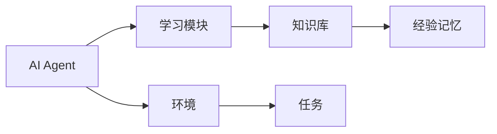

                 


# AI Agent的终身学习系统实现

> 关键词：AI Agent，终身学习系统，机器学习，强化学习，自适应系统

> 摘要：本文详细探讨了AI Agent的终身学习系统实现，从核心概念、算法原理到系统架构，再到项目实战，全面解析如何构建一个能够持续学习和适应的AI Agent系统。通过实例分析和详细讲解，帮助读者理解并掌握AI Agent终身学习系统的实现方法。

---

## 第一部分: AI Agent的终身学习系统背景与核心概念

### 第1章: AI Agent的基本概念与类型

#### 1.1 AI Agent的定义与特点
- **1.1.1 AI Agent的定义**  
  AI Agent（人工智能代理）是指在特定环境中能够感知并自主行动以实现目标的智能实体。它能够通过与环境交互，动态调整行为以适应变化。

- **1.1.2 AI Agent的核心特点**  
  - 自主性：能够在没有外部干预的情况下独立运作。  
  - 反应性：能够实时感知环境并做出响应。  
  - 目标驱动：通过实现特定目标来指导行为。  
  - 学习能力：能够通过经验改进性能。

- **1.1.3 AI Agent与传统AI的区别**  
  AI Agent强调与环境的动态交互和自主决策，而传统AI更多关注静态问题的求解。

#### 1.2 AI Agent的类型
- **1.2.1 简单反射型Agent**  
  根据当前感知直接执行预定义的行为，不涉及学习或推理。

- **1.2.2 基于模型的反射型Agent**  
  维护环境模型，并根据模型进行推理和规划，能够处理复杂任务。

- **1.2.3 目标驱动型Agent**  
  以特定目标为导向，通过规划和推理实现目标。

- **1.2.4 学习型Agent**  
  具备学习能力，能够通过经验改进性能，适应新环境。

- **1.2.5 综合型Agent**  
  结合多种类型的优势，具备复杂任务处理能力。

#### 1.3 AI Agent的核心功能
- **1.3.1 感知功能**  
  通过传感器或接口获取环境信息。

- **1.3.2 决策功能**  
  根据感知信息做出决策，选择最优行动。

- **1.3.3 执行功能**  
  执行决策并输出行动，影响环境状态。

- **1.3.4 学习功能**  
  通过经验改进感知、决策和执行能力。

### 第2章: 终身学习系统的背景与重要性

#### 2.1 终身学习系统的定义
终身学习系统是指能够持续从经验中学习并适应新环境的智能系统，具备在线学习和自适应能力。

#### 2.2 终身学习系统的核心特点
- 持续性：能够不断学习新知识，适应变化。
- 自适应性：根据环境反馈调整行为策略。
- 累积性：能够积累经验，避免重复犯错。

#### 2.3 终身学习系统在AI Agent中的重要性
- 提高AI Agent的泛化能力和适应性。
- 支持复杂动态环境中的任务执行。
- 实现长期目标的持续优化。

#### 2.4 终身学习系统的应用场景
- 智能助手：提供个性化服务，如智能音箱、智能手机助手。
- 自动驾驶：在复杂交通环境中实时学习和调整驾驶策略。
- 机器人控制：在工业或服务场景中动态调整行为。

---

## 第二部分: 终身学习系统的核心概念与联系

### 第3章: 终身学习系统的核心概念

#### 3.1 终身学习系统的概念模型
- **知识表示**：采用符号逻辑、神经网络等方法表示知识。
- **学习策略**：包括监督学习、无监督学习、强化学习等。
- **经验记忆**：存储历史经验，供后续学习和决策参考。

#### 3.2 核心概念的属性特征对比
| 概念       | 属性特征                   |
|------------|---------------------------|
| 知识表示    | 结构化 vs 非结构化         |
| 学习策略    | 监督 vs 无监督 vs 强化     |
| 经验记忆    | 离线 vs 在线              |

#### 3.3 系统架构中的实体关系


### 第4章: 终身学习系统的核心算法

#### 4.1 模型无关方法
- **算法流程**：
  ```mermaid
  graph LR
  A[经验] --> B[经验重放]
  B --> C[策略评估]
  C --> D[策略优化]
  ```

- **代码实现**：
  ```python
  def experience_replay(experience):
      # 存储经验
      replay_buffer.append(experience)
      # 随机抽取小批量经验
      batch = random.sample(replay_buffer, batch_size)
      # 训练模型
      for state, action, reward, next_state in batch:
          target = reward + gamma * max(Q(next_state, ·))
          Q(state, action) = target
  ```

- **数学模型**：
  $$ Q(s, a) = Q(s, a) + \alpha (r + \gamma \max Q(s', ·) - Q(s, a)) $$

---

## 第三部分: 终身学习系统的算法原理

### 第5章: 终身学习算法的实现原理

#### 5.1 基于模型的方法
- **算法流程**：
  ```mermaid
  graph LR
  A[状态] --> B[模型预测]
  B --> C[行动选择]
  C --> D[经验存储]
  ```

- **数学公式**：
  $$ V(s) = V(s) + \alpha (r + \gamma V(s') - V(s)) $$

- **代码实现**：
  ```python
  def model_based_learning(states, actions, rewards, next_states):
      for i in range(len(states)):
          target = rewards[i] + gamma * V(next_states[i])
          V(states[i]) = V(states[i]) + alpha * (target - V(states[i]))
  ```

#### 5.2 模型无关方法
- **算法流程**：
  ```mermaid
  graph LR
  A[经验] --> B[经验重放]
  B --> C[策略评估]
  C --> D[策略优化]
  ```

- **代码实现**：
  ```python
  def model_free_learning(batch):
      for state, action, reward, next_state in batch:
          target = reward + gamma * max(Q(next_state, ·))
          Q(state, action) = target
  ```

---

## 第四部分: 终身学习系统的系统分析与架构设计

### 第6章: 终身学习系统的架构设计

#### 6.1 系统功能设计
- **领域模型**：
  ```mermaid
  classDiagram
  class Agent {
      - environment: Environment
      - knowledge_base: KnowledgeBase
      - learning_module: LearningModule
  }
  ```

- **系统架构**：
  ```mermaid
  graph LR
  Agent --> Environment
  Agent --> KnowledgeBase
  Agent --> LearningModule
  ```

#### 6.2 系统接口设计
- **输入接口**：接收环境反馈和用户指令。
- **输出接口**：输出决策和行动，影响环境状态。

#### 6.3 系统交互流程
- **交互流程图**：
  ```mermaid
  sequenceDiagram
  Agent ->> Environment: 感知环境状态
  Environment ->> Agent: 返回反馈
  Agent ->> LearningModule: 更新知识库
  ```

---

## 第五部分: 终身学习系统的项目实战

### 第7章: 终身学习系统的实现案例

#### 7.1 项目介绍
- **项目名称**：智能客服助手
- **项目目标**：通过终身学习系统，提升客服助手的对话理解和问题解决能力。

#### 7.2 核心代码实现
```python
class LifelongLearningAgent:
    def __init__(self):
        self.knowledge_base = {}  # 知识库
        self.learning_module = LearningModule()  # 学习模块

    def perceive(self, environment):
        # 感知环境并获取反馈
        feedback = environment.get_feedback()
        self.learning_module.learn(feedback)

    def act(self):
        # 根据知识库决策行动
        action = self.knowledge_base.get_next_action()
        return action
```

#### 7.3 案例分析与总结
- **案例分析**：通过实际应用，展示终身学习系统在智能客服中的优势。
- **项目总结**：总结实现过程中的经验教训，提出改进建议。

---

## 第六部分: 终身学习系统的最佳实践与总结

### 第8章: 最佳实践与小结

#### 8.1 最佳实践
- **持续优化**：定期更新知识库，保持系统性能。
- **多模态学习**：结合多种学习方法，提升系统适应性。
- **安全与隐私**：确保学习过程中的数据安全和用户隐私。

#### 8.2 总结
终身学习系统是AI Agent实现智能化的核心，通过不断学习和适应，AI Agent能够更好地应对复杂动态环境，为实际应用提供强大支持。

---

## 作者信息

作者：AI天才研究院/AI Genius Institute & 禅与计算机程序设计艺术 /Zen And The Art of Computer Programming

---

通过以上目录大纲，文章内容将详细讲解AI Agent的终身学习系统实现，从基础概念到算法原理，再到系统设计和项目实战，全面覆盖相关内容，确保读者能够深入理解并掌握相关知识。

