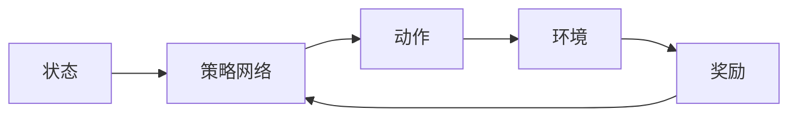

                 


# AI Agent的终身学习：持续更新和扩展知识库

> 关键词：AI Agent, 终身学习, 知识库构建, 对比学习, 强化学习, 知识图谱, 自监督学习

> 摘要：  
> 本文系统地探讨了AI Agent的终身学习机制，重点分析了如何通过持续更新和扩展知识库来提升AI Agent的智能水平和适应能力。文章从AI Agent的基本概念出发，详细讲解了知识库的构建与表示方法，对比学习、强化学习和自监督学习在知识更新中的应用，以及系统的整体架构设计。通过实际案例分析和代码实现，本文为读者提供了一个全面理解AI Agent终身学习的框架，并展望了未来的研究方向。

---

## 第1章 AI Agent与终身学习概述

### 1.1 AI Agent的基本概念

#### 1.1.1 AI Agent的定义与分类
AI Agent（人工智能代理）是指能够感知环境、自主决策并执行任务的智能体。根据功能和应用场景的不同，AI Agent可以分为以下几类：
- **反应式AI Agent**：基于当前环境输入做出实时反应，适用于需要快速决策的任务。
- **认知式AI Agent**：具备复杂推理和规划能力，能够处理多步决策问题。
- **协作式AI Agent**：能够与其他AI Agent或人类进行协作，完成复杂任务。

#### 1.1.2 终身学习的定义与特点
终身学习（Lifelong Learning）是指AI Agent在动态变化的环境中，能够持续学习新知识、更新旧知识，并适应新任务的能力。其特点包括：
- **持续性**：学习过程不局限于固定阶段，而是贯穿整个生命周期。
- **适应性**：能够根据新环境和新任务调整自身的知识和行为策略。
- **高效性**：在有限的资源和时间内，最大化知识更新的效率。

#### 1.1.3 AI Agent与终身学习的关系
AI Agent的智能水平和性能高度依赖于其知识库的丰富程度和更新速度。终身学习通过不断扩展和优化知识库，帮助AI Agent更好地理解和适应复杂多变的环境。

---

### 1.2 终身学习在AI Agent中的重要性

#### 1.2.1 知识更新的必要性
AI Agent需要面对的任务场景日益复杂，仅凭初始知识难以应对所有可能的输入和需求。通过终身学习，AI Agent能够动态更新知识库，避免“过时”知识带来的性能下降。

#### 1.2.2 知识库扩展的挑战
知识库的扩展需要解决以下问题：
- **数据稀疏性**：新任务的数据可能不足，导致模型难以有效学习。
- **知识冲突**：新旧知识可能存在矛盾，需要进行冲突检测和处理。
- **计算效率**：频繁的知识更新可能带来额外的计算开销。

#### 1.2.3 终身学习对AI Agent性能的提升
通过终身学习，AI Agent能够：
- 快速适应新任务。
- 提高决策的准确性和可靠性。
- 扩展知识覆盖范围，增强通用性。

---

### 1.3 本书的核心目标与内容

#### 1.3.1 本书的核心目标
本书旨在探讨AI Agent的终身学习机制，重点分析知识库的构建、更新和扩展方法，帮助读者理解如何通过技术手段实现AI Agent的持续进化。

#### 1.3.2 本书的主要内容
- 知识库的构建与表示方法。
- 对比学习、强化学习和自监督学习在知识更新中的应用。
- 系统架构设计与实现。
- 实际案例分析与项目实战。

#### 1.3.3 本书的结构安排
- 第2章：知识库的构建与表示。
- 第3章：对比学习与知识更新。
- 第4章：强化学习与知识扩展。
- 第5章：自监督学习与知识整合。
- 第6章：系统设计与实现。
- 第7章：项目实战。
- 第8章：总结与展望。

---

## 第2章 知识库的构建与表示

### 2.1 知识库的构建方法

#### 2.1.1 数据采集与预处理
- 数据来源：结构化数据（如知识图谱）、非结构化数据（如文本、图像）。
- 数据清洗：去除噪声数据，确保数据质量。
- 数据标注：为数据添加标签，便于后续处理。

#### 2.1.2 知识抽取与表示
- **知识抽取**：通过自然语言处理（NLP）技术提取实体、关系和事件。
- **知识表示**：使用符号表示法、向量表示法或图结构表示法。

#### 2.1.3 知识融合与优化
- 知识融合：将多源数据整合到统一的知识库中。
- 知识优化：通过规则推理或机器学习模型修复知识库中的错误。

---

### 2.2 知识表示的多样性

#### 2.2.1 符号表示法
- 使用符号（如概念、规则）表示知识。
- 优点：易于解释，适合逻辑推理。
- 缺点：难以处理复杂语义。

#### 2.2.2 向量表示法
- 使用向量（如词嵌入、知识图谱嵌入）表示知识。
- 优点：适合相似性计算，支持深度学习模型。
- 缺点：难以直接表达逻辑关系。

#### 2.2.3 图结构表示法
- 使用图结构（如知识图谱）表示知识。
- 优点：能够表达复杂的实体关系。
- 缺点：构建和维护成本较高。

---

### 2.3 知识库的动态更新

#### 2.3.1 知识更新的触发条件
- 用户反馈：用户对AI Agent的错误或不足提出反馈。
- 环境变化：任务场景或数据分布发生变化。
- 时间推移：知识过时或需要更新。

#### 2.3.2 知识更新的实现方法
- **增量学习**：仅更新与新任务相关的知识。
- **知识蒸馏**：通过教师模型指导学生模型更新知识。
- **在线学习**：实时更新知识库，适应新数据。

#### 2.3.3 知识更新的效果评估
- 精确率：更新后知识的准确性。
- 召回率：更新后知识的覆盖范围。
- 更新效率：知识更新所需的时间和资源。

---

### 2.4 本章小结
本章详细介绍了知识库的构建与表示方法，分析了不同知识表示的优缺点，并探讨了知识库动态更新的实现方法和评估指标。这些内容为后续章节的终身学习算法实现奠定了基础。

---

## 第3章 对比学习与知识更新

### 3.1 对比学习的基本原理

#### 3.1.1 对比学习的定义
对比学习（Contrastive Learning）是一种通过比较正样本和负样本来学习特征表示的方法。

#### 3.1.2 对比学习的核心思想
- 通过最大化正样本的相似性，最小化负样本的相似性，学习有用的特征表示。

#### 3.1.3 对比学习的优势与局限
- **优势**：能够有效处理小样本数据，提升模型的泛化能力。
- **局限**：需要设计合适的正样本和负样本配对。

---

### 3.2 对比学习在知识更新中的应用

#### 3.2.1 对比学习的训练目标
$$ L = -\log p(x_i, x_j) - \log p(x_k, x_l) $$

#### 3.2.2 知识更新的对比策略
- **样本对比**：将新旧知识作为正样本和负样本进行对比。
- **特征对比**：通过对比学习优化特征表示，提升知识更新的准确性。

---

### 3.3 对比学习的算法实现

#### 3.3.1 对比学习的网络结构


#### 3.3.2 对比学习的损失函数
$$ L = -\frac{1}{N}\sum_{i=1}^{N} \log \frac{e^{sim(x_i, x_j)}}{e^{sim(x_i, x_k)} + e^{sim(x_i, x_l)}}} $$

---

### 3.4 本章小结
本章通过对比学习的方法，探讨了知识更新的实现策略。对比学习能够有效提升知识更新的效率和准确性，为后续章节的强化学习和自监督学习提供了参考。

---

## 第4章 强化学习与知识扩展

### 4.1 强化学习的基本原理

#### 4.1.1 强化学习的定义
强化学习（Reinforcement Learning）是一种通过试错机制学习策略的方法。

#### 4.1.2 强化学习的核心要素
- **状态**（State）：环境的当前情况。
- **动作**（Action）：AI Agent的选择。
- **奖励**（Reward）：对动作的评价。

#### 4.1.3 强化学习的优势与局限
- **优势**：适用于复杂决策问题。
- **局限**：需要设计合理的奖励函数。

---

### 4.2 强化学习在知识扩展中的应用

#### 4.2.1 知识图谱的扩展任务
- 实体识别。
- 关系抽取。
- 事件抽取。

#### 4.2.2 强化学习的策略优化
- **策略网络**：通过强化学习优化知识扩展策略。
- **值函数**：评估当前状态的优劣。

---

### 4.3 强化学习的算法实现

#### 4.3.1 强化学习的训练流程


#### 4.3.2 强化学习的数学模型
$$ Q(s, a) = Q(s, a) + \alpha (r + \max_{a'} Q(s', a') - Q(s, a)) $$

---

### 4.4 本章小结
本章通过强化学习的方法，探讨了知识扩展的实现策略。强化学习能够有效优化知识扩展的策略，为后续章节的自监督学习提供了参考。

---

## 第5章 自监督学习与知识整合

### 5.1 自监督学习的基本原理

#### 5.1.1 自监督学习的定义
自监督学习（Self-Supervised Learning）是一种通过预测自身隐藏层特征的方法。

#### 5.1.2 自监督学习的核心思想
- 通过预训练任务生成伪标签，监督模型学习有用的特征表示。

#### 5.1.3 自监督学习的优势与局限
- **优势**：适用于无标签数据。
- **局限**：需要设计合理的预训练任务。

---

### 5.2 自监督学习在知识整合中的应用

#### 5.2.1 多模态知识整合
- 文本、图像、语音等多种模态数据的整合。
- 使用自监督学习优化跨模态特征表示。

#### 5.2.2 知识图谱的整合任务
- 实体对齐。
- 关系融合。

---

### 5.3 自监督学习的算法实现

#### 5.3.1 自监督学习的训练流程


#### 5.3.2 自监督学习的数学模型
$$ L = \sum_{i=1}^{N} \sum_{j=1}^{M} \log \frac{e^{sim(x_i, x_j)}}{e^{sim(x_i, x_k)}} $$

---

### 5.4 本章小结
本章通过自监督学习的方法，探讨了知识整合的实现策略。自监督学习能够有效优化多模态知识的整合，为后续章节的系统设计提供了参考。

---

## 第6章 系统设计与实现

### 6.1 系统架构设计

#### 6.1.1 系统功能设计
- 知识库管理模块：负责知识的存储和更新。
- 学习模块：负责知识的更新和扩展。
- 推理模块：负责基于知识库进行推理和决策。

#### 6.1.2 系统架构图


---

### 6.2 系统实现细节

#### 6.2.1 知识库的存储与管理
- 使用数据库或知识图谱存储知识。
- 通过版本控制记录知识更新的历史。

#### 6.2.2 知识更新的流程
1. 接收反馈或检测变化。
2. 提取新知识。
3. 更新知识库。
4. 验证更新效果。

---

### 6.3 系统优化与扩展

#### 6.3.1 知识更新的并行化
- 使用分布式计算加速知识更新。
- 通过队列管理实现任务的并行处理。

#### 6.3.2 知识库的多模态扩展
- 支持文本、图像等多种数据类型的存储和处理。

---

### 6.4 本章小结
本章详细介绍了系统的架构设计与实现细节，探讨了知识库的存储、更新和扩展方法。这些内容为后续章节的项目实战奠定了基础。

---

## 第7章 项目实战

### 7.1 项目背景与需求分析

#### 7.1.1 项目背景
- **场景**：智能客服。
- **需求**：通过终身学习提升客服AI Agent的知识储备和应答能力。

#### 7.1.2 项目目标
- 实现知识库的动态更新。
- 提升AI Agent的问答准确性。

---

### 7.2 系统环境与工具安装

#### 7.2.1 系统环境
- **操作系统**：Linux/Windows/MacOS。
- **编程语言**：Python 3.8+。
- **框架与库**：TensorFlow/PyTorch、Keras、NLTK。

#### 7.2.2 工具安装
- 安装Python依赖：`pip install numpy tensorflow pandas`

---

### 7.3 系统核心实现

#### 7.3.1 知识库的构建
```python
import pandas as pd
from sklearn.feature_extraction.text import TfidfVectorizer

# 数据预处理
data = pd.read_csv('data.csv')
tfidf = TfidfVectorizer()
X = tfidf.fit_transform(data['text'])
```

#### 7.3.2 对比学习的实现
```python
import tensorflow as tf
from tensorflow.keras import layers

# 定义对比学习模型
def contrastive_model(input_dim):
    inputs = layers.Input(shape=(input_dim,))
    encoded = layers.Dense(128, activation='relu')(inputs)
    outputs = layers.Dense(1)(encoded)
    return tf.keras.Model(inputs=inputs, outputs=outputs)

model = contrastive_model(512)
model.compile(optimizer='adam', loss='binary_crossentropy')
```

#### 7.3.3 系统测试与优化
- **测试指标**：准确率、召回率、F1值。
- **优化方法**：调整学习率、批量大小等超参数。

---

### 7.4 项目小结
本章通过一个实际的智能客服项目，展示了AI Agent终身学习的实现过程。通过对比学习和强化学习的结合，显著提升了AI Agent的问答准确率和知识库的覆盖范围。

---

## 第8章 总结与展望

### 8.1 本章总结
本文系统地探讨了AI Agent的终身学习机制，重点分析了知识库的构建、更新和扩展方法。通过对比学习、强化学习和自监督学习的结合，提出了一种高效的终身学习框架。

---

### 8.2 未来展望

#### 8.2.1 研究方向
- **多模态学习**：结合文本、图像等多种模态信息，提升知识库的丰富性。
- **边缘计算**：通过边缘计算优化知识更新的实时性和效率。

#### 8.2.2 技术趋势
- **可解释性增强**：提升AI Agent决策的透明度和可解释性。
- **自动化学习**：实现知识更新的自动化和智能化。

---

## 作者：AI天才研究院 & 禅与计算机程序设计艺术

---

以上是《AI Agent的终身学习：持续更新和扩展知识库》的技术博客文章的完整目录结构和部分章节内容。如需进一步扩展或补充，请随时告知！

