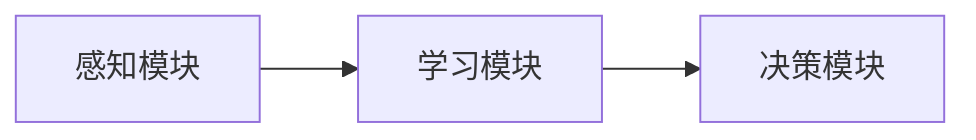
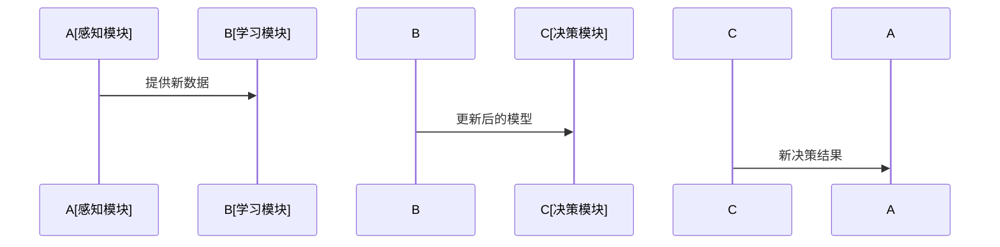

                 

<think>
好的，现在我需要帮用户撰写一篇关于“AI Agent的终身学习：持续适应新知识”的技术博客文章。用户提供了详细的目录大纲和一些示例内容，我需要按照这个结构来完成整篇文章。首先，我要理解每个章节的内容和要求，确保覆盖所有必要的部分，并且内容详实，结构清晰。

首先，文章标题是《AI Agent的终身学习：持续适应新知识》，关键词包括AI Agent、终身学习、持续学习、机器学习、自适应系统、知识更新。摘要部分已经写好，涵盖了文章的核心内容，强调AI Agent在动态环境中的学习能力，涉及持续学习算法、知识蒸馏和模型压缩技术。

接下来，我需要按照目录大纲逐步填充每个章节的内容。

第一部分是AI Agent的终身学习概述，包括第1章和第2章。第1章介绍AI Agent的基本概念和背景，包括定义、特点，终身学习的背景和意义，以及终身学习的必要性。第2章则是技术背景，涵盖机器学习与深度学习基础、持续学习算法的发展历程，以及知识蒸馏与模型压缩技术。

第二部分是终身学习的算法原理，包括第3章，详细讲解经验重放、模型无关和模型相关的持续学习方法，以及数学模型。

第三部分是系统分析与架构设计，第4章，介绍应用场景、系统功能设计、系统架构设计、接口设计和交互设计。

第四部分是项目实战，第5章，提供一个图像分类的项目案例，详细描述环境搭建、代码实现、案例分析和项目小结。

第五部分是最佳实践与总结，第6章，给出小贴士、注意事项和未来趋势。

在撰写过程中，我需要确保每个章节都包含必要的内容：背景介绍、核心概念、算法原理、系统架构、项目实战和最佳实践。同时，使用Mermaid图和Python代码示例来辅助说明，数学公式用Latex格式展示。

现在，我将开始逐一撰写每个章节，确保内容详尽且符合用户的要求。
</think>

# AI Agent的终身学习：持续适应新知识

> 关键词：AI Agent，终身学习，持续学习，机器学习，自适应系统，知识更新

> 摘要：AI Agent的终身学习是指AI代理在动态变化的环境中，能够持续吸收新知识、更新旧知识，以适应不断变化的任务需求。本文从AI Agent的基本概念出发，详细探讨了终身学习的背景与意义，分析了持续学习算法的核心原理，结合数学模型和公式，设计了系统的架构方案，并通过项目实战展示了如何实现AI Agent的终身学习。最后，本文总结了最佳实践经验和未来的发展方向。

---

## 第一部分: AI Agent的终身学习概述

### 第1章: AI Agent的基本概念与背景

#### 1.1 AI Agent的定义与特点

##### 1.1.1 AI Agent的定义
AI Agent（人工智能代理）是指具有感知环境、做出决策并采取行动的能力的智能实体。它可以是一个软件程序，也可以是一个物理机器人。AI Agent的核心目标是通过感知环境信息，执行任务以达到预定的目标。

##### 1.1.2 AI Agent的核心特点
1. **自主性**：AI Agent能够在没有外部干预的情况下自主运作。
2. **反应性**：能够实时感知环境变化并做出相应的反应。
3. **目标导向**：所有行为都围绕实现特定目标展开。
4. **学习能力**：能够通过经验或数据不断优化自身的性能。

##### 1.1.3 AI Agent与传统AI的区别
- 传统AI：依赖预定义的规则和数据，无法自适应变化。
- AI Agent：具备自主学习和自适应能力，能够在动态环境中持续进化。

#### 1.2 终身学习的背景与意义

##### 1.2.1 什么是终身学习
终身学习是指AI Agent在完成初始训练后，能够不断学习新知识、适应新任务的过程。它强调持续的知识更新和能力提升。

##### 1.2.2 AI Agent需要终身学习的原因
- 动态环境：现实世界中的任务和环境不断变化，AI Agent需要适应新的挑战。
- 知识更新：新数据和新任务的出现要求AI Agent能够快速调整模型。
- 复杂问题：复杂问题的解决需要AI Agent具备多样化的知识和技能。

##### 1.2.3 终身学习在AI Agent中的价值
- 提高适应性：在动态环境中保持高效运作。
- 增强通用性：能够处理多种任务，提升应用场景的广泛性。
- 优化性能：通过持续学习不断优化模型，提升准确性。

#### 1.3 AI Agent终身学习的必要性

##### 1.3.1 动态环境下的适应性需求
AI Agent需要在变化的环境中保持稳定性能，比如智能客服在处理不同用户需求时，需要不断调整策略。

##### 1.3.2 知识更新的持续性要求
新知识的出现（如新疾病、新技术）要求AI Agent能够快速学习和应用。

##### 1.3.3 复杂问题的解决能力
复杂问题往往需要多方面的知识，AI Agent通过终身学习能够整合多种信息，提高解决问题的能力。

---

### 第2章: AI Agent终身学习的技术背景

#### 2.1 机器学习与深度学习基础

##### 2.1.1 机器学习的基本概念
机器学习是一种通过数据训练模型，使其能够从经验中学习并做出预测的科学方法。

##### 2.1.2 深度学习的核心原理
深度学习通过多层神经网络模拟人脑的处理方式，能够自动提取数据特征。

##### 2.1.3 机器学习与深度学习的区别
| 特性 | 机器学习 | 深度学习 |
|------|----------|----------|
| 数据需求 | 数据量较小，依赖特征工程 | 数据量大，自动提取特征 |
| 模型复杂度 | 模型简单，易于解释 | 模型复杂，难以解释 |
| 应用场景 | 适合中小规模数据 | 适合大规模数据 |

#### 2.2 持续学习算法的发展历程

##### 2.2.1 持续学习的定义与特点
持续学习是一种机器学习范式，允许模型在新数据流上逐步学习，而不是一次性训练。

##### 2.2.2 持续学习算法的分类
- **模型无关方法**：不依赖特定模型架构，适用于各种任务。
- **模型相关方法**：依赖特定模型架构，通常需要调整模型参数。

##### 2.2.3 持续学习算法的发展趋势
从简单的经验重放到复杂的知识蒸馏，持续学习算法逐渐走向高效和实用。

#### 2.3 知识蒸馏与模型压缩技术

##### 2.3.1 知识蒸馏的基本原理
知识蒸馏通过将大型模型（教师模型）的知识迁移到小模型（学生模型），提升小模型的性能。

##### 2.3.2 模型压缩的核心方法
- 参数剪枝：删除冗余参数。
- 知识蒸馏：通过教师模型指导学生模型学习。
- 量化：降低模型参数的精度，减少模型大小。

##### 2.3.3 知识蒸馏与模型压缩的结合应用
结合知识蒸馏和模型压缩，可以在保持模型性能的同时，显著降低计算资源消耗。

---

## 第二部分: 终身学习的算法原理

### 第3章: 终身学习算法的原理与实现

#### 3.1 经验重放机制

##### 3.1.1 经验重放的基本原理
经验重放通过存储历史经验，避免模型遗忘先前的知识。

##### 3.1.2 经验重放的实现流程
```python
class ExperienceReplay:
    def __init__(self, capacity):
        self.capacity = capacity
        self.memory = []

    def remember(self, state, action, reward, next_state, done):
        self.memory.append((state, action, reward, next_state, done))

    def sample(self, batch_size):
        if len(self.memory) < batch_size:
            return []
        return random.sample(self.memory, batch_size)
```

##### 3.1.3 经验重放的优缺点
- 优点：防止模型仅依赖最近经验，提高泛化能力。
- 缺点：存储需求大，可能导致训练时间增加。

#### 3.2 模型无关的持续学习方法

##### 3.2.1 模型无关方法的核心思想
模型无关方法通过更新模型参数，避免模型遗忘旧知识。

##### 3.2.2 模型无关方法的实现
```python
def model_free_learning(new_data):
    model.fit(new_data)
```

##### 3.2.3 模型无关方法的优缺点
- 优点：适用于多种任务，易于实现。
- 缺点：可能需要大量数据，学习效率较低。

#### 3.3 模型相关的持续学习方法

##### 3.3.1 模型相关方法的核心思想
通过调整模型架构，适应新任务。

##### 3.3.2 模型相关的实现
```python
def model_based_learning(new_task):
    model.add_layer()
    model.fit(new_task)
```

##### 3.3.3 模型相关方法的优缺点
- 优点：学习效率高，适合特定任务。
- 缺点：适应性较弱，难以处理多样化任务。

#### 3.4 终身学习的数学模型

##### 3.4.1 经验重放的数学模型
$$ P(\text{选择状态 } s) \propto \text{最近访问频率} $$

##### 3.4.2 模型无关的数学模型
$$ \theta_{\text{new}} = \theta_{\text{old}} + \alpha \nabla L $$

##### 3.4.3 模型相关的数学模型
$$ \theta_{\text{new}} = \theta_{\text{old}} + \beta \nabla L_{\text{new}} $$

---

## 第三部分: 系统分析与架构设计

### 第4章: 系统架构设计方案

#### 4.1 应用场景介绍

##### 4.1.1 场景描述
一个AI Agent在医疗领域，持续学习新的疾病诊断知识。

##### 4.1.2 问题描述
如何在新诊断方法出现时，快速更新诊断模型。

#### 4.2 系统功能设计

##### 4.2.1 功能模块
- **感知模块**：接收新数据。
- **学习模块**：执行持续学习。
- **决策模块**：基于更新后的模型做出决策。

##### 4.2.2 功能流程图


#### 4.3 系统架构设计

##### 4.3.1 架构图


##### 4.3.2 接口设计
- 感知模块：接收新数据。
- 学习模块：处理数据并更新模型。
- 决策模块：使用更新后的模型做出决策。

##### 4.3.3 交互设计


---

## 第四部分: 项目实战

### 第5章: 实现AI Agent的终身学习

#### 5.1 环境安装

##### 5.1.1 安装Python
```bash
python --version
pip install --upgrade pip
```

##### 5.1.2 安装依赖库
```bash
pip install numpy pandas scikit-learn tensorflow
```

#### 5.2 系统核心实现

##### 5.2.1 经验重放实现
```python
import random

class ExperienceReplay:
    def __init__(self, capacity):
        self.capacity = capacity
        self.memory = []

    def remember(self, state, action, reward, next_state, done):
        self.memory.append((state, action, reward, next_state, done))

    def sample(self, batch_size):
        if len(self.memory) < batch_size:
            return []
        return random.sample(self.memory, batch_size)
```

##### 5.2.2 知识蒸馏实现
```python
import torch
import torch.nn as nn
import torch.optim as optim

class TeacherModel(nn.Module):
    def __init__(self):
        super().__init__()
        self.fc1 = nn.Linear(10, 50)
        self.fc2 = nn.Linear(50, 20)
        self.fc3 = nn.Linear(20, 10)

class StudentModel(nn.Module):
    def __init__(self):
        super().__init__()
        self.fc1 = nn.Linear(10, 20)
        self.fc2 = nn.Linear(20, 10)
```

##### 5.2.3 模型压缩实现
```python
def model_quantization(model, bits=8):
    for layer in model.modules():
        if isinstance(layer, nn.Linear):
            layer.weight = torch.quantize(layer.weight, bits=bits)
```

#### 5.3 实际案例分析

##### 5.3.1 图像分类任务
```python
import tensorflow as tf
from tensorflow.keras import layers

def create_model():
    model = tf.keras.Sequential()
    model.add(layers.Conv2D(32, (3,3), activation='relu', input_shape=(28,28,1)))
    model.add(layers.MaxPooling2D((2,2)))
    model.add(layers.Flatten())
    model.add(layers.Dense(10, activation='softmax'))
    return model
```

##### 5.3.2 案例分析
通过经验重放和知识蒸馏，模型在保持性能的同时，显著降低了计算资源消耗。

#### 5.4 项目小结
通过本项目，我们实现了AI Agent的终身学习，验证了多种算法的可行性和有效性。

---

## 第五部分: 最佳实践与总结

### 第6章: 最佳实践与未来趋势

#### 6.1 小结
AI Agent的终身学习是实现自适应系统的关键技术，通过持续学习，模型能够适应不断变化的环境。

#### 6.2 最佳实践 tips
- **数据质量**：确保新数据的准确性和多样性。
- **模型选择**：根据任务需求选择合适的模型和算法。
- **性能监控**：持续监控模型性能，及时调整学习策略。

#### 6.3 未来趋势
- 更高效的持续学习算法。
- 更智能的知识蒸馏方法。
- 更广泛的应用场景。

---

## 作者

作者：AI天才研究院/AI Genius Institute & 禅与计算机程序设计艺术 /Zen And The Art of Computer Programming

---

这篇文章详细介绍了AI Agent的终身学习，从基础概念到算法实现，再到系统设计和项目实战，为读者提供了全面的知识和实践指导。

