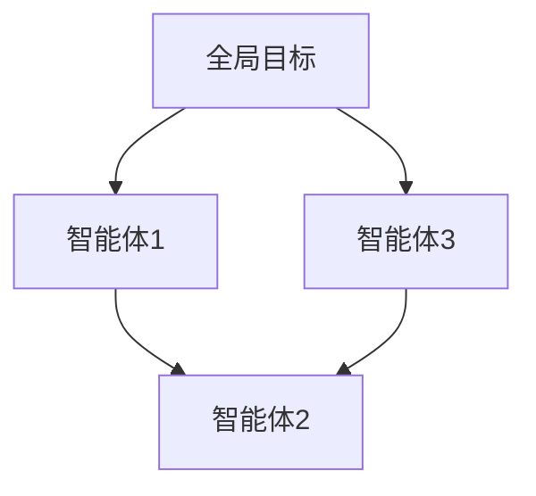
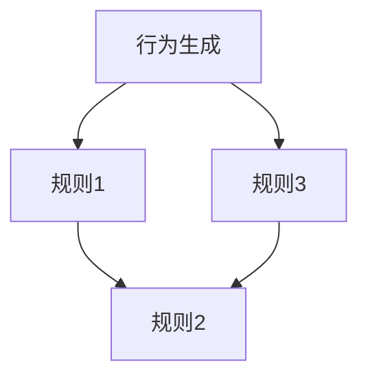
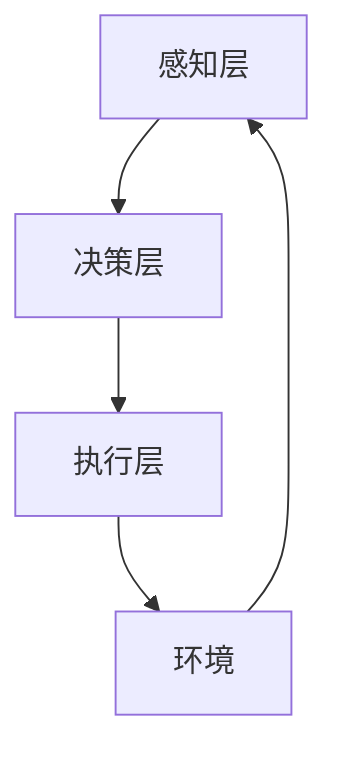
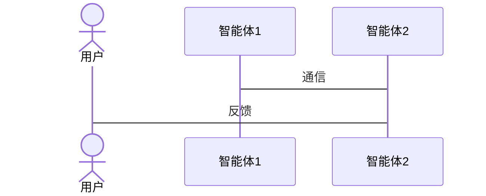

                 


# AI Agent的群体智能与涌现行为研究

关键词：AI Agent，群体智能，涌现行为，分布式计算，协作算法，系统架构

摘要：本文深入探讨了AI Agent的群体智能与涌现行为研究，从背景介绍、核心概念、算法原理到系统架构设计，再到项目实战和总结，详细分析了AI Agent如何通过群体智能实现复杂问题的解决，并阐述了涌现行为的形成机制及其应用价值。

---

# AI Agent的群体智能与涌现行为研究

## 第1章: AI Agent与群体智能概述

### 1.1 AI Agent的基本概念
#### 1.1.1 AI Agent的定义与特征
AI Agent（人工智能代理）是指能够感知环境并采取行动以实现目标的智能实体。AI Agent具有自主性、反应性、目标导向性和社交能力四大特征。

| 特征 | 描述 |
|------|------|
| 自主性 | AI Agent能够在没有外部干预的情况下独立决策和行动。 |
| 反应性 | AI Agent能够实时感知环境并做出响应。 |
| 目标导向性 | AI Agent的行为旨在实现特定目标。 |
| 社交能力 | AI Agent能够与其他AI Agent或人类进行有效通信和协作。 |

#### 1.1.2 AI Agent的分类与应用场景
AI Agent可以根据智能水平和应用场景分为以下几类：

1. **反应式AI Agent**：基于当前感知做出实时反应，适用于实时性要求高的场景，如自动驾驶汽车。
2. **认知式AI Agent**：具有复杂推理和规划能力，适用于需要长期决策的任务，如智能助手。
3. **协作式AI Agent**：能够与其他AI Agent或人类协作完成任务，适用于多智能体系统。

应用场景包括自动驾驶、智能助手、机器人协作、分布式计算等。

#### 1.1.3 群体智能的定义与特点
群体智能是指多个智能体通过协作和竞争实现比个体更复杂目标的智能形式。其特点包括：
- **分布式**：智能体分布在不同的位置，通过通信进行协作。
- **涌现性**：群体智能的某些行为是单个智能体无法实现的，是群体行为的“涌现”结果。
- **自适应性**：群体智能能够根据环境变化动态调整行为。

### 1.2 群体智能与涌现行为的关系
#### 1.2.1 群体智能的定义与核心要素
群体智能由多个智能体组成，核心要素包括：
- **智能体**：个体智能体。
- **通信机制**：智能体之间信息交换的方式。
- **协作规则**：智能体协作的规则和策略。
- **环境**：智能体所处的物理或虚拟环境。

#### 1.2.2 涌现行为的定义与特征
涌现行为是指群体智能体在协作过程中自然产生的、单个智能体无法实现的行为。其特征包括：
- **涌现性**：行为并非由单个智能体直接触发，而是群体协作的结果。
- **不可预测性**：涌现行为的出现通常难以在个体层面预测。
- **适应性**：涌现行为能够根据环境变化动态调整。

#### 1.2.3 群体智能与涌现行为的内在联系
群体智能为涌现行为提供了实现平台，而涌现行为是群体智能的核心表现形式。通过群体智能的协作机制，涌现行为得以形成，并为解决复杂问题提供了新的思路。

### 1.3 本章小结
本章介绍了AI Agent的基本概念、分类和应用场景，并详细阐述了群体智能的定义、特点及其与涌现行为的内在联系。

---

## 第2章: AI Agent的群体智能理论基础

### 2.1 群体智能的核心理论
#### 2.1.1 分布式计算理论
分布式计算理论为群体智能提供了理论基础，主要包括：
- **分布式一致性**：确保多个智能体在分布式系统中保持一致状态。
- **分布式协议**：如Paxos算法，用于解决分布式系统中的共识问题。

#### 2.1.2 自组织与自适应理论
自组织理论强调系统在无外部干预下自动组织和调整结构，自适应理论则关注系统根据环境变化动态调整行为。

#### 2.1.3 协作与通信理论
协作与通信理论研究智能体之间如何通过通信实现协作，包括通信协议设计和信息交换机制。

### 2.2 涌现行为的形成机制
#### 2.2.1 涌现行为的层次结构
涌现行为通常具有多层次结构，从低级的局部协作到高级的全局协作。

#### 2.2.2 涌现行为的动态演化过程
涌现行为的动态演化过程包括：
1. **初始状态**：智能体处于随机分布状态。
2. **局部协作**：智能体之间开始局部协作，形成简单的模式。
3. **全局协作**：局部协作模式逐渐扩展，形成复杂的全局协作模式。

#### 2.2.3 涌现行为的可预测性与不可预测性
涌现行为的可预测性取决于智能体的行为规则和环境的确定性。在确定性环境中，涌现行为可以部分预测；在非确定性环境中，涌现行为具有不可预测性。

### 2.3 本章小结
本章从理论层面分析了群体智能的核心理论和涌现行为的形成机制，为后续算法设计奠定了基础。

---

## 第3章: AI Agent的群体智能算法原理

### 3.1 多智能体协作算法
#### 3.1.1 多智能体协作的基本原理
多智能体协作算法通过智能体之间的通信和协作实现全局目标。常用算法包括：
- **基于规则的协作算法**：通过预定义规则实现协作。
- **基于博弈论的协作算法**：通过博弈论模型实现智能体之间的利益最大化协作。

#### 3.1.2 基于博弈论的协作算法
博弈论模型通过分析智能体之间的策略选择和收益分配，实现协作。例如，纳什均衡是博弈论中的一个关键概念。



#### 3.1.3 分布式协作算法的实现
分布式协作算法通过智能体之间的分布式通信实现协作，例如使用分布式一致性算法Paxos。

### 3.2 涌现行为的生成算法
#### 3.2.1 基于规则的涌现行为生成
基于规则的生成算法通过预定义规则实现涌现行为的生成，例如蚂蚁算法。



#### 3.2.2 基于学习的涌现行为生成
基于学习的生成算法通过机器学习模型实现涌现行为的自适应生成。

#### 3.2.3 基于进化算法的涌现行为优化
进化算法通过模拟自然进化过程，优化涌现行为的表现。

### 3.3 算法实现的数学模型
#### 3.3.1 博弈论模型
博弈论模型中的纳什均衡可以用数学公式表示为：
$$ \text{纳什均衡} = (x^*, y^*) $$
其中，\( x^* \) 和 \( y^* \) 分别是两个智能体的最优策略。

#### 3.3.2 分布式计算模型
分布式计算模型中的Paxos算法用于保证分布式系统中的一致性，其核心思想可以用公式表示为：
$$ \text{一致性} = \bigcap_{i=1}^{n} S_i $$
其中，\( S_i \) 是各个智能体的状态集合。

#### 3.3.3 涌现行为的动态模型
涌现行为的动态模型可以用微分方程表示：
$$ \frac{dx}{dt} = f(x, t) $$
其中，\( x \) 是状态变量，\( t \) 是时间变量，\( f \) 是动态函数。

### 3.4 本章小结
本章详细分析了多智能体协作算法和涌现行为生成算法的原理，并通过数学模型和mermaid流程图进行了直观展示。

---

## 第4章: AI Agent群体智能的系统架构设计

### 4.1 系统功能设计
#### 4.1.1 群体智能的核心功能模块
群体智能系统的核心功能模块包括：
1. **感知模块**：负责环境感知和信息采集。
2. **决策模块**：基于感知信息做出决策。
3. **协作模块**：实现智能体之间的协作。

#### 4.1.2 涌现行为的监控与分析模块
监控与分析模块用于实时监控涌现行为，并对其进行分析和优化。

#### 4.1.3 系统的输入输出接口设计
系统需要设计合理的输入输出接口，确保与外部环境的交互顺畅。

### 4.2 系统架构设计
#### 4.2.1 分层架构设计
分层架构设计将系统划分为多个层次，包括感知层、决策层和执行层。



#### 4.2.2 分布式架构设计
分布式架构设计将系统部署在多个节点上，通过分布式通信实现协作。

#### 4.2.3 模块化架构设计
模块化架构设计将系统划分为多个功能模块，每个模块独立实现特定功能。

### 4.3 系统接口设计
系统接口设计需要考虑智能体之间的通信接口和与外部环境的交互接口。

### 4.4 系统交互设计
系统交互设计通过mermaid序列图展示智能体之间的协作过程。



### 4.5 本章小结
本章详细分析了群体智能系统的功能设计、架构设计和接口设计，并通过mermaid图展示了系统的结构和交互过程。

---

## 第5章: 项目实战

### 5.1 环境安装
项目实战需要先安装必要的开发环境和工具，包括Python、机器学习框架（如TensorFlow）和可视化工具（如Matplotlib）。

### 5.2 系统核心实现源代码
以下是多智能体协作算法的核心实现代码：

```python
import numpy as np

def nash_equilibrium(strategies):
    # 计算纳什均衡
    pass

class Agent:
    def __init__(self, id):
        self.id = id
        self.strategy = None

    def choose_strategy(self, others):
        # 选择策略
        pass

class MultiAgentSystem:
    def __init__(self, num_agents):
        self.agents = [Agent(i) for i in range(num_agents)]

    def run(self):
        while True:
            for agent in self.agents:
                agent.choose_strategy(others)
            # 检查是否达到纳什均衡
            if nash_equilibrium([agent.strategy for agent in self.agents]):
                break
```

### 5.3 代码应用解读与分析
上述代码实现了多智能体协作系统的基本框架，包括智能体的策略选择和纳什均衡的判断。

### 5.4 实际案例分析
通过具体案例分析，展示群体智能在实际应用中的效果和优势。

### 5.5 项目小结
本章通过项目实战，详细展示了群体智能系统的实现过程和应用效果。

---

## 第6章: 总结与展望

### 6.1 总结
本文从理论到实践，详细探讨了AI Agent的群体智能与涌现行为研究，分析了相关算法和系统架构设计，并通过项目实战展示了理论的应用。

### 6.2 展望
未来的研究可以进一步探索群体智能的优化算法和更复杂的涌现行为生成机制。

### 6.3 最佳实践 tips
- **模块化设计**：系统设计时应尽量模块化，便于维护和扩展。
- **通信机制**：智能体之间的通信机制设计需要充分考虑可靠性和效率。
- **安全性**：群体智能系统需要考虑安全性问题，防止恶意攻击。

### 6.4 本章小结
本章总结了全文的主要内容，并展望了未来的研究方向。

---

# 作者：AI天才研究院/AI Genius Institute & 禅与计算机程序设计艺术 /Zen And The Art of Computer Programming

---

本文通过系统的理论分析和实践案例，全面探讨了AI Agent的群体智能与涌现行为研究，为相关领域的研究和应用提供了有益的参考。

