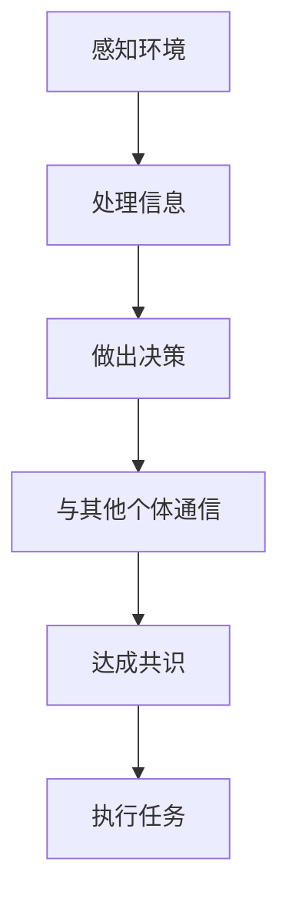
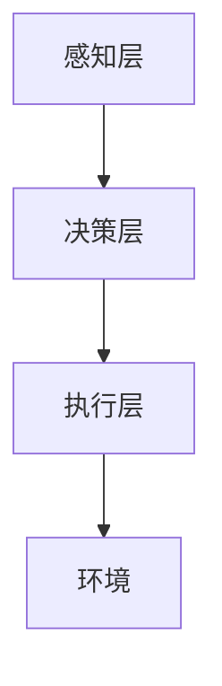
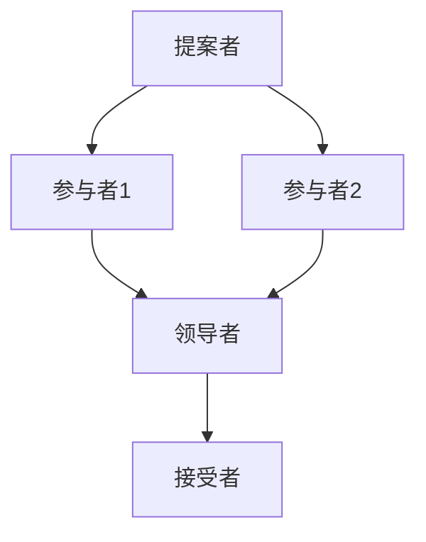

                 


# AI Agent的群体智能与集体决策机制

> 关键词：AI Agent，群体智能，集体决策，多智能体系统，一致性算法，分布式系统

> 摘要：本文深入探讨AI Agent在群体智能中的应用及其集体决策机制。通过分析AI Agent的基本概念、群体智能的核心特征、集体决策的数学模型，结合一致性算法和分布式计算的原理，展示如何实现高效可靠的群体智能系统。通过实际案例和项目实战，提供可操作的解决方案和最佳实践。

---

## 第一部分: AI Agent的群体智能与集体决策机制概述

### 第1章: AI Agent的基本概念与背景

#### 1.1 AI Agent的定义与特点

**AI Agent**（智能体）是指在计算环境中能够感知环境并采取行动以实现目标的实体。AI Agent可以是软件程序、机器人或其他智能系统，其核心目标是通过与环境交互来完成特定任务。

- **定义**：AI Agent是一个能够感知环境、自主决策并采取行动的实体。
- **特点**：
  - **自主性**：能够自主决策，无需外部干预。
  - **反应性**：能够实时感知环境并做出反应。
  - **社会性**：能够与其他智能体或人类进行交互和协作。
  - **学习能力**：通过经验改进性能和决策能力。

**应用场景**：
- 智能助手（如 Siri、Alexa）。
- 自动驾驶汽车。
- 机器人协作。

---

#### 1.2 群体智能的定义与特征

**群体智能**是指多个个体（智能体）通过协作完成复杂任务的过程，其集体智慧往往超越个体能力。

- **定义**：群体智能是多个智能体通过协作和信息共享实现复杂任务的过程。
- **特征**：
  - **去中心化**：没有中央控制节点，个体自主决策。
  - **涌现性**：群体智能的结果是单个个体无法实现的。
  - **鲁棒性**：群体智能系统能够在部分个体故障时仍保持功能。

**与个体智能的对比**：

| 特性       | 个体智能            | 群体智能            |
|------------|--------------------|--------------------|
| 决策方式   | 单一决策者          | 多个体协作决策      |
| 故障容错性 | 单点故障可能导致系统瘫痪 | 去中心化，容错性强   |
| 表现能力   | 取决于单个个体能力    | 取决于群体协作能力    |

---

#### 1.3 集体决策机制的定义与意义

**集体决策机制**是指多个个体通过某种规则或算法共同做出决策的过程。

- **定义**：集体决策机制是多个个体通过信息共享和协商，共同做出决策的过程。
- **意义**：
  - 提高决策的可靠性和准确性。
  - 增强系统的容错性和鲁棒性。
  - 实现复杂任务的分布式协作。

---

## 第二部分: AI Agent的群体智能与集体决策机制的核心概念

### 第2章: AI Agent与群体智能的关系

#### 2.1 AI Agent在群体智能中的角色

AI Agent在群体智能中通常扮演个体角色，通过与其他个体协作完成任务。

- **个体角色**：每个AI Agent负责感知环境、处理信息并做出决策。
- **协作机制**：通过通信协议共享信息，达成共识。

**AI Agent在群体智能中的协作流程**：



---

### 第3章: 集体决策机制的核心算法

#### 3.1 一致性算法

**一致性算法**（Consensus Algorithm）是实现分布式系统中达成一致决策的关键算法。

- **算法步骤**：
  1. 初始化：每个节点提出初始提案。
  2. 提案传播：节点之间交换提案。
  3. 达成一致：通过投票机制选出一个提案作为最终决策。

**一致性算法的数学模型**：

$$ \text{Consensus}(P_1, P_2, \dots, P_n) = D $$

其中，$P_i$ 是节点 $i$ 的提案，$D$ 是最终决策。

---

### 第4章: 群体智能的系统架构

#### 4.1 群体智能系统的组成

- **感知层**：负责环境感知和数据采集。
- **决策层**：负责信息处理和决策制定。
- **执行层**：负责执行决策并输出结果。

**群体智能系统的架构图**：



---

## 第三部分: AI Agent群体智能与集体决策机制的实现

### 第5章: 集体决策机制的实现

#### 5.1 分布式计算与一致性算法

**一致性算法**是实现集体决策的核心技术，常用的一致性算法包括Paxos、Raft等。

- **Paxos算法**：
  1. 提案者提出提案。
  2. 通过两次投票确保提案被所有节点接受。

**Paxos算法的流程图**：



---

### 第6章: 项目实战

#### 6.1 环境安装与依赖

- **Python环境**：安装Python 3.8及以上版本。
- **依赖库**：安装`numpy`, `scipy`, `matplotlib`。

#### 6.2 核心代码实现

**一致性算法的Python实现**：

```python
class ConsensusAlgorithm:
    def __init__(self, nodes):
        self.nodes = nodes
        self.leader = None

    def elect_leader(self):
        # 选举领导者
        self.leader = max(self.nodes)

    def propose(self, value):
        # 提案者提出提案
        self.leader.proposal = value

    def vote(self, proposal):
        # 节点投票
        import random
        if random.choice([True, False]):
            return True
        else:
            return False

    def decide(self):
        # 达成一致
        if all(node.vote(proposal)):
            return proposal
        else:
            return None
```

---

### 第7章: 最佳实践与总结

#### 7.1 小结

- AI Agent的群体智能与集体决策机制是实现分布式协作的关键技术。
- 一致性算法是实现集体决策的核心算法。
- 通过实际案例和项目实战，可以更好地理解和应用这些技术。

#### 7.2 注意事项

- 确保系统通信的可靠性和安全性。
- 处理好去中心化带来的复杂性。
- 定期监控和优化系统性能。

#### 7.3 拓展阅读

- 《分布式系统：概念与设计》
- 《一致性算法：原理与应用》
- 《群体智能：理论与实践》

---

## 作者：AI天才研究院/AI Genius Institute & 禅与计算机程序设计艺术/Zen And The Art of Computer Programming

---

以上是《AI Agent的群体智能与集体决策机制》的完整文章大纲和内容。

