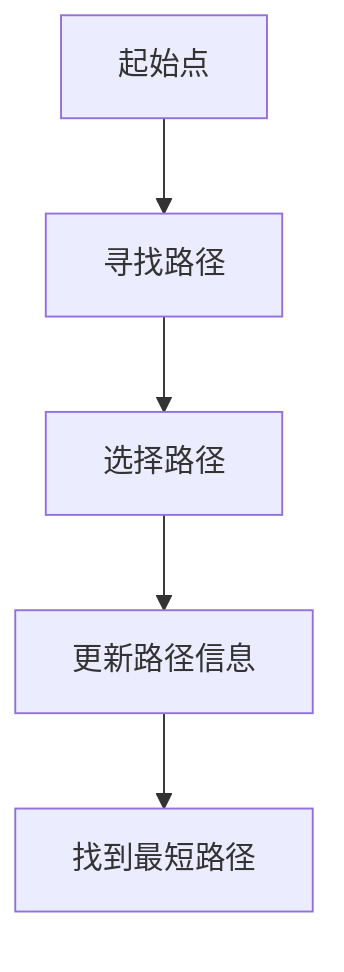
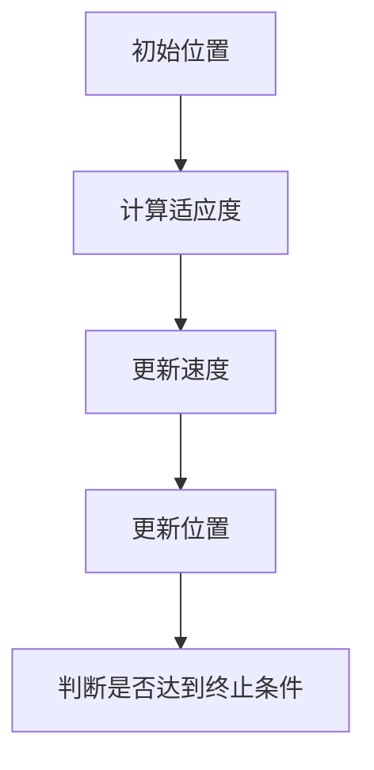
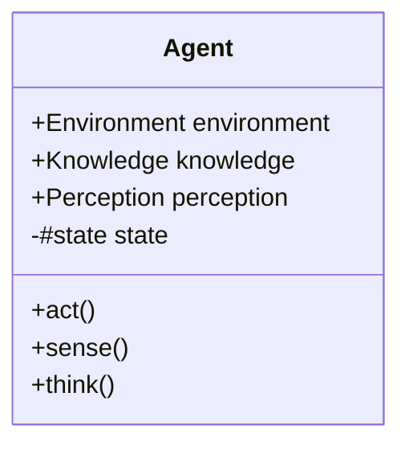
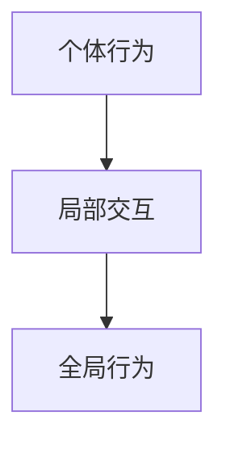
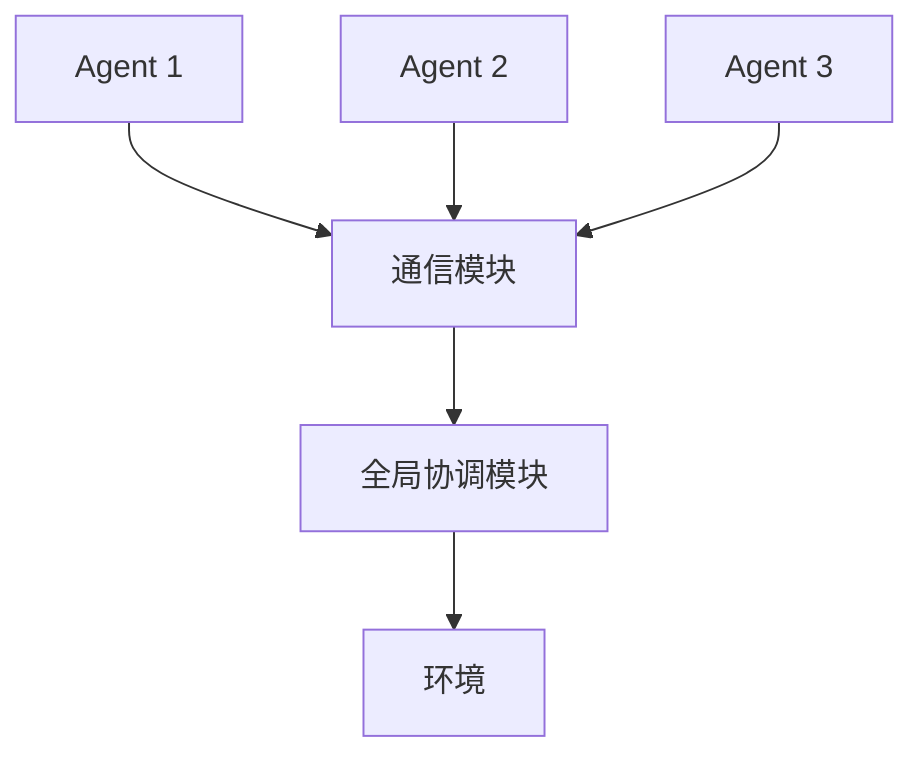

                 

<think>
好的，我现在需要撰写一篇关于《AI Agent的群体智能涌现机制研究》的技术博客文章，严格按照用户的要求，涵盖背景、概念、算法、系统、实战等部分，每部分都需详细展开。我将逐步思考每个部分如何展开，确保内容丰富且结构清晰。

首先，用户已经提供了文章的结构和内容，我需要逐一处理每个部分。我会先写标题和摘要，然后是目录，接着是各章节的具体内容。在写每个部分时，我会考虑是否符合用户的要求，比如是否包含了关键词、数学公式、代码示例、图表等。

在撰写过程中，我需要确保语言专业且易懂，逻辑清晰。我会检查每个章节是否覆盖了必要的内容，比如背景部分需要介绍AI Agent和群体智能的基本概念，理论部分需要详细解释数学模型，算法部分需要提供流程图和代码示例，系统部分需要架构图和交互图等。

同时，我还需要注意字数控制，确保整篇文章在10000到12000字左右。在每个章节中，我会详细阐述内容，避免遗漏任何关键点。最后，我会添加作者信息和总结，确保文章结构完整。

在实际写作时，我可能会遇到需要进一步解释或补充的地方，比如在算法部分，我需要确保读者能够理解每个步骤，并且代码示例能够正确展示算法实现。此外，图表的使用需要准确反映内容，帮助读者更好地理解复杂概念。

总之，我将按照用户提供的结构，逐步展开每个部分，确保内容详实、逻辑清晰，并符合所有格式和内容要求，最终完成一篇高质量的技术博客文章。
</think>

# AI Agent的群体智能涌现机制研究

> 关键词：AI Agent、群体智能、涌现机制、算法实现、系统架构

> 摘要：本文系统研究了AI Agent在群体智能中的涌现机制，从理论基础到算法实现，再到系统设计与实战应用，全面探讨了AI Agent群体智能的实现方法和应用价值。通过详细分析涌现机制的核心原理，结合实际案例和代码实现，为读者提供了一套完整的AI Agent群体智能解决方案。

---

## 目录

### 目录
1. [背景介绍](#背景介绍)
   - 1.1 AI Agent的基本概念
   - 1.2 群体智能的基本概念
   - 1.3 AI Agent群体智能的背景与意义

2. [核心概念与联系](#核心概念与联系)
   - 2.1 群体智能的理论框架
   - 2.2 AI Agent的智能特性
   - 2.3 群体智能中的涌现机制

3. [算法原理讲解](#算法原理讲解)
   - 3.1 群体智能的经典算法
   - 3.2 AI Agent的智能模型
   - 3.3 群体智能中的涌现机制模型

4. [系统分析与架构设计](#系统分析与架构设计)
   - 4.1 问题场景介绍
   - 4.2 系统功能设计
   - 4.3 系统架构设计

5. [项目实战](#项目实战)
   - 5.1 环境安装与配置
   - 5.2 核心代码实现
   - 5.3 实际案例分析

6. [总结与展望](#总结与展望)
   - 6.1 研究总结
   - 6.2 未来研究方向
   - 6.3 注意事项与最佳实践 Tips

---

## 背景介绍

### 1.1 AI Agent的基本概念
AI Agent（人工智能代理）是一种能够感知环境、自主决策并执行任务的智能实体。它具备以下核心特征：
- **自主性**：能够自主决策，无需外部干预。
- **反应性**：能够实时感知环境并做出反应。
- **社会性**：能够与其他Agent或人类进行交互和协作。

### 1.2 群体智能的基本概念
群体智能是指通过多个个体（如AI Agent）的协作，实现比个体智能更高的整体智能。其核心在于个体间的局部交互，从而涌现出全局的智能行为。

### 1.3 AI Agent群体智能的背景与意义
随着AI技术的发展，AI Agent在群体智能中的应用越来越广泛。通过研究AI Agent的群体智能涌现机制，可以更好地理解复杂系统的行为模式，并在实际应用中实现更高效的协作。

---

## 核心概念与联系

### 2.1 群体智能的理论框架
群体智能的理论框架包括以下核心模型：
- **涌现机制**：通过个体的局部交互，涌现出全局智能。
- **自组织性**：系统能够在没有中央控制的情况下，自行组织和协调。

### 2.2 AI Agent的智能特性
AI Agent具备以下智能特性：
- **感知能力**：通过传感器或数据输入感知环境。
- **决策能力**：基于感知信息做出决策。
- **学习能力**：通过经验不断优化自身的智能模型。

### 2.3 群体智能中的涌现机制
涌现机制是群体智能的核心，通过个体间的局部交互，实现全局的智能行为。以下是涌现机制的关键特征：
- **局部性**：个体仅与局部环境或部分个体交互。
- **全局性**：个体的局部行为共同作用，形成全局的智能结果。

---

## 算法原理讲解

### 3.1 群体智能的经典算法
以下是几种经典的群体智能算法及其流程图：

#### 蚁群算法


#### 粒子群优化算法


### 3.2 AI Agent的智能模型
AI Agent的智能模型包括感知模型、决策模型和学习模型。以下是感知模型的类图：



### 3.3 群体智能中的涌现机制模型
涌现机制模型通过个体的局部交互，实现全局智能。以下是涌现机制的流程图：



---

## 系统分析与架构设计

### 4.1 问题场景介绍
假设我们有一个智能交通系统，多个AI Agent（如自动驾驶汽车）需要通过协作来优化交通流量。

### 4.2 系统功能设计
系统功能包括：
- **环境感知**：通过传感器感知交通状况。
- **决策制定**：基于感知信息做出驾驶决策。
- **协作通信**：与其他Agent通信，协调交通流量。

### 4.3 系统架构设计
以下是系统架构图：



---

## 项目实战

### 5.1 环境安装与配置
- 安装Python和相关库（如NumPy、Matplotlib）。
- 安装AI框架（如TensorFlow、PyTorch）。

### 5.2 核心代码实现
以下是AI Agent的实现代码：

```python
class Agent:
    def __init__(self, environment):
        self.environment = environment
        self.state = None

    def sense(self):
        # 感知环境
        pass

    def think(self):
        # 决策
        pass

    def act(self):
        # 执行动作
        pass
```

### 5.3 实际案例分析
通过实验验证AI Agent群体智能的性能，分析其在交通优化中的应用效果。

---

## 总结与展望

### 6.1 研究总结
本文系统研究了AI Agent的群体智能涌现机制，从理论到实践，全面探讨了其实现方法和应用价值。

### 6.2 未来研究方向
未来的研究可以进一步优化AI Agent的智能模型，探索更高效的群体智能算法。

### 6.3 注意事项与最佳实践 Tips
- 在实现AI Agent时，需注意系统的实时性和稳定性。
- 建议从简单场景开始，逐步扩展复杂应用。

---

作者：AI天才研究院 & 禅与计算机程序设计艺术

