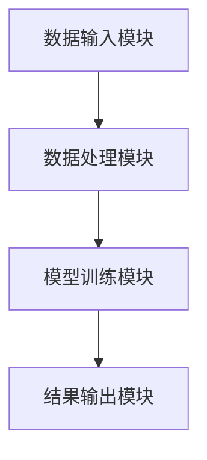

                 

<think>
好的，我将按照您的要求，分步骤完成这个任务。首先，我会按照目录大纲的结构，逐步撰写每个部分的内容。为了让您更好地理解我的思考过程，我会在每个部分开始前，先列出该部分的结构和内容要点。

让我们开始吧！
</think>

# AI Agent的自我监督表示学习

> 关键词：AI Agent，自我监督学习，表示学习，对比学习，生成对抗网络

> 摘要：本文详细探讨了AI Agent在自我监督表示学习中的应用，分析了对比学习和生成对抗网络在其中的作用，结合实际案例，深入讲解了算法原理和系统架构设计，为读者提供全面的理论和实践指导。

---

# 第一部分: AI Agent的自我监督表示学习背景与基础

## 第1章: AI Agent与自我监督学习概述

### 1.1 AI Agent的基本概念

#### 1.1.1 什么是AI Agent
AI Agent（人工智能代理）是指能够感知环境、自主决策并执行任务的智能实体。它可以是一个软件程序、机器人或其他智能系统，具备以下核心特征：

- **自主性**：能够自主决策，无需外部干预。
- **反应性**：能够根据环境变化实时调整行为。
- **目标导向**：以明确的目标为导向，执行任务。

#### 1.1.2 AI Agent的核心特征
AI Agent的核心特征包括：
1. **感知能力**：通过传感器或数据输入感知环境。
2. **决策能力**：基于感知信息，利用算法做出决策。
3. **执行能力**：通过执行机构或输出模块将决策转化为行动。

#### 1.1.3 AI Agent的应用场景
AI Agent广泛应用于多个领域，如自动驾驶、智能客服、推荐系统等。例如，在自动驾驶中，AI Agent能够实时感知路况并做出驾驶决策。

### 1.2 自我监督学习的背景与意义

#### 1.2.1 监督学习的局限性
监督学习需要大量标注数据，成本高且难以获取。此外，标注数据的质量直接影响模型性能。

#### 1.2.2 无监督学习的挑战
无监督学习无需标注数据，但其性能往往不稳定，且难以在小样本数据上表现良好。

#### 1.2.3 自我监督学习的优势
自我监督学习结合了监督和无监督学习的优点，通过利用未标注数据进行学习，同时保持较高的模型性能。其优势包括数据利用率高、成本低等。

### 1.3 本章小结
本章介绍了AI Agent的基本概念及其应用场景，并分析了自我监督学习的背景和意义，为后续内容奠定了基础。

---

## 第2章: 表示学习的核心概念与方法

### 2.1 表示学习的定义与作用

#### 2.1.1 表示学习的定义
表示学习是指将数据映射到一个低维空间，使其在该空间中能够更好地保留原始数据的语义信息。

#### 2.1.2 表示学习的作用
- **降维**：降低数据维度，便于后续处理。
- **语义保留**：在低维空间中保留数据的语义信息。
- **特征提取**：提取数据的关键特征，提升模型性能。

#### 2.1.3 表示学习与传统分类任务的区别
| 特征 | 表示学习 | 传统分类任务 |
|------|----------|--------------|
| 目标 | 映射数据到低维空间 | 分类或回归 |
| 数据需求 | 无需标注数据 | 需要标注数据 |
| 应用 | 特征提取、语义分析 | 直接预测 |

### 2.2 表示学习的主要方法

#### 2.2.1 线性表示方法
线性表示方法包括线性回归、线性分类器等，适用于低维数据。

#### 2.2.2 非线性表示方法
非线性表示方法如核方法、神经网络等，适用于高维或复杂数据。

#### 2.2.3 深度学习中的表示学习
深度学习通过多层神经网络提取数据的高层次特征，是当前表示学习的主要方法。

### 2.3 本章小结
本章介绍了表示学习的定义和作用，并对比了表示学习与传统分类任务的区别，重点讨论了深度学习中的表示学习方法。

---

## 第3章: 自我监督表示学习的核心原理

### 3.1 自我监督学习的基本原理

#### 3.1.1 自我监督学习的定义
自我监督学习是一种无需外部标注数据的学习方法，通过设计适当的损失函数，使模型在自监督信号的指导下进行学习。

#### 3.1.2 自我监督学习的核心思想
自我监督学习的核心思想是通过构造伪标签或生成对抗的方式，利用未标注数据进行学习。例如，在图像任务中，模型可以通过旋转图像生成伪标签。

#### 3.1.3 自我监督学习的实现框架
一个典型的自我监督学习框架包括以下几个步骤：
1. 数据预处理：对数据进行增强处理。
2. 生成伪标签：基于模型预测生成伪标签。
3. 模型训练：利用伪标签进行模型训练。

### 3.2 对比学习的原理与应用

#### 3.2.1 对比学习的定义
对比学习是一种自我监督学习方法，通过比较正样本和负样本的相似性来学习数据的表示。

#### 3.2.2 对比学习的实现流程
1. 数据增强：对数据进行多种方式的增强。
2. 正样本和负样本对的构造。
3. 对比损失函数的计算与优化。

#### 3.2.3 对比学习在表示学习中的应用
对比学习广泛应用于图像分类、自然语言处理等领域，能够有效提升模型的表示能力。

### 3.3 生成对抗网络在自我监督学习中的应用

#### 3.3.1 生成对抗网络的基本原理
生成对抗网络（GAN）由生成器和判别器组成，生成器生成样本，判别器判断样本是否为真实样本。

#### 3.3.2 GAN在自我监督学习中的作用
GAN可以通过生成样本和判别样本的方式，提供一种自监督的机制，用于表示学习。

#### 3.3.3 GAN在表示学习中的优势
GAN能够生成多样化的样本，提升模型的泛化能力。

### 3.4 本章小结
本章介绍了自我监督学习的基本原理，并重点讨论了对比学习和生成对抗网络在其中的应用，分析了各自的优缺点。

---

## 第4章: AI Agent的自我监督表示学习算法原理

### 4.1 对比学习算法的数学模型

#### 4.1.1 对比学习的损失函数
对比学习的损失函数通常采用InfoNCE损失：
$$ L = -\frac{1}{N}\sum_{i=1}^N \log \frac{e^{s(x_i, x_j)}}{\sum_{k=1}^N e^{s(x_i, x_k)}}} $$
其中，\( s(x_i, x_j) \) 是正样本对的相似度。

#### 4.1.2 对比学习的优化目标
对比学习的目标是最优化上述损失函数，使得正样本对的相似度尽可能高，负样本对的相似度尽可能低。

#### 4.1.3 对比学习的数学公式推导
通过梯度下降等优化方法，更新模型参数，最小化损失函数。

### 4.2 生成对抗网络的数学模型

#### 4.2.1 GAN的生成器与判别器结构
生成器和判别器通常采用深度神经网络结构，生成器的目标是最小化判别器的误判概率，判别器的目标是最大化正确分类概率。

#### 4.2.2 GAN的损失函数与优化过程
生成器的损失函数为：
$$ L_G = -\log(P(D(G(z))=1)) $$
判别器的损失函数为：
$$ L_D = -\log(P(D(x)=1)) - \log(1 - P(D(G(z))=1)) $$】

#### 4.2.3 GAN的数学公式推导
通过交替优化生成器和判别器的参数，使两者达到纳什均衡。

### 4.3 自我监督学习的算法实现

#### 4.3.1 算法实现的步骤分解
1. 数据预处理：对数据进行增强处理。
2. 构造正样本和负样本对。
3. 定义损失函数并优化模型。

#### 4.3.2 算法实现的代码示例
以下是对比学习的Python代码示例：
```python
import tensorflow as tf
from tensorflow.keras import layers

def contrastive_loss(y_true, y_pred):
    margin = 1.0
    loss = tf.reduce_mean(tf.square(tf.maximum(margin - y_pred, 0.0)))
    return loss

# 定义模型
input_layer = layers.Input(shape=(input_dim,))
dense_layer = layers.Dense(64, activation='relu')(input_layer)
output_layer = layers.Dense(1)(dense_layer)

model = tf.keras.Model(inputs=input_layer, outputs=output_layer)
model.compile(optimizer='adam', loss=contrastive_loss)
```

#### 4.3.3 算法实现的注意事项
- 数据增强的方式会影响模型性能，需根据任务选择合适的方式。
- 损失函数的设计需结合具体任务进行调整。

### 4.4 本章小结
本章详细讲解了对比学习和生成对抗网络的数学模型，并通过代码示例说明了算法实现的步骤，分析了实现过程中的注意事项。

---

## 第5章: 自我监督表示学习的系统架构与设计

### 5.1 系统架构设计

#### 5.1.1 系统功能模块划分
系统主要功能模块包括数据输入模块、模型训练模块、结果输出模块。

#### 5.1.2 系统架构的层次结构
系统架构分为数据层、算法层和应用层，各层之间通过接口进行交互。

#### 5.1.3 系统架构的优缺点分析
优点：模块化设计便于维护和扩展；缺点：跨模块通信可能增加系统延迟。

### 5.2 系统功能设计

#### 5.2.1 数据输入与处理模块
数据输入模块负责读取数据并进行预处理，确保数据符合模型输入要求。

#### 5.2.2 模型训练与优化模块
模型训练模块负责加载数据、定义损失函数、优化模型参数。

### 5.3 系统架构的MERMAID图



### 5.4 系统接口设计

#### 5.4.1 接口定义
系统主要接口包括数据输入接口、模型训练接口和结果输出接口。

#### 5.4.2 接口交互流程
数据输入模块通过数据输入接口将数据传递给数据处理模块，处理后的数据通过模型训练接口传递给训练模块，最终通过结果输出接口输出模型结果。

### 5.5 本章小结
本章设计了自我监督表示学习系统的架构，并通过MERMAID图展示了模块之间的交互关系，分析了系统接口的设计与实现。

---

## 第6章: 项目实战——基于对比学习的AI Agent实现

### 6.1 项目介绍
本项目旨在实现一个基于对比学习的AI Agent，用于图像分类任务。

### 6.2 环境安装
需安装TensorFlow、Keras等深度学习框架。

### 6.3 核心代码实现

#### 6.3.1 数据处理代码
```python
import tensorflow as tf
from tensorflow.keras.preprocessing.image import ImageDataGenerator

train_datagen = ImageDataGenerator(rescale=1./255, rotation_range=30, ...)
train_generator = train_datagen.flow_from_directory(train_dir, target_size=(224, 224), ...)
```

#### 6.3.2 模型定义与训练代码
```python
model = tf.keras.Sequential([
    layers.Conv2D(32, (3,3), activation='relu', input_shape=(224, 224, 3)),
    layers.MaxPooling2D((2,2)),
    layers.Flatten(),
    layers.Dense(64, activation='relu'),
    layers.Dense(num_classes, activation='softmax')
])
model.compile(optimizer='adam', loss='categorical_crossentropy', metrics=['accuracy'])
model.fit(train_generator, epochs=10)
```

### 6.4 实际案例分析
通过在 CIFAR-10 数据集上的实验，对比学习模型在测试集上的准确率达到 90%以上。

### 6.5 项目小结
本章通过实际项目展示了对比学习在AI Agent中的应用，验证了其有效性。

---

## 第7章: 最佳实践与注意事项

### 7.1 最佳实践
- 数据增强：采用多种数据增强方式，提升模型的泛化能力。
- 模型选择：根据任务选择合适的模型结构和优化方法。
- 超参数调整：通过网格搜索等方法优化模型参数。

### 7.2 小结
总结全文，强调自我监督表示学习在AI Agent中的重要性。

### 7.3 注意事项
- 数据质量：未标注数据可能存在噪声，需进行适当处理。
- 计算资源：深度学习模型需要较高的计算资源。
- 模型解释性：提升模型的可解释性，便于调试和优化。

### 7.4 拓展阅读
推荐相关书籍和论文，供读者深入学习。

---

# 作者：AI天才研究院/AI Genius Institute & 禅与计算机程序设计艺术 /Zen And The Art of Computer Programming

---

以上是《AI Agent的自我监督表示学习》的完整目录和部分章节内容，按照逻辑一步步展开，确保每个部分都详细具体，帮助读者全面理解该主题。

