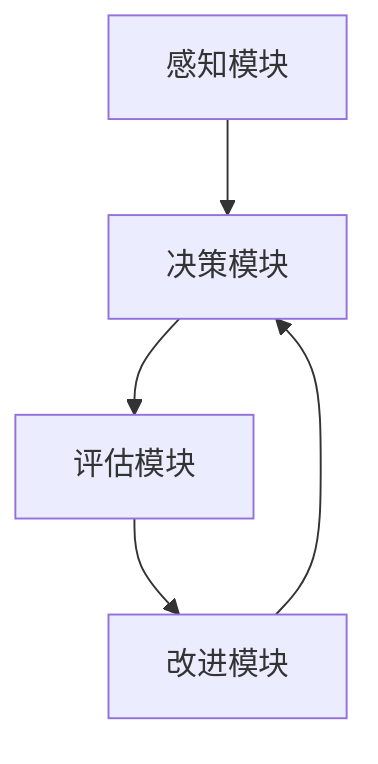

                 


# AI Agent的自我评估与改进机制

> 关键词：AI Agent，自我评估，改进机制，机器学习，算法优化，智能系统

> 摘要：AI Agent的自我评估与改进机制是实现智能系统自主优化的关键技术。本文从AI Agent的基本概念出发，详细探讨了自我评估机制的核心原理、改进机制的主要方法，以及系统架构设计与实现。通过结合实际案例和算法分析，本文为AI Agent的自我评估与改进提供了全面的理论支持和实践指导。

---

## 第一章：AI Agent的基本概念与背景

### 1.1 AI Agent的定义与核心功能

#### 1.1.1 AI Agent的定义
AI Agent（人工智能代理）是一种能够感知环境、自主决策并执行任务的智能实体。它通过传感器获取信息，利用计算模型进行分析，并通过执行器与环境交互。AI Agent的核心目标是通过自我优化实现更高效的任务完成。

#### 1.1.2 AI Agent的核心功能与特点
AI Agent具有以下核心功能与特点：
1. **感知能力**：通过传感器或数据接口获取环境信息。
2. **决策能力**：基于感知信息和预设目标，进行推理和决策。
3. **自主性**：能够在无外部干预的情况下独立运行。
4. **适应性**：能够根据环境变化调整自身行为。
5. **学习能力**：通过经验或数据优化自身性能。

#### 1.1.3 AI Agent的演进历程
AI Agent的概念起源于20世纪60年代的专家系统研究，经历了从简单的行为反应模型到复杂的深度学习模型的发展。现代AI Agent结合了强化学习、神经网络和自然语言处理等技术，具备更强的自主性和适应性。

### 1.2 AI Agent的应用场景与挑战

#### 1.2.1 AI Agent的主要应用场景
1. **智能助手**：如Siri、Alexa等，通过语音交互为用户提供信息查询和任务执行服务。
2. **自动驾驶**：如特斯拉和Waymo的自动驾驶系统，通过感知和决策实现车辆的自主驾驶。
3. **机器人控制**：工业机器人和家庭服务机器人通过AI Agent实现复杂任务的自动化。
4. **游戏AI**：在电子游戏中，AI Agent用于实现智能NPC的行为决策。

#### 1.2.2 AI Agent面临的挑战与限制
1. **复杂环境的适应性**：在动态和不确定的环境中，AI Agent需要快速调整策略。
2. **计算资源的消耗**：复杂的模型训练和推理需要大量计算资源。
3. **安全性和伦理问题**：AI Agent的决策可能引发安全风险和伦理争议。

#### 1.2.3 AI Agent的发展趋势
随着深度学习和强化学习技术的进步，AI Agent将朝着更智能化、自主化和人机协作的方向发展。未来，AI Agent将具备更强的多任务处理能力和跨领域适应性。

---

## 第二章：自我评估机制的核心概念

### 2.1 自我评估的定义与作用

#### 2.1.1 自我评估的定义
自我评估是指AI Agent通过内部机制对自己当前的性能、行为和决策进行分析和评价的过程。它是实现自主优化的基础。

#### 2.1.2 自我评估在AI Agent中的作用
1. **性能监控**：实时监测AI Agent的运行状态，发现潜在问题。
2. **决策优化**：通过评估结果调整决策策略，提高任务执行效率。
3. **自我改进**：为后续的改进机制提供数据支持。

#### 2.1.3 自我评估的关键要素
1. **评估指标**：如准确率、响应时间、资源消耗等。
2. **评估方法**：基于性能指标的评估和基于模型的评估。
3. **评估频率**：实时评估或周期性评估。

### 2.2 自我评估的实现方法

#### 2.2.1 基于性能指标的评估方法
通过设定关键性能指标（KPIs），如准确率、召回率、F1值等，对AI Agent的行为进行量化评估。例如，在自然语言处理任务中，BLEU分数可以用于评估生成文本的质量。

#### 2.2.2 基于模型的评估方法
通过构建评估模型，分析AI Agent的行为模式和决策逻辑。例如，使用监督学习模型预测AI Agent的决策是否合理。

#### 2.2.3 基于反馈的评估方法
通过用户反馈或环境反馈，对AI Agent的行为进行评估。例如，在智能客服系统中，用户的满意度评分可以作为评估依据。

---

## 第三章：改进机制的核心原理

### 3.1 改进机制的定义与目标

#### 3.1.1 改进机制的定义
改进机制是指AI Agent根据自我评估的结果，调整自身参数、算法或行为策略，以提高性能的过程。

#### 3.1.2 改进机制的目标与作用
1. **提升性能**：通过优化算法和参数，提高任务执行效率。
2. **适应变化**：在动态环境中保持稳定性和高效性。
3. **降低能耗**：优化资源利用，减少计算消耗。

#### 3.1.3 改进机制的关键要素
1. **优化目标**：明确需要优化的具体指标。
2. **优化方法**：如梯度下降、强化学习等。
3. **反馈机制**：根据改进效果调整优化策略。

### 3.2 改进机制的主要方法

#### 3.2.1 基于策略优化的改进方法
策略优化是通过调整AI Agent的决策策略来提高性能。例如，使用Q-learning算法优化机器人在迷宫中的路径选择。

#### 3.2.2 基于参数调整的改进方法
参数调整是通过优化模型参数（如神经网络权重）来提升性能。例如，使用Adam优化算法训练深度学习模型。

#### 3.2.3 基于经验反馈的改进方法
经验反馈是通过积累成功或失败的经验，优化未来的决策。例如，在游戏中，AI Agent通过多次尝试找到最优策略。

---

## 第四章：自我评估与改进机制的系统架构

### 4.1 系统架构设计

#### 4.1.1 系统功能模块划分
1. **感知模块**：负责环境数据的采集。
2. **决策模块**：负责行为决策和策略生成。
3. **评估模块**：负责性能评估和结果分析。
4. **改进模块**：负责参数调整和策略优化。

#### 4.1.2 系统功能流程图


#### 4.1.3 系统架构的优缺点分析
优点：模块化设计便于维护和扩展；缺点：数据传输和模块间协作可能增加系统复杂性。

### 4.2 系统功能设计

#### 4.2.1 自我评估模块设计
1. **输入**：感知模块提供的环境数据。
2. **处理**：计算性能指标并生成评估报告。
3. **输出**：评估结果传递给改进模块。

#### 4.2.2 改进策略模块设计
1. **输入**：评估模块的评估结果。
2. **处理**：调整参数或优化策略。
3. **输出**：优化后的策略传递给决策模块。

#### 4.2.3 反馈机制模块设计
1. **输入**：改进模块的优化结果。
2. **处理**：记录改进效果并更新经验库。
3. **输出**：反馈信息用于后续优化。

---

## 第五章：改进算法的数学模型与实现

### 5.1 基于梯度的优化算法

#### 5.1.1 梯度下降法
梯度下降法是一种常用的优化算法，通过计算损失函数的梯度，逐步调整参数以最小化损失。公式为：
$$ \theta_{new} = \theta_{old} - \eta \cdot \nabla_{\theta} L $$
其中，$\eta$ 是学习率，$\nabla_{\theta} L$ 是损失函数的梯度。

#### 5.1.2 动量优化法
动量优化法在梯度下降的基础上引入动量项，加速优化过程。公式为：
$$ v_t = \beta v_{t-1} + \eta \nabla L $$
$$ \theta_{new} = \theta_{old} - v_t $$
其中，$\beta$ 是动量系数。

#### 5.1.3 Adam优化算法
Adam结合了动量优化和自适应学习率的优点。公式为：
$$ m_t = \beta_1 m_{t-1} + (1-\beta_1) \nabla L $$
$$ v_t = \beta_2 v_{t-1} + (1-\beta_2) (\nabla L)^2 $$
$$ \theta_{new} = \theta_{old} - \frac{\eta}{\sqrt{v_t + \epsilon}} m_t $$
其中，$\epsilon$ 是防止除零的常数。

### 5.2 基于经验的改进算法

#### 5.2.1 Q-learning算法
Q-learning是一种基于经验的强化学习算法，通过更新Q值表实现策略优化。公式为：
$$ Q(s, a) = Q(s, a) + \alpha [r + \gamma \max Q(s', a') - Q(s, a)] $$
其中，$\alpha$ 是学习率，$\gamma$ 是折扣因子。

#### 5.2.2 Deep Q-Network (DQN)算法
DQN结合了深度学习和Q-learning，通过神经网络近似Q值函数。公式为：
$$ Q(s, a) = \theta \cdot \phi(s, a) $$
其中，$\theta$ 是神经网络参数，$\phi(s, a)$ 是状态-动作对的特征表示。

---

## 第六章：项目实战

### 6.1 环境搭建

#### 6.1.1 环境需求
1. **硬件要求**：高性能CPU或GPU，内存8GB以上。
2. **软件要求**：Python 3.8及以上，TensorFlow或PyTorch框架。
3. **依赖库安装**：
   ```bash
   pip install numpy matplotlib tensorflow
   ```

### 6.2 系统核心实现源代码

#### 6.2.1 自我评估模块实现
```python
def evaluate_model(model, data_loader):
    model.eval()
    total_loss = 0
    correct = 0
    with torch.no_grad():
        for inputs, labels in data_loader:
            outputs = model(inputs)
            loss = criterion(outputs, labels)
            total_loss += loss.item()
            _, predicted = torch.max(outputs.data, 1)
            correct += (predicted == labels).sum().item()
    return total_loss / len(data_loader), correct / len(data_loader.dataset)
```

#### 6.2.2 改进策略模块实现
```python
def improve_strategy(model, optimizer, criterion, data_loader, num_epochs=10):
    for epoch in range(num_epochs):
        model.train()
        for inputs, labels in data_loader:
            optimizer.zero_grad()
            outputs = model(inputs)
            loss = criterion(outputs, labels)
            loss.backward()
            optimizer.step()
        loss, accuracy = evaluate_model(model, data_loader)
        print(f"Epoch {epoch+1}: Loss={loss}, Accuracy={accuracy}")
    return model
```

### 6.3 代码应用解读与分析

#### 6.3.1 自我评估模块解读
上述代码定义了一个`evaluate_model`函数，用于评估模型在数据集上的损失和准确率。通过`model.eval()`模式，禁止反向传播，仅计算前向传播的结果。

#### 6.3.2 改进策略模块解读
`improve_strategy`函数定义了一个训练循环，通过优化器`optimizer`更新模型参数，最小化损失函数`criterion`。每轮训练后，调用`evaluate_model`评估当前模型性能。

### 6.4 实际案例分析

#### 6.4.1 案例背景
假设我们正在训练一个图像分类模型，目标是优化其在验证集上的准确率。

#### 6.4.2 案例实现
```python
import torch
import torch.nn as nn
import torch.optim as optim
from torch.utils.data import DataLoader
from torchvision.datasets import MNIST
from torchvision.transforms import ToTensor

# 数据加载
train_dataset = MNIST(root='data', train=True, transform=ToTensor(), download=True)
train_loader = DataLoader(train_dataset, batch_size=32, shuffle=True)

# 模型定义
class SimpleNN(nn.Module):
    def __init__(self):
        super(SimpleNN, self).__init__()
        self.fc1 = nn.Linear(28*28, 128)
        self.fc2 = nn.Linear(128, 10)
    
    def forward(self, x):
        x = x.view(-1, 28*28)
        x = nn.ReLU()(self.fc1(x))
        x = self.fc2(x)
        return x

# 模型实例化
model = SimpleNN()
criterion = nn.CrossEntropyLoss()
optimizer = optim.Adam(model.parameters(), lr=0.001)

# 模型优化
improved_model = improve_strategy(model, optimizer, criterion, train_loader, num_epochs=10)
```

### 6.5 项目小结

#### 6.5.1 项目总结
通过本项目，我们实现了AI Agent的自我评估与改进机制，验证了算法的有效性，并展示了其在实际任务中的应用。

#### 6.5.2 经验与教训
1. **数据预处理**：高质量的数据对模型性能至关重要。
2. **超参数调整**：学习率和批量大小需要仔细调优。
3. **模型选择**：选择合适的模型架构可以显著提高性能。

---

## 第七章：总结与展望

### 7.1 全书总结
本文从AI Agent的基本概念出发，详细探讨了自我评估与改进机制的核心原理和实现方法。通过结合理论分析和实际案例，为AI Agent的优化提供了全面的技术支持。

### 7.2 当前研究热点与未来趋势
当前，AI Agent的自我评估与改进机制研究主要集中在以下几个方面：
1. **多模态学习**：结合视觉、听觉等多种感知方式。
2. **强化学习**：通过强化学习进一步提升决策能力。
3. **人机协作**：实现更高效的人机协作与互动。

### 7.3 实践中的注意事项与最佳实践

#### 7.3.1 注意事项
1. **确保数据质量**：数据偏差可能影响评估结果。
2. **合理选择算法**：不同任务需要不同的优化方法。
3. **监控与维护**：定期监控系统性能，及时调整策略。

#### 7.3.2 最佳实践
1. **模块化设计**：便于维护和扩展。
2. **持续学习**：通过不断学习新知识优化自身。
3. **多团队协作**：结合不同领域的知识提升系统性能。

---

## 作者：AI天才研究院/AI Genius Institute & 禅与计算机程序设计艺术 /Zen And The Art of Computer Programming

---

本文通过详细的技术分析和实际案例，全面探讨了AI Agent的自我评估与改进机制。从理论到实践，为读者提供了系统化的知识和实用的指导。

