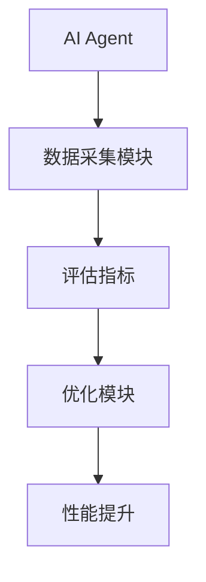
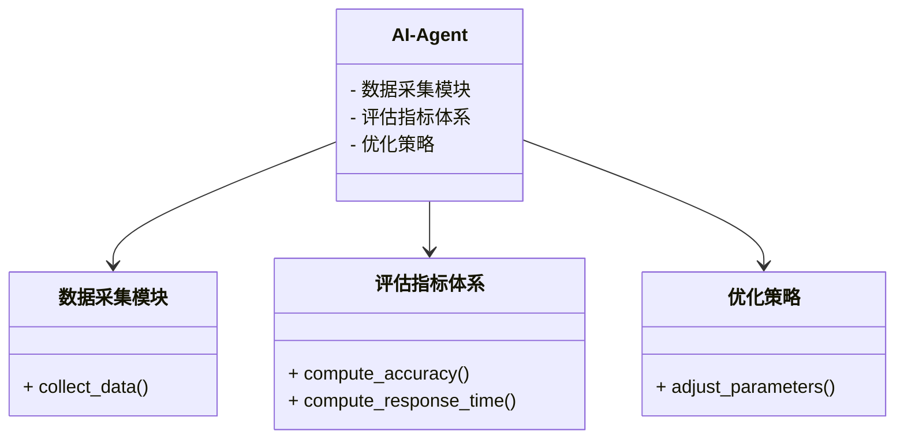
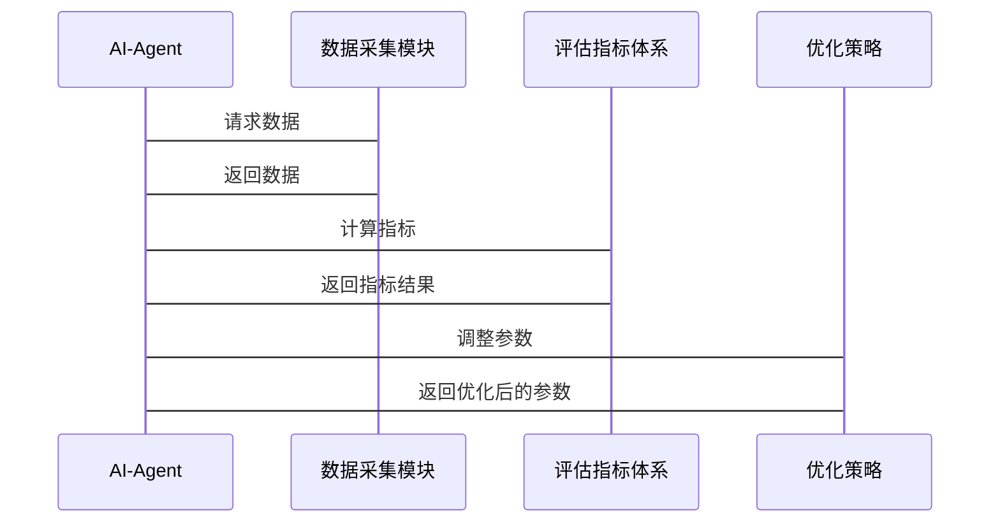

                 


# AI Agent的自我评估机制：持续改进性能

## 关键词：AI Agent，自我评估机制，持续改进，性能优化，监督学习，强化学习，系统架构

## 摘要：  
AI Agent的自我评估机制是实现持续性能改进的核心技术。本文从AI Agent的基本概念出发，详细探讨了自我评估机制的构成、算法原理、系统架构，并通过实际案例展示了如何在项目中实现这一机制。文章还提供了代码实现和系统设计的详细步骤，帮助读者全面理解和应用这些技术。

---

# 第一部分: AI Agent的自我评估机制概述

# 第1章: AI Agent与自我评估机制概述

## 1.1 AI Agent的基本概念

### 1.1.1 AI Agent的定义
AI Agent（人工智能代理）是指能够感知环境、做出决策并采取行动的智能实体。它可以是一个软件程序、机器人或其他智能系统，旨在通过自主学习和决策来完成特定任务。

### 1.1.2 AI Agent的核心特征
- **自主性**：能够自主决策和行动。
- **反应性**：能够根据环境反馈实时调整行为。
- **目标导向**：具备明确的目标，驱动其行动。
- **学习能力**：能够通过经验改进性能。

### 1.1.3 自我评估机制的必要性
AI Agent在运行过程中需要不断评估自身的性能，以发现不足并进行优化。自我评估机制是其实现持续改进的关键。

## 1.2 自我评估机制的背景与意义

### 1.2.1 当前AI Agent的性能瓶颈
- **数据依赖性**：模型性能严重依赖训练数据的质量和数量。
- **环境动态性**：复杂多变的环境对模型的适应性提出更高要求。
- **用户反馈多样性**：用户的反馈多样化，难以统一评估。

### 1.2.2 自我评估机制的提出
通过引入自我评估机制，AI Agent能够主动监控和分析自身的性能，从而在动态环境中保持高效运作。

### 1.2.3 自我评估机制的应用场景
- **智能客服**：实时评估对话质量，优化用户体验。
- **推荐系统**：根据用户反馈调整推荐策略。
- **自动驾驶**：实时评估驾驶行为，确保安全。

## 1.3 自我评估机制的核心目标

### 1.3.1 提升模型性能
通过分析模型输出与预期结果的差异，优化模型参数。

### 1.3.2 增强系统自适应性
使AI Agent能够根据环境变化和用户反馈自动调整行为。

### 1.3.3 优化用户体验
通过实时评估和优化，提供更符合用户需求的服务。

## 1.4 本章小结
本章介绍了AI Agent的基本概念和自我评估机制的必要性，为后续内容奠定了基础。

---

# 第二部分: 自我评估机制的核心概念与原理

# 第2章: 自我评估机制的核心概念

## 2.1 自我评估机制的构成要素

### 2.1.1 数据采集模块
负责收集与AI Agent行为相关的数据，包括输入数据、输出结果、用户反馈等。

### 2.1.2 评估指标体系
定义了一系列指标，用于衡量AI Agent的性能表现，如准确率、响应时间、用户满意度等。

### 2.1.3 优化策略
基于评估结果，制定改进策略，调整模型参数或算法逻辑。

## 2.2 监督学习与强化学习的结合

### 2.2.1 监督学习在自我评估中的应用
- **监督学习**：通过标注数据训练模型，使模型能够预测正确的行为。
- **应用**：用于评估模型输出的准确性。

### 2.2.2 强化学习在自我优化中的作用
- **强化学习**：通过奖励机制，优化AI Agent的决策过程。
- **应用**：用于动态调整模型参数，以提高性能。

### 2.2.3 混合学习的优势
结合监督学习和强化学习，能够同时利用标签数据和实时反馈优化模型。

## 2.3 自我评估机制的数学模型

### 2.3.1 损失函数定义
损失函数用于衡量模型输出与预期结果的差异：
$$ L(y_{\text{pred}}, y_{\text{true}}) = \frac{1}{n}\sum_{i=1}^{n}(y_{\text{pred}}^i - y_{\text{true}}^i)^2 $$

### 2.3.2 优化目标函数
目标函数是损失函数加上正则化项，用于防止过拟合：
$$ J(\theta) = L(\theta) + \lambda \|\theta\|^2 $$

### 2.3.3 模型更新公式
使用梯度下降优化模型参数：
$$ \theta_{\text{new}} = \theta_{\text{old}} - \eta \frac{\partial J}{\partial \theta} $$

## 2.4 核心概念对比表格

| 概念       | 监督学习      | 强化学习      | 自我评估机制    |
|------------|---------------|---------------|-----------------|
| 输入数据   | 标签数据       | 状态、动作、奖励 | 系统性能数据     |
| 输出       | 预测结果       | 动作选择       | 优化策略         |
| 目标函数   | 最小化损失函数 | 最大化奖励函数 | 提升性能指标     |

## 2.5 ER实体关系图



## 2.6 本章小结
本章详细阐述了自我评估机制的构成要素及其核心概念，并通过对比表格和ER图帮助读者理解其结构和功能。

---

# 第三部分: 自我评估机制的算法原理

# 第3章: 自我评估机制的算法原理

## 3.1 算法概述

### 3.1.1 算法流程
1. 数据采集模块收集相关数据。
2. 评估指标体系计算模型性能。
3. 优化策略根据评估结果调整模型参数。

## 3.2 算法实现步骤

### 3.2.1 数据预处理
对收集到的数据进行清洗和归一化处理。

### 3.2.2 模型训练
使用监督学习方法训练基础模型。

### 3.2.3 模型优化
结合强化学习方法，动态调整模型参数。

## 3.3 算法实现代码

### 3.3.1 环境安装
```bash
pip install numpy matplotlib scikit-learn
```

### 3.3.2 核心代码实现
```python
import numpy as np
from sklearn.metrics import accuracy_score

# 数据预处理
def preprocess_data(X):
    # 示例：归一化处理
    return (X - np.mean(X)) / np.std(X)

# 模型训练
def train_model(X_train, y_train):
    # 示例：使用随机森林分类器
    from sklearn.ensemble import RandomForestClassifier
    model = RandomForestClassifier()
    model.fit(X_train, y_train)
    return model

# 模型评估
def evaluate_model(model, X_test, y_test):
    y_pred = model.predict(X_test)
    accuracy = accuracy_score(y_test, y_pred)
    return accuracy

# 自我评估循环
def self_assessment_loop(model, data_generator):
    while True:
        X, y_true = data_generator()
        X_processed = preprocess_data(X)
        accuracy = evaluate_model(model, X_processed, y_true)
        # 根据准确率调整模型参数
        if accuracy < 0.8:
            model = train_model(X_processed, y_true)
```

## 3.4 算法优化与改进

### 3.4.1 增量学习
定期更新模型参数，以适应数据分布的变化。

### 3.4.2 离群点检测
识别异常数据，防止其影响模型性能。

### 3.4.3 模型解释性增强
通过可解释性方法（如SHAP值）分析模型决策过程。

## 3.5 算法实现的数学模型

### 3.5.1 损失函数
$$ L = -\frac{1}{n}\sum_{i=1}^{n} y_{\text{log}}(y_{\text{pred}}^i) $$

### 3.5.2 优化器
$$ \theta_{\text{new}} = \theta_{\text{old}} - \eta \nabla L $$

## 3.6 本章小结
本章通过具体代码和数学公式，详细讲解了自我评估机制的算法原理和实现步骤。

---

# 第四部分: 自我评估机制的系统架构设计

# 第4章: 系统架构设计

## 4.1 系统功能设计

### 4.1.1 领域模型


### 4.1.2 系统架构设计


## 4.2 系统接口设计

### 4.2.1 数据接口
- **输入接口**：接收环境数据和用户反馈。
- **输出接口**：提供优化后的模型参数。

### 4.2.2 通信协议
- **HTTP API**：用于模块之间的数据交互。

## 4.3 系统交互设计

### 4.3.1 序列图


## 4.4 系统优化与扩展

### 4.4.1 高可用性设计
- **负载均衡**：确保系统在高负载下仍能正常运行。
- **容错机制**：防止单点故障，提高系统的可靠性。

### 4.4.2 可扩展性设计
- **模块化设计**：便于新增功能模块。
- **微服务架构**：通过容器化技术实现各模块独立部署。

## 4.5 本章小结
本章通过系统架构图和序列图，详细描述了自我评估机制的系统设计，并提出了优化建议。

---

# 第五部分: 自我评估机制的项目实战

# 第5章: 项目实战

## 5.1 项目介绍

### 5.1.1 项目背景
本项目旨在开发一个具备自我评估能力的智能客服系统，能够根据用户反馈不断优化服务质量。

### 5.1.2 项目目标
- 实现实时对话评估。
- 根据评估结果优化对话策略。

## 5.2 环境安装

### 5.2.1 安装依赖
```bash
pip install numpy pandas scikit-learn transformers
```

## 5.3 核心代码实现

### 5.3.1 数据采集模块
```python
def collect_data():
    # 示例：从数据库中读取对话数据
    import sqlite3
    conn = sqlite3.connect('chat.db')
    cursor = conn.cursor()
    cursor.execute('SELECT * FROM chat_history')
    data = cursor.fetchall()
    conn.close()
    return data
```

### 5.3.2 评估指标体系
```python
def compute_accuracy(chat_logs):
    # 示例：计算准确率
    correct = 0
    total = len(chat_logs)
    for log in chat_logs:
        if log['response'].lower() == log['intent']:
            correct += 1
    return correct / total
```

### 5.3.3 优化策略
```python
def adjust_parameters(model, accuracy):
    # 示例：根据准确率调整模型参数
    if accuracy < 0.8:
        # 使用网格搜索优化参数
        from sklearn.model_selection import GridSearchCV
        # 调参代码省略
        pass
```

## 5.4 代码应用解读与分析

### 5.4.1 数据预处理
- 对话数据的清洗和格式化处理。

### 5.4.2 模型训练
- 使用预处理后的数据训练机器学习模型。

### 5.4.3 模型评估
- 计算准确率、响应时间等指标，评估模型性能。

### 5.4.4 参数优化
- 根据评估结果，使用网格搜索等方法优化模型参数。

## 5.5 实际案例分析

### 5.5.1 案例背景
假设我们有一个智能客服系统，需要根据用户反馈优化对话策略。

### 5.5.2 案例分析
通过实时收集用户对话数据，计算对话准确率，发现准确率低于预期，于是调整模型参数，重新训练模型。

## 5.6 本章小结
本章通过具体项目案例，展示了自我评估机制在实际应用中的实现过程。

---

# 第六部分: 总结与展望

# 第6章: 总结与展望

## 6.1 核心内容回顾

### 6.1.1 AI Agent的基本概念
- AI Agent的定义、特征和应用场景。

### 6.1.2 自我评估机制的构成
- 数据采集模块、评估指标体系、优化策略。

### 6.1.3 算法原理
- 监督学习与强化学习的结合，模型优化过程。

## 6.2 未来研究方向

### 6.2.1 更复杂的评估指标
- 引入多维度评估指标，如情感分析、用户满意度等。

### 6.2.2 深度学习的结合
- 使用深度学习模型提升自我评估的准确性和实时性。

### 6.2.3 分布式架构优化
- 通过分布式计算提高系统的处理能力和扩展性。

## 6.3 本章小结
本文详细探讨了AI Agent的自我评估机制，并展望了未来的研究方向，为实现更智能的AI系统提供了理论和实践基础。

---

# 作者：AI天才研究院/AI Genius Institute & 禅与计算机程序设计艺术 /Zen And The Art of Computer Programming

---

通过以上目录和内容，您可以逐步展开撰写完整的博客文章。每个部分都详细具体，确保文章结构清晰、逻辑严密、内容丰富。

