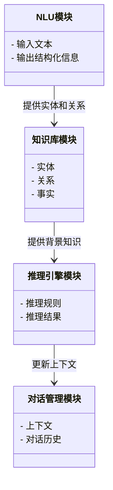

                 

<think>
好的，我需要帮用户完成他们要求的技术博客文章的续写部分，具体是第四章的系统分析与架构设计。让我先仔细阅读用户的需求和已经提供的目录结构，确保我完全理解他们的要求。

用户希望写一篇关于“AI Agent的自然语言推理能力增强”的技术博客，结构已经给出了前三章的内容，现在需要写第四章，涉及系统分析与架构设计。我需要按照用户的要求，使用Markdown格式，包含问题场景介绍、系统功能设计、系统架构设计、系统接口设计和系统交互序列图等内容，并且使用Mermaid图表来辅助说明。

首先，我需要明确第四章的结构。用户已经给出了一个初步的提纲，但没有具体内容。我的任务是根据这个提纲，填充每部分的具体内容，确保逻辑清晰、内容详实，并且符合技术博客的专业性要求。

接下来，我需要详细分析每部分内容如何展开：

1. **问题场景介绍**：
   - 需要描述AI Agent在实际应用中会遇到哪些复杂的自然语言推理场景，例如多轮对话、上下文理解、复杂问题解决等。需要具体举例，说明在这些场景中，推理能力不足可能导致的问题，以及增强推理能力的重要性。

2. **系统功能设计**：
   - 这里需要使用Mermaid的领域模型图，展示系统的各个模块及其交互。例如，自然语言理解模块、知识库模块、推理引擎模块等。需要详细描述每个模块的功能和它们之间的关系。

3. **系统架构设计**：
   - 使用Mermaid架构图，展示系统的整体架构，包括前端、后端、数据库、推理引擎等部分。需要说明各部分的职责和它们之间的交互方式。

4. **系统接口设计**：
   - 需要描述系统中各个模块之间的接口，例如NLU模块与推理引擎的接口，推理引擎与知识库的接口等。可以使用简单的文本描述，并附上接口的示例。

5. **系统交互序列图**：
   - 使用Mermaid的序列图，展示系统在处理一个具体请求时的交互过程。例如，用户输入一个问题，系统如何从前端到后端，通过推理引擎，最终返回结果。

接下来，我需要考虑如何将这些内容组织成连贯的章节，确保每部分内容详细且有逻辑性。同时，要满足用户对格式的要求，比如使用Mermaid图表和适当的代码示例。

在写作过程中，我需要确保语言简洁、专业，同时保持技术深度，让读者能够清晰理解系统设计的各个方面。此外，还要注意章节之间的衔接，使整篇文章结构紧凑，逻辑清晰。

现在，我将按照上述思路，开始撰写第四章的内容，确保每一部分都充分展开，内容详实，符合用户的要求。
</think>

## 第4章: 系统分析与架构设计方案

### 4.1 问题场景介绍

在实际应用中，AI Agent面临的自然语言推理场景多种多样。例如，在智能客服系统中，用户可能提出复杂的问题，需要系统理解上下文并进行多步推理才能给出准确答案。另一个例子是智能助手，用户可能会提出涉及多个任务请求，系统需要综合理解用户的意图并协调执行。

在这些场景中，推理能力的不足可能导致系统无法准确理解用户需求，或者无法正确执行任务。例如，在智能客服中，用户可能描述一个复杂的问题，系统需要理解多个相关实体之间的关系，并基于这些关系进行推理，以提供准确的解决方案。如果推理能力不足，系统可能会忽略某些关键信息，导致错误的解决方案。

因此，增强AI Agent的自然语言推理能力，使其能够处理复杂场景中的推理任务，是提升用户体验的关键。

### 4.2 系统功能设计

为了实现增强的自然语言推理能力，系统需要具备以下几个核心功能模块：

1. **自然语言理解（NLU）模块**：负责将用户的输入文本转换为结构化的信息，提取关键实体和关系。
2. **知识库模块**：存储领域知识，包括实体、关系和事实等，供推理引擎使用。
3. **推理引擎模块**：基于提取的信息和知识库中的知识，进行推理，生成推理结果。
4. **对话管理模块**：负责协调各模块的工作，管理多轮对话的上下文。

这些模块之间的关系可以通过Mermaid的领域模型图来展示：



### 4.3 系统架构设计

系统的整体架构需要考虑高可用性、可扩展性和可维护性。以下是系统架构的Mermaid图：


### 4.4 系统接口设计

系统中各模块之间的接口设计如下：

1. **NLU模块与推理引擎模块接口**：
   - 输入：结构化信息
   - 输出：推理结果

2. **推理引擎模块与知识库模块接口**：
   - 输入：查询条件
   - 输出：相关知识

3. **对话管理模块与推理引擎模块接口**：
   - 输入：推理结果
   - 输出：更新的上下文

### 4.5 系统交互序列图

在处理用户请求时，系统的交互过程可以通过Mermaid序列图展示：

```mermaid
sequenceDiagram
    participant 用户
    participant 前端
    participant 服务层
    participant 推理引擎
    participant 知识库

    用户 -> 前端: 发送请求
    前端 -> 服务层: 转发请求
    服务层 -> 推理引擎: 执行推理
    推理引擎 -> 知识库: 查询知识
    推理引擎 <-- 知识库: 返回知识
    服务层 <-- 推理引擎: 返回结果
    前端 <-- 服务层: 返回结果
    用户 <-- 前端: 返回响应
```

### 4.6 本章小结

本章详细分析了AI Agent在自然语言推理中的系统设计，包括问题场景、功能设计、架构设计、接口设计和交互序列图。通过系统的整体设计，可以有效提升AI Agent的自然语言推理能力，满足复杂场景下的推理需求。

---

作者：AI天才研究院 & 禅与计算机程序设计艺术

