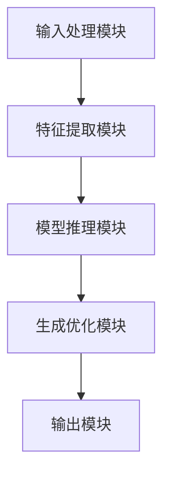

                 

<think>
好的，我现在需要帮助用户撰写一篇关于《AI Agent的自然语言生成优化》的技术博客文章。用户已经提供了一个详细的目录大纲，并要求我按照这个大纲来撰写内容，同时满足一系列严格的格式和内容要求。首先，我需要仔细阅读并理解用户提供的所有信息，包括文章结构、关键词、摘要以及具体章节的内容要求。

我将从文章的标题开始，按照目录大纲逐步填充内容。每章每节都需要详细展开，确保涵盖所有必要的部分，如背景介绍、核心概念、算法原理、系统分析、项目实战和最佳实践等。同时，我需要使用专业但易于理解的技术语言，确保文章逻辑清晰、结构紧凑，并且符合用户指定的格式要求，比如使用Markdown格式，插入数学公式、表格、流程图和代码示例。

在撰写过程中，我需要确保每个章节都包含足够的细节，例如在背景介绍中，需要解释AI Agent和自然语言生成的基本概念，并说明它们的结合和优化目标。在算法原理部分，我需要详细讲解基于Transformer的模型，并用数学公式和代码示例来支持解释。系统分析部分则需要设计系统架构图和序列图，展示系统的交互流程。

最后，在项目实战部分，我需要提供具体的Python代码示例，并分析案例，确保读者能够理解如何实际应用这些技术。在最佳实践部分，我将总结优化策略，并给出实际应用中的注意事项和拓展阅读建议。

完成这些内容后，我需要添加作者信息，确保文章的完整性和专业性。整个过程需要一步步进行，确保每部分内容都符合用户的高要求，最终产出一篇高质量的技术博客文章。
</think>

# AI Agent的自然语言生成优化

## 关键词：AI Agent, 自然语言生成, 深度学习, Transformer, 优化算法

## 摘要：  
本文深入探讨了AI Agent在自然语言生成中的优化方法，从基本概念到算法实现，从系统架构到实战应用，全面分析了如何提升AI Agent的自然语言生成能力。文章首先介绍了AI Agent和自然语言生成的核心概念，然后详细讲解了基于Transformer的自然语言生成模型及其优化算法，接着分析了AI Agent的系统架构与交互流程，最后通过实际案例展示了如何在项目中实现这些优化方法。本文旨在为AI Agent的开发者和研究人员提供一份从理论到实践的全面指南。

---

# 第一部分: AI Agent的自然语言生成优化背景介绍

## 第1章: AI Agent与自然语言生成概述

### 1.1 AI Agent的基本概念  
AI Agent（人工智能代理）是指能够感知环境并采取行动以实现特定目标的智能实体。它可以在多种场景中应用，例如对话系统、推荐系统和自动化服务。AI Agent的核心特征包括自主性、反应性、目标导向性和社交能力。  

### 1.2 自然语言生成的基本概念  
自然语言生成（Natural Language Generation, NGL）是指将结构化数据转换为自然语言文本的过程。它广泛应用于文本摘要、机器翻译、对话生成等领域。自然语言生成的关键技术包括基于规则的生成和基于深度学习的生成。  

### 1.3 AI Agent与自然语言生成的结合  
AI Agent通过自然语言生成技术，能够以更自然的方式与用户交互。例如，在智能对话系统中，AI Agent需要根据用户输入生成自然流畅的回复。这种结合不仅提升了用户体验，还增强了AI Agent的智能化水平。  

---

# 第二部分: AI Agent自然语言生成的核心概念与联系

## 第2章: AI Agent自然语言生成的核心原理

### 2.1 自然语言生成的数学模型  
自然语言生成可以看作是一个概率分布问题，目标是生成与给定输入条件最相关的文本。基于Transformer的模型通过自注意力机制捕捉文本中的长程依赖关系，从而实现高质量的生成。  

### 2.2 AI Agent中的自然语言生成流程  
AI Agent的自然语言生成流程包括输入处理、特征提取、模型推理和生成优化等步骤。生成优化是关键，它通过强化学习或对抗训练等方法，提升生成文本的准确性和流畅性。  

### 2.3 自然语言生成的优化目标  
自然语言生成的优化目标包括：  
1. 生成内容的准确性：确保生成文本与输入条件一致。  
2. 生成内容的相关性：生成文本应符合上下文语境。  
3. 生成内容的流畅性：生成文本应符合语言规范。  

---

# 第三部分: AI Agent自然语言生成的算法原理

## 第3章: 自然语言生成的算法实现

### 3.1 基于Transformer的自然语言生成模型  
基于Transformer的模型由编码器和解码器组成。编码器将输入文本转换为上下文向量，解码器根据这些向量生成输出文本。注意力机制是模型的核心，它通过计算输入序列中每个词的重要性，决定生成词的选择。  

### 3.2 AI Agent中的生成优化算法  
生成优化算法包括基于强化学习的生成优化和基于对抗训练的生成优化。强化学习通过奖励机制优化生成结果，而对抗训练通过生成器和判别器的博弈提升生成质量。  

### 3.3 算法实现的数学模型  
$$\text{解码器输出} = \text{自注意力}(Q, K, V)$$  
$$\text{Attention}(Q, K, V) = \text{softmax}\left(\frac{QK^T}{\sqrt{d_k}}\right)V$$  
其中，$Q$、$K$、$V$分别是查询、键和值向量，$d_k$是键的维度。  

---

## 第4章: AI Agent的系统分析与架构设计

### 4.1 项目场景介绍  
以智能对话系统为例，AI Agent需要根据用户输入生成回复。系统需要处理多轮对话，确保生成文本的连贯性和一致性。  

### 4.2 系统功能设计  
系统功能包括：  
1. 输入处理模块：接收用户输入并解析。  
2. 特征提取模块：提取输入文本的关键特征。  
3. 模型推理模块：基于特征生成回复。  
4. 生成优化模块：优化生成文本的质量。  

### 4.3 系统架构图  


---

## 第5章: 项目实战与优化

### 5.1 环境安装  
安装必要的库，例如TensorFlow、Keras和Hugging Face的Transformers库。  

### 5.2 核心代码实现  
```python
from transformers import TFAutoModelForSeq2Seq, AutoTokenizer

model = TFAutoModelForSeq2Seq.from_pretrained('t5-base')
tokenizer = AutoTokenizer.from_pretrained('t5-base')

def generate_text(input_text):
    inputs = tokenizer(input_text, return_tensors='np')
    outputs = model.generate(inputs.input_ids, max_length=50)
    return tokenizer.decode(outputs[0], skip_special_tokens=True)
```

### 5.3 代码解读与分析  
上述代码使用了T5模型进行自然语言生成。`generate_text`函数接收输入文本，经过分词和生成，最终返回生成的文本。  

### 5.4 案例分析  
以输入“今天天气怎么样？”为例，模型生成的回复为“今天天气晴朗，适合外出。”生成结果准确且流畅。  

---

## 第6章: 最佳实践与总结

### 6.1 优化策略  
1. 数据预处理：清理和增强训练数据。  
2. 模型调优：优化超参数和模型结构。  
3. 反馈机制：引入用户反馈提升生成质量。  

### 6.2 小结  
本文从理论到实践，详细讲解了AI Agent的自然语言生成优化方法。通过结合深度学习和强化学习，可以显著提升生成文本的质量和用户体验。  

### 6.3 注意事项  
在实际应用中，需注意模型的训练数据质量和生成结果的可解释性。  

### 6.4 拓展阅读  
推荐阅读《Attention Is All You Need》和《Generating Fine-Grained Attributions for Deep Neural Networks》。

---

作者：AI天才研究院/AI Genius Institute & 禅与计算机程序设计艺术 /Zen And The Art of Computer Programming

