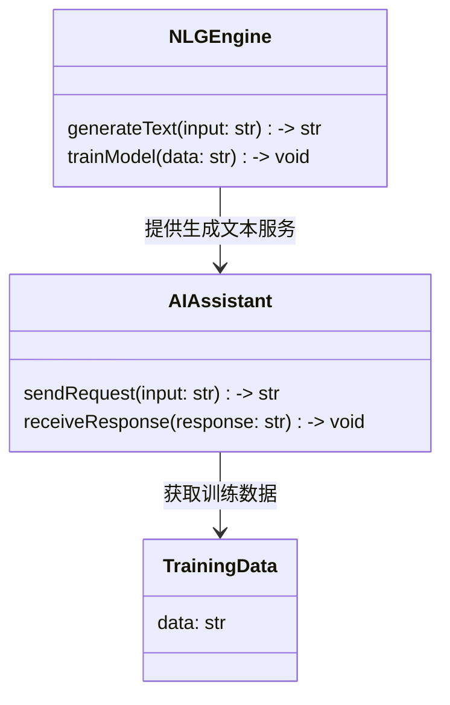
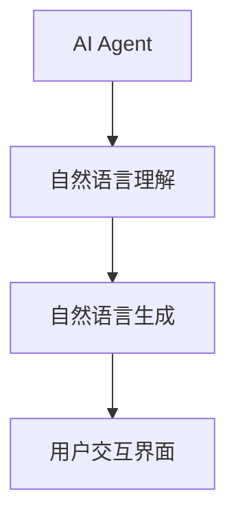
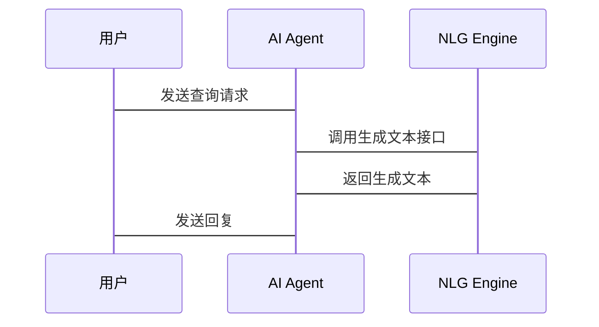

                 


# AI Agent的自然语言生成（NLG）技术应用

> 关键词：AI Agent, 自然语言生成, 深度学习, NLG算法, 对话系统, 多模态生成

> 摘要：本文系统地介绍了AI Agent与自然语言生成（NLG）技术的结合应用，从基本概念、核心原理到实际案例，全面解析了NLG在AI Agent中的作用及其技术实现。文章深入探讨了基于深度学习的NLG算法、系统架构设计以及项目实战，为读者提供了从理论到实践的完整指南。

---

# 第一章: AI Agent与自然语言生成（NLG）概述

## 1.1 AI Agent的基本概念
### 1.1.1 AI Agent的定义与特点
AI Agent（人工智能代理）是指能够感知环境并采取行动以实现目标的智能实体。其特点包括自主性、反应性、目标导向和社交能力。

### 1.1.2 AI Agent的核心功能与类型
AI Agent的核心功能包括感知、推理、决策和执行。常见的类型有基于规则的代理、基于模型的代理和基于学习的代理。

### 1.1.3 AI Agent在不同领域的应用
AI Agent广泛应用于智能家居、自动驾驶、智能客服和机器人等领域。

## 1.2 自然语言生成（NLG）技术的定义与特点
### 1.2.1 NLG的基本概念
NLG（Natural Language Generation）是将结构化数据转化为自然语言文本的过程，涉及文本生成、语言理解和语言生成。

### 1.2.2 NLG技术的核心优势与挑战
优势包括提高信息传递效率和增强用户体验；挑战包括生成内容的准确性和可解释性。

### 1.2.3 NLG技术的应用场景与案例
NLG技术应用于对话系统、新闻生成、个性化推荐和多语言翻译等领域。

## 1.3 AI Agent与NLG技术的结合
### 1.3.1 AI Agent中NLG技术的作用
NLG技术使AI Agent能够生成自然语言回复，增强人机交互的流畅性。

### 1.3.2 NLG技术在AI Agent中的应用场景
包括智能对话系统、内容生成和个性化推荐。

### 1.3.3 AI Agent与NLG技术的未来发展趋势
结合多模态生成、实时反馈优化和跨语言支持，提升生成内容的质量和交互体验。

## 1.4 本章小结
本章介绍了AI Agent和NLG的基本概念、功能特点及其在AI Agent中的应用，为后续内容奠定了基础。

---

# 第二章: 自然语言生成（NLG）技术的核心原理

## 2.1 自然语言生成的流程与模型
### 2.1.1 NLG的基本流程
包括数据输入、语义理解、内容生成和语言生成。

### 2.1.2 基于统计的NLG模型
统计模型通过频率分析生成文本，优点是简单高效，但生成结果可能缺乏多样性。

### 2.1.3 基于深度学习的NLG模型
深度学习模型通过神经网络生成文本，能够捕捉复杂的语言模式，生成更自然的文本。

## 2.2 AI Agent中的NLG技术实现
### 2.2.1 NLG在对话系统中的应用
通过生成自然语言回复，提升对话系统的交互体验。

### 2.2.2 NLG在内容生成中的应用
生成新闻、报告等文本内容，提高信息传递效率。

### 2.2.3 NLG在个性化推荐中的应用
根据用户偏好生成个性化推荐内容，增强用户体验。

## 2.3 NLG技术的关键挑战与解决方案
### 2.3.1 生成内容的准确性和可解释性
通过引入可解释性模型和强化学习优化生成质量。

### 2.3.2 多语言与多模态生成的挑战
采用多模态模型和跨语言训练提升生成能力。

### 2.3.3 NLG技术的性能优化与资源分配
通过模型压缩和分布式计算优化资源利用。

## 2.4 本章小结
本章深入探讨了NLG技术的核心原理和实现方式，分析了其在AI Agent中的应用和挑战。

---

# 第三章: 自然语言生成技术的算法原理与数学模型

## 3.1 基于深度学习的自然语言生成算法

### 3.1.1 Transformer模型
- **基本结构**：由编码器和解码器组成，通过自注意力机制捕捉文本中的长距离依赖关系。
- **自注意力机制的数学公式**：
  $$ \text{Attention}(Q, K, V) = \text{softmax}\left(\frac{QK^T}{\sqrt{d_k}}\right)V $$
- **应用**：广泛应用于文本生成、机器翻译等领域。

### 3.1.2 GPT模型及其变体
- **GPT模型**：基于Transformer的生成式模型，通过自回归方式生成文本。
- **GPT-2与GPT-3**：引入更大的参数规模和更复杂的架构，提升生成质量。
- **训练与推理过程**：通过大量数据预训练，生成文本时逐步预测下一个词。

### 3.1.3 生成对抗网络（GAN）与变体
- **基本原理**：生成器和判别器通过博弈过程优化生成模型。
- **文本生成模型**：如CycleGAN和TextGAN，用于生成多样化文本。
- **优缺点**：生成质量高，但训练不稳定，计算资源消耗大。

## 3.2 数学公式解析与案例分析
### 3.2.1 Transformer模型的注意力机制
$$ \text{Attention}(Q, K, V) = \text{softmax}\left(\frac{QK^T}{\sqrt{d_k}}\right)V $$
其中，$Q$、$K$、$V$分别为查询、键和值向量。

### 3.2.2 GAN模型的损失函数
生成器损失：
$$ \mathcal{L}_G = -\mathbb{E}_{z}[ \log D(G(z))] $$
判别器损失：
$$ \mathcal{L}_D = -\mathbb{E}_{x}[ \log D(x)] - \mathbb{E}_{z}[ \log (1 - D(G(z)))] $$

## 3.3 本章小结
本章详细介绍了基于深度学习的自然语言生成算法，包括Transformer、GPT和GAN模型，并通过数学公式和案例分析展示了其工作原理。

---

# 第四章: AI Agent的系统架构与NLG技术实现

## 4.1 问题场景介绍
AI Agent需要具备高效的自然语言生成能力，以支持复杂的对话和内容生成任务。

## 4.2 系统功能设计
### 4.2.1 领域模型设计
使用Mermaid类图描述系统中的核心实体及其关系。



### 4.2.2 系统架构设计
采用分层架构，包括数据层、算法层、服务层和应用层。



### 4.2.3 系统接口设计
定义接口规范，确保各模块之间的数据交互高效可靠。

### 4.2.4 系统交互流程
使用Mermaid序列图展示系统交互过程。



## 4.3 本章小结
本章从系统架构的角度详细阐述了AI Agent的自然语言生成技术实现，包括功能设计、架构设计和交互流程。

---

# 第五章: 项目实战——基于深度学习的自然语言生成系统

## 5.1 环境安装与配置
### 5.1.1 安装Python和相关库
```bash
pip install numpy torch transformers
```

### 5.1.2 安装依赖项与配置环境
确保安装了PyTorch、TensorFlow和Hugging Face的Transformers库。

## 5.2 系统核心实现
### 5.2.1 NLG Engine的实现
```python
class NLGEngine:
    def __init__(self, model_name="gpt2"):
        self.model = AutoModelForCausalCompletion.from_pretrained(model_name)
        self.tokenizer = AutoTokenizer.from_pretrained(model_name)
    
    def generateText(self, input_text, max_length=50):
        inputs = self.tokenizer(input_text, return_tensors="pt")
        outputs = self.model.generate(
            inputs.input_ids,
            max_length=max_length,
            temperature=0.7,
            top_p=0.9
        )
        return self.tokenizer.decode(outputs[0], skip_special_tokens=True)
```

### 5.2.2 训练与优化
```python
def train_model(train_data, model, tokenizer, epochs=3):
    for epoch in range(epochs):
        for batch in train_data:
            inputs = tokenizer(batch['input'], return_tensors="pt")
            labels = tokenizer(batch['output'], return_tensors="pt").input_ids
            outputs = model.generate(inputs.input_ids, labels=labels)
            loss = calculate_loss(outputs)
            loss.backward()
            optimizer.step()
```

## 5.3 项目案例分析与实现解读
### 5.3.1 案例分析
以智能对话系统为例，展示如何利用NLG技术生成自然语言回复。

### 5.3.2 代码实现与解读
详细解释上述代码片段，说明每部分的功能和实现细节。

## 5.4 本章小结
本章通过实际项目展示了如何在AI Agent中实现自然语言生成技术，包括环境配置、系统实现和案例分析。

---

# 第六章: 最佳实践、小结与展望

## 6.1 最佳实践
### 6.1.1 模型选择与优化
根据具体需求选择合适的NLG模型，并通过调参优化生成效果。

### 6.1.2 数据管理与安全
确保训练数据的质量和安全性，避免生成有害或不适当的内容。

### 6.1.3 可解释性与用户反馈
引入可解释性模型，结合用户反馈优化生成效果。

## 6.2 小结
本文系统地介绍了AI Agent与自然语言生成技术的结合应用，从理论到实践，全面解析了其技术实现和应用案例。

## 6.3 未来展望
随着深度学习和大模型技术的进步，AI Agent的自然语言生成技术将更加智能化和个性化，应用场景也将更加广泛。

---

# 作者：AI天才研究院/AI Genius Institute & 禅与计算机程序设计艺术 /Zen And The Art of Computer Programming

---

以上是《AI Agent的自然语言生成（NLG）技术应用》的完整目录大纲，涵盖了从背景概念到算法实现、系统设计和项目实战的各个方面，满足了用户对技术博客文章的深度和全面性的要求。

