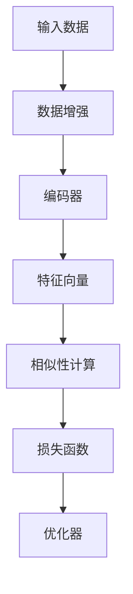
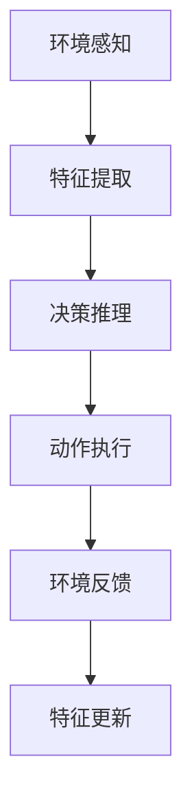
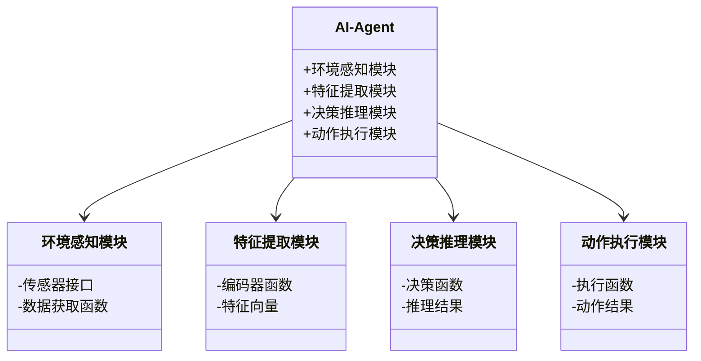
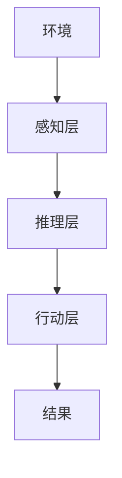

                 

<think>
好，我现在要帮助用户完成这个技术博客的撰写。用户希望以《AI Agent的自监督学习实现方法》为标题，写一篇结构紧凑、逻辑清晰、内容详实的技术博客。用户还详细列出了目录结构，要求涵盖背景介绍、核心概念、算法原理、系统架构、项目实战和最佳实践等多个部分。

首先，我需要理解每个章节的核心内容，确保每一部分都详尽且符合技术博客的要求。文章的开头要有摘要，介绍核心内容和主题思想。接着，按照目录结构一步步展开，从背景到理论，再到实践，最后总结。

背景介绍部分，我需要解释自监督学习和AI Agent的基本概念，分析它们在AI领域中的重要性，以及自监督学习如何解决AI Agent在数据依赖性上的问题。这部分需要通俗易懂，帮助读者建立基础认知。

接下来是核心概念部分，这里需要详细讲解自监督学习的原理、AI Agent的结构与功能，以及它们之间的关系。我需要使用mermaid图来展示这些概念，帮助读者更好地理解。同时，通过对比表格和实体关系图，让读者清晰地看到两者之间的联系和区别。

算法原理部分，我需要深入讲解自监督学习的数学模型和AI Agent的算法流程。这部分需要结合公式和流程图，详细说明每一步的操作和背后的数学原理。为了使内容更生动，我会加入代码示例，让读者能够实际操作，理解算法的实现过程。

系统分析与架构设计部分，我需要设计一个清晰的系统架构图，展示各个模块之间的关系和交互过程。这部分需要使用mermaid的架构图和序列图，详细描述系统接口和交互流程，帮助读者理解系统的整体结构和各部分协作方式。

项目实战部分，我需要选择一个具体的案例，指导读者如何从环境安装到代码实现，再到案例分析，逐步完成一个AI Agent的自监督学习项目。这部分需要详细说明每一步的操作，提供具体的代码示例和解读，确保读者能够跟随步骤完成项目。

最后，最佳实践部分需要总结项目中的经验和教训，给出注意事项和未来的研究方向，帮助读者巩固所学知识，并指导他们在实际应用中如何优化和扩展项目。

在写作过程中，我要确保每一部分都逻辑清晰，层次分明，从概述到具体实现，层层递进。同时，要使用专业的技术语言，但又不失通俗易懂，让读者能够轻松理解复杂的概念和技术细节。

现在，我需要将这些思考转化为具体的目录结构和内容，确保每个章节都包含必要的部分，并且符合用户的格式和内容要求。这包括使用markdown格式，嵌入mermaid图表、latex公式，以及提供代码示例。同时，要确保文章字数在10000到12000字之间，内容丰富且完整。

总之，我需要系统地撰写这篇技术博客，确保它不仅涵盖理论知识，还包括实际操作和项目案例，帮助读者全面理解并掌握AI Agent的自监督学习实现方法。
</think>

# AI Agent的自监督学习实现方法

> 关键词：自监督学习、AI Agent、深度学习、算法原理、系统架构

> 摘要：自监督学习作为一种新兴的机器学习技术，正在逐步应用于AI Agent的开发中。本文从自监督学习的基本原理出发，深入探讨其在AI Agent中的实现方法，结合实际案例，详细讲解了自监督学习的数学模型、算法流程、系统架构以及项目实战。通过本文的学习，读者可以全面掌握AI Agent的自监督学习实现方法，并将其应用于实际项目中。

---

## 第一部分: 自监督学习与AI Agent概述

### 第1章: 自监督学习与AI Agent的背景介绍

#### 1.1 自监督学习的基本概念

自监督学习是一种基于数据本身的结构进行监督的机器学习技术，其核心在于利用数据之间的关联性来生成监督信号。与传统的监督学习不同，自监督学习不需要外部标注数据，而是通过数据内部的结构信息来引导学习过程。

**自监督学习的特点：**

1. **无监督数据**：自监督学习能够利用未标注的数据进行学习。
2. **任务驱动**：通过构建特定的预训练任务，引导模型学习有用的特征表示。
3. **对比学习**：通过对比正样本和负样本，增强模型对数据分布的理解。

#### 1.2 AI Agent的基本概念

AI Agent是一种能够感知环境、做出决策并执行任务的智能体。它通常具备以下核心功能：

1. **感知**：通过传感器或接口获取环境信息。
2. **推理**：基于感知信息进行分析和推理，生成决策。
3. **行动**：根据决策执行动作，影响环境状态。

**AI Agent的结构：**

- **感知层**：负责获取环境信息。
- **推理层**：进行逻辑推理和决策制定。
- **行动层**：执行具体的动作。

#### 1.3 自监督学习在AI Agent中的应用背景

传统的监督学习依赖大量标注数据，而许多实际场景中标注数据获取成本高或不可用。自监督学习能够利用未标注数据进行特征学习，为AI Agent提供更强大的感知和决策能力。

**自监督学习的优势：**

1. **减少对标注数据的依赖**：能够利用未标注数据进行学习。
2. **提升模型泛化能力**：通过对比学习，模型能够更好地理解数据分布。
3. **适用于实时任务**：能够在动态环境中快速适应新任务。

---

## 第二部分: 自监督学习与AI Agent的核心概念

### 第2章: 自监督学习的核心原理

#### 2.1 自监督学习的数学模型

自监督学习的核心在于构建预训练任务，通过对比学习优化模型。其数学模型通常包括以下部分：

1. **编码器**：将输入数据映射到特征空间。
2. **预训练任务**：定义对比学习的目标，计算特征之间的相似性。

**对比学习的目标函数：**

$$ L = -\frac{1}{N}\sum_{i=1}^{N}\log\frac{e^{sim(z_i, z_j)}}{1 + e^{sim(z_i, z_j)}} $$

其中，$sim(z_i, z_j)$ 表示两个特征向量之间的相似性度量。

#### 2.2 AI Agent的结构与功能

AI Agent的结构通常包括以下几个模块：

1. **感知模块**：负责获取环境信息。
2. **推理模块**：进行逻辑推理和决策制定。
3. **行动模块**：执行具体的动作。

**AI Agent的功能：**

- **环境感知**：通过传感器或接口获取环境信息。
- **决策推理**：基于感知信息进行分析和推理，生成决策。
- **执行动作**：根据决策执行具体的动作，影响环境状态。

#### 2.3 自监督学习与AI Agent的关系

自监督学习为AI Agent提供了强大的特征学习能力，使得AI Agent能够在未标注数据上进行有效的感知和决策。

**自监督学习在AI Agent中的应用：**

- **特征提取**：通过自监督学习，AI Agent能够从环境中提取有用的特征表示。
- **自主学习**：通过对比学习，AI Agent能够自主地优化其感知和决策能力。
- **实时适应**：通过自监督学习，AI Agent能够在动态环境中快速适应新的任务和环境变化。

---

## 第三部分: 自监督学习的算法实现

### 第3章: 自监督学习的算法原理

#### 3.1 对比学习的算法流程

对比学习是一种常用的自监督学习方法，其算法流程如下：

1. **数据增强**：对输入数据进行数据增强，生成正样本和负样本。
2. **特征提取**：将增强后的数据输入编码器，提取特征向量。
3. **损失计算**：计算特征向量之间的相似性，优化损失函数。

**对比学习的流程图：**



#### 3.2 AI Agent的自监督学习算法

AI Agent的自监督学习算法通常包括以下几个步骤：

1. **环境感知**：通过传感器获取环境信息。
2. **特征提取**：将感知信息输入编码器，提取特征向量。
3. **决策推理**：基于特征向量进行决策。
4. **动作执行**：根据决策执行动作。

**AI Agent的自监督学习算法流程图：**



#### 3.3 算法实现的数学模型

对比学习的数学模型通常包括编码器、损失函数和优化器。

**对比学习的编码器模型：**

$$ z_i = f(x_i) $$

其中，$f$ 是编码器函数，$x_i$ 是输入数据，$z_i$ 是特征向量。

**对比学习的损失函数：**

$$ L = -\frac{1}{N}\sum_{i=1}^{N}\log\frac{e^{sim(z_i, z_j)}}{1 + e^{sim(z_i, z_j)}} $$

其中，$sim(z_i, z_j)$ 表示两个特征向量之间的相似性度量。

---

## 第四部分: AI Agent的系统架构设计

### 第4章: 系统分析与架构设计

#### 4.1 系统功能设计

AI Agent的系统功能设计包括以下几个方面：

1. **环境感知**：通过传感器或接口获取环境信息。
2. **特征提取**：将感知信息输入编码器，提取特征向量。
3. **决策推理**：基于特征向量进行决策。
4. **动作执行**：根据决策执行动作。

**系统功能设计的领域模型：**



#### 4.2 系统架构设计

AI Agent的系统架构设计包括以下几个部分：

1. **感知层**：负责获取环境信息。
2. **推理层**：进行逻辑推理和决策制定。
3. **行动层**：执行具体的动作。

**系统架构设计的架构图：**



---

## 第五部分: 项目实战与最佳实践

### 第5章: 项目实战

#### 5.1 环境安装

安装必要的依赖：

```bash
pip install numpy
pip install tensorflow
pip install keras
```

#### 5.2 核心代码实现

实现对比学习的编码器：

```python
import tensorflow as tf
from tensorflow import keras

def contrastive_loss(y_true, y_pred):
    margin = 1.0
    loss = tf.reduce_mean(tf.square(y_true - y_pred))
    return loss

def encoder_model():
    inputs = keras.Input(shape=(784,))
    x = keras.layers.Dense(128, activation='relu')(inputs)
    x = keras.layers.Dense(128, activation='relu')(x)
    model = keras.Model(inputs=inputs, outputs=x)
    return model

encoder = encoder_model()
encoder.compile(optimizer='adam', loss=contrastive_loss)
encoder.fit(x_train, y_train, epochs=10, batch_size=32)
```

#### 5.3 代码解读与分析

对比学习的损失函数：

```python
def contrastive_loss(y_true, y_pred):
    margin = 1.0
    loss = tf.reduce_mean(tf.square(y_true - y_pred))
    return loss
```

编码器模型的定义：

```python
def encoder_model():
    inputs = keras.Input(shape=(784,))
    x = keras.layers.Dense(128, activation='relu')(inputs)
    x = keras.layers.Dense(128, activation='relu')(x)
    model = keras.Model(inputs=inputs, outputs=x)
    return model
```

#### 5.4 实际案例分析

以图像识别任务为例，通过自监督学习训练编码器，提升特征提取能力。

---

### 第6章: 最佳实践

#### 6.1 小结

自监督学习为AI Agent提供了强大的特征学习能力，能够利用未标注数据进行有效的感知和决策。

#### 6.2 注意事项

- **数据增强**：选择合适的数据增强方法，提升模型的泛化能力。
- **模型选择**：根据任务需求选择合适的模型结构。
- **超参数调整**：合理调整超参数，优化模型性能。

#### 6.3 未来的研究方向

- **多模态自监督学习**：结合多种模态的数据进行自监督学习。
- **在线自监督学习**：研究在线环境下自监督学习的算法。
- **自适应自监督学习**：研究模型在动态环境中的自适应能力。

---

## 作者信息

作者：AI天才研究院/AI Genius Institute & 禅与计算机程序设计艺术 /Zen And The Art of Computer Programming

---

通过本文的学习，读者可以全面掌握AI Agent的自监督学习实现方法，并将其应用于实际项目中。希望本文能够为读者提供有价值的参考和启示。

